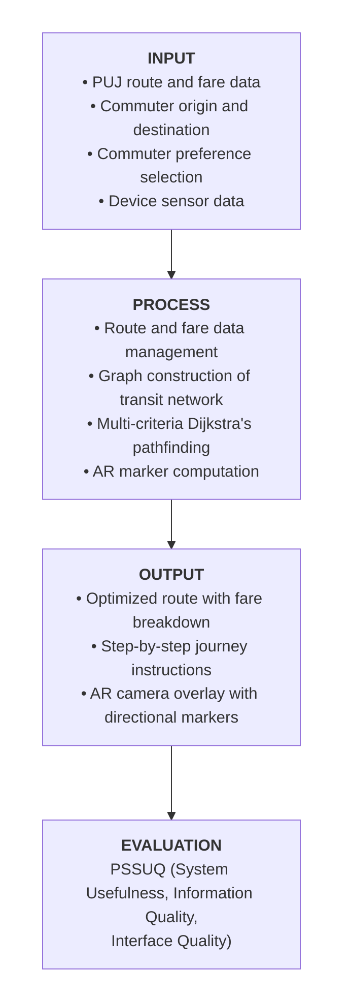

## INTRODUCTION

Commuting in the Philippines often feels less like a formal system and more like an oral tradition. Millions of Filipinos navigate by memorizing Jeepney routes through word of mouth or identifying pick-up points that exist only through collective habit rather than official signage. While this implicit knowledge serves the daily commuter, it leaves newcomers and tourists stranded. Without a digital guide, venturing even one street beyond a familiar route turns a simple trip into a frustrating logistical puzzle.

This study presents Komyuter, a mobile navigation application developed to address this gap in Iloilo City. By digitizing the city's LTFRB-approved transit routes, implementing a multi-criteria Dijkstra's pathfinding algorithm that weighs distance, fare, transfers, and walking distance, and integrating an Augmented Reality wayfinding module that overlays directional markers onto the commuter's real-world camera view, Komyuter proposes a transit navigation experience designed from the ground up for the realities of Philippine public transportation.

### BACKGROUND OF THE STUDY

The rapid growth of urban populations worldwide has placed increasing pressure on public transportation systems, making efficient and accessible transit navigation a critical concern for governments, urban planners, and commuters alike. In developing countries, this challenge is particularly pronounced, as infrastructure development often struggles to keep pace with urbanization and the majority of the population depends on public transit as their primary mode of daily mobility. The integration of technology into transportation, commonly referred to as smart mobility, has emerged as a promising approach to bridging this gap, with mobile applications, geographic information systems, and real‑time data platforms transforming how people navigate cities across the globe [6], [25]. Despite these advances, their application remains largely concentrated in highly digitized transit ecosystems, leaving secondary cities in developing countries underserved.

In the Philippine context, public transportation is dominated by the Public Utility Jeepney (PUJ), which accounts for approximately 80% of all urban trips nationwide [16]. However, the system remains largely undigitized outside of Metro Manila. While the capital achieved a foundational General Transit Feed Specification (GTFS) database through World Bank initiatives in 2012, secondary cities have received no comparable investment in transit data infrastructure [18]. As a result, navigation platforms such as Google Maps and Waze offer no functional public transit directions for these cities, and Philippine‑specific applications such as Sakay.ph remain confined to Metro Manila [2]. No existing study has yet applied multi‑criteria routing and Augmented Reality wayfinding in combination to the specific operational conditions of PUJ‑based transit in a Philippine secondary city.

This gap is particularly urgent in Iloilo City, one of the fastest‑growing metropolitan centers in Western Visayas. The city’s Local Public Transport Route Plan (LPTRP), ratified in March 2023, documents 25 authorized PUJ routes, yet this data exists only in static formats that cannot be processed by navigation algorithms [11], [35]. Consequently, 72% of Iloilo commuters report that transit unreliability directly impacts their work performance and quality of life, while commuters nationwide lose an average of 117 hours annually to inefficient travel [8], [15].

Given these compounding gaps in transit data infrastructure, routing algorithm design, and commuter‑facing navigation tools, there is a clear and pressing need for a system that addresses all three simultaneously. This study presents Komyuter, a mobile navigation application that digitizes Iloilo City’s PUJ transit network, implements a multi‑criteria Dijkstra’s pathfinding engine optimized for the LTFRB fare structure, and integrates a location‑based Augmented Reality wayfinding module to guide commuters to physical boarding points.

### OBJECTIVES OF THE STUDY

This study generally aims to design, develop, and evaluate Komyuter, a mobile navigation application that provides distance and fare-optimized public transit routing with Augmented Reality wayfinding for jeepney commuters in Iloilo City.

Specifically, this study aims to:

1. Develop a geospatial route and fare management system that allows authorized administrators to create, manage, and update Public Utility Jeepney (PUJ) route data, stop sequences, and LTFRB-based fare structures for Iloilo City through a web-based admin dashboard;
2. Implement a multi-criteria Dijkstra's pathfinding engine that computes optimal transit routes by simultaneously optimizing for travel distance, fare cost, transfer penalties, and walking distance through user-selectable preference profiles (Shortest, Cheapest, Least Transfers, and Balanced);
3. Design and integrate a location-based Augmented Reality wayfinding module that overlays real-time 3D directional markers onto the commuter's camera view during walking and transfer segments of a journey to assist in locating physical PUJ boarding points; and
4. Evaluate the usability of the developed system using the Post-Study System Usability Questionnaire (PSSUQ) across three user subscales, namely System Usefulness, Information Quality, and Interface Quality, and interpret results against the established PSSUQ industry benchmark mean of 2.82.

### CONCEPTUAL FRAMEWORK

#### FIGURE 1: Conceptual Framework of the Study

Figure 1 presents the conceptual framework of the study, illustrating the flow of inputs, processes, outputs, and evaluation components that form the foundation of Komyuter.

The Input represents the data and information that the system requires to function. This includes PUJ route and fare data sourced from Iloilo City's LTFRB-approved Local Public Transport Route Plan, the commuter's origin and destination as entered in the application, the commuter's selected routing preference, and real-time device sensor data such as GPS location, compass heading, and device motion used by the AR module.

The Process covers the core operations performed by the system on the given inputs. Route and fare data are managed through an admin web dashboard that allows authorized users to create and update transit information. This data is then used to construct a weighted graph of the transit network, on which the multi-criteria Dijkstra's pathfinding algorithm computes the optimal route based on the commuter's selected preference. Simultaneously, AR marker computation processes the device's sensor data to determine the position and direction of nearby boarding stops in the real-world environment.

The Output is what the commuter receives as a result of the system's processing. This includes an optimized route recommendation with a computed fare breakdown, step-by-step journey instructions, and an AR camera overlay displaying 3D directional markers that guide the commuter to physical boarding and transfer points.

The Evaluation measures the quality and usability of the system as experienced by its users. The Post-Study System Usability Questionnaire (PSSUQ) is administered to 25 to 30 respondents drawn from three user groups: students, working professionals, and tourists. Results are interpreted across three subscales, namely System Usefulness, Information Quality, and Interface Quality, and measured against the established PSSUQ industry benchmark mean of 2.82.

### DEFINITION OF TERMS

The following terms are defined both conceptually and operationally to provide clarity on how they are used throughout this study.

Augmented Reality (AR). Augmented Reality refers to a technology that superimposes computer-generated information, such as images, sounds, or other data, onto a user's view of the real world, thereby enhancing perception of the environment rather than replacing it [1]. In this study, AR is defined as the feature of Komyuter that overlays 3D directional markers onto the commuter's live camera view to guide them toward nearby PUJ boarding and transfer points.

Dijkstra's Algorithm. Dijkstra's Algorithm is a graph search algorithm that finds the shortest path between a source node and all other nodes in a weighted graph by iteratively selecting the node with the lowest cumulative cost [5]. In this study, Dijkstra's Algorithm is defined as the pathfinding engine used by Komyuter to compute optimal jeepney routes across Iloilo City's transit network, extended to support multiple cost criteria simultaneously.

General Transit Feed Specification (GTFS). The General Transit Feed Specification is a standardized data format developed by Google that allows public transit agencies to publish their route, stop, schedule, and fare information in a machine-readable format compatible with navigation applications [7]. In this study, GTFS is defined as the data standard used as reference in structuring Komyuter's transit database for Iloilo City's PUJ network.

Local Public Transport Route Plan (LPTRP). A Local Public Transport Route Plan is a government-mandated document that identifies and rationalizes public transportation routes within a city or municipality, specifying authorized vehicle types, route alignments, and fleet sizes in accordance with Department of Transportation guidelines [4]. In this study, the LPTRP is defined as the official Iloilo City document ratified in March 2023 that serves as the primary source of route and stop data for Komyuter's transit network.

Multi-criteria Pathfinding. Multi-criteria pathfinding refers to the process of computing an optimal route across a network by simultaneously evaluating and balancing two or more competing cost factors, such as distance, time, or monetary cost, rather than optimizing for a single variable [23]. In this study, multi-criteria pathfinding is defined as the routing approach used by Komyuter that weighs travel distance, fare cost, transfer penalties, and walking distance together to produce a route recommendation aligned with the commuter's selected preference profile.

Post-Study System Usability Questionnaire (PSSUQ). The Post-Study System Usability Questionnaire is a standardized usability evaluation instrument developed by IBM that measures user satisfaction with a system across three subscales: System Usefulness, Information Quality, and Interface Quality, with a lower mean score indicating higher usability [12], [30]. In this study, the PSSUQ is defined as the primary evaluation tool used to assess commuter satisfaction with Komyuter, with results interpreted against the established industry benchmark mean of 2.82.

Public Utility Jeepney (PUJ). A Public Utility Jeepney is a government-franchised, fixed-route public transport vehicle operating under a Certificate of Public Convenience issued by the Land Transportation Franchising and Regulatory Board, following designated alignments and charging distance-based fares regulated by the LTFRB fare matrix [10], [28]. In this study, the PUJ is defined as the primary mode of public transit for which Komyuter provides routing, fare computation, and wayfinding support in Iloilo City.

Transfer Penalty. In transit routing, a transfer penalty is an artificial cost value added to a route computation whenever a commuter is required to switch from one transit line or vehicle to another, used to discourage unnecessary transfers and reflect the real-world inconvenience of changing vehicles [23]. In this study, transfer penalty is defined as a weighted cost component in Komyuter's pathfinding algorithm that penalizes routes requiring the commuter to board a second or additional PUJ line.

Wayfinding. Wayfinding refers to the cognitive and physical process by which a person uses spatial information, landmarks, and directional cues to orient themselves and navigate from one location to another within an environment [6], [25]. In this study, wayfinding is defined as the process by which Komyuter's AR module assists commuters in locating physical PUJ boarding and transfer stops by overlaying directional markers onto their real-world camera view.

### SIGNIFICANCE OF THE STUDY

The development of Komyuter carries significant implications for various stakeholders in Iloilo City and beyond. The findings and outputs of this study are expected to benefit the following:

Jeepney Commuters. As the primary users of the system, jeepney commuters stand to benefit most directly from Komyuter. The application provides them with an accessible and reliable tool for planning PUJ journeys, computing accurate fares, and locating boarding points, reducing the time, effort, and uncertainty involved in daily commuting particularly for those navigating unfamiliar routes.

Tourists and First-time Visitors. Iloilo City receives over a million airport arrivals annually, many of whom have no prior knowledge of the city's transit network. Komyuter provides this group with an entry point into the PUJ system, making public transportation a viable and navigable option for visitors who would otherwise rely on more expensive private transport alternatives.

Local Government Unit of Iloilo City. The study supports the city's efforts to implement and maximize the value of its LTFRB-approved Local Public Transport Route Plan. By transforming static, paper-based route data into a functional digital navigation system, Komyuter contributes to the city's broader goals of improving urban mobility and transit accessibility for its growing population.

Land Transportation Franchising and Regulatory Board (LTFRB). The operationalization of LTFRB fare matrices and franchise route data within a working navigation application demonstrates the practical utility of the board's existing regulatory frameworks. This study may inform future efforts to digitize and standardize transit data at the regional and national level.

Future Researchers. This study serves as a reference and foundation for researchers seeking to develop similar transit navigation systems in other Philippine secondary cities. The methodology, system architecture, and evaluation approach documented here may be adapted or extended to address transit data gaps in other urban centers outside Metro Manila.

The Academe. This study contributes to the growing body of knowledge on smart mobility, multi-criteria pathfinding, and Augmented Reality wayfinding within the Philippine context. It demonstrates the technical feasibility of combining these approaches in a single system and provides empirical usability data that future studies in human-computer interaction and transportation informatics may build upon.

### SCOPE AND DELIMITATION OF THE STUDY

This study covers the design, development, and usability evaluation of Komyuter, a mobile-based public transit navigation system for Iloilo City and the neighboring municipalities of Oton, Pavia, and Leganes. The system enables commuters, particularly students, working professionals, and tourists, to find optimized transit routes based on distance, fare, number of transfers, and walking distance using a multi-criteria Dijkstra's algorithm. It also provides augmented reality wayfinding during walking and transfer segments, computes fares following the LTFRB distance-based formula, and includes an administrator web dashboard for managing route, stop, and fare data. Usability is evaluated using the PSSUQ instrument administered to 25 to 30 respondents across five structured task scenarios.

However, the system has several limitations. Route coverage is restricted to 10 to 12 of the 25 rationalized LPTRP routes due to the manual effort required for geospatial data collection. Real-time vehicle tracking and live detour detection are not included, as both require hardware installations and user volumes beyond the scope of this project. AR wayfinding is limited to outdoor walking and transfer segments only, as GPS signal is unreliable indoors and camera use inside a moving vehicle is impractical. The trust scoring feature, while present, does not influence route computation and serves only as supplementary information for users. The system is developed and tested primarily on Android, and iOS compatibility is not guaranteed within the project timeline.

Komyuter is designed to assist commuters in navigating Iloilo City's PUJ network more efficiently and confidently. By using this system, users can identify optimal routes, estimate fares before boarding, and receive real-time AR guidance at key walking and transfer points, helping bridge the gap between unfamiliar transit networks and the everyday commuter.
