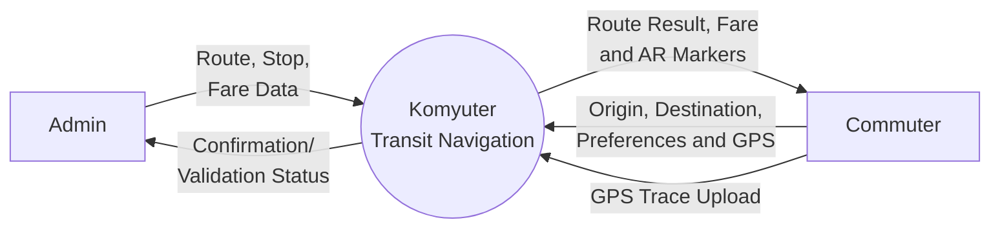

## METHODOLOGY

This chapter describes the research design, data collection procedures, system architecture, algorithm design, software development life cycle, and evaluation methodology employed in the development of Komyuter. The study followed a Developmental Research design, with the system constructed and then evaluated through a standardized usability instrument. All design decisions documented in this paper were guided by the project's four panel-approved research objectives, which include (1) management of PUJ route and fare data, (2) multi-criteria pathfinding using Dijkstra's algorithm, (3) Augmented Reality wayfinding for commuters, and (4) usability evaluation using the Post-Study System Usability Questionnaire (PSSUQ).

### PROJECT DESCRIPTION

Komyuter is a mobile public transit navigation system developed for Iloilo City and the adjacent municipalities of Oton, Pavia, and Leganes. The system targets commuters of Public Utility Jeepneys (PUJs), which are official vehicles that follow the fixed routes set by the LTFRB under the Local Public Transport Route Plan (LPTRP). Three compounding problems motivated the project: the lack of a digitized PUJ route map that can be integrated into navigation algorithms for Iloilo City; the inadequacy of standard single-criterion shortest-path algorithms for multi-modal transit routing where commuters simultaneously weigh distance, fare, transfer inconvenience, and walking; and the difficulty of using traditional digital maps to locate public transport boarding points that completely lack physical signs or markers.

Komyuter addresses these problems through three integrated functional layers. The first layer is a web-based administrative dashboard enabling authorized personnel to create, read, update, and delete PUJ route data (including geospatial polylines, stop sequences, and LTFRB fare structures) without requiring code changes. The second layer is a multi-criteria Dijkstra's algorithm that models the transit network as a weighted directed graph and finds optimal paths across multiple preference profiles (Shortest, Cheapest, Least Transfers, and Balanced). The third layer is a location-based Augmented Reality wayfinding module that overlays 3D directional markers on the commuter's camera feed during walking and transfer segments, helping users locate physically unmarked boarding points. An additional, non-scored community trust scoring feature allows commuters to record GPS traces, which are compared against route polylines using Modified Hausdorff Distance (MHD) to generate informational route confidence badges.

The system is deployed as a Turborepo monorepo comprising three applications: a React Native mobile app (apps/mobile), a React + Vite administrative dashboard (apps/admin), and a Node.js + Fastify backend server (apps/server). Shared TypeScript types, Zod validation schemas, and LTFRB fare computation logic are maintained in a shared package (packages/shared) to enforce type-safety and consistency across all applications. The database layer uses PostgreSQL 15+ with the PostGIS spatial extension, managed through the Supabase platform, and accessed via the Drizzle ORM.

### PROJECT DEVELOPMENT

The project adopted an Incremental and Iterative Software Development Life Cycle (SDLC) model. This model was chosen because the four research objectives map directly to four distinct, deliverable system increments, with each increment building upon the previous one. Developing the project in increments allowed for a constant loop of designing, testing, and reviewing with the thesis adviser. This approach was essential for prototyping the Augmented Reality module and ensuring the system constantly aligned with panel expectations.

Development proceeded across two academic semesters. Chapters 1 through 3 and the foundational system architecture were completed in the first semester. Chapters 4 and 5, the full system implementation, integration testing, evaluation, and defense preparation were completed in the second semester.

#### TABLE 1: Software Development Life Cycle Phases

| Phase                                           | Duration    | Key Output                                                                                                          |
| ----------------------------------------------- | ----------- | ------------------------------------------------------------------------------------------------------------------- |
| Phase 1: Requirements & Planning                | Weeks 1–2   | System Requirements Specification, architecture design, database schema, UI wireframes, development timeline        |
| Phase 2: Data Collection & Foundation           | Weeks 2–5   | Ground truth route dataset (10–12 routes, 30–36 GPS traces), seeded database, foundational API and dashboard shells |
| Phase 3: Incremental Development (4 increments) | Weeks 4–15  | Working system across four increments covering all panel objectives                                                 |
| Phase 4: System Testing                         | Weeks 14–16 | Test reports, 40 OD-pair benchmarks, AR field tests, stable release candidate                                       |
| Phase 5: Evaluation                             | Weeks 16–18 | PSSUQ results from 25–30 respondents, statistical analysis                                                          |
| Phase 6: Defense                                | Weeks 18–20 | Final thesis manuscript and defense presentation                                                                    |

### REQUIREMENT ANALYSIS

Requirement analysis was conducted following the formalization of the panel's revised research objectives. Functional and non-functional requirements were mapped against each panel objective to produce a System Requirements Specification (SRS) and a Functional Requirements Traceability Matrix.

#### TABLE 2: Functional Requirements Traceability Matrix

| Req_ID | Requirement                                                         | Panel Objective | Priority |
| ------ | ------------------------------------------------------------------- | --------------- | -------- |
| FR-01  | Admin can create a PUJ route with polyline on map                   | Obj 1           | Must     |
| FR-02  | Admin can define stops along a route                                | Obj 1           | Must     |
| FR-03  | Admin can configure LTFRB fare structure per route                  | Obj 1           | Must     |
| FR-04  | Admin can update and delete routes, stops, and fares                | Obj 1           | Must     |
| FR-05  | Admin can manage routes for multiple cities                         | Obj 1           | Should   |
| FR-06  | System models transit network as weighted directed graph            | Obj 2           | Must     |
| FR-07  | System auto-generates transfer edges between nearby stops           | Obj 2           | Must     |
| FR-08  | System computes fare using LTFRB distance-based formula             | Obj 2           | Must     |
| FR-09  | System finds optimal path using multi-criteria Dijkstra's algorithm | Obj 2           | Must     |
| FR-10  | Users can select a preference profile (Shortest / Cheapest / etc.)  | Obj 2           | Must     |
| FR-11  | System displays step-by-step directions with fare and distance      | Obj 2           | Must     |
| FR-12  | User can activate AR camera during walking segments                 | Obj 3           | Must     |
| FR-13  | AR displays 3D markers at stop locations on camera feed             | Obj 3           | Must     |
| FR-14  | AR shows distance and direction to next stop                        | Obj 3           | Must     |
| FR-15  | AR markers dynamically reposition as user moves or rotates phone    | Obj 3           | Must     |
| FR-16  | System is evaluable through PSSUQ with task scenarios               | Obj 4           | Must     |
| FR-17  | User can record GPS trace while riding (bonus)                      | Bonus           | Should   |
| FR-18  | System computes trust score via MHD comparison (bonus)              | Bonus           | Should   |
| FR-19  | Routes display trust badges based on verification (bonus)           | Bonus           | Should   |

#### NON-FUNCTIONAL REQUIREMENTS

In addition to functional requirements, a set of non-functional requirements defined the performance, security, compatibility, and usability constraints of the system. Key non-functional requirements include a pathfinding computation time under 500 milliseconds per query, AR marker rendering at a minimum of 30 frames per second, Android 10 (API Level 29) or higher compatibility, JWT-secured and role-gated admin endpoints, and a PSSUQ overall mean score at or below the industry benchmark of 3.0.

#### DATA FLOW DIAGRAM

The system's data flow was modeled at two levels of abstraction to identify the key processes, external entities, and data stores that define the system's boundaries and internal behavior.

##### FIGURE 2: Level 0 Data Flow Diagram

At Level 0 (Context Diagram), Komyuter is treated as a single process interacting with two external entities: the Admin and the Commuter. The Admin supplies Route, Stop, and Fare data and receives Confirmation and Validation Status in return. The Commuter provides Origin, Destination, Preferences, and GPS position and receives Route Results, Fare information, and AR Markers. GPS Traces submitted by the Commuter flow back into the system asynchronously.

##### FIGURE 3: Level 1 Data Flow Diagram

```mermaid
flowchart TD
    %% Actors
    Admin["Admin"]
    Commuter["Commuter"]

    %% Processes
    P1["P1<br>Route and Fare<br>Management"]
    P2["P2<br>Graph Construction"]
    P3["P3<br>Navigation and<br>Pathfinding"]
    P4["P4<br>Trust Scoring"]

    %% Data Stores
    DS1["DS1 Routes / stops / fare configs"]
    DS2["DS2 Transit graph (in-memory cache)"]
    DS3["DS3 GPS Traces"]

    %% Connections - Admin to P1
    Admin <-->|"Confirmation"| P1
    P1 <-->|"Route, fare,<br>stop data"| Admin

    %% Connections - P1 to DS1
    P1 -->|"write"| DS1
    DS1 -.->|"dirty flag / invalidate graph"| P2

    %% Connections - DS1 to P2 and P3
    DS1 -->|"read"| P2
    DS1 -->|"fare config"| P3

    %% Connections - P2 to DS2
    P2 -->|"rebuild"| DS2

    %% Connections - DS2 to P3
    DS2 -->|"read graph"| P3

    %% Connections - Commuter to P3
    Commuter <-->|"Origin, Destination,<br>Preferences and GPS"| P3
    P3 <-->|"Route Result,<br>Fare, Stops"| Commuter

    %% Connections - Commuter to P4
    Commuter -.->|"GPS Trace"| P4
    P4 -.->|"Trust Badge"| Commuter

    %% Connections - P4 to DS3 and DS2
    P4 <-->|"read"| DS3
    P4 -->|"update trust score"| DS2

    %% Styling to create the horizontal lines in P1-P4
    classDef process fill:#000000,stroke:#000,stroke-width:1.5,shape:stadium;
    class P1,P2,P3,P4 process;
```

At Level 1 (System Diagram), four internal processes are exposed: P1 (Route and Fare Management), P2 (Graph Construction), P3 (Navigation and Pathfinding), and P4 (Trust Scoring). Three data stores support these processes: DS1 (Routes, Stops, and Fare Configs), DS2 (Transit Graph — In-Memory Cache), and DS3 (GPS Traces). Admin mutations to DS1 raise a dirty flag that invalidates DS2, triggering graph reconstruction by P2. Navigation requests to P3 consume the graph from DS2 and fare configuration from DS1 to produce route results for the Commuter. GPS Traces submitted by the Commuter are stored in DS3 and processed by P4 to update trust scores in DS1.

When an admin update (DS1 mutation) invalidates the graph (DS2), Process P2 immediately rebuilds the entire transit graph in memory from PostGIS and atomically swaps it into place, so the next commuter navigation request (P3) reads a consistent, up-to-date graph with no stale window. Because the transit network at this study's scale (10–12 routes) rebuilds in only milliseconds, a full eager rebuild is cheaper than any external cache round-trip, so no background worker or external cache is needed and no graph state is serialized outside the server's memory.

### DESIGN SPECIFICATION

#### DESIGN ARCHITECTURE

Komyuter follows a three-tier client-server architecture organized as a Turborepo monorepo with pnpm workspaces. Three applications reside in the apps/ directory: the mobile commuter app (apps/mobile), the administrative web dashboard (apps/admin), and the backend API server (apps/server). A shared package at packages/shared houses TypeScript types, Zod schemas, and the LTFRB fare calculator, ensuring consistent data contracts across all three applications. Database migrations reside in supabase/migrations/ as SQL files managed by the Supabase CLI.

The mobile app communicates with the backend exclusively through a REST API secured with JSON Web Tokens (JWT). The admin dashboard communicates with the same backend API using an admin-scoped JWT. The backend translates requests into SQL queries issued against a PostgreSQL 15+ database with the PostGIS spatial extension, hosted via the Supabase platform. The computed transit graph is held in the server's in-memory cache and rebuilt eagerly on any administrative mutation, so it is never recomputed on a per-navigation-request basis.

#### TRANSIT GRAPH MODEL

The transit network is modeled as a weighted directed graph G=(V,E,W). Every route is bidirectional, so each physical route is represented by two directions, each with its own polyline and ordered stop list; each stop on each direction becomes a distinct node, identified by the composite key stop_{stopId}_direction_{directionId}. This per-direction representation is necessary because the same physical location reached by two different routes, or by the two directions of one route, represents distinct commuter states — one on each vehicle, or traveling in each direction — and the algorithm must traverse a transfer edge to move between them.

Two types of edges populate the graph. Route edges connect consecutive stops on the same route in the direction of travel, carrying four raw weight attributes: distance (meters, computed via haversine formula), fare (a ranking cost comprising a one-time base fare plus the marginal ₱1.80 per kilometer), transfer penalty (0, since no vehicle switch occurs), and walk distance (0, since the commuter is riding). Transfer edges connect stops of different routes within a 300-meter walkable radius, detected using the PostGIS ST_DWithin(::geography, 300) spatial query. Transfer edges carry zero fare, a transfer penalty value of 1, and a walk distance equal to the physical distance between the two stops. Detour stops, flagged inside a detour's notable_stops, are excluded from the default graph and injected as temporary nodes and edges only when a navigation request includes a detour-flagged destination.

##### TABLE 3: Graph Edge Types and Weight Attributes

| Edge Type     | Connects                               | Distance             | Fare          | Transfer Penalty | Walk Distance        |
| ------------- | -------------------------------------- | -------------------- | ------------- | ---------------- | -------------------- |
| Route Edge    | Consecutive stops, same route          | Segment distance (m) | LTFRB formula | 0                | 0                    |
| Transfer Edge | Stops of different routes within 300 m | Walking distance (m) | 0             | 1                | Walking distance (m) |

#### ROUTE DATA SCHEMA

Each PUJ route in the system is represented by a structured data object comprising route metadata, two travel directions, associated stops, detour segments, restricted boarding segments, and a fare configuration reference. Because franchises are bidirectional and share the same physical corridor, each route carries two directions; an administrator plots one base path, from which the return direction is automatically derived at save time and can then be edited independently. Direction geometries are stored in the PostgreSQL database as PostGIS LINESTRING(4326) geometry, and stops as POINT(4326) geometry. All coordinate pairs follow a single convention, [longitude, latitude], throughout the entire system — PostGIS ST_MakePoint(), GeoJSON, and the map renderer (MapLibre GL JS) all consume this format natively, so no coordinate conversion layer is required at any boundary.

Stops are assigned a stop_order field that determines their sequence along the direction for graph edge construction. Each stop carries an is_guaranteed_service flag distinguishing formally serviced stops (terminals, major waiting areas) from hail-and-ride corridor points. Commuters may board anywhere along the valid direction polyline, not only at formal stops; the system uses PostGIS ST_ClosestPoint with a 25–50 meter snap tolerance to project a commuter's GPS position onto the nearest valid polyline segment, then validates the snapped point against the direction's restrictions before confirming boarding eligibility. A restriction is stored as a coordinate-index range along the polyline together with its reason (no-stopping zone, contraflow, or pedestrian-hostile) and whether it affects boarding or alighting.

#### ALGORITHM DESIGN

##### Multi-Criteria Dijkstra's Pathfinding Algorithm

The pathfinding engine implements a multi-criteria extension of Dijkstra's algorithm. Standard Dijkstra's algorithm finds the shortest path in a graph with non-negative edge weights by greedily expanding the lowest-cost unvisited node. The multi-criteria extension preserves this single-objective structure by combining four raw edge weights into a single composite cost through a weighted linear combination, allowing preference-sensitive optimization without violating Dijkstra's non-negative weight requirement. The engine utilizes a scalarized approach to multi-criteria optimization to guarantee a single deterministic path output per preference profile, preserving standard O(|E| + |V| log |V|) complexity.

The engine operates as a label-setting algorithm, extending the node label to dynamically track state variables, including accumulated_route_distance. This state variable is reset to zero whenever a transfer edge is traversed.

The composite edge cost function is defined as:

> Cost(e) = α · norm(distance) + β · norm(fare) + γ · norm(transfer) + δ · norm(walk)

where α + β + γ + δ = 1.0, and all coefficients are non-negative. The norm() operator denotes Min-Max normalization, which scales each raw weight to the interval [0, 1] by the formula norm(x) = (x − min) / (max − min). Rather than applying a single graph-wide scale, min and max are computed independently for each weight's own pool — distance over route edges, fare over boarding and marginal fares, walk over transfer and virtual walk edges, and transfer over {0, 1} — and each result is clamped to [0, 1]. This per-pool scaling keeps every dimension at full dynamic range instead of allowing one outlier edge to compress all other values toward zero. Transfer edges carry a distance of zero, since no vehicle travel occurs across a transfer. Because all normalized weights are bounded in [0, 1] and all coefficients are non-negative, all composite edge costs are guaranteed to be non-negative, preserving Dijkstra's optimality guarantee.

The inclusion of transfer penalty (γ) and walking distance (δ) as supplementary weights beyond the panel's minimum specification of distance and fare is technically necessary. Under the LTFRB formula, fare is a direct monotone function of distance: fare = base_fare + max(0, distance − base_distance_km) × rate_per_km. On a single-route trip, minimizing distance and minimizing fare are therefore equivalent objectives, making a purely two-criterion model mathematically redundant for multi-modal routing. Transfer penalty and walking distance introduce independent dimensions of cost that enable the algorithm to differentiate between a shorter path requiring a vehicle transfer and a longer direct path, a distinction that is central to the commuter experience.

The engine therefore distinguishes two fare notions. The displayed fare a commuter sees is the exact per-leg LTFRB total, re-computed from the cumulative distance traveled on each vehicle ride and re-based upon every transfer. Inside the cost function, however, fare is represented as a ranking cost — a one-time base fare charged upon boarding (₱13) plus a marginal ₱1.80 per kilometer along each route edge — because the LTFRB fare is non-additive and its fixed base cannot be charged per edge without double-counting. Because the marginal rate is constant, minimizing distance and minimizing fare are equivalent objectives on a single-route journey, so the Cheapest profile converges on the Shortest there and only diverges when candidate routes genuinely differ in total distance; usability task T3 therefore uses origin–destination pairs that admit such divergence so the profile's effect is observable.

###### TABLE 4: Preference Profile Weight Coefficients

| Profile         | α (Distance) | β (Fare) | γ (Transfer) | δ (Walk) |
| --------------- | ------------ | -------- | ------------ | -------- |
| Shortest        | 0.50         | 0.15     | 0.20         | 0.15     |
| Cheapest        | 0.15         | 0.50     | 0.20         | 0.15     |
| Least Transfers | 0.15         | 0.15     | 0.55         | 0.15     |
| Balanced        | 0.25         | 0.25     | 0.25         | 0.25     |

##### LTFRB FARE COMPUTATION

Fare is computed using the LTFRB distance-based formula applicable to modernized PUJs under 2024 rates. The formula is defined as:

> fare = base_fare + max(0, dist_km − base_distance_km) × rate_per_km

Default parameters for modernized PUJs are: base_fare = ₱13.00, base_distance_km = 4.0 km, and rate_per_km = ₱1.80. A 20% discount applies to students and senior citizens. These parameters are stored in the fare_configs table and are configurable through the admin dashboard without requiring code changes, ensuring the system remains compliant with future LTFRB rate adjustments.

Fares are calculated based on the total distance traveled per vehicle ride rather than independently for each route segment. This approach ensures transfer costs are calculated accurately, as boarding a new route resets the calculation and applies a new base fare.

##### Augmented Reality Wayfinding Algorithm

The AR wayfinding module employs a location-based Geo-AR approach that does not rely on ARCore, ARKit, or surface detection. This decision was made because outdoor PUJ stop location assistance requires geographic accuracy rather than planar surface mapping, and Expo's managed workflow provides all necessary sensor APIs without requiring bare workflow ejection.

The AR pipeline accepts five inputs available in Expo: the commuter's GPS position (expo-location), compass heading (expo-sensors Magnetometer), device pitch and tilt (expo-sensors DeviceMotion), the camera feed (expo-camera), and the target stop coordinates from the active navigation step. From these inputs, the system computes the geographic bearing from the commuter's position to the target stop using the haversine-based bearing formula:

> bearing = atan2(sin(Δlng)×cos(lat₂), cos(lat₁)×sin(lat₂) − sin(lat₁)×cos(lat₂)×cos(Δlng))

The relative angle between the computed bearing and the device's compass heading determines the horizontal screen position of the AR marker. The device pitch from DeviceMotion determines the vertical position. Screen coordinates are computed as proportions of the camera field of view (FOV). The haversine distance from the commuter to the target stop controls marker scale, meaning markers enlarge as the commuter approaches and display a stop information card when within 50 meters.

Sensor smoothing is applied to reduce jitter: a low-pass filter stabilizes compass readings, and a moving average filter smooths GPS position. Marker repositioning is animated via react-native-reanimated to prevent abrupt visual jumps. The AR view activates exclusively during walking and transfer segments; it is not available during ride segments where the commuter is seated inside the vehicle.

##### Stationary Heading Calibration

To address magnetometer instability when the user is not moving, the system implements a Hybrid Sensor/Velocity Approach paired with Graceful UX Degradation. If the device's GPS speed drops below a reliable threshold (e.g., < 0.5 m/s), a subtle, non-intrusive UI toast appears on the AR screen: "Walk a few steps to calibrate direction," which manages user expectations. For enhanced accuracy while in motion, a GPS Course-Over-Ground (COG) Override programmatically switches the heading source from the magnetometer to the GPS velocity vector when the commuter's speed exceeds 1.0 m/s. This is complemented by Adaptive Low-Pass Filtering, which increases the smoothing factor on magnetometer data for stability when stationary and reduces it for responsiveness during movement.

##### Modified Hausdorff Distance for Trust Scoring (Additional Feature)

As a non-scored additional feature, the system computes a spatial similarity score between community-submitted GPS traces and the admin-entered route polylines using the Modified Hausdorff Distance (MHD). The MHD is defined as the average minimum distance from each point in the trace T to the nearest point on the reference polyline R:

> MHD(T, R) = (1/|T|) × Σ min_distance(tᵢ, R)

The modified form uses the average of minimum distances rather than the maximum, making it robust to occasional GPS outliers that would otherwise dominate the standard Hausdorff Distance. The MHD value is normalized to a similarity score in [0, 1] by the formula similarity = clamp(1 − MHD/100, 0.0, 1.0), where the 100-meter threshold reflects the urban GPS accuracy range of 5–15 meters. Routes accumulate trust scores through an incremental update rule, and trust badges (Verified, Pending, Unverified) are displayed informationally on route cards. Trust score is explicitly excluded from the Dijkstra cost function by architectural design — it is a display-only attribute that does not influence route recommendations.

#### ENVIRONMENT

##### Hardware Requirements

Development was conducted on standard developer workstations. For mobile testing, Android devices running Android 10 (API Level 29) or higher are required. The AR wayfinding module additionally requires a device equipped with a GPS receiver, a digital compass (magnetometer), a gyroscope (for DeviceMotion), and a rear-facing camera. Iloilo International Airport's reported average GPS accuracy in urban environments of 5–15 meters supports the AR module's 25–50 meter snap tolerance.

##### Software and Technology Stack

The technology stack was selected to maximize type safety, spatial data support, and alignment with team expertise. Table 5 summarizes the key technologies across all system layers.

###### TABLE 5: Technology Stack Summary

| Layer           | Technology                  | Purpose                                                   |
| --------------- | --------------------------- | --------------------------------------------------------- |
| Mobile App      | Expo SDK + React Native     | Managed workflow for iOS/Android (Android primary)        |
| Mobile App      | Expo Router v3+             | File-based navigation                                     |
| Mobile App      | @rnmapbox/maps              | Mapbox GL map rendering and route overlays                |
| Mobile App      | expo-location               | Foreground and background GPS                             |
| Mobile App      | expo-camera + expo-sensors  | AR camera feed, compass, and device motion                |
| Mobile App      | react-native-reanimated     | Smooth AR marker animation                                |
| Mobile App      | expo-sqlite                 | Offline GPS trace caching                                 |
| Admin           | React 18+ + Vite 5+         | SPA UI library and build tool                             |
| Admin Dashboard | MapLibre GL JS              | Route polyline rendering and drawing                      |
| Admin Dashboard | Zustand + TanStack Query    | Global state and server state management                  |
| Backend Server  | Node.js 20 LTS + Fastify v5 | HTTP runtime and API framework                            |
| Backend Server  | Drizzle ORM                 | Type-safe SQL with PostGIS raw SQL escape hatch           |
| Backend Server  | In-memory graph store       | Eagerly rebuilt transit graph storage                     |
| Database        | PostgreSQL 15+ + PostGIS    | Relational and spatial data storage                       |
| Database        | Supabase                    | Managed Postgres hosting, auth, and local dev environment |
| Shared Package  | Zod + TypeScript            | Runtime validation schemas and shared types               |
| Monorepo        | Turborepo + pnpm workspaces | Build orchestration and package management                |

#### TESTING AND EVALUATION

The testing strategy covered four categories: unit testing of algorithm and fare computation logic, API integration testing, a structured benchmarking protocol using 40 origin-destination pairs, and AR field testing at physical Iloilo City stop locations.

Unit testing was performed using Vitest, targeting the fare calculator (15+ cases), haversine and bearing computations (10+ cases), Dijkstra's pathfinding logic (30+ cases), and MHD trust scoring (10+ cases). API endpoint testing used Vitest with Supertest across all 20+ endpoints.

The algorithm benchmarking protocol tested 40 origin-destination pairs distributed across four difficulty levels: 12 easy pairs (single route, no transfer), 14 medium pairs (one transfer required), 8 hard pairs (two or more transfers), and 6 edge cases (same origin and destination, adjacent stops, maximum route distance). Metrics recorded per pair include computation time (target: under 500 ms), route validity, fare accuracy against manual LTFRB calculation, step completeness, and profile differentiation — verifying that different preference profiles produce different results when the routing conditions warrant them.

AR field testing was conducted at 10 or more known Iloilo City stop locations, measuring marker positional accuracy, marker stability under device rotation, and distance indicator correctness. Sensor filtering parameters were tuned iteratively based on field test results.

#### DATA GATHERING INSTRUMENT

The study used the Post-Study System Usability Questionnaire (PSSUQ) as the primary data gathering instrument. The PSSUQ is a 16-item standardized questionnaire developed by Lewis (1992) and validated across decades of industry and academic use. Items are scored on a 7-point Likert scale where 1 represents Strongly Agree and 7 represents Strongly Disagree, so that lower scores indicate better usability. The instrument is organized into three subscales: System Usefulness (SYSUSE, Items 1–6), Information Quality (INFOQUAL, Items 7–12), and Interface Quality (INTQUAL, Items 13–16). The INFOQUAL subscale was particularly relevant to Komyuter's core contribution, as it directly measures the clarity of route, fare, and navigation information presented to the commuter.

The PSSUQ was selected over the System Usability Scale (SUS) because its three-subscale structure provides more diagnostic insight into specific usability dimensions, allowing the study to evaluate not only overall system usability but also the clarity of route and fare information (INFOQUAL) and interface pleasantness (INTQUAL) independently.

#### VALIDITY OF THE INSTRUMENT

The PSSUQ is a published, standardized instrument with established psychometric properties. Lewis (1992) reported Cronbach's alpha reliability coefficients above 0.90 for all three subscales, and Lewis (2018) established the industry benchmark overall mean of 2.82 from a large normative dataset. The instrument does not require expert review or pilot testing for validation in the conventional sense, as its validity and reliability are established in the peer-reviewed literature. The study adopts the PSSUQ in its original 16-item English-language form without modification, ensuring comparability with published benchmarks.

#### RESPONDENTS OF THE STUDY

A total of 25 to 30 respondents participated in the usability evaluation. Respondents were drawn from three groups reflecting the target user population of Komyuter:

- University students (10–12 respondents) were selected through purposive sampling. Students constitute the primary commuter demographic in Iloilo City, regularly using PUJs for daily travel between residences and campuses. This group was expected to be most representative of routine navigation use cases and fare-awareness behavior.
- Working professionals (8–10 respondents) were selected through purposive sampling. This group represents time-sensitive users for whom route efficiency and accurate fare estimation are critical, and who regularly navigate multi-stop PUJ trips across the city.
- Tourists and newcomers (5–8 respondents) were selected through convenience sampling at transport hubs and tourist areas. This group was expected to be most dependent on the AR wayfinding feature for locating unmarked boarding points and was included to evaluate the system's usability for first-time or low-familiarity users.

##### TABLE 6: Task Scenarios for Usability Evaluation

| Task                                                       | Panel Objective | Time Limit | Success Criteria                                       |
| ---------------------------------------------------------- | --------------- | ---------- | ------------------------------------------------------ |
| T1: Find a route from Location A to Location B             | Obj 2           | 3 minutes  | Correct route displayed with fare and step breakdown   |
| T2: Identify the total fare and number of transfers        | Obj 1 + 2       | 2 minutes  | Correct fare amount and transfer count stated          |
| T3: Switch to the Cheapest profile and note the difference | Obj 2           | 2 minutes  | A different route or fare is observed                  |
| T4: Use AR mode to locate the boarding stop                | Obj 3           | 3 minutes  | Stop located using AR markers and distance indicator   |
| T5: Navigate a transfer point using AR guidance            | Obj 3           | 3 minutes  | Transfer stop found via AR without external assistance |

All respondents completed five structured task scenarios before administering the PSSUQ (Table 6). Selection criteria required that respondents own or have access to an Android 10+ device and have at least occasional experience using public transit.

#### DATA PROCESSING AND STATISTICAL TOOL

PSSUQ responses were tabulated per item and per subscale. Descriptive statistics, specifically the mean and standard deviation, were computed for each of the three subscales (SYSUSE, INFOQUAL, INTQUAL) and for the overall instrument score. Task-level metrics recorded included task completion rate (percentage of respondents who successfully completed each task within the time limit) and mean task completion time in seconds.

The primary interpretation criterion was the overall PSSUQ mean score compared against the published industry benchmark of 2.82 (Lewis, 2018), with the study target set at an overall mean of 3.0 or below. Subscale means were interpreted to identify specific usability strengths and weaknesses across the system's three functional dimensions.

The mean scale used for interpretation of PSSUQ subscale and overall scores follows the standard PSSUQ scoring convention where lower values indicate higher agreement (i.e., better usability).

##### TABLE 7: PSSUQ Mean Score Interpretation

| Mean Score Range | Interpretation                        |
| ---------------- | ------------------------------------- |
| 1.00 – 1.49      | Strongly Agree (Excellent Usability)  |
| 1.50 – 2.49      | Agree (Good Usability)                |
| 2.50 – 3.49      | Neutral                               |
| 3.50 – 4.49      | Disagree (Below Acceptable Usability) |
| 4.50 – 7.00      | Strongly Disagree (Poor Usability)    |
