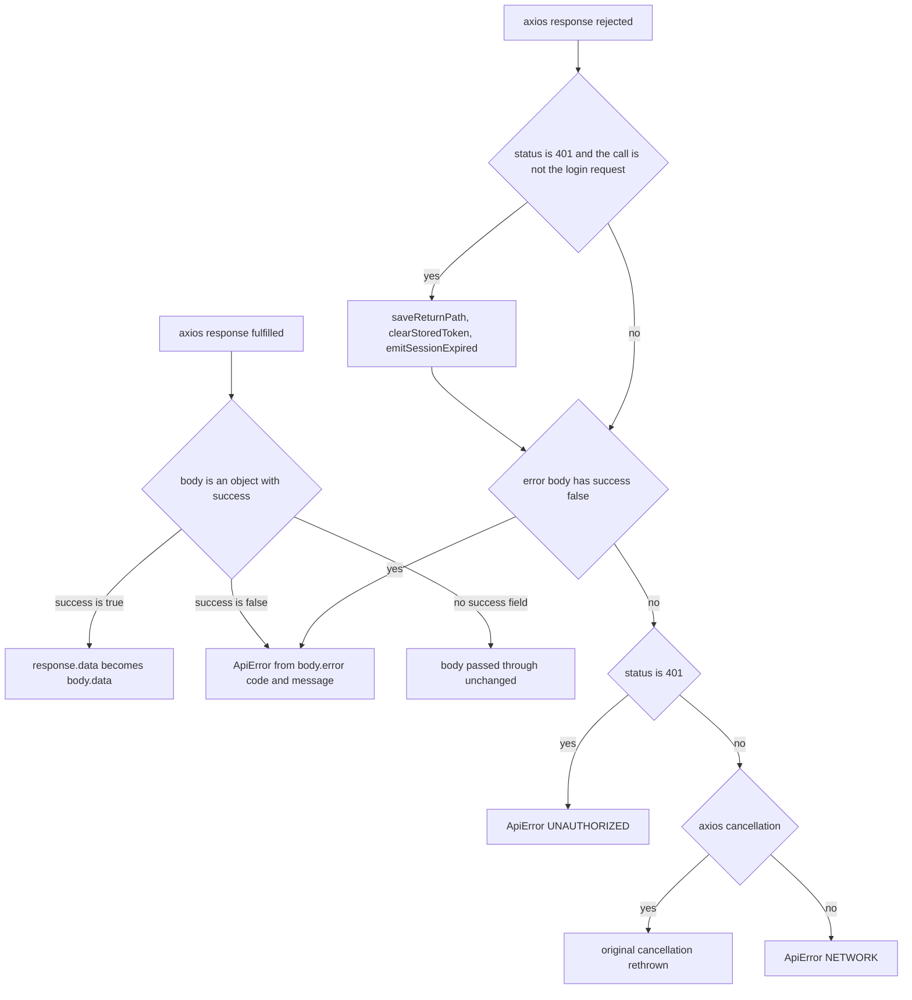

# Admin data access, query cache and client state

The admin SPA has one data path: every request leaves through the axios instance in [`../../apps/admin/src/lib/api.ts`](../../apps/admin/src/lib/api.ts), every server entity lives in the react-query cache built in [`../../apps/admin/src/lib/queryClient.ts`](../../apps/admin/src/lib/queryClient.ts), and everything that is *not* a server entity — the in-progress plot, the detour composition, layer visibility, sidebar mode — lives in zustand stores or in browser storage. Feature modules (`routesApi.ts`, `features/*/api.ts`) are thin typed wrappers over the axios instance; the query and mutation hooks in `useRouteQueries.ts` and `features/fares/queries.ts` own the cache-update policy, so components consume hooks instead of touching the cache (the lone exception is the detour editor, which invalidates the detours key itself after a save).

The split matters for change safety: UI code never inspects `success`, `data`, or axios error shapes, and it never keeps its own cached copy of a server entity.

## One axios instance: the API boundary

```ts
export const api = axios.create({
  baseURL: import.meta.env.VITE_API_URL,
  headers: { "Content-Type": "application/json" },
});
```

`VITE_API_URL` points at the Fastify backend (dev default `http://localhost:3000`). The SPA never talks to Supabase directly and `VITE_SUPABASE_URL` / `VITE_SUPABASE_ANON_KEY` are deliberately unused — authentication is backend-proxied (see [ADR-0006](../../docs/adr/0006-supabase-auth.md) and [Admin authentication and session](../workflows/admin-authentication-and-session.md)).

### Token storage and the request interceptor

The session token is a plain browser value: `localStorage["komyuter.admin.token"]`, reached only through `getStoredToken()`, `setStoredToken()`, and `clearStoredToken()`. The request interceptor reads it on every call and adds `Authorization: Bearer <token>` when present, so no caller passes credentials explicitly. `login()` writes the token returned by `POST /api/auth/login`; sign-out and the session-expiry hook are the only places that drop it.

### Envelope unwrapping

The backend answers every admin call with the `{ success, data | error }` envelope declared in [`../../packages/shared/src/types/envelope.ts`](../../packages/shared/src/types/envelope.ts). The response interceptor flattens that away:

| Wire body | What the caller receives |
| --- | --- |
| `{ success: true, data: T }` | `response.data` is replaced by the unwrapped `T` |
| `{ success: false, error: { code, message } }` | rejection with `ApiError(code, message, httpStatus)` |
| a body without a `success` property | passed through untouched (defensive: a proxy or mock may not envelope) |

Because `data` is unwrapped in the interceptor, every API function is three lines — `const { data } = await api.get<T>(url); return data;` — and returns the domain payload directly.

### Error classification



Both interceptor branches of `lib/api.ts` — envelope failures and transport failures — collapse to the same two outcomes.

Callers therefore observe exactly two things: unwrapped data, or an `ApiError` carrying `code`, `message`, and (when a response existed) `status`. The classifications are:

- **Envelope failure** — `body.success === false` → `ApiError(body.error.code ?? "INTERNAL", body.error.message ?? "Request failed.", status)`. Codes come from the server's `ERROR_CODES` set (`UNAUTHORIZED`, `FORBIDDEN`, `NOT_FOUND`, `VALIDATION_ERROR`, `CONFLICT`, `INTERNAL`) and are produced by the backend error handler.
- **Raw 401 without an envelope** — classified defensively as `ApiError("UNAUTHORIZED", "Invalid or expired token", 401)`, identical in shape to the envelope case.
- **Network failure** — anything else, including transport failures, timeouts, and responses whose body is not a JSON envelope, becomes `ApiError("NETWORK", "Cannot reach the server.", status?)`. `status` is `undefined` for a transport failure with no response; consumers use that (`status >= 500 || code === "NETWORK" with no status`) to distinguish "backend unreachable" from a real rejection.
- **Cancellation** — an axios cancellation is rethrown untouched, never wrapped, so a consumer can recognise its own cancelled request.

`"NETWORK"` and the fallback `"UNAUTHORIZED"` are client-synthesised codes that do not exist in the shared `ERROR_CODES` union; feature code that switches on `code` must tolerate them.

### The 401 session-expiry hook

For any 401 whose URL does not end with `/api/auth/login`, the interceptor performs its side effects *before* classifying the error:

1. `saveReturnPath(window.location.pathname + search)` — written to `sessionStorage`, so the path survives a full page reload (react-router `location.state` would not).
2. `clearStoredToken()` — the stored token no longer validates.
3. `emitSessionExpired()` — notifies the subscriber bus in `features/auth/sessionExpired.ts`.

`AuthProvider` is the only subscriber: it sets `sessionExpired`, clears the user, and flips the status to `unauthenticated`, which makes `RequireAuth` redirect to the login screen with the `sessionExpired` flag and the saved return path. Decoupling matters — the API layer knows nothing about React state, and the auth layer knows nothing about HTTP.

The login endpoint is deliberately exempt: a wrong-password 401 must render the ordinary "invalid credentials" message instead of being reported as an expired session. Requests cancelled or failed for other reasons never emit. See [Admin authentication and session](../workflows/admin-authentication-and-session.md) for the startup-restore side of the same classification.

## Query keys and the query client

`lib/queryKeys.ts` is a tiny factory per resource; nothing builds a key inline.

| Key | Shape |
| --- | --- |
| `routeKeys.all` | `["routes"]` — the route list query |
| `routeKeys.overview` | `["routes", "overview"]` |
| `routeKeys.detail(routeId)` | `["routes", routeId]` |
| `routeKeys.directions(routeId)` | `["routes", routeId, "directions"]` |
| `routeKeys.directionStops(directionId)` | `["directions", directionId, "stops"]` |
| `routeKeys.detours(directionId)` / `routeKeys.detour(directionId, detourId)` | `["directions", directionId, "detours"]` / `["directions", directionId, "detours", detourId]` |
| `fareConfigKeys.all` | `["fare-configs"]` |

The tree is prefix-nested: `["routes"]` is a prefix of both `["routes", "overview"]` and `["routes", routeId]`. A single `invalidateQueries({ queryKey: routeKeys.all })` would therefore refetch the list, the overview, and *every* cached route detail — which is exactly the redundant traffic the current model removed. No production code performs that invalidation any more; the list key is used for reading and for row-level patching.

Global defaults, shared by every query:

```ts
export const queryClient = new QueryClient({
  defaultOptions: {
    queries: { staleTime: 30_000, retry: 1, refetchOnWindowFocus: false },
  },
});
```

Per-query overrides carry the policy:

- The route list opts back into `refetchOnWindowFocus: true` so another administrator's changes surface without any push infrastructure.
- The heavy payloads (route detail, directions, direction stops, detours, overview) set `gcTime: 5 * 60_000` so reopening a route reuses the cached copy; the route detail also states `staleTime: 30_000` explicitly (the global default) so a revisited route is not refetched on every render.
- Detail-style queries are `enabled: id !== null`, so a key is never built for an absent id.

## The cache model: patch from the response, never invalidate blindly

[`../../apps/admin/src/features/routes/routeCache.ts`](../../apps/admin/src/features/routes/routeCache.ts) holds four pure patch helpers that take the mutation's own response body and write it into the caches the client already has:

| Helper | Detail cache | Overview cache | List cache |
| --- | --- | --- | --- |
| `patchRouteFromSave` | `directions` replaced by `[base, return_direction]` | entry's `base_polyline`, `return_polyline`, and lean stops | — |
| `patchRouteMeta` | name, short name, colour, active flag, fare config, `updated_at` | name, colour, active flag | row replaced by the returned `RouteSummary` |
| `patchRouteCreated` | — | appended entry with null polylines and no stops | new row prepended |
| `patchRouteDeleted` | evicted with `removeQueries` | entry removed | row removed |

Two invariants make this safe:

- **A patch never fabricates data.** Each `setQueryData` updater returns `current` unchanged when the cache entry is `undefined`, so patching a route the client has not loaded is a no-op rather than a synthetic entry. Deletion is the only helper that purges, because the record is genuinely gone server-side.
- **The server stays the source of truth.** The atomic direction-save response carries the base polyline, the server-derived return direction, the persisted stops, and `updated_at`; the client only copies them. Write-write races are the server's job — the save-time `409 CONFLICT` guard is the authority, and the freshness reference is the returned `updated_at`, not a client timestamp. See [Admin route plotting and save](../workflows/admin-route-plotting-save.md) and the save-API contract for the payload guarantees.

Where the patches are applied: `useCreateRouteMutation`, `useDeleteRouteMutation`, and `useUpdateRouteMutation` patch list/overview/detail; `useSaveDirectionMutation` and `useReplaceDirectionMutation` both funnel into `patchRouteFromSave`. Detours and fare configurations deviate on purpose — their responses do not carry enough to rebuild the list, and the list is small, so `useCreateDetourMutation` / `useUpdateDetourMutation` / `useDeleteDetourMutation` invalidate the direction's detours key (delete also removes the cached single-detour query), and the fare-configuration mutations invalidate `fareConfigKeys.all` after every create, update, or deactivation.

### CONFLICT is an inline banner, not a toast

A `409 CONFLICT` from a direction save means another administrator changed the same route while this one was editing. The mutation hooks deliberately *do not* toast it: `onError` returns early when the error is an `ApiError` with `code === "CONFLICT"`, leaving the workspace to raise an inline conflict banner in the status slot. Everything else still becomes an error toast.

The workspace side of that contract:

- The conflict flag also arms a **Load latest** recovery, which calls `queryClient.fetchQuery({ queryKey: routeKeys.detail(routeId) })` to force a refetch and then replaces the local drafting draft — stops, polyline, metadata, and saved baseline — with the server's state, after the admin confirms that unsaved edits are discarded.
- The consolidated `saveAll` catches `CONFLICT` for the route-metadata leg too, so a metadata-only conflict sets the same flag and shows the same copy instead of being skipped as an unhandled rejection.

Why the deliberate exception: an auto-dismissing toast would hide a state the admin must act on (their work is still in the draft, the server has moved on), while the banner persists next to the Save action. The fare-configuration dialog takes the opposite approach — it keeps the dialog open with the entered values and lets the toast carry the server message — and the detour editor keeps its own inline `lastError` message plus a stale-list guard that refetches before saving.

## Zustand: what client state owns

Three zustand stores make up the client-state layer, and none of them is a cache of server entities. Fetched rows live in react-query; the stores hold the *editable* copy and ephemeral UI state, consistent with the documented rule that the admin never computes fare or geometry truth the server would disagree with.

| Store | Owns | Notes |
| --- | --- | --- |
| `usePlottingStore` (`lib/plottingStore.ts`) | the editing buffer for one route: `routeId`/`directionId`, draft stops, connections chain, committed polyline, `pathStopIds` association, snap state, selection, layer visibility, route-metadata draft, `savedBaseline`, `seedSource`, `draftDirty`, `saving`, undo/redo history | also hosts the pure `deriveUiState` selector and the debounced snap orchestration; `getState()` is used imperatively from effects, never as a global mutable singleton for server data |
| `useDetourStore` (`features/detours/detourStore.ts`) | per-direction detour composition: split/merge nodes, detour stops, road-followed loop, instructions, refusal state, capped undo/redo, `validateSave` gate, serialisation/restore of its own draft | per-direction mini-draft, deliberately separate from the plotting store |
| `useUiStore` (`lib/uiStore.ts`) | sidebar mode only (`expanded` / `collapsed` / `hover`) | smallest possible surface |

Two deliberate design points in the plotting store:

- **Snap orchestration lives in module scope, not in state.** The bound `SnapFetcher`, the debounce timer, the generation counter, and the "history entry that owns the last snap" pointer are module-level variables, so `reset()` or `openRoute()` cannot lose a pending timer or the fetcher. Every edit bumps the generation, and a response whose generation is stale is dropped — a slow snap can never auto-commit over a newer composition. The network call itself is injected with `bindSnapFetcher` (the workspace binds `snapPreview`), which keeps the store free of an HTTP import and unit-testable.
- **Undo/redo history is part of the draft**, not a separate client concern: `history: { past, future }` is a field of the store, persists inside the localStorage draft, and is cleared by a successful save.

`lib/selection.ts` is the accompanying model: a selection is either `{ type: "none" }` or a single stop. Clicking a route polyline on the map is *not* a selection — it sets the workspace focus (`focusedRouteId` in the plotting store) — so the selection type never needs to represent a route.

This page covers store semantics only; how the stores are composed into columns, plates, and dialogs belongs to [Admin route workspace UI](admin-route-workspace-ui.md).

## Browser-storage mirrors

The two mirrors documented here — the plotting/detour draft and the overview geometry — are browser storage only, both use a **24 h TTL**, both accept an injectable `StorageLike` so they are testable in the node test environment, and **neither is ever the system of record** — the server response always replaces them, and staleness is bounded by the TTL. The table also lists the two smaller keys this layer owns (the session token and the saved return path), which are not TTL'd mirrors.

| Mirror | Key | TTL | Written by | Read by |
| --- | --- | --- | --- | --- |
| Plotting draft | `komyuter.draft.{routeId}.{directionId}` (`no-route` / `new` for nulls) | 24 h | debounced store subscription in the workspace provider | draft-restore offer on route open |
| Detour draft | `komyuter.detour-draft.{directionId}` | 24 h | detour editor after the composition is touched | detour draft offer, once per direction |
| Overview geometry | `komyuter.overview-cache` | 24 h | `useOverviewQuery` effect | `placeholderData` warm start + instant edit seed |
| Session token | `komyuter.admin.token` | none (localStorage) | login | request interceptor |
| Return path | `returnTo` (sessionStorage) | tab session | 401 interceptor | login redirect |

### The plotting draft

`lib/draft.ts` persists unsaved plotting work so an admin who navigates away or closes the tab can pick the route back up exactly where they left it. The contract:

- **Never sent to the server.** The draft is recovery state; the only way plot data reaches the backend is the direction save/replace call.
- **Keyed per route and direction**, so a new route and each direction keep independent drafts.
- **Empty payloads are not written** — a payload with no stops and no polyline returns `null` instead of creating an empty entry, so nothing pointless is ever offered back.
- **~500 ms debounce** through `createDebouncedDraftWriter`, with `save` coalescing rapid edits to the latest payload, `flush` writing immediately (used on `beforeunload`), and `cancel` dropping a pending write.
- **Expiry and corruption are terminal.** `loadDraft` returns `null` and *deletes* the entry when `now - savedAt > 24 h`, and deletes it on JSON parse failure. Older draft shapes (missing `history`, `connections`, `routeMeta`, `pathStopIds`) are normalised to safe defaults, so a restore never crashes on a field an older build did not write.
- **Storage is injectable.** `StorageLike` is `{ getItem, setItem, removeItem }`, defaulting to `localStorage` and falling back to a no-op store when the global is absent.

The payload carries `stops`, `polyline`, `connections`, `history`, `routeMeta`, and `pathStopIds`, which is what makes the restore exact: the undo/redo stack and the metadata edits come back with the geometry. `restoreDraft` refuses to trust a stale path↔stop association (a draft written mid-snap can hold a rewired chain with the previous path), nulls `pathStopIds` in that case, and re-requests a snap so the save guard unblocks honestly; a restored draft has no saved baseline, because all of it is unsaved work.

Lifecycle, driven from `RouteWorkspaceProvider`:

- A `usePlottingStore.subscribe` listener writes the draft whenever the draft is dirty and a route is open; when the draft transitions to clean (undo back to the baseline, or a save), it clears the stored draft and cancels the pending writer.
- A `beforeunload` listener flushes a pending write, and unmount flushes too.
- When a fresh route detail lands, the provider offers a stored draft once per route/direction (`restoredRef` guard). Restoring clears the stored draft and marks the draft restored; discarding also clears it.
- A successful save clears the draft, cancels the writer, clears the undo history, and captures a new baseline — so the mirror only ever holds *unsaved* work.

Detour drafts reuse the same module, TTL, and injectable storage with their own prefix and a generic payload, because a detour composition is a separate mini-draft from the base route. The editor writes only after `touched` is set, so a pristine open never clobbers a leftover draft before it has been offered.

### The overview mirror

`lib/overviewCache.ts` mirrors the overview query's full geometry (every route's base/return polylines plus lean stops) into a single `localStorage` key. `readOverviewCache` returns `null` for an absent, expired, corrupt, or shape-invalid payload; `writeOverviewCache` removes the key when handed an empty list and swallows storage failures (quota exceeded, storage disabled) because the cache is an optimisation only.

`useOverviewQuery` uses it in both directions:

- `placeholderData: () => readOverviewCache() ?? undefined` — a function form, so `localStorage` is read only while the query is actually loading. A warm reload therefore paints the polylines immediately with the map instead of showing blank state while `GET /api/admin/routes/overview` refetches.
- an effect mirrors fresh data back so the *next* reload is instant too, skipped while the placeholder is on screen (that data *is* the cached value; writing it back would be churn).

`RouteList` reads the same mirror a second time to seed the plotting store the moment the edit view opens (`seedFromOverview`), but only when the draft is still empty and the cached row has a base polyline; the seed marks `seedSource: "cache"` and derives `pathStopIds` from the seeded stops. When the authoritative detail arrives, the fetch fills an empty draft or upgrades a *pristine* cache seed (same stop ids, not dirty) with the full stop fields and the real `directionId`. A dirty draft is never clobbered — a cache seed is a paint accelerator, and the detail response wins.

## Invariants and failure modes

- Callers only ever see unwrapped data or an `ApiError`; the sole exception that escapes un-wrapped is an axios cancellation, which is rethrown unchanged.
- A 401 on a non-login request always has the same three side effects (save return path, clear token, emit expiry) before the error is classified; the login call is exempt so bad credentials are not reported as an expired session.
- Patching is additive-by-design: a missing cache entry is left missing, and only deletion evicts.
- Cache writes and mirror writes are best-effort; storage failures degrade performance, never correctness.
- Expired or corrupt mirror entries are deleted and reported as absent, so stale work is never silently restored.
- `CONFLICT` is never swallowed: it stops the plotting toast, arms the persistent conflict banner, and enables the load-latest recovery.
- The API server remains the single source of truth for routes, directions, stops, detours, and fares — everything on this page is a cache, an editing buffer, or recovery state.

## Focused tests

| Suite | What it pins |
| --- | --- |
| `tests/session-expired.test.ts` | the listener bus (emit/unsubscribe) and the interceptor: a protected 401 clears the token, saves the current path, and emits; a login 401 emits nothing; a 500 does not emit |
| `tests/draft.test.ts` | key scheme and TTL, save/load round-trip, expired drafts deleted and never returned, `clearDraft` scoping, debounce/`flush`/`cancel` timing, normalisation of older draft shapes |
| `tests/overviewCache.test.ts` | write→read round-trip, TTL boundaries, corrupt JSON and malformed shapes → `null`, empty write drops the key, quota failures swallowed, explicit clear |
| `tests/plotting-store.test.ts` | cache seeding semantics (`seedSource`, baseline capture, no-op when the draft is non-empty or no route is open, reset by `openRoute`/`reset`) |
| `tests/restore.test.ts` | how the classifications drive startup restore: `UNAUTHORIZED` clears the token, `NETWORK` or 5xx keeps it |

The suite runs in a node environment with no jsdom (`apps/admin/vitest.config.ts`, `pnpm --filter admin test`, or `pnpm test` for the whole turbo pipeline) — which is exactly why the mirror modules take an injectable storage surface instead of touching `localStorage` directly.

## Related

- [Admin route workspace UI](admin-route-workspace-ui.md) — how these stores and queries are composed into the workspace surfaces.
- [Admin route plotting and save](../workflows/admin-route-plotting-save.md) — the save pipeline whose responses feed the patches.
- [Admin authentication and session](../workflows/admin-authentication-and-session.md) — the token flow and login redirect that consume the 401 hook.
- [Server API surface](../operations/server-api-surface.md) and [Shared contracts](../packages/shared-contracts.md) — the envelope, error codes, and entity shapes this layer consumes.
