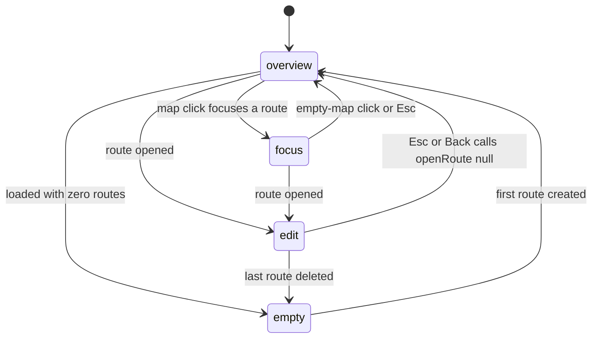
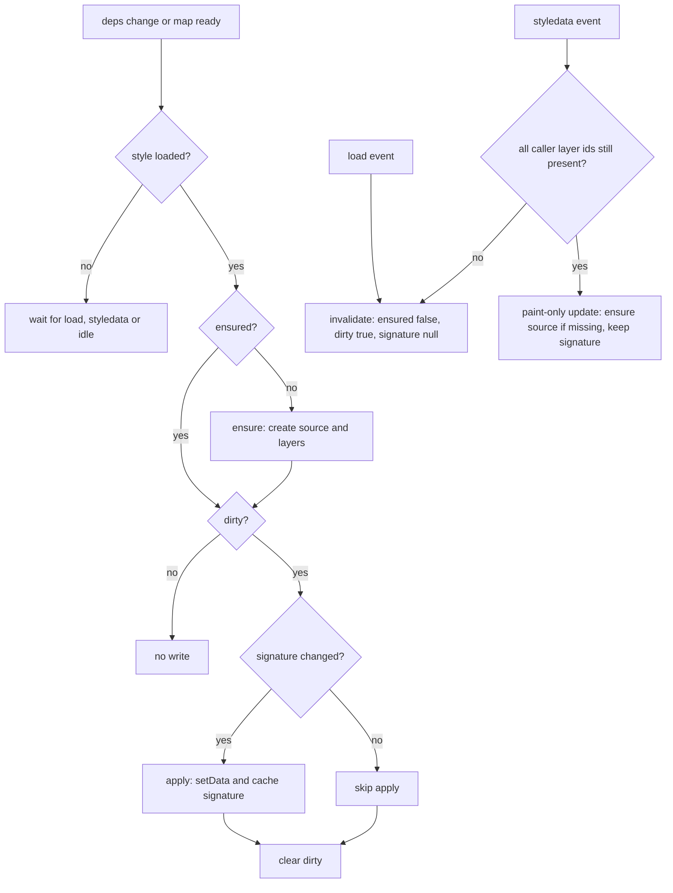

# Admin route workspace: four states, three layers and the map rendering stack

The route workspace is the admin's centrepiece screen: one full-bleed MapLibre canvas with content-adaptive DOM plates floating over it. The structural decisions are ADR-0014 (three layers, four states, one GL instance that is never unmounted) and ADR-0015 (the plates float over a full-bleed map); the map/everything-else split is ADR-0013, and `[lng, lat]` is consumed natively with no conversion layer anywhere in this surface (ADR-0013).

This page covers how that structure is actually built: who derives the state, which column owns what, what is a GL layer versus a DOM marker, the one lifecycle helper both drawing pipelines go through, the overview layer's rendering rules, and which store field each interaction writes.

## The four states

`WorkspaceUiState` is `"empty" | "overview" | "focus" | "edit"`, derived by the pure selector `deriveUiState` in [`../../apps/admin/src/lib/plottingStore.ts`](../../apps/admin/src/lib/plottingStore.ts) from four structural inputs — `loaded`, `routeCount`, `routeId`, `focusedRouteId` — with a fixed precedence: `empty` when the route list has loaded with zero routes, `edit` when a route is open, `focus` when a route is only focused from the map, otherwise `overview`. A not-yet-loaded list derives `overview`, so the empty state is never flashed during loading.

The four-state machine and its legal transitions; `edit` always wins over `focus` because `routeId` is checked first.

Components never keep a `uiState` of their own: [`RouteWorkspaceProvider.tsx`](../../apps/admin/src/features/routes/workspace/RouteWorkspaceProvider.tsx) calls `deriveUiState` once per render and publishes it through `useRouteWorkspace()`, and the page passes it to the column shell and the narrow-window gate. The URL parameter is only a seed — an effect calls `openRoute(routeParam ?? null)` and the store becomes the source of truth from then on.

`openRoute(null)` is the "leave the editor" transition and it clears the whole editing slate at once (`stops`, `polyline`, `snap`, `selection`, `tool`, `poi`, `routeMeta`, `connections`, `draftDirty`, `focusedRouteId`, `history`, `savedBaseline`), which is why closing the editor lands in `overview` rather than back in `focus`.

## The column shell: what each plate owns

[`WorkspaceColumns.tsx`](../../apps/admin/src/features/routes/workspace/WorkspaceColumns.tsx) renders five grid tracks in a fixed order — left plate, left spacer, transparent centre, right spacer, right plate — and switches the track template per state:

| State | `grid-template-columns` | Plates rendered |
| --- | --- | --- |
| `empty` | `0px 0px minmax(0,1fr) 0px 0px` | centre: `EmptyState` plate over the warm canvas |
| `overview` | `256px 0px minmax(0,1fr) 0px 0px` | left: `RouteList`; centre chrome |
| `focus` | `256px 0px minmax(0,1fr) 0px 336px` | left `RouteList`, right `FocusPlate`, centre chrome |
| `edit` | `256px 0px minmax(0,1fr) 0px 336px` | left `RouteList` + `DetourSidebar`, right `PropertiesPanel`, centre chrome |

Track widths come from `WORKSPACE_GEOMETRY` in [`workspace/geometry.ts`](../../apps/admin/src/features/routes/workspace/geometry.ts): `leftCol: 256`, `rightCol: 336`, `gutter: 0`, `minMapWidth: 400`. There is no gutter track — the 12 px `p-3` inset inside each column cell is both the floating look and the inter-plate spacing, and `computeMapWidth(viewport, railW, mode)` therefore reports the *free map region* the user actually interacts with (`viewport − railW − plates`). `focus` and `edit` share the right-column footprint, so the canvas never resizes between them. (The doc comments in `RouteMap.tsx`/`WorkspaceColumns.tsx` still quote the older `240 | 16 | … | 16 | 336` figures; the tokens and `workspaceGeometry.test.ts` are the current values.)

Three properties of the shell matter for anyone changing it:

- **The grid is identity-stable.** The same five items render in the same order in every state; hidden tracks use `display: none` (`showLeft = mode !== "empty"`, `showRight = mode === "focus" || mode === "edit"`) rather than conditional items, so state changes never re-order or remount the map backdrop.
- **The container is `pointer-events: none`** and the map backdrop is a positioned sibling (`main` is `absolute inset-0`), so clicks in the free region reach the canvas — add-stop, drag-stop, polyline focus, empty-map deselect. Only the plate faces and the chrome opt back in with `pointer-events-auto`.
- **Plates are content-adaptive.** Each track's inner wrapper is a capped flex column (`flex max-h-full flex-col`, or `h-full` when `leftPinned`) with the plate root `min-h-0`, so short content shows a short plate with the map around it and long content scrolls inside the plate.

The centre track hosts the state-independent chrome, assembled in [`RouteWorkspace.tsx`](../../apps/admin/src/pages/RouteWorkspace.tsx): `PoiSearchBar` top-left, `StatusBar` top-right (save lifecycle, draft-restore offer, conflict notice — exactly one notice at a time), and `PlotActionBar` plus the Save button bottom-centre, with the snap warning below it. All of it renders only when a route is open. `NarrowWindowGate` wraps the whole workspace with the derived mode (`mode={uiState === "empty" ? "overview" : uiState}`) so the map-width floor is evaluated against the free region (see [Admin shell and routing](./admin-shell-and-routing.md)).

## The map stack inside `RouteMap`

[`RouteMap.tsx`](../../apps/admin/src/features/routes/RouteMap.tsx) is a thin wrapper around react-map-gl's `<Map>`: it owns the viewport as local `useState` seeded at `ILOILO_CITY`, and mounts the map-stack components in a fixed order — `RouteFitter`, `SelectionPanner`, `BasemapController`, `PerspectiveController`, `RouteLines`, then the marker lists and, via `children`, `RouteOverviewLayer` (only in `overview`/`focus`) and `DetourLayer`.

`react-map-gl`'s `MapProvider` sits at the page root rather than around the canvas, so context consumers both inside the map (`RouteLines`, the controllers, `RouteOverviewLayer`) and beside it (`PoiSearchBar` in the centre chrome) can resolve the instance. The chrome beside the map reads `useMap().current` at event time rather than capturing it during render, so a late-mounting map still flies; the drawing components re-run their effects whenever the instance appears.

### GL layers versus DOM markers

The workspace deliberately splits point affordances from line geometry:

- **Lines are real MapLibre layers** added imperatively to the shared instance: `route-lines` (draft + connecting), `detour-lines`/`detour-draft-line`, and `overview-lines` with its casing and arrow layers. No polyline is drawn in the DOM, and there is no second canvas.
- **Stops, split/merge nodes and detour stops are HTML markers** (`<Marker>` from `react-map-gl`), because they need drag gestures, click handlers, focus-visible outlines, ARIA labels and Tailwind shapes. Selected stops get an outline on top of the type plate, so selection is never carried by colour alone.

Marker identity comes from [`stopShapes.ts`](../../apps/admin/src/lib/stopShapes.ts): `terminal` → square `#1B6DB2`, `major_stop` → circle `#008554`, `waiting_area` → amber diamond `#C98A1B`, with the Tailwind classes in [`map/constants.ts`](../../apps/admin/src/features/routes/map/constants.ts). Stop numbering uses the index in the *full* `stops` array even when a type is hidden, so hiding a type never renumbers the rest.

### Click routing and drag gating

A single `handleMapClick` defines a strict priority order, which is the easiest thing to break when adding a new tool:

1. Any map click clears the temporary POI marker (`setPoi(null)`).
2. If the detour editor is `open`, the click belongs to it: with the `add` tool it delegates to the detour store's `handleMapClick([lng, lat])` (entry/exit/waypoint placement); with any other tool it closes the editor and returns focus to the base route. The guard reads `open`, not `mode`.
3. With `routeId === null` the click does nothing — no plotting controls are active without a route.
4. `select` → `setSelection(clearSelection)`.
5. `add` → `addStop([lng, lat])` at the exact clicked coordinate.

Stop dragging is enabled only when `routeId !== null && tool === "select"`; detour stops and split/merge nodes are draggable while the editor is open.

### Zoom, fit and selection effects

Three small controller components translate store changes into camera moves, each reading fresh store state inside its effect so async-loaded geometry is framed once it arrives:

| Component | Trigger | Camera action |
| --- | --- | --- |
| `RouteFitter` | `fitCounter` incremented by `requestFit()` | `fitBounds` over every stop plus the committed polyline, `padding 80`, `maxZoom 15`, `duration 450` |
| `SelectionPanner` | `selection.type === "stop"` | `easeTo` the selected stop's location, `duration 450` |
| `RouteOverviewLayer` click | a route line clicked in `overview` | `fitToOverview`: `fitBounds` over the base polyline + stops, `padding 90`, `maxZoom 14.5`, `duration 500`, then `setFocusedRouteId(routeId)` |

`requestFit()` is fired by `openRoute(id)`, by the route-detail load in `RouteList`, and by a completed `saveAll`. Focus is set and cleared in three more places: the overview click handler, an empty-map click that hits no overview layer, and `Esc` (handled in the page, which pops the focus plate before it would leave the editor).

### Basemap style, opacity and camera

`BasemapController` walks every layer of the active style and writes `baseOpacity` to the matching paint property per layer type (`background-opacity`, `fill-opacity`, `line-opacity`, `icon-opacity`/`text-opacity` for symbols, `raster-opacity`), skipping anything whose id starts with `route-line-`, `overview-` or `route-arrow` so overlays always stay fully opaque. It re-applies on `styledata` and `load`, so switching styles can never leave the basemap uncontrolled.

`PerspectiveController` keys off the `layers.baseStyle` choice: `3d` (the OpenFreeMap `liberty` style) eases the camera to `pitch 60`, and any other style levels it back to `pitch 0`, both over 500 ms. The 3D effect is the camera, not the style.

One subtlety is load-bearing enough to have its own comment: the basemap style is memoised on `layers.baseStyle` before being handed to `<Map mapStyle>`. A fresh object per render would make react-map-gl call `setStyle` on every re-render (marker toggles, opacity changes) and flicker the route lines, so `mapStyle` must stay referentially stable.

## The map-layer lifecycle helper

Both drawing pipelines — the editor's `RouteLines` and the overview's `RouteOverviewLayer` (and, with the same contract, `DetourLayer`) — draw through [`../../apps/admin/src/lib/mapLayers.ts`](../../apps/admin/src/lib/mapLayers.ts). That helper is the single source of truth for *when* imperative MapLibre drawing happens, and it exists because three failure modes show up in practice: data arriving while a vector style still reports "not loaded", a perpetual `idle → setData` loop on a settled map, and style reloads that silently destroy runtime layers.

`useDrawWhenReady` — the dirty check, the style-reload invalidation and the paint-only carve-out.

The contract has four parts:

- **`ensure()`** creates the GeoJSON source and the layers and returns whether they exist. Callers guard every `addLayer` with `if (!map.getLayer(id))`, so re-running it is idempotent. `ensureGeoJsonSource` seeds an empty `FeatureCollection`; `setSourceData` is a no-op when the source is missing.
- **`signature()`** returns the current content identity. `apply()` runs only when that identity differs from the last applied one, so a settled map stops writing. Callers use the identity that matches their cost: the overview returns its memoised feature array (a data change rebuilds the memo and yields a new reference), while `RouteLines` returns `JSON.stringify(...)` of kind, colour *and* coordinates — the coordinates matter because a stop drag that keeps the same vertex count must still redraw.
- **The dirty flag drives retries.** The effect sets `dirtyRef` and ticks immediately; if the style is not loaded the tick returns, and `load`/`styledata`/`idle` re-tick. `idle` re-ticks only while a draw is still dirty, which is what stops the idle loop. On top of the event path there is a bounded safety net: `retryEnsure` polls up to 150 animation frames until the source/layers exist, because a flapping style can starve the event path entirely.
- **Style (re)loads invalidate.** `load` calls `invalidate()`, which clears the "ensured" flag, marks the draw dirty and resets the cached signature, so the destroyed source/layers are rebuilt *and* the data redrawn even if the content is unchanged. `styledata` is the subtle case: it fires for any style update, including the crossfade's per-frame `setPaintProperty` calls, so it does **not** invalidate unconditionally. When the caller passes its `layerIds` and all of them still exist, the update is treated as paint-only (ensure the source if missing, leave the signature alone); when any layer is gone, that means a real reload and it invalidates.

The practical rule for a change: any new imperative layer must go through this helper with its own layer ids, or a style switch will wipe it and a paint-only fade can trigger a redraw storm (every current caller — `RouteLines`, `RouteOverviewLayer`, `DetourLayer` — passes them, and omitting them leaves only the conservative path). The fade animations are additionally kept *outside* the `apply` step: a fade's per-frame `setPaintProperty` calls emit `styledata`, and a fade driven from inside `apply` would re-enter the draw path on every frame.

## The two drawing pipelines

### `RouteLines` — the editor's geometry

[`map/RouteLines.tsx`](../../apps/admin/src/features/routes/map/RouteLines.tsx) draws two filtered line layers over one `route-lines` source:

- `route-line-draft` — the committed, road-snapped draft, `4 px`, route colour (falling back to `DRAFT_LINE` `#1B6DB2`). This is what the admin saves.
- `route-line-connecting` — the transient straight line that bridges stops while no road-snapped path exists (`4 px`, dashed `[2, 1]`, `PREVIEW_LINE` `#FF5C00`). It is a display fallback only and is never persisted.

`RouteMap` computes the connecting geometry itself: the chain order from `pathFromConnections`, with disconnected stops dropped, plus a `chainOutOfSync` check (true while `pathStopIds` is null mid-rewire, or when the association mismatches by order or length) that makes the connecting line reappear when the committed path no longer matches the chain. See [Workflow: plotting a route and saving the direction pair](../workflows/admin-route-plotting-save.md) for the chain and snap semantics behind those fields.

`RouteLines` also owns the editor's crossfade:

- **Fade in, once per route open.** Keyed on `routeId`, so snap auto-commits during editing stay immediate, and re-armed for the next route. It retries a few frames until the layer exists (the layer is created by the helper on style load) and then runs `fadeLineLayers`, which zeroes the layer synchronously before stepping `line-opacity` — a freshly created layer must never paint one full-opacity frame.
- **Fade out on close.** When the draft becomes `null` while geometry was showing, `fadeOutLayers` runs for `DRAFT_FADE_OUT_MS` (200 ms) and the geometry is only cleared once the fade completes *and* the route is still closed; the `apply` step is paused during the fade (`draftFadeOutRef`) so an empty `setData` cannot cut the line. Opening a new route mid-fade cancels the fade-out, unblocks the apply and re-arms the fade-in.

`DetourLayer` ([`features/detours/DetourLayer.tsx`](../../apps/admin/src/features/detours/DetourLayer.tsx)) follows the same contract for `detour-line` (saved alternatives, dashed, per-detour colour, inactive ones at lowered opacity) and `detour-draft-line` (the live amber composition while the editor is open), gated by `layers.detours` and the sidebar's per-detour `hiddenDetourIds`.

### `RouteOverviewLayer` — every route at once

[`RouteOverviewLayer.tsx`](../../apps/admin/src/features/routes/RouteOverviewLayer.tsx) mounts only in `overview` and `focus`, and is fed by a single `useOverviewQuery()` call (all routes' base and return polylines plus stops) rather than per-route detail fetches. The rendering decisions are the non-obvious part:

- **The base direction is always drawn in full** on its saved geometry (`direction: "base"` features), with a feature property carrying the route name and colour.
- **The return direction is drawn only where it genuinely diverges.** Each return polyline is passed through `divergingSegments(returnCoords, baseCoords)` ([`lib/coords.ts`](../../apps/admin/src/lib/coords.ts)), which keeps only the contiguous runs whose vertices all sit more than the default 20 m from the base corridor and drops runs shorter than two vertices. On a shared corridor the return is an exact reverse of the base, so drawing it there would split the route into two parallel lines.
- **Opposite-direction shared corridors get a real-metre lateral offset.** `findOppositeOverlapRuns` ([`lib/overlap.ts`](../../apps/admin/src/lib/overlap.ts)) hashes every route's base polyline into a 20 m spatial grid, projects to flat-earth metres at the dataset's mean latitude, and marks vertex pairs that are within 20 m of each other *and* travelling in opposite directions (tangent dot below −0.5). Same-direction pairs are deliberately ignored; a single polyline doubling back on itself only counts when the two vertices are at least 100 m apart along the line. The matched ranges are then applied to the base geometry by `shiftOverlapRuns`, which moves each overlapping pass `OVERLAP_OFFSET_METERS` (1 m) right of its own travel — 2 m total separation — with a symmetric 0 → full → 0 taper over `OVERLAP_TAPER_METERS` (30 m) so the shifted stretch rejoins the line without a kink. The offset is in metres, not pixels, so it reads subtly at overview zoom and clearly when zoomed in.
- **Direction arrows are symbol layers on the line.** Each direction gets an `overview-arrows-<direction>` layer with `symbol-placement: "line"`, `symbol-spacing: ARROW_SPACING_PX` (200 px), an SDF icon image (`route-arrow`, a canvas-drawn right-pointing triangle added with `sdf: true`), `icon-size: 0.7`, `icon-rotation-alignment: "map"` and `icon-allow-overlap: false` — so MapLibre places the icons at line-relative intervals and rotates them along the travel direction while skipping ones that would collide.
- **Six layers, casing included.** `OVERVIEW_LAYERS` lists the base and return lines, their two white 7 px casings, and the two arrow layers. The casing layers are in the hit-test list as well, so hover and click targets stay wide; the visible lines are 3.5 px in the per-feature colour (defaulting to `#1B6DB2`).

Hover and focus are expressed as MapLibre feature state, not by rebuilding geometry: the layer paint expression resolves to 1 for a `hovered` or `focused` feature, otherwise to the numeric `dim` feature state. Hovering sets `dim = 0.5` on every other route, focusing sets `dim = 0.3` (focus wins), and at rest `dim` is `null` so everything renders at full opacity. `mousemove`, `mouseleave` and `click` are registered against the full `OVERVIEW_LAYERS` array; `mouseleave` only clears the hover when no overview layer is under the pointer, because the base/return pair sits on opposite sides of the road and leaving one may just mean crossing onto its sibling.

## Fades and teardown

The overview's fade behaviour is where most of the tuning in this area lives ([`lib/overviewFade.ts`](../../apps/admin/src/lib/overviewFade.ts), [`overview/helpers.ts`](../../apps/admin/src/features/routes/overview/helpers.ts)):

- **The opacity expression is shared.** `overviewOpacityAt(factor)` returns the hover/focus-aware case expression at `factor >= 1`, and `["*", expression, factor]` below it (clamped to `[0, 1]`), so a fade never makes a dimmed feature jump to full opacity first. `writeOverviewOpacity` writes it to all six layers, choosing `line-opacity` for `overview-lines-*` and `icon-opacity` for the arrow layers, and skips layers that do not exist yet.
- **Fade in is a 0 → 1 timeline over `OVERVIEW_FADE_MS` (250 ms), stepped by a 25 ms `setTimeout`** rather than rAF, so it is immune to frame starvation, with a module-level single-flight guard so at most one timeline runs. The factor is zeroed before the first step, so freshly created layers never paint at full opacity.
- **Fresh versus survivor is decided from map state.** Before the ensure can create the source, the layer captures whether `overview-lines` was already present. Absent means a fresh overview (fade in); present means the layers survived an edit round-trip and may be sitting at a partial opacity from a cancelled teardown fade — they are restored to full immediately rather than zeroed and faded again. The trigger effect also retries until the base layer exists, and runs at most one fade per mount, so later data changes (refetch, save) swap the geometry instantly: re-fading visible lines is what reads as flicker.
- **Unmount is a crossfade, not a cut.** When the layer unmounts (overview → edit), the six layers fade out over 250 ms while the editor's draft line fades in on top, and only then are the layers, the `overview-lines` source and the `route-arrow` image removed — MapLibre would otherwise keep the drawn geometry under the editing view. Teardown races are handled with a map-scoped mount token (`__komyuterOverviewMount`, stored on the map object because module state is unreliable under HMR duplication): each setup claims a fresh token, and an older teardown's fade-out and delayed removal abort as soon as a newer mount has claimed it. `fadeOutLayers` returns a cancel handle and re-reads each layer's current paint value as the start point, so a focused (0.3) route fades smoothly from where it is. Every step checks `mapIsUsable` (a `getStyle()` probe) because react-map-gl can destroy the map while timers are still in flight.

## Invariants a change must not break

- **The map never remounts or resizes across state changes.** The canvas is a positioned backdrop that is always mounted, the grid's five items are identity-stable, and `focus`/`edit` share the same right-column width. Nothing in this area may conditionally render the `<Map>`, key it by state, or move it inside a plate.
- **`react-map-gl`'s `MapProvider` stays above both the map and the chrome**, and consumers keep reading `useMap().current` lazily.
- **All imperative drawing goes through `useDrawWhenReady` with the caller's layer ids and a content signature**; keeping geometry in the store and letting the helper decide when to write is what makes style switches and fades safe.
- **Fades stay outside `apply`.** Any `setPaintProperty` loop driven from the apply step re-enters the style-data path.
- **The detour editor owns the tools while it is open.** The base route's click handling, `mod+s`, undo/redo and `Esc` all defer to it, and the map's click route checks `open` before the plotting tool.
- **Two store-level oddities worth knowing before touching this area:** `LayerVisibility.base` exists in state (defaulted to `true` and asserted in `plotting-store.test.ts`) but no component reads it and no control writes it — basemap visibility is expressed only through `baseOpacity`. And `RouteWorkspaceProvider`'s context value is deliberately *not* memoised, because its only consumer re-renders on every provider state change anyway; the file records what to do if a memoised consumer ever appears.

## Stores this surface reads and writes

| Store field / action | Owner | Read by |
| --- | --- | --- |
| `routeId`, `focusedRouteId` | `plottingStore` | `deriveUiState`, `RouteOverviewLayer`, `PropertiesPanel`, `RouteMap` |
| `stops`, `polyline`, `connections`, `pathStopIds`, `selection` | `plottingStore` | `RouteMap` markers, `RouteLines`, `RouteFitter`, `SelectionPanner` |
| `layers` (baseStyle, baseOpacity, markers, markerLabels, routes, detours, detourStops, detourStopLabels, detourNodes) | `plottingStore` | `RouteMap`, `BasemapController`, `PerspectiveController`, `DetourLayer`, `PlotActionBar` |
| `fitCounter` | `plottingStore` | `RouteFitter` |
| `poi` | `plottingStore` | `RouteMap` POI marker, `PoiSearchBar` |
| `detourStops`, `entry`, `exit`, `hiddenDetourIds` | `detourStore` | `RouteMap` detour markers, `DetourLayer` |

Layer visibility is one merged object written through `setLayers(patch)`; the toggles for those flags live in the `PlotActionBar` Layers submenu (Basemap, Markers, Polylines), which renders only while a route is open. The toggles are pure reads for the map stack: `layers.routes` decides whether `RouteLines` receives the draft and connecting geometry at all, `layers.markers[type]` filters `visibleStopsForLayers`, and the detour flags gate the detour markers, their labels and the split/merge indicators.

## Configuration and tests

The three basemap styles resolve through `baseMapStyleFor` in [`../../apps/admin/src/lib/tiles.ts`](../../apps/admin/src/lib/tiles.ts) to keyless OpenFreeMap vector styles — `default` → `bright`, `minimalist` → `positron`, `3d` → `liberty`. The browser's production Content-Security-Policy has to allow `https://tiles.openfreemap.org` in `img-src` and `connect-src`; the allowlist and its policy live on [Configuration and secrets](../operations/configuration-and-secrets.md).

The pure parts of this surface are covered by Node-environment tests: `workspaceUiState.test.ts` pins the five `deriveUiState` rules, `workspaceGeometry.test.ts` pins the tokens and the free-map-width formula including the 400 px gate boundary, `overviewFade.test.ts` pins the opacity-expression scaling and the monotonic fade/fade-out/cancel behaviour with stubbed rAF, `overlap.test.ts` covers the opposite-direction run detection and tapering, `tiles.test.ts` pins the three style URLs, and `stopShapes.test.ts` pins the shape/colour mapping and that selection never leaks into it. The React components, the MapLibre rendering and the network paths are not covered by automated tests — see [Admin test suite: what is hermetic and what is not covered](../testing/admin-tests.md).

Related reading: [Admin data access, query cache and client state](./admin-data-layer-and-client-state.md) for the query cache behind `useOverviewQuery`, [Coordinate order, PostGIS helpers and distance tolerances](../concepts/coordinates-and-spatial-math.md) for the metre tolerances used by the overlap and divergence rules, and [Two directions per route](../concepts/directions-and-derived-return.md) for what the base and return polylines actually are.
