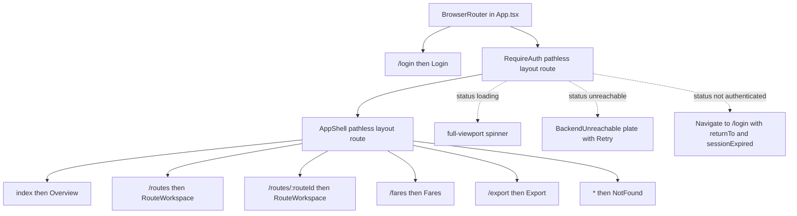
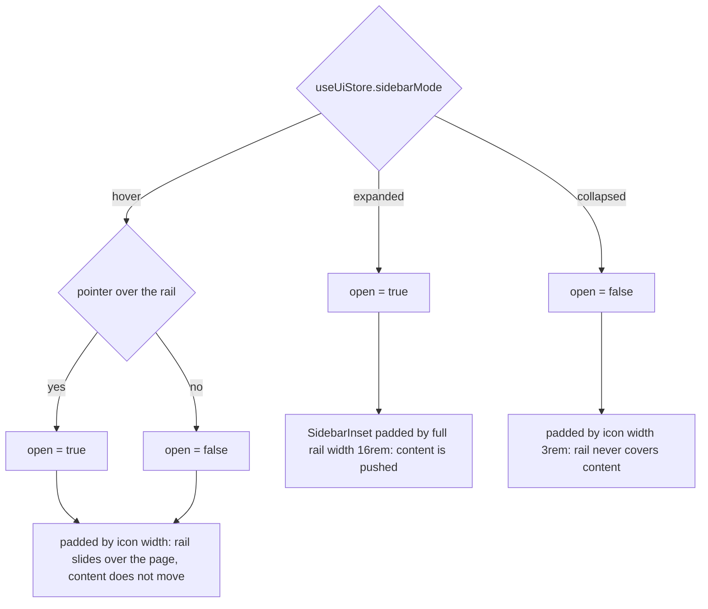

# Admin SPA shell: providers, routes, rail and workspace gates

The admin SPA has no framework-level layout file: [`main.tsx`](../../apps/admin/src/main.tsx) mounts [`App`](../../apps/admin/src/App.tsx), which stacks the providers and hands over to [`app/router.tsx`](../../apps/admin/src/app/router.tsx). The router declares one pathless `RequireAuth` layout route containing one pathless `AppShell` layout route, and `AppShell` is the only component that renders chrome around a page. Everything pages share — the section list, the rail mode, the header title, the offline banner, and the scroll container — is owned by those few modules.

Two decisions outside this page govern the behaviour described here. The desktop-only floor and the rail's mode behaviour are ADR-0014 (see [ADR-0014](../../docs/adr/0014-admin-workspace-layers.md)); the visual and product-strategy layer is `DESIGN.md` / `PRODUCT.md`, which are authoritative and deliberately not restated here. Where the code diverges from what the docs around it say, this page says so explicitly.

## Boot: the provider stack

`App` composes four things, and the order is load-bearing:

```tsx
<AuthProvider>
  <QueryClientProvider client={queryClient}>
    <BrowserRouter>
      <AppRoutes />
    </BrowserRouter>
    <Toaster />
  </QueryClientProvider>
</AuthProvider>
```

- `AuthProvider` is outermost so every component below it — including the router's guard — can call `useAuth()`. It also owns the mid-use expiry listener: the axios 401 interceptor emits `sessionExpired`, the provider flips `status` to `unauthenticated`, and the guard re-renders into a redirect (see [Admin authentication and session](../workflows/admin-authentication-and-session.md)).
- `QueryClientProvider` wraps the router with the single module-level `queryClient`, so one cache survives client-side navigation. Its defaults are `staleTime: 30_000`, `retry: 1`, `refetchOnWindowFocus: false`; individual queries override them (the route list opts back into window-focus refetch). Cache semantics belong to [Admin data access, query cache and client state](./admin-data-layer-and-client-state.md).
- `BrowserRouter` has no `basename`, so section paths are root-absolute (`/routes`). Deep links therefore depend on the host serving `index.html` for unknown paths (Vite's dev/preview SPA fallback does this); there is no hash-router fallback.
- `Toaster` is a sibling of the router rather than a child of it — sonner, `position="top-center"`, `richColors`, `closeButton` — so toasts fired during navigation or by non-route code still render.

[`main.tsx`](../../apps/admin/src/main.tsx) wraps `App` in React `StrictMode` and mounts into `#root` from `index.html`. There is no `ErrorBoundary`, no `<Suspense>` and no lazy route: all pages (`Login`, `Overview`, `RouteWorkspace`, `Fares`, `Export`, `NotFound`) are static imports, so a matched route renders without a second loading layer.

## Route tree and the guard chain



The route table and the three guard branches; `RequireAuth` and `AppShell` are pathless layout routes that render `<Outlet />`, so every guarded page is nested inside both.

`/login` is declared before — and outside — the guarded group, which means an unauthenticated visitor on an unknown URL is redirected to login *before* the catch-all `NotFound` can render, and that the login screen has no rail, header or banner. `Login` also has no "already signed in → home" redirect of its own, so an authenticated admin who navigates to `/login` simply sees the form.

`RequireAuth` is a four-way switch over `useAuth()` state:

| `status` | Rendered |
| --- | --- |
| `loading` | a centred `Loader2` spinner in a full-height (`h-svh`) background, with `sr-only` "Loading session" text |
| `unreachable` | [`BackendUnreachable`](../../apps/admin/src/features/auth/BackendUnreachable.tsx) — a branded plate with a single **Retry** action |
| `unauthenticated` / `authenticating` | `<Navigate to="/login" replace state={{ returnTo, sessionExpired }} />` |
| `authenticated` | `<Outlet />` (the shell) |

Two properties matter for anyone touching it. First, the non-authenticated branch passes the current `pathname + search` as `returnTo`, so a sign-in round trip returns to the deep link; the state contract and its sanitization live in [`features/auth/redirect.ts`](../../apps/admin/src/features/auth/redirect.ts) — `getReturnPath` accepts only strings that start with `/` and not `//`, which closes the open-redirect hole that a naive `location.state` read would open, and `getSessionExpired` accepts only a literal `true` for the flag. Second, the unreachable branch never renders a login form: a backend that cannot be reached at startup is not an expired session, so `RequireAuth` shows the retry plate, whose button calls `AuthProvider.retry()` and re-runs the session restore while `retrying` disables it.

`Login` consumes both forms of the return path: `location.state` for the in-app redirect, and the `sessionStorage` copy that the 401 interceptor writes (which survives a full page reload). After a successful sign-in the saved path wins over `location.state` and is cleared, then navigation happens with `{ replace: true }`.

## One section registry for rail, header and routes

[`lib/sections.ts`](../../apps/admin/src/lib/sections.ts) is the single source of truth for the four top-level sections:

| id | label | path | icon |
| --- | --- | --- | --- |
| `overview` | Overview | `/` | `LayoutGrid` |
| `routes` | Routes | `/routes` | `Route` |
| `fares` | Fares | `/fares` | `Banknote` |
| `export` | Export | `/export` | `Download` |

Array order is rail order. `getSectionByPath(pathname)` resolves a section by exact match **or** by prefix with a trailing slash (`pathname.startsWith(`${section.path}/`)`). That one rule produces three behaviours worth knowing:

- `/routes/:routeId` resolves to `routes`, so the nested workspace keeps the Routes rail item active and the Routes header context.
- The `/` entry only ever matches exactly `/`, because no real path starts with `//` — that is why Overview is not highlighted on every page.
- Unknown paths return `undefined`, so the rail shows no active item and the header falls back to the product name.

Consumers are exactly two: [`NavRail`](../../apps/admin/src/app/NavRail.tsx) maps `sections` into menu items and derives active state by comparing `section.id` with `getSectionByPath(pathname)?.id` (with `end` on the `NavLink` only for `/`), and [`Header`](../../apps/admin/src/app/Header.tsx) uses the same lookup for its title. Adding a section is therefore a two-part change — one entry in this array plus one `<Route>` inside the `AppShell` group — and the rail item, active state and header title follow automatically.

## The nav rail: a full-height overlay, not the stock sidebar

`NavRail` deliberately does **not** render the `Sidebar` primitive from [`components/ui/sidebar.tsx`](../../apps/admin/src/components/ui/sidebar.tsx). That primitive emits an in-flow `sidebar-gap` plus a `fixed` container pair; this rail instead renders its own root `<div>` and composes only the primitive's sub-parts (`SidebarHeader`, `SidebarContent`, `SidebarFooter`, `SidebarGroup`, `SidebarMenu`, `SidebarMenuButton`, `SidebarMenuItem`), reading `state` from `useSidebar()`. The root carries:

- `role="navigation"` and `aria-label="Primary"` — it is the app's navigation landmark.
- `data-slot="sidebar"`, `data-state` and `data-collapsible` so the primitive's styles still apply.
- `absolute inset-y-0 left-0 z-30` and `hidden md:flex`, with the width switched between `w-(--sidebar-width-icon)` and `w-(--sidebar-width)` from `state`. Because the rail is absolute rather than in flow, `AppShell` must pad the content itself.
- Full height (`inset-y-0`, `h-full`) with the mode control in `SidebarFooter`, so the branding sits at the top of the column and the control at the bottom.

The width tokens are supplied by `SidebarProvider`'s inline style rather than by app CSS: `--sidebar-width: 16rem` (256 px) and `--sidebar-width-icon: 3rem` (48 px). Those are the same two figures the workspace's `leftCol` and the loose 48 px rail arithmetic use, which is how the rail's mode reaches the workspace geometry.

Rail header uses `BrandMark compact={collapsed}`: the "Komyuter" wordmark fades out at icon width and the image's `alt` text takes over, so the collapsed rail is still labelled. Each menu button passes `tooltip={section.label}`, which the primitive shows only while collapsed and not on mobile.

### The three modes



How `AppShell` turns the stored mode plus local hover state into the rail's open state and the content padding.

The mode itself lives in [`lib/uiStore.ts`](../../apps/admin/src/lib/uiStore.ts) as `SidebarMode = "expanded" | "collapsed" | "hover"`, defaulting to `expanded`, and is chosen from the rail footer: a ghost icon button (`aria-label="Sidebar visibility options"`) opens a radio-group dropdown labelled "Sidebar control" with the three options, each selection calling `setSidebarMode` and closing the menu explicitly (radio items do not auto-close).

`AppShell` owns the single controlled `SidebarProvider` and derives everything from the mode:

| Mode | `open` (rail state) | `SidebarInset` padding | Visible consequence |
| --- | --- | --- | --- |
| `expanded` | always `true` | full rail width (`md:pl-(--sidebar-width)`, 256 px) | the rail docks and **pushes** the layout |
| `collapsed` | always `false` | icon width (`md:pl-(--sidebar-width-icon)`, 48 px) | the rail stays at icon width and never covers the left plate |
| `hover` | local `hoverOpen`, toggled by pointer enter/leave on the rail | icon width, always | the rail **overlays**: it expands over the page at `z-30` while the content keeps its icon-width padding |

Two details make the modes behave as documented:

- `NavRail` reports hover changes only when `sidebarMode === "hover"` (its `onMouseEnter`/`onMouseLeave` guard on the mode), and `AppShell`'s `onOpenChange` accepts a value only in that same mode. In `expanded`/`collapsed` nothing in the rail can change `open`, so the persisted choice is authoritative rather than sticky state.
- The content never reflows in `hover` mode. ADR-0014's 2026-08-16 amendment to its shell-rail section reversed the original always-push behaviour, and the code records the reversal in place (`AppShell`'s comment "supersedes D1 in ADR-0014"): hover-expand trades the push for a transient overlay, so the workspace canvas is never resized by the rail — the cost is that the rail briefly covers part of the workspace's left plate. That trade is the decision; the implementation is the absolute rail plus the icon-width padding above.

### Mode persistence, and the vestigial cookie

The mode is **in-memory only**. `uiStore` is a plain zustand store with no `persist` middleware, so the choice survives client-side navigation within the session and resets to `expanded` on a full page load. ADR-0014 and the workspace plan both call `sidebarMode` "persisted"; read that as *the user's chosen mode is read as-is and never forced per route*, not as browser persistence — the in-memory-only choice is the documented one for this store.

Two artefacts of the stock `SidebarProvider` are inert here and are a common source of confusion:

- It writes a `sidebar_state` cookie on every `setOpen` call, but nothing in the app reads that cookie and nothing rehydrates `open` from it. The comments in the primitive describe cookie-backed persistence that the app does not use.
- It installs a `Cmd`/`Ctrl`+`B` shortcut that calls `toggleSidebar()` → `setOpen(!open)`. Since `AppShell`'s `onOpenChange` honours a value only in `hover` mode, the shortcut changes nothing in `expanded`/`collapsed` and only moves the rail (as a hover-style expansion) in `hover` mode. The rail is driven exclusively by the footer mode control.

Finally, because the rail is `hidden md:flex`, a window below 768 px has no rail at all; the desktop floor (1024 px) is enforced by the workspace gate, not by the rail.

## Header

`Header` is a fixed-height strip (`h-14 shrink-0`) outside the scrolling region, so it stays put while a page scrolls. It renders an `<h1>` with `aria-live="polite"` — section changes are announced — and derives its title in two steps:

- For every section except `routes`, the title is `section.label`, falling back to `"Komyuter"` when `getSectionByPath` returns `undefined` (an unknown path under the catch-all route).
- For `routes`, the shell reads the workspace's open route: `usePlottingStore((s) => s.routeId)`, then `useRouteQuery(routeId)` (disabled while `routeId` is `null`). With a route open it renders `Route › {name}`, substituting `…` while the detail is still loading; with no route open it renders `"Route"`. This is the one place the shell reaches into a workspace store, and it means the header shares the route-detail cache key with the workspace, so opening a route typically serves both from one request.

The account menu renders only when `user` is non-null (defensive — `RequireAuth` already guarantees a user inside the shell). It shows an initials avatar (`getInitials`), the display name and email (`getDisplayName` falls back to the email's local part), and a **Sign Out** item that runs `signOut()`, toasts `"Signed out"`, and navigates to `/login` with `{ replace: true }`.

That sign-out is client-local: `signOut()` clears the stored token and resets auth state without making a request, so the shell never calls the server's idempotent `POST /api/auth/logout` (which performs a global Supabase sign-out) — even though `docs/ADMIN.md` describes admin sign-out as that call. Revocation of an already-issued access token therefore depends on the token expiring; the server-side route exists and is unused by the client. The auth workflow page owns the rest of that path.

## Layout and scroll contract

`AppShell`'s tree fixes the whole application's scrolling model:

```
SidebarProvider            (controlled; defines --sidebar-width tokens)
└─ div  [data-slot=sidebar-wrapper]  flex min-h-svh w-full
   └─ div  h-svh flex-col
      ├─ a  "Skip to content" → #main-content  (sr-only until focused)
      ├─ ConnectionBanner
      └─ div  relative flex min-h-0 flex-1
         ├─ NavRail (absolute, z-30)
         └─ SidebarInset  <main> with mode-dependent md:pl-…
            ├─ Header                h-14 shrink-0
            └─ div#main-content      min-h-0 flex-1 overflow-auto tabIndex={-1}
               └─ <Outlet />  ← the page
```

The invariants for anyone writing a page:

- The **window never scrolls** (`h-svh` column); `#main-content` is the only scroll container, with `flex-1 min-h-0` keeping it bounded to the viewport. A page that wants to fill the viewport must be `h-full` — `Overview`, `Fares` and `Export` do, and the workspace uses `h-full overflow-hidden` and manages its own panes internally.
- The skip link is the first focusable element and targets `#main-content`, which is programmatically focusable (`tabIndex={-1}`) and therefore a valid skip destination.
- `SidebarInset` is the `<main>` landmark; the padding that stands in for the rail lives on it, and it is animated (`transition-[padding] duration-150 ease-linear`).
- Because the padding — not a spacer element — encodes the rail width, anything that measures the content box (notably the workspace gate) sees the real rail footprint without being told about it.

## Connection banner

[`useOnline`](../../apps/admin/src/lib/useOnline.ts) seeds from `navigator.onLine` and tracks the browser's `online`/`offline` events. [`ConnectionBanner`](../../apps/admin/src/components/shared/ConnectionBanner.tsx) renders `null` while online and, while offline, a full-width `h-9` warning bar (`role="status"`, `z-50`, `shrink-0`) reading "You're offline. Changes won't be saved until you reconnect." It sits above the rail/content row, so showing it reduces the content height without changing its width. It is presentational only — nothing queues or retries requests — and the same component is used on the login screen.

## The desktop floor: `NarrowWindowGate`

ADR-0014 declares the admin dashboard desktop-only with a minimum viewport, guards the map's usable width rather than a viewport class, and `NarrowWindowGate` is that guard. It is mounted by the workspace page, not by `AppShell`:

```tsx
<NarrowWindowGate mode={uiState === "empty" ? "overview" : uiState}>
```

It sits inside `MapProvider` but **outside** `RouteMap`, so gating never touches the GL instance.

Mechanism, in evaluation order:

1. **Measure.** A `useLayoutEffect` attaches a `ResizeObserver` to the gate's own wrapper and records its width before paint. The wrapper is the workspace box — the strip right of the rail — so the gate never needs to know how the rail works.
2. **Viewport floor.** A second effect installs `matchMedia("(min-width: 1024px)")` and sets `belowFloor` when the window is narrower.
3. **Invariant.** `computeMapWidth(width, 0, mode)` computes the free map region (rail width `0`, because the measured box already excludes the rail — the function is invariant to how the rail is passed, which the unit test pins) and `isMapGateActive` tests it against `WORKSPACE_GEOMETRY.minMapWidth` (400 px). Plate widths and the floor come from [`workspace/geometry.ts`](../../apps/admin/src/features/routes/workspace/geometry.ts): `leftCol: 256`, `rightCol: 336`, `gutter: 0`, `minMapWidth: 400`.
4. **Decide.** `blocked = belowFloor || mapRegion < 400`. Before the first measurement (`width === 0`) the children render unconditionally, so the gate never flashes on initial paint.
5. **Cover, never unmount.** When blocked, an opaque plate (`bg-background absolute inset-0 z-50`) covers the workspace with a `role="status" aria-live="polite"` message — "A wider window is needed" plus guidance to widen the window or collapse the navigation rail — while the children stay mounted underneath. A `useLayoutEffect` sets `innerRef.current.inert = true` on the covered chrome (via the DOM property, which also keeps React from warning about the `inert` attribute), so the covered panels and map cannot be focused or clicked. Keeping the map mounted is what preserves its identity and camera across gate toggles (see [Admin route workspace: four states, three layers and the map rendering stack](./admin-route-workspace-ui.md)).

Two triggers, two different regimes:

- **Below 1024 px** the plate always shows, in every mode.
- **At or above 1024 px** the 400 px free-map invariant still fires. At a literal 1024 px window the 48 px collapsed rail leaves 976 px of workspace, so `focus`/`edit` computes `976 − 256 − 336 = 384` and the plate appears even though the window is not "below the floor"; `overview` at the same width computes 768 and passes. So the effective floor is roughly 1024 px of workspace (about 1072 px of window) with the rail collapsed — the reference figures and that exact case are pinned in [`workspaceGeometry.test.ts`](../../apps/admin/src/tests/workspaceGeometry.test.ts).
- An **`expanded` rail** (256 px instead of 48 px) removes 208 px of workspace width, so a window that passes while collapsed can trip the invariant while expanded. This is the only route by which the rail mode reaches the gate, and it is why the plate's instruction includes collapsing the rail. `hover` mode needs no special case: the rail overlays without changing the measured width, so the gate sees collapsed-state geometry.

Two maintenance notes. The declared floor is a literal `"(min-width: 1024px)"` inside the gate's `matchMedia` call — `WORKSPACE_GEOMETRY` holds the plate widths and the 400 px floor but no viewport token, so changing the desktop floor means editing the gate. And the plate's live verdict follows the rail's **animated** padding: `SidebarInset`'s padding transitions over 150 ms and the gate re-measures on every resize, so a rail toggle at a marginal width can show or hide the plate during the animation.

The gate is mounted only on the workspace route. `Overview`, `Fares` and `Export` are ordinary flowing pages with no gate — the desktop-only floor is a property of the workspace's fixed plates, not of the shell as a whole.

## Extension points

- **Adding a section or page**: add one entry to `sections.ts`, add one `<Route>` inside the `AppShell` layout route, and write a page that fills `h-full`. The rail item, active state, tooltip and header title come from the registry.
- **Adding a public route**: declare it as a sibling of the `RequireAuth` layout route (as `/login` is); anything else, including the catch-all, inherits the guard and the shell.
- **Changing the rail**: `SidebarMode` is exported from `lib/uiStore.ts`; the mode labels live in `NavRail`'s `MODE_OPTIONS`. Any new mode must be taught to `AppShell`'s `open` derivation, its `onOpenChange` gate and the rail's hover wiring — those three places are the whole contract.
- **Changing the desktop floor**: edit the gate's `matchMedia` query and/or `WORKSPACE_GEOMETRY.minMapWidth`, then update `workspaceGeometry.test.ts`, which is the executable statement of the arithmetic.

## Focused tests and verification

`apps/admin` runs a single hermetic node-environment suite (`pnpm --filter admin test`; `pnpm test` at the root fans out through turbo). [`vitest.config.ts`](../../apps/admin/vitest.config.ts) sets `environment: "node"` and restricts `include` to `src/tests/**/*.test.{ts,tsx}`, so there is no jsdom and no component testing: the shell's *components* have no tests at all. What is covered is the pure logic they depend on:

| Test | Covers |
| --- | --- |
| [`sections.test.ts`](../../apps/admin/src/tests/sections.test.ts) | the four sections in order, unique ids, exact-path resolution, the nested `/routes/some-route` case, and `undefined` for an unknown path |
| [`require-auth.test.ts`](../../apps/admin/src/tests/require-auth.test.ts) | `returnTo` sanitization (including the `https://` and `//` open-redirect rejections), the `sessionExpired` flag's strict-boolean parsing, and the `sessionStorage` return-path round trip |
| [`workspaceGeometry.test.ts`](../../apps/admin/src/tests/workspaceGeometry.test.ts) | the token values, the free-map formulas per mode, rail-width invariance, the 399/400/401 gate boundary, and the literal-1024-window case above |

So `AppShell`, `NavRail`, `Header` and `NarrowWindowGate` are guarded by typecheck, review of the invariants on this page, and the workspace's manual smoke checks (rail modes, gate plate, map identity across toggles) — not by automated UI tests. When changing the rail or the gate, re-verify the three mode outcomes, that the content padding matches the mode, and that the map keeps its identity and camera across a gate toggle.

## Related

- [Admin data access, query cache and client state](./admin-data-layer-and-client-state.md) — `queryClient` defaults, query keys, token storage and the 401 hook the guard depends on.
- [Admin route workspace: four states, three layers and the map rendering stack](./admin-route-workspace-ui.md) — what the gate wraps, and the map identity it preserves.
- [Workflow: admin login, authorization gate and session expiry](../workflows/admin-authentication-and-session.md) — the auth state machine behind `RequireAuth`.
- [Configuration, environment variables and secrets](../operations/configuration-and-secrets.md) — `VITE_API_URL`, the production CSP injection and the server env schema.
