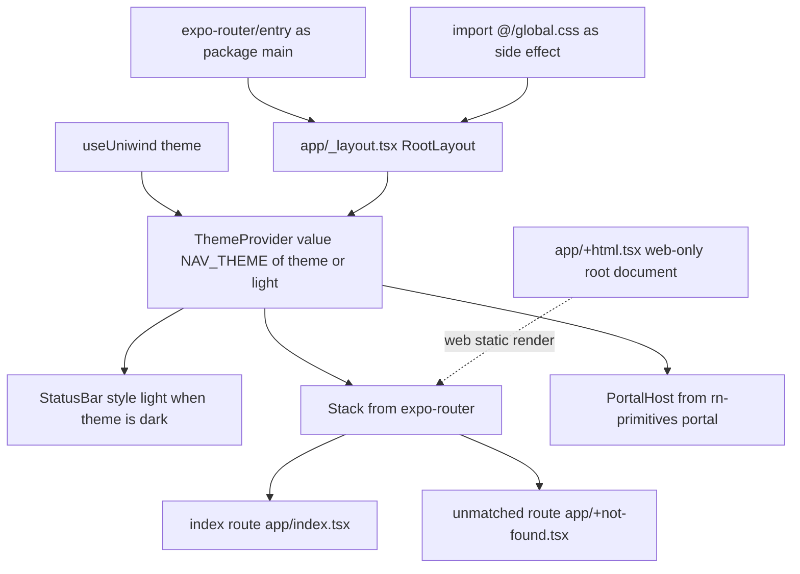

# Mobile commuter app: current state and absent scope

`apps/mobile` is the pnpm workspace member whose package is named `mobile` — an Expo + React Native app that is still the **React Native Reusables "Minimal (Uniwind)" starter** it was generated from. The [README](../../apps/mobile/README.md) records the init command (`npx @react-native-reusables/cli@latest init`, then the Minimal (Uniwind) template), and the Expo identity is untouched: [app.json](../../apps/mobile/app.json) still declares `name`, `slug` and `scheme` as `minimal`, version `1.0.0`. No file in the package names a journey, stop, fare or boarding point — the only copy left in place is the demo line "Edit `app/index.tsx` to get started".

The responsibilities a commuter app would own — state, navigation beyond a single screen, and services — exist here as *scope*, not as code. This page states only what is present and points at where the intended design is authoritative: `docs/DEVIATIONS.md` **D10** for the tracked-but-unbuilt list, [ADR-0006](../../docs/adr/0006-supabase-auth.md) for commuter identity, and [Routing, navigation and trust are not implemented](../concepts/routing-and-navigation-scope.md) as the guard rail against inventing behaviour.

## Boot: one root layout, one stack

[`app/_layout.tsx`](../../apps/mobile/app/_layout.tsx) is the only layout the Expo Router registers; there are no route groups, no `(tabs)` and no nested stacks, so all navigation in the app is the root `Stack`.

The root layout's composition order, and the only routes reachable beneath it.

Three details are load-bearing. `global.css` is imported for its side effect at the top of the layout, so the stylesheet reaches every route through the root. Within the layout the theme is read from `useUniwind()` and used twice — to pick `NAV_THEME[theme ?? "light"]` for the React Navigation theme, and to set the status-bar style — so an undefined theme falls back to light in every branch (the demo screen makes the same `?? "light"` fallback when choosing its logo and header icon). `PortalHost` is a **sibling** of the stack rather than a child, which is what lets RN Reusables overlay primitives render outside the navigator. The layout also re-exports Expo Router's `ErrorBoundary`, so a render error in any route surfaces through the framework's error screen instead of a blank frame.

## Screens

| Route | File | What it renders |
| --- | --- | --- |
| `/` (root) | [`app/index.tsx`](../../apps/mobile/app/index.tsx) | The template demo screen: an RN Reusables logo, two instructional lines, and two `Button`s wrapped in `Link asChild` that open `reactnativereusables.com` and the GitHub repo |
| any unmatched path | [`app/+not-found.tsx`](../../apps/mobile/app/+not-found.tsx) | One `Text` and a `Link` back to `/` |
| web document | [`app/+html.tsx`](../../apps/mobile/app/+html.tsx) | Web-only static-render shell: `<html lang="en" className="bg-background">`, viewport meta and `ScrollViewStyleReset` |

`app/index.tsx` sets its own screen options through `Stack.Screen` — title `React Native Reusables`, `headerTransparent: true`, and `headerRight` replaced by the theme toggle — so the header is owned per screen, not by the layout. The toggle calls `Uniwind.setTheme` imperatively from `onPressIn` and is the only mutation of app-wide state in the package; the app persists nothing itself (no storage dependency is present), so how that choice survives a restart is entirely the library's business and is not configured here. `app/+not-found.tsx` is the only internal `Link` in the app.

## Theming and styling pipeline

Theme data exists in two places, in two colour spaces, for two consumers:

- [`global.css`](../../apps/mobile/global.css) is the Uniwind/Tailwind entry: `@import "tailwindcss"`, `@import "uniwind"`, `@import "tw-animate-css"`, a small `@theme` block (radius scale plus `--spacing-hairline: hairlineWidth()`), and a `@layer theme` block whose `:root` defines **oklch** `--color-*` tokens under `@variant light` and `@variant dark`. These tokens are what make `className="bg-background text-muted-foreground"` resolve, and the set is complete (background, foreground, card, popover, primary, secondary, muted, accent, destructive, border, input, ring, chart 1–5, sidebar family).
- [`lib/theme.ts`](../../apps/mobile/lib/theme.ts) holds a second, **hsl**-string palette (`THEME.light` / `THEME.dark`) and maps just six of its entries — `background`, `border`, `card`, `notification`, `primary`, `text` — onto React Navigation's `Theme` as `NAV_THEME`. That is the only slice of the palette the navigator chrome knows about; the chart and sidebar tokens are defined but unused by any component.

The styling pipeline is wired in [metro.config.js](../../apps/mobile/metro.config.js): the default Expo Metro config is passed through `withUniwindConfig` with `cssEntryFile: "./global.css"` and `dtsFile: "./uniwind-types.d.ts"`, which is both how `className` survives the bundle and why [`uniwind-types.d.ts`](../../apps/mobile/uniwind-types.d.ts) exists as a generated file that must not be hand-edited (it declares the `light`/`dark` theme tuple). TypeScript is strict through `expo/tsconfig.base` with the `@/*` → `./*` path alias ([tsconfig.json](../../apps/mobile/tsconfig.json)), and `expo-env.d.ts` / `env.d.ts` pull in `expo/types`, which is what makes the `typedRoutes` experiment in `app.json` check `Link href` values against generated route types.

## UI primitives and the extension point

<!-- openwiki: broken internal link [../../apps/mobile/components/ui] file "../../apps/mobile/components/ui" does not exist. Fix the href or restore the target, then delete this comment. -->
[`components/ui/`](../../apps/mobile/components/ui) contains exactly three RN Reusables components, all sharing `cn` ([`lib/utils.ts`](../../apps/mobile/lib/utils.ts), `clsx` + `tailwind-merge`):

- [`button.tsx`](../../apps/mobile/components/ui/button.tsx) — a `Pressable` with `cva` `variant`/`size` maps and `role="button"`. It wraps its children in `TextClassContext.Provider` with `buttonTextVariants({ variant, size })`, so a plain `Text` inside a button picks up variant-appropriate colour without being told; a disabled button is dimmed with `opacity-50`.
- [`text.tsx`](../../apps/mobile/components/ui/text.tsx) — `RNText` (or `Slot` when `asChild`) with variants `default`/`h1`–`h4`/`p`/`blockquote`/`code`/`lead`/`large`/`small`/`muted`, merging the context class with its own. Headings also set `role="heading"` and `aria-level`, and the same context is what the button and icon components consume.
- [`icon.tsx`](../../apps/mobile/components/ui/icon.tsx) — a Lucide wrapper where `withUniwind(IconImpl, …)` maps `className` to the `width` and `color` style props, so `className="size-5 text-foreground"` styles an SVG icon. It defaults to `size-5 text-foreground` and appends the ambient `TextClassContext`.

Adding a component is a CLI operation, not a hand-written one: [`components.json`](../../apps/mobile/components.json) is the registry config (`style: "new-york"`, `baseColor: "neutral"`, `css: "global.css"`, aliases for `@/components`, `@/components/ui`, `@/lib`, `@/lib/utils`, `@/hooks`) and the README documents `npx react-native-reusables/cli@latest add …`. One consequence worth knowing: the `@/hooks` alias resolves into a directory that does not exist yet, so the first hook component added creates it.

## What is absent (tracked planned work, not defects)

Nothing below is a bug or an oversight; each item has an authoritative design elsewhere.

- **No state layer.** No `zustand`, no React Query, no Redux and no custom store — a grep for `zustand` in the package returns nothing. The only cross-render state is Uniwind's theme.
- **No service layer.** No file in the package calls `fetch`, there is no API client, no base-URL or environment read, and no Supabase client (`supabase` appears nowhere in the package). The app never talks to `apps/server`.
- **No device or map capability.** `@rnmapbox/maps`, `expo-camera`, `expo-sensors` and `expo-sqlite` are not dependencies, and `app.json` declares no location, camera or sensor permissions — its plugin list is only `expo-router`, `expo-splash-screen` and `expo-status-bar`.
- **Declared-but-unimported dependencies.** Several template dependencies are declared in [`package.json`](../../apps/mobile/package.json) yet imported by no file under `apps/mobile` (`react-native-reanimated`, `react-native-gesture-handler`, `expo-haptics`, `expo-updates`, `expo-linking`, `expo-constants`, `expo-system-ui`, `react-native-keyboard-controller`, `react-native-svg`). `react-native-reanimated` being present and unused is recorded at [`docs/DEVIATIONS.md` D10](../../docs/DEVIATIONS.md).

`docs/DEVIATIONS.md` §2 marks the mobile increments — AR wayfinding, `@rnmapbox/maps`, an `expo-sqlite` offline trace cache and MHD trust scoring — as **Planned / not implemented**, and notes that no server trust/GPS-trace endpoint exists either. [ADR-0006](../../docs/adr/0006-supabase-auth.md) settles the identity model this app will use (anonymous by default, optional sign-in) but no auth code exists here ([`docs/SECURITY.md`](../../docs/SECURITY.md) records that as its M1 gap); the AR design constraints live in `AGENTS.md`, and the visual/strategic surface brief in [`apps/mobile/.impeccable/surfaces/apps-mobile.md`](../../apps/mobile/.impeccable/surfaces/apps-mobile.md) — both cited as authority, not restated here.

## Gates, scripts and install layout

The app is first-class in the repository's quality gates even though it builds little:

- The root `pnpm typecheck` script includes `pnpm --filter mobile typecheck` (`tsc --noEmit`), and the single root ESLint flat config scopes `eslint-config-expo/flat.js` to `apps/mobile/**/*.{ts,tsx,js,jsx,mjs,cjs}`. Both currently report no errors for this package (the package also declares its own `lint` and `typecheck` scripts, but the gate that runs is the root pair).
- CI runs `format:check`, `lint`, `typecheck`, the admin test suite, then `build` — so mobile is covered by the first three. The package declares **no `test` and no `build` script**, which is why `turbo run test` and `turbo run build` skip it; lint plus typecheck are the whole of its automated verification, and there are no mobile tests to run.
- Development is Expo-driven: `pnpm dev` → `expo start -c`, with `android`, `ios` and `web` variants, and the README notes the project runs in Expo Go. `app.json` bundles web with Metro to `static` output and enables the `typedRoutes` experiment, so adding a route regenerates `.expo/types` for type-checking.
- [`apps/mobile/.npmrc`](../../apps/mobile/.npmrc) sets `node-linker=hoisted` (plus `enable-pre-post-scripts=true`), unlike the root `.npmrc`, which sets only `auto-install-peers`; installs for this package are therefore flat-linked while the rest of the workspace is not.
- The app reads no configuration or secrets of its own: no `.env.example`, no `expo.extra` keys. Nothing on [Configuration, environment variables and secrets](../operations/configuration-and-secrets.md) applies to `apps/mobile` today.

## Where to look next

- [Routing, navigation and trust are not implemented](../concepts/routing-and-navigation-scope.md) — read this before writing any commuter-app feature.
- [System overview](../architecture/system-overview.md) — how the mobile app sits (unwired) next to the admin SPA, Fastify API and Supabase stack.
- [Admin SPA shell](./admin-shell-and-routing.md) — the shape a real client in this repo has today, for contrast.
- [`docs/DEVIATIONS.md`](../../docs/DEVIATIONS.md) §2 (D10) and [ADR-0006](../../docs/adr/0006-supabase-auth.md) — the tracked work and the identity decision.
