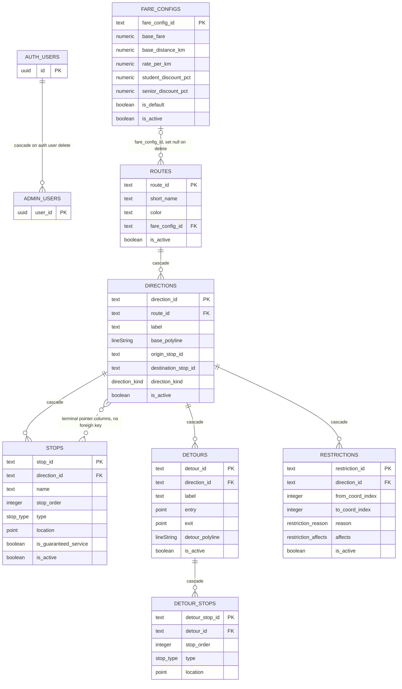
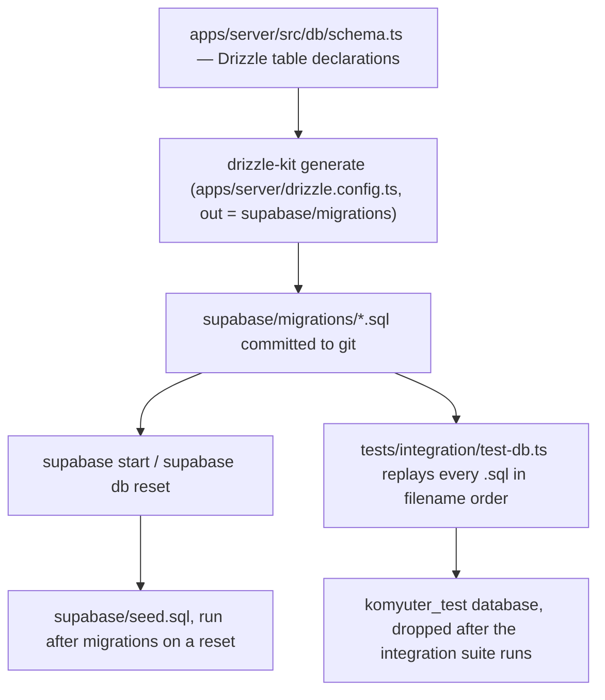

# Persistent data model and migrations

<!-- openwiki: broken internal link [../../supabase/migrations] file "../../supabase/migrations" does not exist. Fix the href or restore the target, then delete this comment. -->
All plotted transit data lives in one PostgreSQL database (with PostGIS) inside the local Supabase stack. The tables are declared once in TypeScript at [apps/server/src/db/schema.ts](../../apps/server/src/db/schema.ts) — the migration source of truth — and the SQL that creates them is committed under [supabase/migrations](../../supabase/migrations). Every read and write goes through the Fastify server: `createDb(DATABASE_URL)` opens a `pg` `Pool` and wraps it in `drizzle(pool, { schema })`, and the resulting `Db` (`NodePgDatabase<typeof schema>`) is injected into `buildApp({ db, supabase, env })`. Geometry write/read is the one place raw SQL is used by design; entity loading and the export assembler live above that seam.

No migration contains a `GRANT` or a row-level-security policy, so the only authorization boundary is the server itself: the `admin_users` membership check in `createAdminAuthGuard` guards the `/api/admin` plugin, and the `DATABASE_URL` connection is trusted. See [Server API surface](../operations/server-api-surface.md) for the route table and guard, and [Supabase local stack](../integrations/supabase-local-stack.md) for the container topology.

## Tables and their relationships

The eight public tables and their foreign keys, with `auth.users` shown for the admin grant it anchors. Solid edges are foreign-key cascades; the dotted edge is the terminal pointer pair, which is not a constraint.

| Table                | Primary key                      | Enums used                                 | Foreign keys                                                                  |
| -------------------- | -------------------------------- | ------------------------------------------ | ----------------------------------------------------------------------------- |
| `admin_users`        | `user_id` (uuid)                 | —                                          | `user_id → auth.users(id)` `ON DELETE CASCADE` (migration `0002`)             |
| `fare_configs`       | `fare_config_id` (text)          | —                                          | —                                                                             |
| `routes`             | `route_id` (text slug)           | —                                          | `fare_config_id → fare_configs` `ON DELETE SET NULL`                          |
| `directions`         | `direction_id` (text)            | `direction_kind`                           | `route_id → routes` `ON DELETE CASCADE`                                       |
| `stops`              | `stop_id` (text)                 | `stop_type`                                | `direction_id → directions` `ON DELETE CASCADE`                               |
| `detours`            | `detour_id` (text)               | —                                          | `direction_id → directions` `ON DELETE CASCADE`                               |
| `detour_stops`       | `detour_stop_id` (text)          | `stop_type`                                | `detour_id → detours` `ON DELETE CASCADE`                                     |
| `restrictions`       | `restriction_id` (text)          | `restriction_reason`, `restriction_affects` | `direction_id → directions` `ON DELETE CASCADE`                              |

Three Postgres enums back those columns: `stop_type` (`terminal`, `major_stop`, `waiting_area`), `direction_kind` (`base`, `return`), and the restriction pair `restriction_reason` (`no_stopping_zone`, `contraflow`, `pedestrian_hostile`) / `restriction_affects` (`boarding`, `alighting`, `both`). All four are declared in the same order in the Drizzle schema and in migration `0001`/`0003`, which matters for `direction_kind`: Postgres compares enums by declaration order, so `ORDER BY direction_kind ASC` puts `base` first without a CASE expression. That is what makes the route detail and overview queries return the admin-plotted base direction before its derived return (the pair itself is described in [Directions and derived return](../concepts/directions-and-derived-return.md)).

Primary keys are `text` and generated in the application, never by the database: server code builds prefixed UUIDs with `uuidId("stop")` → `stop-<uuid>`, and `routes`/`fare_configs` use `uniqueSlug()` on the human name (`overview` is reserved as a static route segment). The `text` PK is what lets parents and children be inserted in one transaction without a round-trip for a generated id, which the plotting save path depends on.

## Delete semantics: cascade, soft delete, or destructive

The HTTP verb `DELETE` means three different things depending on the entity, and that difference is the most load-bearing operational fact about this model.

| Entity         | `DELETE` behaviour                                                                     | Where it is implemented                                        |
| -------------- | -------------------------------------------------------------------------------------- | -------------------------------------------------------------- |
| `routes`       | Hard delete; the row and everything under it go away via FK cascade                    | `apps/server/src/api/routes.ts` |
| `directions`   | Soft delete (`is_active = false`); the row and its stops stay                           | `apps/server/src/api/directions.ts` |
| `stops`        | Soft delete (`is_active = false`), guarded by a terminal check (409)                    | `apps/server/src/api/stops.ts` |
| `detours`      | Destructive delete (row removed); `detour_stops` cascade; the label is freed for reuse  | `apps/server/src/api/detours.ts` |
| `detour_stops` | No direct endpoint; replaced wholesale by a detour `PUT`                                | `apps/server/src/api/detours.ts` |
| `restrictions` | Soft delete (`is_active = false`)                                                      | `apps/server/src/api/restrictions.ts` |
| `fare_configs` | Soft deactivate only (`is_active = false`) with reference and last-default guards       | `apps/server/src/api/fare-configs.ts` |

Consequences worth internalising:

- **Deleting a route is the only true cleanup operation.** `directions.route_id → routes.route_id` cascades, and `stops`, `detours`, `detour_stops` and `restrictions` all hang off `directions`, so a single `DELETE FROM routes` clears an entire plotted route. Detour deletion is the second destructive path, and it is deliberately scoped: only that detour's own stops cascade.
- **Soft-deleted rows stay in the tables and in most reads.** The entity loaders (`loadStops`, `loadDetours`, `loadRestrictions`) and `readExportRows` have no `is_active` filter, so a deactivated stop, detour or restriction is still returned by the corresponding `GET` and still appears in the exported dataset. Only `routes` and `directions` carry an `is_active` flag through to the export payload; `/api/status` counts rows unfiltered on every table. "Deactivate" therefore means "hidden from the admin UI's own filtering", not "invisible to the dataset".
- **The terminal pointers are not foreign keys.** `directions.origin_stop_id` and `directions.destination_stop_id` are plain `text` columns with their own btree indexes and no constraint, so referential integrity of terminals is enforced in application code: `assertNotDirectionTerminal` rejects a stop delete with a `CONFLICT` (409) while it is referenced as a direction terminal, and `referenceCheck()` in the export assembler re-verifies at export time that every terminal resolves to a stop in the dataset. Anything that writes these columns outside the save path can create a dangling terminal, and Postgres will not stop it.
- **`fare_configs` are never removed.** Deactivation is refused while an *active* route references the config (409) and while the config is the default. Because `routes.fare_config_id` is `ON DELETE SET NULL`, a raw row delete would silently detach routes rather than block.

## Geometry columns and the PostGIS boundary

Geometry is declared with two hand-written Drizzle `customType`s: `pointGeometry` → `geometry(Point,4326)` and `lineStringGeometry` → `geometry(LineString,4326)`, both used as `NOT NULL` columns. Coordinates are `[longitude, latitude]` throughout; the spatial conventions and the meter-math rules live on [Coordinates and spatial math](../concepts/coordinates-and-spatial-math.md).

Geometry never crosses the driver as a plain parameter. The declared data type is a string, and every read and write goes through the SQL-expression helpers in [apps/server/src/db/queries.ts](../../apps/server/src/db/queries.ts):

- Reads select `asGeoJSON(column)`, which is `ST_AsGeoJSON(col)::jsonb`, so GeoJSON arrives already parsed in the same query (including in the export assembler).
- Writes pass `asPointFromGeoJSON()` / `asLineStringFromGeoJSON()`, i.e. `ST_GeomFromGeoJSON($json)::geometry(Point,4326)` / `::geometry(LineString,4326)`, which both parses and asserts the geometry subtype and SRID.
- Call sites cast the result `as unknown as string` because the custom type advertises `string` data; this is the type-level seam, not a conversion.

Two further helpers, `pointOnLineMeters` (`ST_DWithin` on `::geography`) and `pointDistanceToLineMeters` (`ST_Distance` on `::geography`), exist in the same module but are not called by any handler today: the on-line and loop-endpoint checks used by detours are computed in `apps/server/src/domain/validation.ts` with a local haversine, not with PostGIS. Meter-based PostGIS math requires the `::geography` cast shown in those helpers.

`stops.location` is the only spatially indexed column: a GiST index (`stops_location_gist`) supports proximity and containment queries, while every other geometry column is read by primary key or by parent id. Ordering indexes are `stops_direction_id_stop_order_idx` (btree) and `detour_stops_detour_id_order_idx`.

## String-mode numeric columns

`fare_configs` holds five `numeric` columns — `base_fare`, `base_distance_km`, `rate_per_km` at `(10,2)` and `student_discount_pct`, `senior_discount_pct` at `(5,2)`. In `drizzle-orm` 0.36.x these are read and written as **strings**; there is no `mode: "number"` for `numeric`. The conversion is deliberate and happens at the handler layer:

- Writes coerce with `String(body.base_fare)` etc., so the driver never receives a JS float for a fixed-scale column.
- Reads and exports coerce back with a local `Number(value)` (`serialize()` in `apps/server/src/api/fare-configs.ts`, `num()` in `apps/server/src/domain/export.ts`), and the zod schemas in `@komyuter/shared` require numbers on the wire, so the JSON surface stays numeric.
- The same `Number()` pattern unwraps counts: `count(...)::int` is cast in SQL and then converted (`active_route_count` on the fare-config list), because `count()` also returns a string.

<!-- openwiki: broken internal link [../concepts/fares-and-fare-configurations.md] file "../concepts/fares-and-fare-configurations.md" does not exist. Fix the href or restore the target, then delete this comment. -->
Treating "numeric columns are strings in Drizzle" as a defect would be wrong; it is the documented consequence of the pinned ORM version. The fare values themselves, their defaults (₱13 / 4 km / ₱1.80, 20% discounts) and their one-default rule are covered in [Fares and fare configurations](../concepts/fares-and-fare-configurations.md).

## Ordering, uniqueness, and invariants the database does not enforce

- `stops` has **no** unique constraint on `(direction_id, stop_order)`. The base chain's order is a write-path invariant: the plotting save inserts `normalizeStopOrder(...)` output with `stop_order: index + 1`, and the standalone stop-create endpoint appends `max(stop_order) + 1`. A duplicate or gap introduced by any other writer will persist, and readers simply sort by `stop_order` (`loadStops`).
- `detour_stops` is stricter: a unique index on `(detour_id, stop_order)` enforces a gap-free ordering within a detour, and the rows are numbered `0..n-1` from array position. A detour `PUT` replaces the whole list (delete-then-insert) rather than patching positions.
- Exactly one default fare configuration is an **application-level** rule. There is no partial unique index on `fare_configs.is_default`; promoting a new default runs an un-mark statement followed by a mark statement outside a transaction, which the handler documents as acceptable for a single admin writer. Any second writer could momentarily see zero or two defaults.
- Conflict-style guards (route slug taken, third active direction, duplicate detour label within a direction, out-of-range restriction indices, terminal in use) are all pre-checks executed by handlers before the write; they are not backed by database constraints. The one constraint-level signal `detour_stops` gives is the unique `(detour_id, stop_order)` index.

Restrictions are the odd entity out structurally: instead of referencing stops, a restriction stores `from_coord_index`/`to_coord_index`, an inclusive range **into the direction's `base_polyline` coordinate array**. The bounds are validated against the currently loaded polyline on every create and update, which means replacing a direction's polyline can invalidate existing restriction ranges — nothing re-validates them at that moment.

## `created_at` / `updated_at` never move after insert

Every table except `admin_users` carries `created_at` and `updated_at`, both `timestamp with time zone NOT NULL DEFAULT now()`. There is no `ON UPDATE` trigger in any migration and no Drizzle `$onUpdate` on the columns, and no server code path ever writes `updated_at` — update handlers build a patch of business columns only, and the plotting save's `UPDATE directions SET label, base_polyline, direction_kind` is no exception. In practice `updated_at` therefore stays equal to insert time for the life of a row.

Two features read that column as if it were a modification signal, so the distinction matters operationally:

- `GET /api/admin/routes` orders by `updated_at DESC`, so the list is effectively in creation order.
- `GET /api/status` reports `dataset_updated_at` as `max(directions.updated_at)`, i.e. the time the most recently inserted direction row was created, not the time the dataset was last edited.

## Migrations: authoring and delivery

Two delivery paths reach a database: the Supabase CLI's reset/start flow (which also seeds), and the integration-test harness (which bypasses the CLI entirely).

**Authoring.** `schema.ts` is the declared source of truth; [apps/server/drizzle.config.ts](../../apps/server/drizzle.config.ts) points `drizzle-kit` at it and writes output directly to `../../supabase/migrations`. `drizzle-kit` is a dev dependency of `apps/server`; there is no root, turbo or package-level script that runs generation, so producing SQL is a manual `drizzle-kit generate` invocation from `apps/server`. PostGIS itself arrives as the hand-written, non-generated `0000_create_postgis.sql` (`create extension if not exists postgis`).

**Hand-written migrations.** Files that drizzle-kit cannot express sit alongside the generated ones: `0002_admin_users_auth_fk.sql` adds the `admin_users → auth.users` foreign key, `0003_direction_kind.sql` adds the `direction_kind` enum and column (defaulting legacy rows to `base`), `0004_drop_detour_notable_stops.sql` drops the removed JSONB column, and `0005_detour_stops.sql` creates `detour_stops` plus its unique index.

**Local stack delivery.** [supabase/config.toml](../../supabase/config.toml) enables `[db.migrations]` and sets `[db.seed] sql_paths = ["./seed.sql"]`, so `supabase start` and `supabase db reset` apply migrations and then run the seed. `seed.sql` is idempotent (`ON CONFLICT DO NOTHING` throughout) and provisions three things: a deterministic local Auth user (`00000000-…-0001`, bcrypt password via pgcrypto), the matching `admin_users` grant, and the `default` fare configuration row (`LTFRB Default Fare`, ₱13 / 4 km / ₱1.80, 20% discounts, `is_default = true`). Because the seed grants admin by inserting the auth user's id, `admin_users` is the single gate that the login and guard paths both consult.

**Journal drift (recorded, not new).** `supabase/migrations/meta/_journal.json` — drizzle-kit's own migration ledger — contains a single entry, `0001_hard_roland_deschain`, while `0002`–`0005` exist on disk and are referenced by the Drizzle schema and handlers. As recorded in `docs/DEVIATIONS.md` Appendix A1, a plain `supabase db reset` consequently applies only `0000` + `0001`, leaving the applied database behind the code (`admin_users → auth.users` and `directions.direction_kind` absent); the fix is to journal and re-run those files before relying on an applied schema.

**Test delivery.** The integration suite does not use the CLI and is therefore not affected by the journal: `recreateTestDatabase()` in [apps/server/tests/integration/test-db.ts](../../apps/server/tests/integration/test-db.ts) drops and recreates a sibling `komyuter_test` database, creates a minimal `auth` schema with an `auth.users(id, email)` stub so the `0002` foreign key resolves, then reads **every** `*.sql` in `supabase/migrations` in filename order and replays it. The global setup captures a baseline of main-database state and the teardown restores it and drops the test database, so CRUD tests never touch the live dev database. This replay loop is what actually exercises migrations `0002`–`0005` in CI-local runs — but it also means a migration that only works when replayed in filename order (rather than by the journal) can pass tests while a reset-based environment stays behind.

## Failure semantics at the persistence boundary

- The Fastify error handler maps only `ApiError` to the `{ success: false, error }` envelope and validation errors to 422; any other throw — including a Postgres constraint or connection error — becomes a `500 INTERNAL`. Constraint violations are therefore never surfaced as 409/422 by the database layer, which is why the handlers pre-check.
- Drizzle `update().set({})` is invalid SQL. The detour `PUT` explicitly skips the `UPDATE` when the patch object is empty, so a `detour_stops`-only edit does not produce a 500.
- The plotting save runs inside `db.transaction(...)`, so the base direction, its stop list, its terminal pointers, the derived return and the return's own stop rows commit or roll back together; a rejected payload (fewer than two stops, path not ending on the first/last stop, a third active direction) leaves no partial rows.
- Soft delete is not reversible through the API for `stops`, `directions` and `restrictions` beyond a `PUT` that sets `is_active: true`; `detours` and `routes` have no restore path at all, since deletion is physical.

## Tests that pin this behaviour

- [apps/server/tests/integration/crud.test.ts](../../apps/server/tests/integration/crud.test.ts) covers the terminal-guard 409, destructive detour delete with label reuse, the `detour_stops` cascade, the empty-patch detour update, and the fare-config lifecycle guards (active-route reference, sole default, zero defaults).
- [apps/server/tests/integration/plotting-save.test.ts](../../apps/server/tests/integration/plotting-save.test.ts) covers the atomic base+return transaction, the third-active-direction conflict, wholesale stop replacement on `PUT`, and the base-first ordering guarantee.
- [apps/server/tests/integration/export.test.ts](../../apps/server/tests/integration/export.test.ts) asserts the export schema version, `lng_lat` coordinate order and that every terminal resolves to a stop in the payload — the check that stands in for the missing foreign keys.
- [apps/server/tests/integration/status.test.ts](../../apps/server/tests/integration/status.test.ts) and `latency.test.ts` read through a freshly built app instance to show data is persisted, not process-local.
- The `komyuter_test` lifecycle in `test-db.ts` plus [global-setup.ts](../../apps/server/tests/integration/global-setup.ts) is itself the migration-replay test; a malformed migration fails the suite at setup rather than in a handler.
