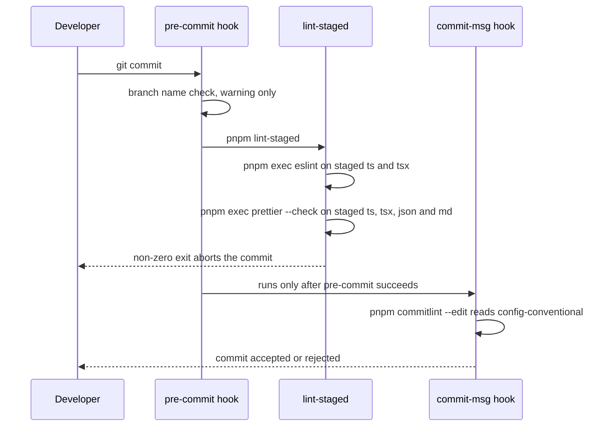
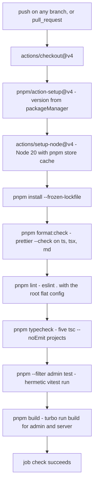

# Workspace, build pipeline, lint and CI wiring

Five quality gates protect this repository: **format**, **lint**, **typecheck**, the **admin test suite**, and **build**. Four of them — format, lint, typecheck and the admin suite — run in CI (`.github/workflows/ci.yml`) together with the build; the sixth gate, the **server test suite**, does not, because its integration half needs the local Supabase stack, so it stays a local pre-merge obligation. Everything else on this page is the wiring that makes those gates reachable: one pnpm workspace, one Turborepo task graph, one root `package.json` of scripts, one root ESLint flat config, and two husky git hooks.

The gates are declared in a handful of root files — `pnpm-workspace.yaml`, `turbo.json`, `package.json`, `eslint.config.mjs`, `.prettierrc.json`, `.prettierignore`, `commitlint.config.cjs`, `.husky/*`, `.github/workflows/ci.yml`. There are no per-package lint configs, no `@repo/eslint-config` package, and no ADR covering this area; the runtime topology these gates protect is on [System overview](./system-overview.md).

## The workspace

`pnpm-workspace.yaml` declares exactly two globs:

```yaml
packages:
  - "apps/*"
  - "packages/*"
```

That yields six workspace members, and it deliberately excludes `navbench/`: because the harness is not a member, nothing in `pnpm install` or in a Turbo graph ever touches its Rust, Go or Node toolchains. See [navbench parity harness](../integrations/navbench-parity-harness.md).

| Directory                  | Package name              | `dev`                | `build`              | `test`       | Other scripts          |
| -------------------------- | ------------------------- | -------------------- | -------------------- | ------------ | ---------------------- |
| `apps/admin`               | `admin`                   | `vite`               | `tsc && vite build`  | `vitest run` | `preview`              |
| `apps/server`              | `server`                  | `tsx watch src/index.ts` | `tsc`            | `vitest run` | `typecheck`            |
| `apps/mobile`              | `mobile`                  | `expo start -c`      | —                    | —            | `lint`, `typecheck`    |
| `packages/shared`          | `@komyuter/shared`        | —                    | —                    | —            | —                      |
| `packages/ui`              | `@repo/ui`                | —                    | —                    | —            | —                      |
| `packages/typescript-config` | `@repo/typescript-config` | —                  | —                    | —            | —                      |

Three install-level details matter more than they look:

- **The package manager is pinned to pnpm 8.** `"packageManager": "pnpm@8.15.6"` in the root `package.json` is authoritative; design docs that claim pnpm 9+ or 10.12+ are stale. `pnpm-lock.yaml` agrees at `lockfileVersion: '6.0'` (pnpm 9+ writes `'9.0'`), and `AGENTS.md` records the conflict explicitly. CI never restates the version — `pnpm/action-setup@v4` has no `version` input, so it reads the `packageManager` field. Changing the gate's pnpm version therefore means editing `package.json`, not the workflow.
- **Root `.npmrc` sets `auto-install-peers = true`**, which is why peer-resolved tooling such as TypeScript shows up in the install without being a direct root dependency.
- **`apps/mobile/.npmrc` overrides the installer for that package**: `node-linker=hoisted` opts that package out of pnpm's isolated `node_modules` layout, and `enable-pre-post-scripts=true` turns on pre/post lifecycle scripts there. It is the only member with its own `.npmrc`. Workspace dependencies are declared as `workspace:*` / `workspace:^` elsewhere.

Install is plain `pnpm install`; the root `prepare` script (`husky`) runs on a local install and wires the git hooks described [below](#the-local-commit-path).

## Root scripts and the Turbo task graph

`turbo.json` defines four tasks and no `typecheck` task at all:

| Turbo task | Config                                              | Implemented by                     |
| ---------- | --------------------------------------------------- | ---------------------------------- |
| `build`    | `dependsOn: ["^build"]`, `inputs` = `$TURBO_DEFAULT$` + `.env*`, `outputs` = `dist/**` | `admin`, `server` |
| `test`     | `inputs` = `$TURBO_DEFAULT$` + `.env*`              | `admin`, `server`                  |
| `lint`     | `{}` (no inputs, outputs or cache override)         | `mobile` only                      |
| `dev`      | `cache: false`, `persistent: true`                  | `admin`, `server`, `mobile`        |

Turbo skips any package that does not define the script, so the task-to-implementer mapping above *is* the effective scope of each pipeline. The root scripts are thin wrappers:

| Root script              | Command it runs                                                                                                                | Effective scope |
| ------------------------ | ------------------------------------------------------------------------------------------------------------------------------ | --------------- |
| `pnpm build`             | `turbo run build`                                                                                                              | `admin`, `server` |
| `pnpm dev`               | `turbo run dev`                                                                                                                | three concurrent dev servers |
| `pnpm test`              | `turbo run test`                                                                                                               | both Vitest suites, server half needs the local stack |
| `pnpm lint`              | `eslint .` — **not** Turbo                                                                                                     | every JS/TS file matched by the root flat config |
| `pnpm typecheck`         | `tsc --noEmit -p packages/ui/tsconfig.json && tsc --noEmit -p apps/admin/tsconfig.json && pnpm --filter mobile typecheck && tsc --noEmit -p apps/server/tsconfig.json && tsc --noEmit -p packages/shared/tsconfig.json` | five projects, no Turbo cache |
| `pnpm format`            | `prettier --write "**/*.{ts,tsx,md}"`                                                                                          | write mode, local convenience |
| `pnpm format:check`      | `prettier --check "**/*.{ts,tsx,md}"`                                                                                          | the CI format gate |
| `pnpm prepare`           | `husky`                                                                                                                        | installs the git hooks |

Two consequences are easy to miss. First, `lint` and `typecheck` exist as root scripts but `lint` is a bare ESLint invocation and `typecheck` is a hard-coded chain of five `tsc` invocations, so neither benefits from Turbo filtering or caching; the mobile project is reached through `pnpm --filter mobile typecheck` (its own `tsc --noEmit`) while the other four are direct `-p <tsconfig>` calls. Second, the `lint` task declared in `turbo.json` has **no caller**: no root script runs `turbo run lint`, and `apps/mobile` is the only package that still declares a package-level `lint` script — it runs `eslint .` directly, and the root `eslint .` already covers mobile through its scoping blocks. `AGENTS.md` states the intent: per-package lint scripts were removed and the single root flat config is the only lint configuration.

The build half is equally narrow. `turbo run build` builds `admin` (`tsc && vite build` → `dist/`) and `server` (`tsc` → `dist/`), and nothing else. `@komyuter/shared` and `@repo/ui` ship TypeScript source through their `exports` maps (`"./src/index.ts"`, `"./index.ts"`) instead of compiled output, so the consuming toolchain resolves the `.ts` files directly — Vite for the admin bundle, `tsx` for the server's dev runner — and neither package needs a build step. `apps/mobile` declares no `build` script at all, so Expo's build is never part of the pipeline.

## The local commit path

Both hooks are thin wrappers around workspace-local tooling; `.husky/_/` holds husky's generated shims and is gitignored.



The commit-time hook chain: a warn-only branch check, then lint-staged, then commitlint.

- **`.husky/pre-commit`** first maps `git symbolic-ref --short HEAD` against an allowlist — `main`, `master`, `develop`, or one of `feat/`, `fix/`, `chore/`, `docs/`, `refactor/`, `test/`, `style/`, `ci/`, `perf/`, `build/`, `revert/` as a `{type}/description` prefix. A non-conforming branch prints a warning and the hook continues; it never fails the commit. It then runs `pnpm lint-staged`.
- **lint-staged** is configured inline in the root `package.json`: `*.{ts,tsx}` → `pnpm exec eslint`, `*.{ts,tsx,json,md}` → `pnpm exec prettier --check`. There is **no `--fix` and no `--write`**: a lint error or a formatting drift blocks the commit and must be repaired by hand (`pnpm format` fixes the TypeScript/Markdown half). JSON is only prettier-checked here — the root format globs are `**/*.{ts,tsx,md}`, so JSON, CSS and YAML formatting is enforced solely at commit time, on staged files, and never in CI.
- **`.husky/commit-msg`** is one line, `pnpm commitlint --edit "$1"`, so commit messages must satisfy `@commitlint/config-conventional`. `commitlint.config.cjs` adds a `scope-enum` rule listing `web`, `ui`, `mobile`, `admin`, `server`, `shared`, `db`, `docs`, `config`, `ci`, `deps` — but at severity `1`, i.e. **warn**, so an unknown scope prints a warning rather than rejecting the commit. The enforced part is the `type(scope): description` shape.

## The CI pipeline

`.github/workflows/ci.yml` is one non-matrix job named `check` on `ubuntu-latest`, triggered by `push` (every branch) and `pull_request`. The steps run sequentially in one job, so the first failing gate stops the rest.



The `check` job: install with a frozen lockfile, then format, lint, typecheck, the admin suite and the build, in that order.

| Step label | Command | Task it actually runs |
| ---------- | ------- | --------------------- |
| Install dependencies | `pnpm install --frozen-lockfile` | pnpm 8.15.6 from the `packageManager` field; fails on lockfile drift |
| Format check | `pnpm format:check` | `prettier --check "**/*.{ts,tsx,md}"` |
| Lint | `pnpm lint` | `eslint .` with the root flat config (not `turbo run lint`) |
| Typecheck | `pnpm typecheck` | five `tsc --noEmit` project checks, mobile through `pnpm --filter mobile typecheck` |
| Test (admin) | `pnpm --filter admin test` | `vitest run` in `apps/admin` |
| Build | `pnpm build` | `turbo run build` → `admin` (`tsc && vite build`) and `server` (`tsc`) |

Notable properties of the job:

- **The order is cheap-to-expensive and fail-fast**: formatting, then lint, then types, then one test suite, then the build. A red `format:check` never reaches the build.
- **The test step is filtered on purpose.** It is `pnpm --filter admin test`, not `pnpm test`/`turbo run test`, because the server suite's integration half needs a live Supabase stack. The workflow carries that reasoning in a comment, and `.specify/memory/constitution.md` makes the policy explicit: `pnpm lint`, `pnpm typecheck`, `pnpm format:check` and the admin suite are mandatory pre-merge gates enforced by CI, while `pnpm --filter server test` is mandatory whenever a change touches `apps/server` or `packages/shared` and remains a local obligation. The server suite is therefore a real gate that no automation enforces — see [Server tests](../testing/server-tests.md).
- **Only the pnpm store is cached** (`actions/setup-node` with `cache: pnpm`). There is no Turbo remote cache, no artifact upload, no test-report upload, no matrix and no branch filter.
- **The enforced environment is Node 20.** `apps/server/README.md` still lists Node 22 LTS as a prerequisite, and the second workflow below uses Node 22; nothing in `package.json` pins an engine, so the workflow's `node-version: 20` is the only enforced runtime version in the repo.

The admin suite is the one gate that observes behaviour rather than syntax, and its blast radius is deliberately narrow: `src/tests/**/*.test.{ts,tsx}` in the `node` environment, 23 files / 311 tests per `AGENTS.md`, no DOM and no database — see [Admin tests](../testing/admin-tests.md). Note that `apps/admin/vitest.config.ts` sets `passWithNoTests: true`, so a broken include pattern or an emptied test directory makes the CI test step pass with zero tests executed; the gate proves that the suite it finds is green, not that it found the suite. In contrast `apps/server/vitest.config.ts` needs a real database: `fileParallelism: false` (the integration files share one Postgres database), a `globalSetup` that snapshots and restores it, and 30-second timeouts.

## What each gate actually covers

| Gate | Entry point | Covered | Not covered |
| ---- | ----------- | ------- | ----------- |
| Format | `pnpm format:check` | every `.ts`/`.tsx`/`.md` file outside `.prettierignore` and gitignore — including `navbench/README.md` | JSON, CSS, YAML, SQL; `/openwiki`; the five root design docs; `pnpm-lock.yaml`; `supabase/.temp` |
| Lint | `pnpm lint` | all web UI + server + shared + mobile files and repo config files, per the flat config's scoping blocks | `navbench/**` (explicitly ignored), `dist`, `.turbo`, `.expo`, `public` |
| Typecheck | `pnpm typecheck` | five projects under `strict: true` from `@repo/typescript-config` | repo config files: `vite.config.ts`, `vitest.config.ts`, `drizzle.config.ts`, `eslint.config.mjs` are outside every `include` list |
| Test (CI) | `pnpm --filter admin test` | the hermetic admin suite | anything needing Postgres, PostGIS, Supabase Auth or the network |
| Test (local) | `pnpm --filter server test` | unit + integration against the local stack | must be run manually before merge |
| Build | `pnpm build` | `admin` bundle, `server` `tsc` output | `apps/mobile`'s Expo build; `@komyuter/shared` and `@repo/ui`, which have no build step |

Three asymmetries are worth knowing before assuming a green pipeline means everything was checked:

- **Prettier's ignore list is not symmetric with ESLint's.** `.prettierignore` excludes `node_modules`, `dist`, `.turbo`, `pnpm-lock.yaml`, `supabase/.temp`, the five root design docs (`OVERVIEW.md`, `TECHSTACK.md`, `SCHEMA.md`, `SUMMARY.md`, `BACKEND.md`) and the whole `/openwiki` directory — the last with a comment explaining that OpenWiki output is generated (Markdown plus `.claims/*.json` sidecars) and that `format:check` globs `**/*.md` while lint-staged runs `prettier --check` over staged `.md`/`.json` with no auto-fix, so the directory must be excluded or every wiki commit would fail both. `navbench/**` is *not* on that list; it is ESLint-ignored, so `navbench` Markdown falls inside the format gate while its JavaScript sits outside the lint gate and outside every Turbo task.
- **Type-checking stops at the app boundary.** `apps/admin/tsconfig.json` includes only `src`, and `apps/server/tsconfig.json` includes `src` and `tests`, so the build/test/lint configuration files themselves are never type-checked even though they are linted.
- **`pnpm test` locally is not what CI runs.** Running it executes both suites through Turbo, which on a machine without a running Supabase stack and `apps/server/.env` fails on the integration half. Use `pnpm --filter admin test` for the CI-equivalent check and `pnpm --filter server test` for the pre-merge obligation.

## The second workflow

`.github/workflows/openwiki-update.yml` is the repo's only other automation and is not a quality gate: it runs on `workflow_dispatch` and a daily `0 8 * * *` cron, uses Node 22, installs `openwiki@0.7.1` plus `mermaid`/`jsdom` globally with npm, runs `openwiki code --update`, deletes the transient `openwiki/.run.json`, and opens a pull request titled `docs: update OpenWiki` on branch `openwiki/update` that adds only `openwiki`, `AGENTS.md`, the workflow file itself, and `CLAUDE.md` when present. Its steps are annotated with result caveats (a failed run still opens a PR preserving the pages that completed), and unlike `ci.yml` it pins its actions by commit SHA. This is why `/openwiki` has to be prettier-ignored: the automated PR stages generated `.md` and `.json` files that `lint-staged` and `format:check` would otherwise reject.

## Where config and docs disagree

Recorded so the disagreement is never silently resolved in prose; none of these changes what the gates do today.

- **`docs/TECHSTACK.md` sketches a CI that does not exist.** Its "CI/CD — GitHub Actions" block lists `typecheck`, `lint`, `test` and a `migration-lint` step (`drizzle-kit check`) triggered "on every PR to main/develop". The real workflow has no `migration-lint`, no `pnpm test` step, and no branch filter — it runs on every push and every pull request. The doc is historical, like the rest of the root design set.
- **The root `README.md` still describes the create-turbo starter**: a `web` app and an `@repo/eslint-config` package, both of which are gone. `@repo/eslint-config` and every `.eslintrc.*` file were removed in favour of the single flat config and must not be recreated; the flat config's `webUiFiles` array still names `apps/web/**` even though `apps/web` was deleted, so those globs match nothing.
- **Several specs and `docs/ADMIN.md` cite `pnpm --filter admin lint`**, which no longer exists as a script — `apps/mobile` is the only package with a `lint` script today. The equivalent command is the root `pnpm lint`.
- **Node version**: `apps/server/README.md` lists Node 22 LTS as a prerequisite while CI pins 20 and the wiki-refresh workflow uses 22.
- **pnpm version**: docs claim 9+/10.12+; `packageManager` pins `pnpm@8.15.6` and the lockfile is in pnpm-8 format. Per `AGENTS.md`, the `package.json` value wins — and because `pnpm/action-setup` takes no version input, that single field is also what CI installs with.
- **"`pnpm test`" is not the CI gate.** `AGENTS.md` correctly describes `pnpm test` as `turbo run test` across both suites, but neither the workflow nor the hooks run that pipeline; CI runs the admin suite by filter, and the server suite is left to the committer.
