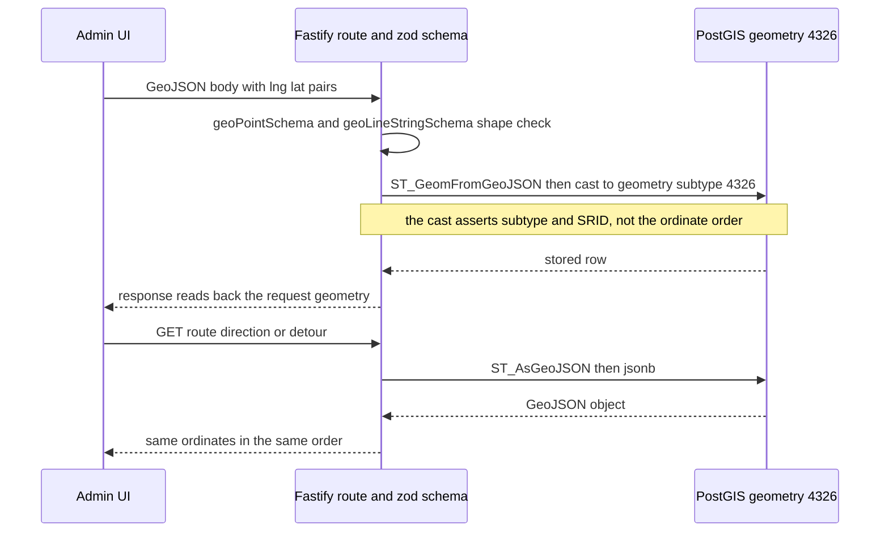

# Coordinate order, PostGIS helpers and distance tolerances

Every spatial value in this repository — a stop `Point`, a `base_polyline`, a detour loop, an export payload, a MapLibre click — uses the same two-number array in the same order: `[longitude, latitude]`. There is no conversion function anywhere, no `[lat, lng]` exception, and no adapter module to keep in sync. That is deliberate (ADR-0013, which supersedes ADR-0007's never-shipped Leaflet exception), and it is the single most dangerous invariant in the codebase: a swapped pair puts stops in the ocean and nothing in the type system prevents it.

This page covers how that invariant is actually carried through the code — the representations it crosses, what enforces it and what does not, the GeoJSON-to-PostGIS round trip, the `::geography` rule for meter math, and the four meter tolerances that decide whether a save is accepted, when a route counts as a loop, and how the overview draws two directions on one road.

## `[lng, lat]` in every representation

| Representation | Where | Shape |
| --- | --- | --- |
| TypeScript type | [packages/shared/src/types/geometry.ts](../../packages/shared/src/types/geometry.ts) | `CoordinatePair = [number, number]`, used by `GeoPoint` and `GeoLineString` |
| MapLibre interaction | [apps/admin/src/features/routes/RouteMap.tsx](../../apps/admin/src/features/routes/RouteMap.tsx) | `event.lngLat.lng` then `event.lngLat.lat` are pushed straight into store actions — the renderer's own event order is the storage order |
| Mapbox Directions request | [apps/admin/src/features/routes/routesApi.ts](../../apps/admin/src/features/routes/routesApi.ts), [apps/server/src/api/mapbox.ts](../../apps/server/src/api/mapbox.ts) | one query string of `lng,lat;lng,lat;…`; the client builds it in that order and the server parses it back in that order |
| Wire JSON | `geoPointSchema` / `geoLineStringSchema` in [packages/shared/src/schemas/geometry.ts](../../packages/shared/src/schemas/geometry.ts) | standard GeoJSON objects with a `coordinates` tuple |
| PostGIS storage | [apps/server/src/db/schema.ts](../../apps/server/src/db/schema.ts) | `geometry(Point,4326)` / `geometry(LineString,4326)`, whose x/y are lng/lat |
| Export payload | `EXPORT_COORDINATE_ORDER = "lng_lat"` in [packages/shared/src/types/export-dataset.ts](../../packages/shared/src/types/export-dataset.ts) | a machine-readable order declaration on the dataset document |

`CoordinatePair` is an unlabelled tuple, so it carries no information about which ordinate is which. The convention is enforced by review and by the visible result, not by the compiler.

Two related facts fall out of this and are worth internalising:

- **Reversing a path reverses vertex order, never the ordinates.** `reverseCoordinates` in [apps/server/src/domain/derive.ts](../../apps/server/src/domain/derive.ts) copies the array and reverses it, so the auto-derived return keeps every pair intact. Direction of travel is therefore encoded purely in vertex order — which is exactly what makes direction-aware overlap detection possible (see the 20 m tolerance below).
- **A string coordinate form exists in two places and both read `lng,lat` first.** `parseCoordinatePair` (admin `lib/coords.ts`) and `parseCoordinates` (server proxy) split on `,` and treat the first token as longitude; both throw on non-finite input. `parseCoordinatePair` is currently exercised only by unit tests, and the live string path is the Mapbox proxy query string.

## What enforces the order — and what does not

There is exactly one automated check that could catch a swapped pair, and it is not currently on the request path.

- The **shape** check *is* on the request path: `geoPointSchema` / `geoLineStringSchema` accept `[number, number]` and require a `LineString` to carry at least two of them ([packages/shared/src/schemas/geometry.ts](../../packages/shared/src/schemas/geometry.ts)). A bad shape is rejected by Fastify's zod body schema, i.e. `422`. `z.number()` rules out `NaN`/`Infinity` but places no bound on the magnitude.
- The **range** check is a separate, hand-written guard: `validatePair` in [apps/server/src/domain/geometry.ts](../../apps/server/src/domain/geometry.ts) rejects longitudes outside `[-180, 180]` and latitudes outside `[-90, 90]`, with the message `"Coordinate pair must be [longitude, latitude]"`, and `validateGeoPoint` / `validateGeoLineString` wrap it into a `GuardResult` with per-index paths. It is unit-tested ([apps/server/tests/unit/geometry.test.ts](../../apps/server/tests/unit/geometry.test.ts)) but **no route or handler imports it** — the unit test even documents the position, asserting that an in-range pair is accepted "regardless of presumed order (range is the enforceable check)". So today a payload such as `[10.6, 122.5]` (a swapped Iloilo coordinate) or `[999, 999]` passes the request schema, and the `::geometry(Point,4326)` cast is a subtype/SRID assertion, not a bounds check. Order mistakes are caught by the reviewer's eye and the map, not by the server.

If you extend the API surface, that dormant guard is the intended place to gain a real check; it is deliberately range-based rather than order-based, because only the range is falsifiable from a single pair.

## The geometry boundary: JSON in, PostGIS, JSON out

Geometry never crosses the `pg` driver as a plain parameter. The columns are declared with two Drizzle `customType`s that advertise `string` data while the database returns `jsonb`, and every read and write goes through SQL-expression helpers in [apps/server/src/db/queries.ts](../../apps/server/src/db/queries.ts) — so call sites end up casting `as unknown as string`, which is a type-level seam, not a conversion.

The GeoJSON round trip through PostGIS: shape is checked on the way in, the cast asserts subtype and SRID, and the ordinates pass through untouched in both directions.

- **Writes** use `asPointFromGeoJSON` / `asLineStringFromGeoJSON` → `ST_GeomFromGeoJSON($json)::geometry(Point,4326)` / `::geometry(LineString,4326)`. Both parse *and* assert the subtype and SRID, so a `LineString` payload can never land in a point column. An untyped `geomFromGeoJSON` (no cast) is exported but unused; write through the typed pair.
- **Reads** select `asGeoJSON(column)` → `ST_AsGeoJSON(col)::jsonb`, so GeoJSON arrives already parsed in the same query — in the entity loaders ([apps/server/src/domain/entities.ts](../../apps/server/src/domain/entities.ts)), in the single stop read, and in the export assembler.
- **No order conversion is involved at any point.** GeoJSON's x/y and PostGIS's x/y are both lng/lat, which is precisely why the ADR-0013 combination works: PostGIS, GeoJSON, MapLibre and Mapbox all agree with the array order the admin already produces.

Where the indirection pays off: the plotting save, the detour create/update, and the derived-return insert all reuse the same two helpers inside their transactions ([apps/server/src/api/directions.ts](../../apps/server/src/api/directions.ts), [apps/server/src/api/detours.ts](../../apps/server/src/api/detours.ts)), so the geometry-subtype guarantee holds for every geometry column in the schema (`directions.base_polyline`, `stops.location`, `detours.entry`, `detours.exit`, `detours.detour_polyline`, `detour_stops.location`).

## Meter math in SQL requires `::geography`

`geometry` and `geography` are different measurements: on a raw `geometry(…,4326)`, `ST_Distance` and `ST_DWithin` return degrees, so a threshold written in metres is meaningless. Casting the operands `::geography` makes PostGIS do the math on the spheroid and return metres. This is a hard rule here (it is in the [project constitution](../../.specify/memory/constitution.md) and [AGENTS.md](../../AGENTS.md)), not a style preference.

In this repository the cast appears in exactly two helpers, both in [apps/server/src/db/queries.ts](../../apps/server/src/db/queries.ts):

- `pointOnLineMeters(point, line, meters)` — `ST_DWithin(<point>::geography, <line>::geography, meters)`, the metre-radius containment form.
- `pointDistanceToLineMeters(point, line)` — `ST_Distance(<point>::geography, <line>::geography)`, the metre distance form.

Both cast **both** operands, because casting only one side still leaves the comparison in degrees. Neither helper is called by any handler today, and no other SQL in the codebase uses a PostGIS distance function: the on-line check, the loop-endpoint check and the plotted-path endpoint rule are all computed with JavaScript haversine (see below). So the `::geography` rule currently has no live call site — it is the pattern any new SQL-side distance work must reproduce, and the reason the existing helpers carry the cast even while unused. The only spatially indexed column is `stops.location` (`stops_location_gist`), so a future proximity query has an index to use.

One consequence worth knowing before mixing the two: the JS helpers model the earth as a sphere of radius `6_371_000` m, while `geography` math uses the spheroid, so the two disagree by a small fraction of a percent. Because every gate today is JS-side, the JS number is the one that accepts or rejects a save.

## The four tolerances

All four are metre values compared against a haversine distance, and all four are **inclusive in the permissive direction** (`<=` passes, a strict `>` rejects) except the detour degeneracy test, which rejects when the entry-exit distance is `<= 30 m`. Boundary behaviour is pinned by tests.

| Gate | Value | Server | Admin | What it decides |
| --- | --- | --- | --- | --- |
| Endpoint-on-stop | 100 m | `ENDPOINT_TOLERANCE_METERS` in `derive.ts`, enforced via `pathEndpointsOnStops` | `pathEndsOnStops` default `toleranceMeters = 100` | whether a plotted path may be saved at all |
| Loop closure | 150 m | — | `LOOP_CLOSE_TOLERANCE_METERS` and `LOOP_CLOSURE_TOLERANCE_METERS` in `lib/coords.ts`; `pathCoversStops` default | whether the chain/path is treated as closed, and whether a stub is drawn |
| Detour on-line / degenerate | 30 m | `DETOUR_ON_LINE_TOLERANCE_METERS` in `domain/validation.ts` | `DEFAULT_DETOUR_SNAP_TOLERANCE_METERS`, `NODE_TOO_CLOSE_METERS`, `inferDetourFlanks` default | whether a detour may be created or edited |
| Overlap detection | 20 m | — | `OVERLAP_TOLERANCE_METERS` in `lib/overlap.ts`; `divergingSegments` default `thresholdMeters = 20` | whether two passes count as the same road point |

### 100 m — endpoint on stop (the save gate)

`pathEndpointsOnStops` in [apps/server/src/domain/derive.ts](../../apps/server/src/domain/derive.ts) measures the path's first vertex against the first stop and its last vertex against the last stop; for a loop the end may instead match the **first** stop (FR-004). It returns a structured `{ ok: false, reason: "start_mismatch" | "end_mismatch", distanceMeters }`, which `validatePlottedPayload` in [apps/server/src/api/directions.ts](../../apps/server/src/api/directions.ts) turns into a `VALIDATION_ERROR` (422) naming the reason and the rounded distance. The same `ENDPOINT_TOLERANCE_METERS` also drives `buildDerivedReturn`'s loop detection: whether the derived return's stop list is rotated so the same stop leads both directions, or simply reversed.

The admin mirrors it in `pathEndsOnStops` ([apps/admin/src/lib/coords.ts](../../apps/admin/src/lib/coords.ts)) so the Save button can be gated locally with an explanatory toast instead of a round trip, and so the two stop-position rules stay visibly identical.

**The gate is conditional on the payload.** It runs only when the request carries `stops`: `POST /api/routes/:routeId/directions` with a `stops` array, and `PUT /api/directions/:directionId` with `stops` (which additionally *requires* `base_polyline` alongside). The legacy `POST` without `stops` and a `PUT` that patches only `base_polyline` write any shape-valid LineString and never run the endpoint rule. The gate itself runs before the transaction, so a rejected payload opens none.

### 150 m — loop closure (admin-only authoring rule)

`LOOP_CLOSE_TOLERANCE_METERS = 150` is the admin's "this is a loop" judgement, and it is shared by every consumer so they can never disagree: `polylineClosesOn` (the path's last vertex near a point), the connection helpers that close the chain back to the first stop, the plotting store's `closingIntent` / `trustedClosed` decisions that re-append the start coordinate before a snap, and `resolveConnectingLine`'s coverage test that decides whether a transient stub is drawn. `inferDetourFlanks` keeps its own `LOOP_CLOSURE_TOLERANCE_METERS = 150` for deciding that a base polyline is a loop and that flanking may wrap across the closing arc; newly placed stops within 150 m of the chain's first stop are read as "close the route".

`pathCoversStops` also defaults to 150 m and is the **client-only** interior-coverage gate: it requires every stop to lie within 150 m of some vertex, and it exists because the server checks only the endpoints. A partial undo (path change popped but stop edit kept) or a failed snap can therefore leave a draft that the admin refuses to save while the API would accept it.

The asymmetry is intentional and safe: the admin's 150 m governs *intent* (should the snap re-append the start coordinate?), while the server's loop acceptance is the 100 m endpoint rule. Once the admin decides a loop and re-appends the first stop's coordinate, the closing vertex is exact, so the server's 100 m test passes exactly rather than marginally.

### 30 m — detour on-line and degenerate loops (the detour gates)

[DETOUR_ON_LINE_TOLERANCE_METERS](../../apps/server/src/domain/validation.ts) backs three checks that run on detour create **and** update:

- `assertPointOnLine` — the entry and exit points must each lie within 30 m of the base polyline (measured as an exact point-to-segment distance across every segment, not vertex-nearest), else 422 naming the offset in metres. This is what keeps a detour's split/merge nodes anchored to the road the base direction actually travels.
- `assertDetourLoopEndpoints` — the loop's first coordinate must be within 30 m of `entry`, its last within 30 m of `exit` (FR-023 / SC-014).
- The degeneracy clause inside the same function — `entry` and `exit` closer than or equal to 30 m apart are rejected as a degenerate loop, because the replaced-arc length that derives the detour's extra distance would be meaningless.

On `PUT`, whenever any of `entry`, `exit` or `detour_polyline` is present the loop is re-checked against the **current** values, filling the untouched fields from the stored detour. A partial geometry edit therefore cannot drift a saved loop off its own endpoints.

The admin mirrors all three numbers so that anything the editor allows will pass the server gate: `DEFAULT_DETOUR_SNAP_TOLERANCE_METERS = 30` is `projectPointOnPolyline`'s default (projecting a click onto the base polyline to produce the snapped entry/exit), `NODE_TOO_CLOSE_METERS = 30` in the detour store refuses a degenerate split/merge pair before it is sent, and `inferDetourFlanks`' default snap tolerance is 30 m. The `coords.ts` comment states the intent explicitly: mirroring makes a snapped point always pass the FR-023 gate.

### 20 m — "the same road point" (overview display math)

`OVERLAP_TOLERANCE_METERS = 20` in [apps/admin/src/lib/overlap.ts](../../apps/admin/src/lib/overlap.ts) is the flat-earth vertex separation under which two vertices are treated as the same physical road point, and `divergingSegments` uses the same 20 m as its default when deciding which parts of the derived return genuinely leave the base corridor. The two are complementary halves of one rendering rule: the base direction is drawn in full (with overlapping stretches shifted sideways), and the return is drawn **only** where it diverges — on the shared corridor the return is an exact reverse and drawing it would produce a doubled line.

Matching two passes requires more than proximity:

- Their local travel tangents must be roughly opposed (`OPPOSITE_DOT_THRESHOLD = -0.5`, i.e. more than ~120° apart). Same-direction convoys and perpendicular junctions deliberately do not match.
- Two vertices of the *same* polyline only count as a second pass when they are at least `SELF_MIN_ALONG_METERS = 100` apart measured along the line, so dense snapped geometry never registers as a loop doubling back.
- A run needs at least two matched vertices (`MIN_RUN_VERTICES`).

The lateral shift is display-only and never persisted: `shiftOverlapRuns` moves each overlapping pass right of its own travel by `OVERLAP_OFFSET_METERS = 1` m, tapered 0 → full → 0 over `OVERLAP_TAPER_METERS = 30` m at each end of a run so the shifted stretch rejoins the line without a kink. The module docstring's "3 m → 6 m total separation" figure is stale relative to the constant: at 1 m per pass (each shifted right of its own, opposite, travel direction) the two passes end up 2 m apart. The constant and the tests are authoritative. Distances in this module are computed on a local flat-earth plane (`M_PER_DEG_LAT = 111_320`, longitude scaled by `cos(mean latitude)`), which is legitimate only because the dataset is one region (ADR-0010).

## Where the gates actually run

The tolerances are not applied at one choke point; they are applied at three moments, and knowing which one owns a rule tells you where to change it.

1. **Authoring (client, admin).** The workspace save handler ([apps/admin/src/features/routes/workspace/RouteWorkspaceProvider.tsx](../../apps/admin/src/features/routes/workspace/RouteWorkspaceProvider.tsx)) refuses to send a draft that fails `pathEndsOnStops`, `pathCoversStops`, or the `pathStopIds` equality check that catches a path derived for a stale stop order. The detour editor refuses an off-corridor node, an out-of-order split/merge pair, and a degenerate pair in the store itself.
2. **Saving (server).** `validatePlottedPayload` (422, before the transaction) and the detour checks in `api/detours.ts` (422, before insert/update). A rejected payload persists nothing — including in the plotting save, where base direction, stops, terminals and the derived return commit or roll back together.
3. **Rendering (admin, display-only).** Overlap offsetting, divergence trimming, transient stub lines and the canvas fallback lines are computed for the map and never written back. The straight-line connecting line that keeps the map from looking blank carries no route data.

Two asymmetries are worth remembering when reasoning about what the server guarantees:

- **Interior stops are not a server concern.** The server checks stop count and endpoints; "every stop lies on the committed path" and "the path matches the current stop order" exist only in the admin. An API client can persist a polyline that misses its interior stops.
- **The straight-line fallback is treated differently by the two authoring flows.** The base-route snap auto-commit path only commits when the proxy reports `snapped: true`; a missing token or an upstream failure yields `snapped: false` with a straight-line polyline that the plotting store explicitly refuses to commit and surfaces as a warning. The detour loop builder, by contrast, takes whatever `snapPreview` resolves with: a `snapped: false` fallback becomes `detour_polyline` and is persisted, and `mapboxWarning` stays `null` in that case (it is only set when the snap request itself throws), so no warning copy appears. A tokenless demo can therefore save straight-line detour geometry — an intentional degradation per the detour spec's straight-line fallback clause, but not one the editor flags.

## Two haversines per side, and why the duplication exists

There is no distance helper in `@komyuter/shared` — [packages/shared/src/index.ts](../../packages/shared/src/index.ts) exports types and zod schemas only. Three separate great-circle implementations exist, all with the same earth radius:

| Implementation | Location | Used for |
| --- | --- | --- |
| `coordsDistanceMeters` | [apps/admin/src/lib/coords.ts](../../apps/admin/src/lib/coords.ts) | every admin gate and measurement (100 m, 150 m, 30 m, polyline lengths, replaced arcs) |
| `coordinatesDistanceMeters` | [apps/server/src/domain/derive.ts](../../apps/server/src/domain/derive.ts) | the endpoint rules and the loop rotation at save time |
| `haversineMeters` (private) | [apps/server/src/domain/validation.ts](../../apps/server/src/domain/validation.ts) | the detour on-line check, loop endpoints, degeneracy |

The duplication is structural, not accidental. The admin must pre-validate a draft before it is sent (there is nothing to validate against until the payload exists) and cannot import server code; the server cannot import an app. `@komyuter/shared` is the natural home for one shared implementation, but it was never given one, so each side carries its own copy and each mirror states in a comment which server rule it duplicates. The pairs that must stay in step are the **constants**, not just the algorithms: the 100 m endpoint rule and the 30 m detour tolerance exist as separate literals on each side, while the 150 m loop and 20 m overlap numbers are admin-only. Changing one side alone silently desynchronizes the gates — a server threshold tighter than the client's lets the admin author work that is then rejected with a 422 the editor cannot explain, and a looser one makes the client block saves the API would have accepted.

The overlap module adds a fourth, different idiom on purpose: a local flat-earth projection rather than haversine, because overlap detection needs metres in a shared plane to build tolerance-sized spatial-hash cells and to compute travel tangents on a grid.

## Projection caps that are *not* tolerances

A few remaining numbers decide geometry shape without being acceptance thresholds, and they are easy to confuse with the tolerance table:

- **Mapbox waypoint chunking:** the Directions proxy accepts at most 25 coordinates per request (`MAPBOX_CHUNK_SIZE`) and splits longer paths into chunks, joining them while dropping the duplicated joint coordinate. The upstream `duration` is never forwarded.
- **Detour node corridor:** split/merge placement projects a click with a 5000 m cap before measuring its position along the base route, and dragging a node re-projects through the same cap so the node always lands back on the polyline. A **waypoint** (detour stop) click is stored at the raw clicked coordinate with no cap at all — the diversion's shape is free by design — while the same click is still projected, uncapped (`Infinity`), when `inferDetourFlanks` uses it to place a new stop in the base route's chain.
- **Stale constant reference:** the `inferDetourFlanks` docstring cites `MAX_DETOUR_VIA_DISTANCE_METERS` as the store-side corridor gate, but no such symbol exists anywhere in the repository — the corridor is the literal `5000` in the detour store. Treat the store as the source of truth.

## Tests that pin this behaviour

- [apps/admin/src/tests/coords.test.ts](../../apps/admin/src/tests/coords.test.ts) covers `lng,lat` string parsing, `coordinatesEqual` epsilon semantics, the vertex-nearest threshold, `pathEndsOnStops` (including the loop ending on the start stop and the too-few-stops case), `pathCoversStops`, `divergingSegments` run splitting, `projectPointOnPolyline` (segment hits, the 30 m default, exact-vertex indexing), `replacedArcLengthMeters` fractional exactness and its defensive `RangeError`/0 cases, and `inferDetourFlanks` including loop wrap-around.
- [apps/admin/src/tests/overlap.test.ts](../../apps/admin/src/tests/overlap.test.ts) pins the direction rule (opposite-direction matches, same-direction convoys ignored), the 20 m corridor limit, partial-overlap run bounds, self-overlap with the along-line gate, and the right-of-travel lateral shift with its taper.
- Server unit: [derive.test.ts](../../apps/server/tests/unit/derive.test.ts) (endpoint rule and loop acceptance), [geometry.test.ts](../../apps/server/tests/unit/geometry.test.ts) (the dormant range guard, including the boundary values and the "range is the enforceable check" case), [validation.test.ts](../../apps/server/tests/unit/validation.test.ts) (loop endpoints at the tolerance boundary and the degenerate case).
- Server integration: [plotting-save.test.ts](../../apps/server/tests/integration/plotting-save.test.ts) (start mismatch → 422 with nothing persisted; the loop ending on the start stop → 201 with a derived return) and [crud.test.ts](../../apps/server/tests/integration/crud.test.ts) (a detour whose entry is off the base polyline → 422).

CI runs the admin suite; the server suites are a local pre-merge obligation. In practice the continuously verified half of the mirror is the client one — which is a further reason the mirrored constants must be changed together.

## See also

- [The geometry columns and the PostGIS boundary](../architecture/data-model.md#geometry-columns-and-the-postgis-boundary) — the Drizzle `customType`s, the geometry columns, and the only spatial index.
- [Admin route workspace UI](../apps/admin-route-workspace-ui.md) — how the map layers consume this geometry through the single MapLibre instance.
- [Admin route plotting and save](../workflows/admin-route-plotting-save.md) — the save path these tolerances gate, end to end.
- [Detour authoring and persistence](../workflows/detour-authoring-persistence.md) — the detour gates and the additional-distance derivation built on the replaced-arc math.
