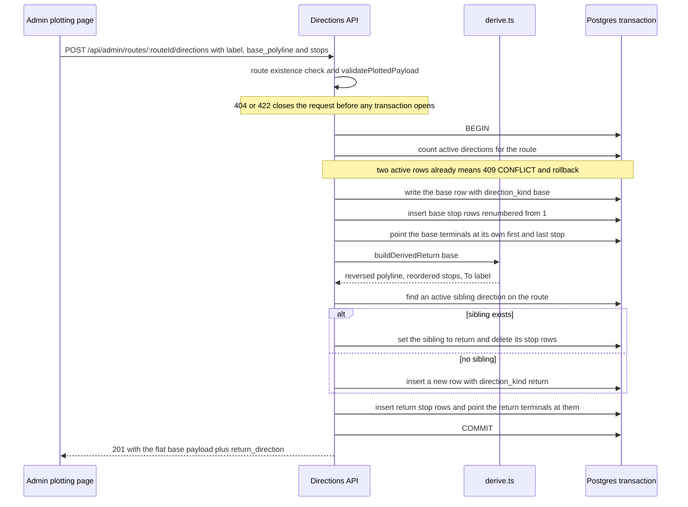

# Two directions per route: base, derived return and the atomic pair

A route in this system is direction-centric: the `routes` row carries only metadata (name, colour, fare config, active flag), while everything a rider or driver would call "the route" — the geometry and the ordered stop list — lives on a `directions` row. Each direction owns its own `base_polyline` geometry and its own `stops` rows, and each direction is the unit of travel: detours and restrictions hang off a direction, not a route.

A route normally has exactly two of them:

| Member | `direction_kind` | Who writes it |
| --- | --- | --- |
| **Base** | `base` | The administrator, by plotting the path and stop order in the workspace |
| **Return** | `return` | The server, once at save time, by deriving it from the base |

Both are real, independent rows. The return is not a view, a render-time reversal, or a shared geometry — it has its own polyline column value, its own stop rows with their own `stop_id`s, and its own terminals. Its stop `location` values start equal to the base's (reversed in order) and its polyline starts as the base's coordinates reversed, but nothing links the two rows afterwards: editing a return stop row does not touch the base, and editing the base path does not implicitly re-derive anything until the next plotted save. The decision to keep two stored directions rather than reverse one polyline on the fly is ADR-0008 (detour replacement, never reverse at runtime); deriving the return from a single plotted base path is ADR-0011. This page documents the code that implements both.

## What identifies a direction

- `direction_id` — a text primary key generated in the application as `dir-<uuid>` by `uuidId("dir")` in [apps/server/src/domain/ids.ts](../../apps/server/src/domain/ids.ts). Application-generated ids are what let the pair write insert parents and children in one transaction without waiting for the database.
- `route_id` — text, `ON DELETE CASCADE` to `routes`, so deleting a route removes both directions and (through the second cascade) their stops, detours and restrictions.
- `label` — free text, `min(1)` in the zod schema. The **base** label comes from the client (the workspace sends `To {last stop name}`); the **return** label is always recomputed by the server.
- `base_polyline` — the geometry column, shared by both members. The name is historical: for a return row it holds the return's own polyline.
- `origin_stop_id` / `destination_stop_id` — the terminal pointers, deliberately *not* foreign keys. The pair write always resolves them inside the direction's own stop list; the legacy create path writes whatever ids the client supplies (see [Data model](../architecture/data-model.md)).
- `direction_kind` — the `base` / `return` marker described [below](#direction_kind-why-order-is-not-row-order).
- `is_active` — defaults to `true`; there is no hard delete for a direction in the API.

Readers come in two shapes: `loadDirectionSummary` returns the row without children, and `loadDirectionFull` adds `stops` (ordered by `stop_order` ascending), `detours` and `restrictions` ([apps/server/src/domain/entities.ts](../../apps/server/src/domain/entities.ts)). The directions *list* endpoint uses the summary loader, so its rows carry `stops: []` — list-driven clients must fetch stops separately.

## The derivation, and only at save time

`buildDerivedReturn` in [apps/server/src/domain/derive.ts](../../apps/server/src/domain/derive.ts) is a pure function from one `PlotBaseInput` to one `DerivedReturn`. It is called inside the save transaction and never on a read path, which is what makes the returned row freely editable afterwards.

The rules it applies, in order:

1. **Polyline reversal.** `reverseCoordinates` copies the coordinate array and reverses it, so the base input is never mutated. Vertex order alone encodes travel direction; no ordinate is touched.
2. **Stop list reversal.** `[...base.stops].reverse()` — array order is the source of truth for sequence.
3. **Closed-loop rotation.** If the base has at least two stops *and* the last polyline coordinate is within `ENDPOINT_TOLERANCE_METERS` (100 m, the same constant the endpoint gate uses) of `base.stops[0].location.coordinates`, the base is treated as a ring. A plain reversal of a ring puts the stop that leads the polyline at the *end* of the stop list, so the return would look like it started at the terminus. The code therefore rotates the reversed list — `[reversed[last], ...reversed.slice(0, last)]` — which moves the base's first stop back to index 0, so the same stop leads both directions. For a base of `[A, B, C]` on a ring, the return's stop list is `[A, C, B]` while its polyline is `[A, C, B, A]`; for the same stops on an open path it would be `[C, B, A]` over `[C, B, A]`.
4. **Label derivation.** `deriveReturnLabel` returns `` `To ${baseStops[0].name}` `` — the base's *first* stop. On an open path that stop is also the return's last entry, so the pair's labels mirror each other naturally (`To Port` / `To City Hall`) and the return label names its destination. On a ring the rotation makes it the return's first entry instead, and the label still names it. The label is computed from the unrotated base list and never depends on the rotation.
5. **Renumbering and fresh objects.** Every derived stop is a new object with a new `location` object and `stop_order` renumbered from 1; the base's objects are never reused. `normalizeStopOrder` does the same renumbering for the base's own stops, so a client-sent `stop_order` is always overwritten by array position.

Because `deriveReturnLabel` indexes `baseStops[0]`, derivation must run *after* the stop-count gate. It does: `validatePlottedPayload` rejects fewer than two stops before `persistPlottedPair` is ever entered, so the derivation never sees an empty list. Preserving that order is part of the contract.

## One transaction writes both members

`persistPlottedPair` in [apps/server/src/api/directions.ts](../../apps/server/src/api/directions.ts) is the only code that writes both members of a pair. It takes an optional `baseId` (present in replace mode, `null` in create mode) and runs entirely inside `db.transaction`, so base row, base stops, base terminals, return row, return stops and return terminals commit together or not at all.



The atomic pair write: gates, base insert, derivation, sibling re-derivation and commit, all inside one transaction.

The two modes differ in more than the row they touch:

| | Create (`POST /routes/:routeId/directions`) | Replace (`PUT /directions/:directionId`) |
| --- | --- | --- |
| Trigger | Body carries a non-empty `stops` array | Body carries a non-empty `stops` array **and** `base_polyline` |
| Base row | Inserted with a new `dir-<uuid>` id | The target direction is updated in place: new `label`, `base_polyline`, `direction_kind: "base"` |
| Base stops | Inserted after `normalizeStopOrder` | All existing stop rows for that direction are **deleted**, then re-inserted |
| Sibling | The active sibling is reused if one exists, otherwise a new row is inserted | Same lookup; the sibling is overwritten with the new derivation |
| Guard | The two-active-directions count runs first | No count is taken |
| `is_active` | Column default (`true`) | Untouched on both rows |
| Response | `201` | `200` |

Both responses are built by re-reading the persisted rows with `loadDirectionFull` after the commit and then flattening the base payload and attaching `return_direction` to it. The flattened base keys are unchanged from the legacy shape, so `return_direction` is a purely additive key (mirrored in `DirectionSaveResult` in [apps/admin/src/features/routes/routesApi.ts](../../apps/admin/src/features/routes/routesApi.ts)). The workspace then patches its react-query caches from that response — replacing the cached `directions` array with `[base, return]` — so a client that just saved never needs a follow-up read (see [Admin data layer](../apps/admin-data-layer-and-client-state.md)).

Replace mode is how a return becomes the new base: pointing the save at the return's `direction_id` publishes it as the `base` member and re-derives the previous base into the `return` member. That is the deliberate meaning of "the pair always stays mutual reverses"; it also means re-saving the base silently discards every return-side edit made since the last save, because the sibling's stop rows are deleted rather than merged.

## The five gates

A plotted save passes through five gates. Four run in the handler before any transaction opens, so a rejected payload writes nothing; the fifth runs as the first statement inside the transaction.

| # | Gate | Enforced by | Outcome |
| --- | --- | --- | --- |
| 1 | The parent exists — route for `POST`, direction for `PUT` | handler lookup | `404 NOT_FOUND` |
| 2 | `stops` is present and holds at least two entries | handler for `stops: []`, `validatePlottedPayload` for the count | `422 VALIDATION_ERROR` |
| 3 | The path starts on `stops[0]` and ends on the last stop — or on `stops[0]` again for a loop — within 100 m | `pathEndpointsOnStops` + `validatePlottedPayload` | `422` naming `start_mismatch` or `end_mismatch` and the rounded distance |
| 4 | Replace mode sends `base_polyline` alongside `stops` | handler | `422 VALIDATION_ERROR` |
| 5 | A create-mode route has fewer than two active directions | `persistPlottedPair`, inside the transaction | `409 CONFLICT` |

Two subtleties belong to gate 2. `stops: []` is a `422` on its own ("Direction must have a non-empty stop list") and is *not* treated as the legacy shape, because the legacy branch is selected by `stops` being **absent**. And the endpoint rule is the only geometry check the server makes: interior stops are not verified against the path, so an API client can persist a polyline that misses its middle stops. That asymmetry is deliberate and is described on [Coordinate order and distance tolerances](./coordinates-and-spatial-math.md).

Everything else the pair promises — a base row, a return row, terminals that resolve inside their own stop list, the `direction_kind` markers — is an invariant established inside the transaction, not a gate. A throw at any point inside it rolls the whole write back; an unexpected error surfaces through the Fastify error handler as `500 INTERNAL` with no partial state, while a `409` raised by gate 5 is thrown before the base row is inserted at all. [apps/server/tests/integration/plotting-save.test.ts](../../apps/server/tests/integration/plotting-save.test.ts) pins both halves: a single-stop save and a start-mismatched save each return `422` and leave the route with zero directions.

## The exactly-two-active-directions guard

Gate 5 is a read of the route's **active** directions inside the transaction:

```ts
const active = await tx
  .select({ direction_id: directionsTable.direction_id })
  .from(directionsTable)
  .where(and(
    eq(directionsTable.route_id, input.routeId),
    eq(directionsTable.is_active, true),
  ));
if (active.length >= 2) throw conflict(`Route ${input.routeId} already has two active directions`);
```

Three consequences are worth carrying:

- **The guard counts active rows only.** `DELETE /api/admin/directions/:directionId` is a soft delete (`is_active: false`), so deactivating a direction frees the slot for a fresh pair while the old row — and its stops — stay in the database. A route can therefore accumulate more than two direction rows over its life; "two directions per route" is the steady state of *active* rows, not a row count.
- **It is a check, not a constraint.** There is no unique index on `(route_id, direction_kind)`, no check constraint and no row lock ([apps/server/src/db/schema.ts](../../apps/server/src/db/schema.ts)); the count is a plain `SELECT` under the default isolation level. Two concurrent create requests can both observe fewer than two active rows and both proceed, so the guard is authoritative for sequential requests and against stale clients, and the admin's write-write story rests on the save-time `409` plus its conflict banner and "Load latest" recovery ([apps/admin/src/features/routes/workspace/RouteWorkspaceProvider.tsx](../../apps/admin/src/features/routes/workspace/RouteWorkspaceProvider.tsx)). Anything that hardens this rule needs a database-level constraint and a unique-violation mapping, not a stricter client.
- **Replace mode skips it entirely**, which is safe for the active-row count in the normal case (the sibling is reused, not added) but means a `PUT` never reactivates anything. The replaced row keeps whatever `is_active` it had, so replacing an inactive direction leaves an inactive `base` beside a freshly derived `return`.

## `direction_kind`: why order is not row order

The pair's two rows are inserted in the same transaction, and `created_at` defaults to `now()` — the transaction timestamp. Both members therefore share one `created_at` value, and nothing ever updates `updated_at`, so that tie never breaks later. Timestamps cannot tell the base from the return, and neither can insertion order once a client reads the rows back.

`direction_kind` exists to answer exactly that question. Postgres compares enums by declaration order, and the enum is declared `["base", "return"]`, so `ORDER BY direction_kind ASC` puts the base first with no `CASE` expression. Both client-facing readers of a route's directions use the same key:

```sql
ORDER BY direction_kind ASC, created_at ASC, direction_id ASC
```

- `GET /api/admin/routes/:routeId` — the route detail, whose `directions[]` the admin reads as `directions[0]` for the base ([apps/server/src/api/routes.ts](../../apps/server/src/api/routes.ts)).
- `GET /api/admin/routes/overview` — the bulk map payload, which takes `slice(0, 2)` of the ordered ids as base and return.

The migration that added the column is [supabase/migrations/0003_direction_kind.sql](../../supabase/migrations/0003_direction_kind.sql): it creates the enum, adds the column with `DEFAULT 'base' NOT NULL`, and states the intent directly — clients must always load the base direction, and before the marker existed the derived return could come back first with its stop list reading as reversed.

Four things about this marker are easy to get wrong:

1. **It is never on the wire.** `toDirectionPayload`, `DirectionSummaryEntity` and the admin's `DirectionEntity` all omit it. Clients that need the base either rely on the server's ordering or track the `direction_id` they saved. Exposing the kind is a deliberate, additive API change, not a field that already exists.
2. **Legacy rows are all `base`.** The migration's default applies to every row that already existed and cannot distinguish an old return from an old base, so a pre-0003 pair is ordered by `created_at` then `direction_id` rather than by role.
3. **Ordering identifies the kind, not the active pair.** Neither reader filters `is_active`, and neither the guard nor the readers pick "the newest base". If a route's pair is deactivated and the route is plotted again, the older `base` row still sorts first by `created_at`, so `directions[0]` — and the overview's two-row slice — can select a deactivated direction instead of the live one. The admin seeds its editor and its draft key from `directions[0]` with no active filter ([apps/admin/src/features/routes/RouteList.tsx](../../apps/admin/src/features/routes/RouteList.tsx)), so this is a real behavioural edge, not a hypothetical.
4. **The list endpoint is the exception.** `GET /api/admin/routes/:routeId/directions` has **no** `ORDER BY`: it selects the route's direction ids, loads each summary through `Promise.all`, and returns them in whatever order the database produced. The summaries carry no stops, so nothing is reversed, but a client that treats the first element as the base gets no guarantee here. Any new client-facing query over directions should copy the kind-first ordering rather than the list endpoint's shape.

## What the pair write guarantees, and what it does not

**Guaranteed, because the transaction writes it:**

- **Each direction owns its stop rows.** The return's stops are inserted as fresh rows with `stop_id`s of their own, so the two members never share a stop. Editing or deactivating a return stop leaves the base untouched, which is what makes the return genuinely editable after derivation rather than a mirror of the base (ADR-0011).
- **Terminals resolve inside their own direction.** After inserting each member's stops, the transaction sets `origin_stop_id` to the first inserted stop id and `destination_stop_id` to the last, for the return as well as the base. For a ring, "last stop in the ordered list" is not the polyline's final coordinate — both members' polylines close back on the first coordinate, which is the loop case the endpoint gate accepts. The property this buys is exactly what `referenceCheck` in [apps/server/src/domain/export.ts](../../apps/server/src/domain/export.ts) asserts — every direction's terminals must name a stop the dataset knows — and the export integration test asserts no dangling terminal after a pair save ([apps/server/tests/integration/export.test.ts](../../apps/server/tests/integration/export.test.ts)). Note that `referenceCheck` is a pure function exercised by the unit and integration tests; the `GET /api/admin/export/dataset` route itself only calls `assembleExportDataset` and serves whatever the tables contain. See [Dataset export pipeline](../workflows/dataset-export-pipeline.md).
- **`direction_kind` matches the role**, so post-save reads order base-before-return.
- **Either both members persist or neither does.**

**Not guaranteed, and worth knowing before changing the save path:**

- **A plotted save replaces stop rows, so per-stop attributes come from the payload, not from the previous rows.** Both members are written as `tx.delete(stopsTable)` followed by re-insert, with fresh `stop_id`s. The insert sets `is_guaranteed_service` to `stop.is_guaranteed_service ?? true`, `landmark_hint` and `notes` to `?? null`, and never sets `ar_marker_enabled` or `is_active` at all — those take their column defaults. `SaveStopPayload` allows all of them, but `savePlot` maps each stop to `name`, `type` and `location` only, so a direction saved from the plotting page always ends up with the defaults for the other stop fields even though the properties panel edits them into the client draft. Any attribute a client wants preserved across a plotted save has to travel in the payload.
- **Both members keep their detours and restrictions through a re-save.** Nothing in the pair write deletes them or re-validates their geometry-derived state, and `assertRestrictionIndexRange` only runs in the restrictions API ([apps/server/src/domain/validation.ts](../../apps/server/src/domain/validation.ts), [apps/server/src/api/restrictions.ts](../../apps/server/src/api/restrictions.ts)). A restriction whose `from_coord_index` / `to_coord_index` fitted the old polyline can be left stale when a replace re-derives or replaces the direction it belongs to; the same applies to a detour's entry/exit anchors, which are plain coordinates that were only ever checked against the polyline at detour save time.
- **Sibling selection is a `limit(1)`**, filtered to active rows and ordered by nothing ([apps/server/src/api/directions.ts](../../apps/server/src/api/directions.ts)). With a single active sibling — the normal case — it is unambiguous; with more than one it is arbitrary, which is another reason not to rely on a route ever holding more than two active directions.
- **`direction_count` on the route list counts every direction row**, active or not, because the aggregate has no `WHERE` clause ([apps/server/src/api/routes.ts](../../apps/server/src/api/routes.ts)). It is a row count, not a live-pair count.

## Legacy single-direction routes

The plotted path is additive; the older shape still works and is still reachable.

- **`POST /routes/:routeId/directions` without `stops`** takes the legacy branch: a plain insert of one direction with the body's `label` and `base_polyline`, plus whatever `origin_stop_id` / `destination_stop_id` the client sent. There is no transaction and no derivation, the response has `stops: []` and no `return_direction` key, `direction_kind` takes the column default (`base`) and `is_active` defaults to `true`. [apps/server/tests/integration/plotting-save.test.ts](../../apps/server/tests/integration/plotting-save.test.ts) pins this — one direction, no derivation.
- **`PUT /directions/:directionId` without `stops`** patches fields on one row only (`label`, `base_polyline`, terminals, `is_active`). A `base_polyline`-only patch is shape-checked but never runs the endpoint gate, because that gate is conditional on the request carrying `stops`. It is the only way to rename a direction without re-plotting it and the only way to flip `is_active` back to `true`; no admin client function calls it today, because the workspace routes every save through `saveDirection` or `replaceDirection`.
- **Reads degrade gracefully.** The overview emits `return_polyline: null` for a single-direction route, and `overviewRouteSchema` declares both polylines nullable for exactly that case ([packages/shared/src/schemas/domain.ts](../../packages/shared/src/schemas/domain.ts)). A legacy direction starts with no stop rows, so its terminals are `null` unless the client supplied ids, and `GET /directions/:directionId/stops` returns an empty list; stops can still be added one at a time through `POST /directions/:directionId/stops`.

## Extension points and change plan

- **Changing the derivation** means editing `derive.ts` and its unit test, not the handler. Keep the three properties the tests assert: no mutation of the base input, fresh objects for the derived stops, and `stop_order` renumbered from 1. The loop-rotation branch is the one most likely to be "simplified" into a plain reverse by someone who does not know why it exists — the ring case in [apps/server/tests/unit/derive.test.ts](../../apps/server/tests/unit/derive.test.ts) is the executable statement of it.
- **Changing the gates** means keeping them ahead of the transaction (gates 2–4) or accepting that a rejected write has already opened one (gate 5). The error helpers in [apps/server/src/api/errors.ts](../../apps/server/src/api/errors.ts) are the only source of the `422` / `409` / `404` codes the admin branches on, and the admin's `CONFLICT` handling is keyed on the error code, not the status text.
- **Adding a client-facing direction query** means repeating `ORDER BY direction_kind ASC, created_at ASC, direction_id ASC`, or adding the kind to the wire payload — not assuming row order.
- **Making "two directions" a hard rule** means a partial unique index on `(route_id, direction_kind)` (or a per-route active count constraint) plus a unique-violation mapping into `409 CONFLICT`; the current guard cannot do it alone, and a constraint would additionally need a decision about how inactive rows are treated.

## Tests that pin this behaviour

| Suite | What it locks down |
| --- | --- |
| [apps/server/tests/unit/derive.test.ts](../../apps/server/tests/unit/derive.test.ts) | coordinate reversal without mutation, the `To {first stop}` label, renumbering from 1, fresh stop/location objects, the closed-loop rotation (`["A", "C", "B"]` over `[A, C, B, A]`), the endpoint rule including the loop-closing acceptance and both mismatch reasons, and `normalizeStopOrder` |
| [apps/server/tests/integration/plotting-save.test.ts](../../apps/server/tests/integration/plotting-save.test.ts) | the atomic pair create and its response shape, the return's own terminal ids, the `422` gates persisting nothing, loop acceptance, the third-direction `409`, replace-mode re-derivation, the legacy no-stops create, base-first route detail ordering, and the overview's base/return polylines |
| [apps/server/tests/integration/export.test.ts](../../apps/server/tests/integration/export.test.ts) | the derived return exported as a direction of its own with terminals that resolve to its own stops, and no dangling terminal references anywhere in the dataset |
| [apps/server/tests/integration/crud.test.ts](../../apps/server/tests/integration/crud.test.ts) | stop edits landing on the right direction, route detail returning two directions with their stops, the empty-stop-list `422`, and the `409` that blocks deleting a stop referenced as a direction terminal |
| [apps/admin/src/tests/coords.test.ts](../../apps/admin/src/tests/coords.test.ts) | the client-side mirror of the endpoint rule, so the workspace can refuse a save before the round trip |

The admin's cache patch and conflict banner are not covered by an automated UI test — see [Admin test suite](../testing/admin-tests.md).

## See also

- [Data model](../architecture/data-model.md) — the `directions` / `stops` columns, the `direction_kind` enum ordering, and delete semantics.
- [Coordinate order and distance tolerances](./coordinates-and-spatial-math.md) — the 100 m endpoint rule, the three haversine implementations, and where each gate actually runs.
- [Server API surface](../operations/server-api-surface.md) — the direction, stop and overview endpoints in context.
- [Admin route plotting and save](../workflows/admin-route-plotting-save.md) — the client half: chain order, snapping, drafts, and the save button.
- [Dataset export pipeline](../workflows/dataset-export-pipeline.md) — how the two directions leave the system.
- [Admin route workspace UI](../apps/admin-route-workspace-ui.md) — how base and return polylines are drawn on one map.
