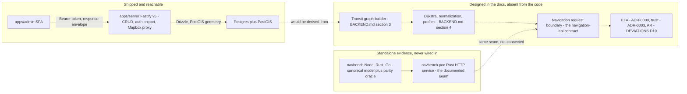

# Routing, navigation and trust are not implemented: the negative space

This page exists to stop an agent from inventing behaviour. The repository contains an admin CRUD API, an admin dashboard, an Expo starter, shared types and an offline benchmark harness. It does **not** contain a routing engine, a graph, a commuter-facing navigation endpoint, an ETA, a GPS-trace pipeline, trust scoring or AR. Every one of those has a design that already exists elsewhere — in `docs/adr/*.md`, `docs/BACKEND.md`, `navbench/`, or `specs/` — and this wiki has no authority over any of them.

## Read this before you touch anything adjacent

- **Do not implement anything listed on this page from this page.** This is not a specification and not a design sketch. It records absence and points at the source that owns the design.
- **Read the ADR first.** The repository's authority ladder (per [OpenWiki instructions](../INSTRUCTIONS.md)) is: `docs/adr/*.md` → `AGENTS.md` → code and tests → this wiki. If a change touches a response shape, a shared schema, a fare or distance calculation, or anything graph-shaped, read the ADR named for that decision and the `docs/BACKEND.md` section named for it *before* editing.
- **If the code and an ADR appear to disagree, say so on the page rather than silently describing the code as intent.** Deliberate deviations are recorded in `docs/DEVIATIONS.md`; check it before reporting a discrepancy. Two such disagreements in this area are listed [below](#where-the-code-and-the-design-docs-disagree).
- **Do not restate an ADR in new prose.** Cite the number and move on — see [Decisions that belong to the ADRs](#decisions-that-belong-to-the-adrs-not-to-this-page).

## What is actually there

`docs/DEVIATIONS.md` §0 records the verified position of the codebase as the reconciliation baseline for the whole thesis: the server is an admin CRUD API only, the mobile app is an untouched Expo starter, and `packages/shared` is types plus Zod schemas — which is why the authoritative spec for routing, AR and trust is the design docs and ADRs rather than code ([docs/DEVIATIONS.md](../../docs/DEVIATIONS.md#L16-L21)).

That position is still accurate. What runs is the admin surface only:

| Area | Present today | Absent |
| --- | --- | --- |
| Server | Six-entity CRUD (routes, directions, stops, detours, restrictions, fare configs) + auth + dataset export + the Mapbox Directions proxy, registered in one place ([apps/server/src/api/index.ts](../../apps/server/src/api/index.ts#L14-L37)) | Graph builder, Dijkstra, pathfinding, navigation endpoint, snapping at request time, trace ingestion, trust scoring, ETA |
| Graph state | Nothing — the process starts, builds the app and listens ([apps/server/src/index.ts](../../apps/server/src/index.ts#L6-L23)) | Any in-memory graph, any cache, any rebuild trigger, any debug route |
| Database | `admin_users`, `routes`, `directions`, `stops`, `detours`, `detour_stops`, `restrictions`, `fare_configs` ([apps/server/src/db/schema.ts](../../apps/server/src/db/schema.ts#L60-L220)) | Graph node/edge tables, GPS trace tables, trust/score tables |
| Shared package | Types + Zod schemas, barrel-exported ([packages/shared/src/index.ts](../../packages/shared/src/index.ts#L1-L11)) | `fareCalculator`, preference profiles, weights, any navigation request/response type |
| Mobile | The React Native Reusables starter screen ([apps/mobile/app/index.tsx](../../apps/mobile/app/index.tsx#L26-L65)) | Any API client (no `fetch`, no `axios`), map, camera, sensors, offline store, AR |
| Tooling | `navbench/` — a standalone Node/Rust/Go harness outside the pnpm workspace | Any wiring of that harness into the server or into a Turbo task |

The server's route surface is the single most load-bearing piece of evidence on this page: every endpoint the process serves is registered by `registerAdminRoutes`, and the list is exhaustive. `apps/server/src/api/index.ts` registers `status` and `auth-login` unguarded at the root, then one plugin mounted at `/api/admin` behind the auth guard containing the CRUD modules, `export` and `mapbox` — and nothing else ([apps/server/src/api/index.ts](../../apps/server/src/api/index.ts#L14-L37)). The full endpoint table lives on [Server API surface](../operations/server-api-surface.md).

## The three tiers

Three tiers, not one pipeline: what actually serves requests, the offline harness that holds the only real Dijkstra in the tree, and the designed-but-unbuilt chain in the middle of which this wiki must not improvise.

## Absence by absence

### No transit graph builder

Nothing in `apps/` or `packages/` builds a graph. The strongest single piece of evidence is that the identifier does not occur anywhere in the shipped workspace: searching the tree for `dijkstra` returns matches only in `docs/TECHSTACK.md`, `docs/BACKEND.md`, the ADRs, the thesis, and `navbench/` — never in `apps/*` or `packages/*`. Searching `apps/server` for `graph` returns nothing but `::geography` casts in the query helpers and one comment in an integration test helper.

Structurally, there is also nowhere for a graph to live:

- startup is `loadEnv` → `buildApp` → `listen`, with no build phase and no rebuild hook ([apps/server/src/index.ts](../../apps/server/src/index.ts#L6-L23));
- there are no graph tables in the Drizzle schema or in any migration — only the eight entity tables ([apps/server/src/db/schema.ts](../../apps/server/src/db/schema.ts#L60-L220)).

What the graph is meant to be is designed elsewhere and must not be paraphrased here: `docs/BACKEND.md` §3 ("Graph Theory — Modeling the Transit Network", [docs/BACKEND.md](../../docs/BACKEND.md#L119-L125)) and the node-naming rule that [ADR-0008](../../docs/adr/0008-detour-replacement.md) fixes. The cache/rebuild strategy has its own section, `docs/BACKEND.md` §12, and its own decision, **ADR-0005** — see the one-liner below.

### No Dijkstra, no normalization, no preference profiles

The only Dijkstra in the repository lives in the standalone harness: `buildGraph` and `dijkstraSegment` in [navbench/shared/model.js](../../navbench/shared/model.js#L46-L60), which is the canonical model the Rust and Go ports must match. `navbench/` sits deliberately outside the pnpm workspace — the declared workspace globs are only `apps/*` and `packages/*` ([pnpm-workspace.yaml](../../pnpm-workspace.yaml#L1-L3)), and `navbench/README.md` states its toolchains never touch `pnpm install` or Turbo and that it is standalone tooling rather than part of the shipped app ([navbench/README.md](../../navbench/README.md#L16-L18)). See [navbench parity harness](../integrations/navbench-parity-harness.md) for the harness itself; ADR-0017 owns the decision about whether navigation ever leaves Node.

Multi-criteria ranking is entirely absent too. `packages/shared` exports only `types/*` and `schemas/*` ([packages/shared/src/index.ts](../../packages/shared/src/index.ts#L1-L11)); the domain types are the eight entity interfaces and their payloads, with no weighting, profile or normalized-cost concept ([packages/shared/src/types/domain.ts](../../packages/shared/src/types/domain.ts#L24-L109)). The word `preference` appears in this repository only in docs and specs. `docs/DEVIATIONS.md` D9 tracks the preference-profile weights as planned / not implemented, and names the design home ([docs/DEVIATIONS.md](../../docs/DEVIATIONS.md#L46)). Normalization is **ADR-0002**; the cost model is **ADR-0001**.

### No navigation endpoint and no commuter-facing API

No file under `apps/` mentions `POST /api/navigate`, and there is no route that accepts an origin/destination pair. The only unguarded endpoints are `GET /api/status` and the three auth routes ([apps/server/src/api/index.ts](../../apps/server/src/api/index.ts#L20-L21)); `GET /api/status` reports row counts and the latest `directions.updated_at`, not graph state ([apps/server/src/api/status.ts](../../apps/server/src/api/status.ts#L18-L56)).

Three separate documents describe a navigation request, which is exactly why this page has to be explicit that none of them is served:

- `docs/BACKEND.md` §10 documents a `POST /api/navigate` request and response ([docs/BACKEND.md](../../docs/BACKEND.md#L444-L460));
- `specs/011-backend-language-migration/contracts/navigation-api.md` is labelled a **target interface contract for planning** and states it is not built by that feature ([specs/011-backend-language-migration/contracts/navigation-api.md](../../specs/011-backend-language-migration/contracts/navigation-api.md#L1-L3));
- the only HTTP navigation service that exists anywhere is the Rust PoC in `navbench/poc`, run by hand and documented as the seam ([navbench/README.md](../../navbench/README.md#L61-L64)).

ADR-0017 owns the runtime decision. Nothing here should be read as a recommendation for a language, a process boundary or an HTTP shape.

### No request-time virtual nodes, no hail-and-ride graph edges

The virtual-node / board-edge mechanism is request-time graph construction, so it is absent along with the graph itself: no code creates a node, an edge, or a per-request copy of anything. What does exist is the *authoring-side* vocabulary — stop types, `is_guaranteed_service`, `restrictions` rows keyed to a direction by polyline coordinate indices — which is data, not graph behaviour. The board-edge definition sits in `docs/BACKEND.md` §3, and the hail-and-ride request path is `docs/BACKEND.md` §10 ("Snap-to-Polyline + Virtual Nodes", [docs/BACKEND.md](../../docs/BACKEND.md#L477-L491)); the detour-replaces-base-segment rule is **ADR-0008**.

### No ETA and no duration anywhere

No response type carries a duration, a speed, or an arrival estimate: the shared domain types have distance/geometry fields only ([packages/shared/src/types/domain.ts](../../packages/shared/src/types/domain.ts#L24-L109)), and the one place where an upstream service *does* return durations — Mapbox Directions — strips them by design, forwarding geometry and distance only ([apps/server/src/api/mapbox.ts](../../apps/server/src/api/mapbox.ts#L85-L91)). Distance math is real (see below), but no time model exists and none may be invented.

The output rule is **ADR-0009** — see the one-liner below.

### No GPS-trace ingestion, no validity filter, no trust scoring

There is no trace pipeline at all:

- no `trust`, `score`, `hausdorff` or `MHD` identifier exists anywhere under `apps/`;
- no trace table exists in the schema or migrations ([apps/server/src/db/schema.ts](../../apps/server/src/db/schema.ts#L60-L220));
- no endpoint accepts a submitted trace;
- no entity carries a score or badge field ([packages/shared/src/types/domain.ts](../../packages/shared/src/types/domain.ts#L24-L109)).

`docs/DEVIATIONS.md` D10 tracks the AR and trust increments as planned / not implemented and notes that no server trust/GPS-trace endpoint exists either ([docs/DEVIATIONS.md](../../docs/DEVIATIONS.md#L47)). The intended discriminator and the informational-only status of trust scoring are **ADR-0003**; the algorithmic design (MHD) is `docs/BACKEND.md` §7–§8.

### No AR, no map, no offline trace cache in the mobile app

`apps/mobile` is the React Native Reusables starter: the only screen renders starter copy and links ([apps/mobile/app/index.tsx](../../apps/mobile/app/index.tsx#L26-L65)), there is no API client of any kind (the package contains no `fetch` or `axios` call), and its dependency list contains no `expo-camera`, `expo-sensors`, `@rnmapbox/maps` or `expo-sqlite` ([apps/mobile/package.json](../../apps/mobile/package.json#L14-L67)). See [Mobile commuter app](../apps/mobile-commuter-app.md).

The AR scope and constraints — when AR is allowed, what it may show — are stated in `AGENTS.md` and in the surface brief under `apps/mobile/.impeccable/surfaces/`; they are not repeated here.

### No fare arithmetic and no `fareCalculator`

<!-- openwiki: broken internal link [./fares-and-fare-configurations.md] file "./fares-and-fare-configurations.md" does not exist. Fix the href or restore the target, then delete this comment. -->
`AGENTS.md` and the wiki brief describe a shared `fareCalculator` that owns the LTFRB formula. No such export, file or identifier exists: `@komyuter/shared` exports types and Zod schemas only ([packages/shared/src/index.ts](../../packages/shared/src/index.ts#L1-L11)), and the identifier `fareCalculator` occurs in this repository exclusively inside docs and specs. Fare configs are *stored and exported parameters* (`base_fare`, `base_distance_km`, `rate_per_km`, discount percentages) — nothing in the code evaluates the formula. The two-fare-notions rule is **ADR-0001**; see [Fares and fare configurations](./fares-and-fare-configurations.md).

### Conditional detour triggers are absent from the model

The detour contract carries a plain lifecycle flag (`is_active`, alongside every other entity's — [apps/server/src/db/schema.ts](../../apps/server/src/db/schema.ts#L94-L232), [packages/shared/src/types/domain.ts](../../packages/shared/src/types/domain.ts#L63-L79)) and no trigger: `createDetourSchema` / `updateDetourSchema` have no time-window or condition field ([packages/shared/src/schemas/domain.ts](../../packages/shared/src/schemas/domain.ts#L110-L123)), and neither string `active_timeframes` nor `condition` appears anywhere under `packages/`. **ADR-0012** owns what conditional activation is meant to be, including its implementation status ([docs/adr/0012-detour-conditional-triggers.md](../../docs/adr/0012-detour-conditional-triggers.md#L23-L25)).

### The one thing that *does* exist: admin-side geometry

Do not overclaim the absence. Real distance and projection math is shipped — it is simply not pathfinding:

- `haversineMeters` and `distanceToSegment` in [apps/server/src/domain/validation.ts](../../apps/server/src/domain/validation.ts#L37-L99) back the authoring-time assertions (detour loop endpoints within tolerance of entry/exit, non-degenerate loops, endpoint proximity and overlap checks);
- `coordsDistanceMeters`, `polylineDistanceMeters`, `projectPointOnPolyline` and `nearestCoordIndex` live in [apps/admin/src/lib/coords.ts](../../apps/admin/src/lib/coords.ts#L48-L178) for display, validation and click-snapping in the plotting workspace ([projectPointOnPolyline](../../apps/admin/src/lib/coords.ts#L287-L291) is the point-to-segment projection, used to place a detour's entry/exit from a map click).

Both are single-geometry operations over data the operator just drew. Neither builds a network, neither considers an alternative, and neither runs on a commuter request — the difference matters when someone proposes "reusing the existing snapping code". [Coordinates and spatial math](./coordinates-and-spatial-math.md) covers the tolerances these helpers enforce.

### "Snap" has two meanings here, and neither is request-time transit snapping

One is the Mapbox Directions proxy, which snaps an operator-plotted path to the **road network** for storage, falling back to a straight line when the token is missing or the upstream call fails, and returning `snapped: false` with a warning code ([apps/server/src/api/mapbox.ts](../../apps/server/src/api/mapbox.ts#L85-L118)). The other is `projectPointOnPolyline`, which snaps a map click onto the polyline the operator is currently drawing ([apps/admin/src/lib/coords.ts](../../apps/admin/src/lib/coords.ts#L287-L291)).

Neither is the harness workload called `polyline_snapping`, which snaps a point to the nearest on-network link at request time. See [Mapbox Directions proxy](../integrations/mapbox-directions-proxy.md).

## Where the intended design is authoritative

Read the source, not this page. Every subject below has exactly one home.

| Subject | Authoritative source | Do not |
| --- | --- | --- |
| Route-expanded graph model, node naming, board edges, virtual nodes, boarding eligibility | `docs/BACKEND.md` §3 and §10 | Summarise or extend it here |
| Dijkstra, multi-criteria extension, normalization, preference profiles | `docs/BACKEND.md` §4 and §10 | Copy formulas or weights into a wiki page |
| Trust scoring (MHD), trace validity, preprocessing filters | `docs/BACKEND.md` §7–§8; **ADR-0003** | Describe an algorithm as if implemented |
| Navigation request/response boundary | `specs/011-backend-language-migration/contracts/navigation-api.md`; `docs/BACKEND.md` §10 | Treat the contract as a shipped API |
| Runtime choice for a future navigation service | **ADR-0017**; `navbench/` results | Recommend a language or a migration |
| Graph caching / rebuild strategy | **ADR-0005**; `docs/BACKEND.md` §12 | Assume any cache or rebuild hook exists |
| Fare used inside a cost function vs displayed fare | **ADR-0001**; `docs/BACKEND.md` §5 | "Fix" the cost model or reimplement the formula |
| Weight normalization pools | **ADR-0002** | Invent a normalization scheme |
| No-ETA output rule | **ADR-0009** | Add a duration, speed or walking-time constant |
| Conditional detour activation | **ADR-0012** | Add trigger fields to shared schemas on a wiki's authority |
| Mobile AR design constraints | `AGENTS.md`; `apps/mobile/.impeccable/surfaces/apps-mobile.md` | Design AR behaviour |
| Which features are tracked as unbuilt (D9, D10, and the drift appendix) | `docs/DEVIATIONS.md` §2 and Appendix A | Duplicate the tracked list here |

## Decisions that belong to the ADRs, not to this page

Each line names the decision's subject only; the decision and its rationale live in the ADR file, and this page neither restates nor interprets them.

- **ADR-0001** — the fare-as-ranking-cost decision belongs there, not here.
- **ADR-0002** — the normalization decision belongs there, not here.
- **ADR-0003** — the trace-validity and trust-scoring decisions belong there, not here.
- **ADR-0005** — the graph-cache and rebuild decision belongs there, not here.
- **ADR-0009** — the no-ETA decision belongs there, not here.
- **ADR-0012** — the conditional-detour-trigger decision belongs there, not here.
- **ADR-0017** — the back-end navigation-runtime decision belongs there, not here.

## Verifying the absences yourself

The absences above are checkable in seconds and should be re-checked before relying on this page, because the moment any of these features lands the page becomes wrong:

- `grep -ri dijkstra apps packages` → no matches (matches appear only under `docs/`, `navbench/`).
- `grep -ri graph apps/server/src` → only `::geography` casts.
- `grep -rn "app.get(\|app.post(" apps/server/src/api` → the CRUD, auth, export and mapbox handlers, and nothing else, when read together with the registrations in `apps/server/src/api/index.ts`.
- `grep -ri "trust\|hausdorff\|mhd" apps packages` → no matches; the single `trace` hit in `apps/` is a test description about rewiring a plotting loop, not a GPS trace.
- `grep -rn fareCalculator apps packages` → no matches.
- `grep -rn "expo-camera\|expo-sensors\|rnmapbox\|expo-sqlite" apps/mobile/package.json` → no matches.

Focused tests also register the absence: the server's unit suite covers `derive`, `env`, `export`, `geometry`, `mapbox-proxy`, `schemas`, `throttle` and `validation` (e.g. [geometry.test.ts](../../apps/server/tests/unit/geometry.test.ts#L1-L20) and [mapbox-proxy.test.ts](../../apps/server/tests/unit/mapbox-proxy.test.ts#L1-L18)) — there is no test for a routing engine, a trace pipeline or a trust score, and the integration helper mentions "graph" only in a comment ([apps/server/tests/integration/helpers.ts](../../apps/server/tests/integration/helpers.ts#L185-L190)). The admin's hermetic suite tests plotting stores, coordinates and geometry, not routing. See [Server tests](../testing/server-tests.md) and [Admin tests](../testing/admin-tests.md).

The harness's own gates are separate and are the right place to judge parity: `navbench/node`, `navbench/rust` and `navbench/go` each have parity tests against the shared oracle, and no Turbo task or CI workflow invokes them ([navbench parity harness](../integrations/navbench-parity-harness.md)).

## Where the code and the design docs disagree

Both of these are code-versus-doc drift in the negative space, and the first one is a trap for anyone looking for graph state:

- **`GET /api/graph/status` is not registered.** `docs/DEVIATIONS.md` D2 keeps that route as the debug surface for graph statistics and names **ADR-0005** as the decision behind it ([docs/DEVIATIONS.md](../../docs/DEVIATIONS.md#L30)), but the server registers no such route — the shipped public status endpoint is `GET /api/status`, which returns table row counts and the latest `directions.updated_at` ([apps/server/src/api/status.ts](../../apps/server/src/api/status.ts#L18-L56)). Do not assume graph statistics are exposed anywhere.
- **Nothing builds or maintains a graph at startup.** `src/index.ts` loads env, builds the app and listens, with no build phase and no rebuild hook ([apps/server/src/index.ts](../../apps/server/src/index.ts#L6-L23)), while the design docs assume a graph that exists to be kept current (**ADR-0005**). This is consistent with the fact that nothing consumes a graph yet; it is recorded here so that a missing rebuild hook is not filed as a defect against a feature that does not exist.

Neither is recorded in `docs/DEVIATIONS.md`, so if you touch this area, they belong in the deviation record rather than in a rewritten wiki paragraph. Report drift; do not silently describe the code as intent.

## If you are here to build something

Because this page's whole value is negative, the honest instructions are short:

1. Read the ADR for the decision and the `docs/BACKEND.md` section for the design — in that order — plus `docs/DEVIATIONS.md` §2 to see whether the feature is already tracked as planned.
2. Check whether `specs/` already carries a specification for it (`specs/011-backend-language-migration/` for the runtime question; `specs/001-local-supabase-backend/` for the server's shape).
3. Change the code and its tests there. Then let the wiki regenerate — do not hand-edit this page to describe the new behaviour, and do not treat this page as the requirement.
