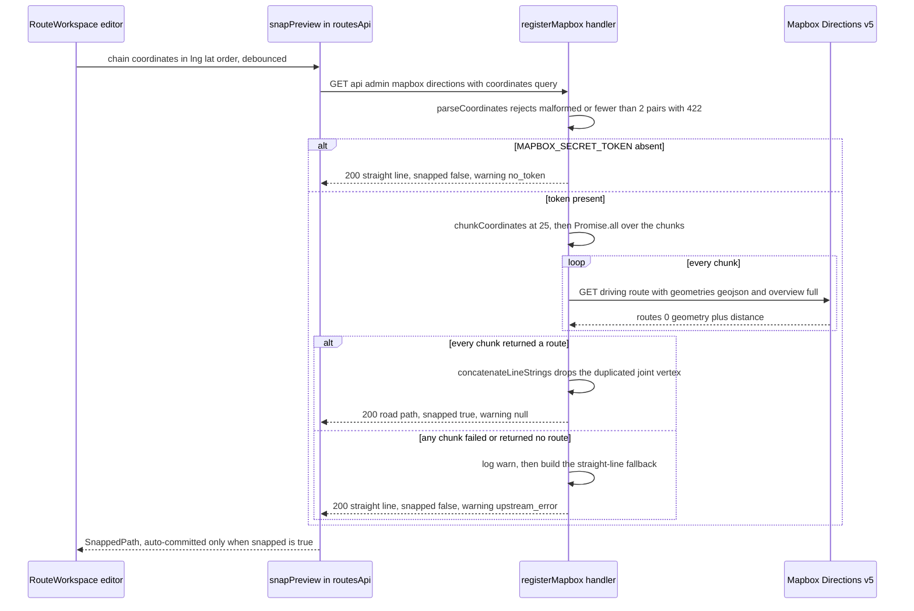

# Integration: Mapbox Directions proxy and road-following fallback

The repository's only server-side third-party call is the Mapbox Directions proxy. It exists for one job: turn an ordered list of plotted stop coordinates into a **road-following LineString** the admin can persist as a Direction's `base_polyline`, and never block plotting when Mapbox is unavailable. It is also the only place where third-party geometry can enter a saved Direction's base path, which is why the contract below is written as rules rather than as a description of the happy path.

The proxy is `GET /api/admin/mapbox/directions`, implemented by `registerMapbox` in [apps/server/src/api/mapbox.ts](../../apps/server/src/api/mapbox.ts), proxied so the Mapbox secret token never reaches the browser (ADR-0013). Coordinate order is `[lng, lat]` with no conversion layer — see [Coordinate order, PostGIS helpers and distance tolerances](../concepts/coordinates-and-spatial-math.md).

## Where the endpoint sits

`registerMapbox` is registered inside the single `/api/admin` plugin, behind the `preHandler` admin auth guard, together with the CRUD routes ([apps/server/src/api/index.ts](../../apps/server/src/api/index.ts#L14-L36)). Everything therefore inherits the server's standard envelope and security posture:

- **Auth**: a strict `Bearer` token verified by Supabase Auth plus an `admin_users` membership check; failures are `401 UNAUTHORIZED` / `403 FORBIDDEN` before the handler runs. The origin allowlist (`ADMIN_ORIGINS`) also applies to browser calls. The full route table and guard behavior live on [Server API surface](../operations/server-api-surface.md).
- **Envelope**: the handler returns `{ success: true, data }` and never an error envelope for a service failure; `ApiError` from `validationError` becomes `{ success: false, error: { code, message } }` via the central error handler ([apps/server/src/api/app.ts](../../apps/server/src/api/app.ts#L66-L86)).
- **One consumer**: the admin SPA is the only client. `snapPreview` in [apps/admin/src/features/routes/routesApi.ts](../../apps/admin/src/features/routes/routesApi.ts#L201-L210) is the single call site, bound into the plotting store by `bindSnapFetcher` and reused by the detour loop builder.
- **Handler shape**: a plain `app.get("/mapbox/directions", …)` with no response schema and no per-route hooks; input validation is hand-rolled rather than zod, because the payload is a single query string.

## Request contract

```
GET /api/admin/mapbox/directions?coordinates=<lng,lat;lng,lat;…>
```

`parseCoordinates` splits on `;`, then on `,`, trims each token, and coerces with `Number()` ([apps/server/src/api/mapbox.ts](../../apps/server/src/api/mapbox.ts#L9-L27)). The rules that decide between a snap and a client error:

| Input                             | Behavior                                                                                        |
| --------------------------------- | ----------------------------------------------------------------------------------------------- |
| `coordinates` missing             | `422 VALIDATION_ERROR` — "Missing required query parameter: coordinates"                         |
| a token that is not two finite numbers | `422 VALIDATION_ERROR` — `Invalid coordinate pair: <token>`                             |
| fewer than 2 pairs                | `422 VALIDATION_ERROR` — "At least 2 coordinates are required"                                   |
| ≥ 2 well-formed pairs             | upstream attempt, then **200** with `snapped: true` or **200** with the straight-line fallback   |

A 422 is a client error, never a service-failure signal — the proxy deliberately has no 5xx path for Mapbox being down, because the flow must degrade instead of failing (FR-009). The client mirrors the ≥ 2 rule: `requestSnapPreview` returns early (after invalidating any in-flight request) when fewer than 2 stops are placed, so the 422 branch is reachable in practice only by a non-UI caller.

For each chunk the proxy issues one HTTPS request to:

```
https://api.mapbox.com/directions/v5/mapbox/driving/<lng,lat;lng,lat;…>?geometries=geojson&overview=full&steps=false&alternatives=false&access_token=<MAPBOX_SECRET_TOKEN>
```

The profile is hard-coded to `driving` and the parameter set is fixed ([apps/server/src/api/mapbox.ts](../../apps/server/src/api/mapbox.ts#L69-L83)): no `optimize`, no `exclude`, no language or timeout options. Coordinates are interpolated with their raw numeric precision, so the waypoint string round-trips exactly what was parsed. The token is passed as the `access_token` query parameter — the only place the secret is used, and it is never echoed into a response.

## Response contract

Every well-formed request returns HTTP 200 with the same shape, whether or not roads were involved:

```jsonc
{
  "success": true,
  "data": {
    "polyline": { "type": "LineString", "coordinates": [[122.5689, 10.6931], "…"] },
    "distance_meters": 2340,
    "snapped": true,
    "warning": null
  }
}
```

| Field             | Meaning in the snapped case                                                        | Meaning in the fallback case                          |
| ----------------- | ---------------------------------------------------------------------------------- | ----------------------------------------------------- |
| `polyline`        | Road geometry from Mapbox, chunks concatenated in request order                     | Straight line through exactly the requested coordinates |
| `distance_meters` | Sum of the per-chunk `route.distance` values, in meters                             | `0` — a sentinel for 'unknown', no distance is computed |
| `snapped`         | `true`                                                                             | `false`                                               |
| `warning`         | `null`                                                                             | `"no_token"` or `"upstream_error"`                    |

The handler reads only two fields out of the upstream JSON — `routes[0].geometry` and `routes[0].distance` ([apps/server/src/api/mapbox.ts](../../apps/server/src/api/mapbox.ts#L124-L156)). **Contract: the proxy forwards geometry and distance only and must never forward upstream durations or instructions (ADR-0009).** That is enforced in three ways at once: the response has no duration-shaped field, `steps=false` means no turn-by-turn legs are requested at all, and the parsed upstream payload is narrowed to geometry plus distance, so a `duration` that Mapbox does return is simply not read. No response type anywhere in the system carries a duration ([Routing, navigation and trust are not implemented](../concepts/routing-and-navigation-scope.md)).



The chunked fetch and its two fallback branches. A failure in any single chunk discards the whole batch.

## Chunking and joint deduplication

Mapbox Directions accepts at most 25 waypoints per driving request, so the proxy declares `MAPBOX_CHUNK_SIZE = 25` and slices with `chunkCoordinates` ([apps/server/src/api/mapbox.ts](../../apps/server/src/api/mapbox.ts#L6-L39)). Three behaviors matter for anyone changing the path:

1. **Chunks are ordered, non-overlapping slices** of the coordinate list — chunk *n* covers indices `25n … 25n+24` — so global route order is preserved without any waypoint being requested twice.
2. **All chunks are fetched concurrently** through `Promise.all`, one `fetch` per chunk, and the responses are joined in chunk order; `distance_meters` is the arithmetic sum of the chunk distances.
3. **Joint deduplication is an exact-equality guard.** `concatenateLineStrings` appends each chunk's coordinates, skipping a chunk's leading coordinate only when it is element-wise identical to the last coordinate already appended ([apps/server/src/api/mapbox.ts](../../apps/server/src/api/mapbox.ts#L48-L67)). There is no tolerance and no interpolation: adjacent snapped chunks whose boundary vertices differ are simply placed next to each other in the LineString, and identical boundary vertices (two waypoints snapping to the same road node) are collapsed into one vertex rather than producing a zero-length segment.

Two edge cases fall out of this design and are worth knowing before touching it:

- **A final chunk of one waypoint is reachable and unguarded.** With 26, 51, 76 … coordinates the last slice holds a single pair; `chunkCoordinates` has no minimum-chunk rule, so such a request is sent as-is even though the endpoint as a whole requires at least two coordinates. Mapbox Directions requires at least two waypoints, so that request is expected to be rejected upstream — and because the whole batch shares one `try`/`catch`, the rejection degrades the entire path rather than just the tail.
- **The batch is all-or-nothing.** `Promise.all` plus a single `catch` around the whole block means a non-OK status, a body without `routes[0]` ("Mapbox returned no route"), or a rejected `fetch` discards every successfully snapped chunk and returns the straight line for the full coordinate list.

There is also no timeout, no `AbortSignal`, and no retry on the upstream `fetch`. A hung Mapbox response therefore leaves the preview in the client's `pending` state until the socket fails; a slow one is still awaited. This route has no rate limiting either — throttling exists only on login.

## The straight-line fallback

Both failure modes converge on one shared closure ([apps/server/src/api/mapbox.ts](../../apps/server/src/api/mapbox.ts#L110-L122)):

```jsonc
{
  "success": true,
  "data": {
    "polyline": { "type": "LineString", "coordinates": [/* the requested coordinates */] },
    "distance_meters": 0,
    "snapped": false,
    "warning": "no_token" // or "upstream_error"
  }
}
```

| Condition                                                                       | Warning code       | What happened first                                                     |
| ------------------------------------------------------------------------------- | ------------------ | ----------------------------------------------------------------------- |
| `MAPBOX_SECRET_TOKEN` absent (`env.ts` parses it as `z.string().optional()`)     | `"no_token"`       | Nothing — the handler returns before issuing any network call            |
| Token present but the chunked fetch fails (non-2xx, no route, network rejection) | `"upstream_error"` | `app.log.warn` with the error: "Mapbox directions proxy failed; falling back to straight line" |

`warning` is computed as `token ? "upstream_error" : "no_token"`, which is safe because the no-token case returns early, so the catch branch can only be reached with a token configured. Both paths produce a real `LineString` through the caller's coordinates — the fallback is live, tested code, not dead code and not a mock-only branch: `straightLineFallback` is exported and exercised directly by the unit suite.

**Status with respect to ADR-0016.** ADR-0016 ("Require `MAPBOX_SECRET_TOKEN`; remove mock/OSM fallbacks") is **PROPOSED and not implemented**: it would make the token required at startup and delete the straight-line fallback entirely, on the grounds that a chord across blocks is fabricated geometry that must never reach a saved `base_polyline`. The shipped code still implements the older behavior — optional token, real fallback — and this gap is recorded as **A3 in `docs/DEVIATIONS.md`**, which also notes that a tokenless demo may be *deliberately* retained. Do not describe the fallback as an oversight or as already-removed: the safest reading today is that the fallback is a supported, deliberately retained path whose removal is a pending decision.

## The admin consumer: what gets committed, and the warning copy

The base-route plotting flow never persists fallback geometry, and the two warning codes are shown as operational copy rather than as an error ([Admin route plotting and save](../workflows/admin-route-plotting-save.md) covers the surrounding draft/save lifecycle).

**Commit rule.** `runSnapRequest` in [apps/admin/src/lib/plottingStore.ts](../../apps/admin/src/lib/plottingStore.ts#L387-L548) treats the response in exactly two ways:

- `result.snapped && result.polyline` → the road path is **auto-committed** to the draft `polyline` (merged into the history entry of the stop edit that triggered it, so one undo reverses both), and `snap.status` becomes `"applied"`.
- otherwise → only the `snap` slice is written: `status: "idle"`, `snapped: false`, `warning: <code>`, and `polyline`/`distanceMeters` cleared. **The fallback geometry is never written into the draft path.** The straight line the admin still sees on the map comes from the separate display-only connecting line (`resolveConnectingLine`, drawn dashed at `dasharray: [2, 1]`), which is never saved. The save path compounds the guard: `savePlot` requires a non-null polyline that ends on stops, covers every stop, and carries a `pathStopIds` list matching the current stop chain, so a stale or fallback-derived path is refused with a toast instead of being persisted.

**Warning copy.** The workspace provider reduces the state to one boolean — `showSnapWarning = !snap.snapped && snap.warning !== null` ([RouteWorkspaceProvider.tsx](../../apps/admin/src/features/routes/workspace/RouteWorkspaceProvider.tsx#L570)) — and [RouteWorkspace.tsx](../../apps/admin/src/pages/RouteWorkspace.tsx#L24-L29) maps the code to an announcement (`role="status"`):

| `warning`        | Copy shown to the admin                                                                                              |
| ---------------- | -------------------------------------------------------------------------------------------------------------------- |
| `"no_token"`     | "Road following is off — showing a straight line. Add a public Mapbox token (MAPBOX_TOKEN) to enable it."              |
| `"upstream_error"` | "Road following is unavailable right now — showing a straight line. Place another stop to retry."                    |
| any other string | the raw `snap.warning` value (the `?? snap.warning` fallback), so a new server-side code degrades to its identifier     |

Two things to know about that copy. First, the `no_token` text names `MAPBOX_TOKEN`, but the only Mapbox variable the schema defines is the server-side `MAPBOX_SECRET_TOKEN` ([apps/server/src/config/env.ts](../../apps/server/src/config/env.ts#L15-L16)); the admin basemap itself needs no Mapbox tile token at all because it renders keyless OpenFreeMap styles — as ADR-0016 records — so following the copy's instruction literally leads nowhere. Second, the code is surfaced by polling client state, not by an error channel: the response is a successful 200, so nothing appears in the browser console and nothing reaches the server's error logging beyond the single `warn` line on the upstream path.

**Async-safety around the integration.** The snap orchestration lives in module scope in the store: a 300 ms debounce (`SNAP_DEBOUNCE_MS`), a `snapGeneration` counter that makes late responses no-ops, and a bound `SnapFetcher`. Every edit bumps the generation, and `resolvePendingSnap` flushes a pending debounce before a save, so a slow proxy response can never overwrite a newer composition or slip past the save guards.

**The detour editor is a second consumer with different semantics.** `detourStore` reuses the same endpoint for the loop `[entry, …waypoints, exit]` but keeps only the polyline: a `snapped: false` fallback body is stored as the loop geometry with `mapboxWarning` left `null`, and the warning code is set to `"upstream_error"` only when the request itself *throws* ([apps/admin/src/features/detours/detourStore.ts](../../apps/admin/src/features/detours/detourStore.ts#L122-L126), [same file](../../apps/admin/src/features/detours/detourStore.ts#L250-L277)). A tokenless demo can therefore save straight-line detour geometry that was never flagged.

## Configuration and operations

- **`MAPBOX_SECRET_TOKEN`** is the only variable this integration reads; it is **optional** in the schema and documented as "Absent → straight-line fallback" ([apps/server/src/config/env.ts](../../apps/server/src/config/env.ts#L14-L16)), so an environment without it passes validation and the process starts.
- The handler does not use `AppDeps.env`. It calls `loadEnv(process.env)` per request ([apps/server/src/api/mapbox.ts](../../apps/server/src/api/mapbox.ts#L107-L108)), so the token is re-read on every call rather than cached at boot. Consequences: the value can be changed without a restart (which is how the unit tests flip it), and an environment that had become invalid would surface on this route as a generic `500 INTERNAL` from the central handler rather than as a fallback — the fallback only covers the upstream call, not configuration failure.
- The token is server-side only and never sent to the browser; the client-visible consequences are limited to the `snapped`/`warning` fields above.
- There is no secret in the admin build for this feature: `VITE_API_URL` is the only documented admin variable, and the basemap uses keyless OpenFreeMap styles ([apps/admin/src/lib/tiles.ts](../../apps/admin/src/lib/tiles.ts#L17-L19)).

## Focused tests

[apps/server/tests/unit/mapbox-proxy.test.ts](../../apps/server/tests/unit/mapbox-proxy.test.ts) is the whole server-side suite for this integration. It is hermetic: the route tests build a bare `Fastify()` instance, register only `registerMapbox`, and stub the global `fetch` with `vi.stubGlobal`, so no Mapbox account or network access is needed.

- Pure functions: `parseCoordinates` (parses `lng,lat;…`, rejects malformed tokens and fewer than 2 pairs), `chunkCoordinates` (25 stays one chunk, 30 becomes 25 + 5), `straightLineFallback`, `concatenateLineStrings` (merges two chunks sharing `[2, 2]` and drops the duplicate joint), `buildDirectionsUrl` (waypoint string, `access_token`, `geometries=geojson`).
- Route behavior, with `process.env.MAPBOX_SECRET_TOKEN` set and deleted per test: no token → 200, `snapped: false`, `warning: "no_token"`, polyline equal to the input; a stubbed successful response → 200, `snapped: true`, `distance_meters: 1234.5`, `warning: null`; a rejecting `fetch` → 200, `snapped: false`, `warning: "upstream_error"`; malformed coordinates → 422 with `VALIDATION_ERROR`.
- The test file records one environment difference worth remembering when reading failures: because it registers the route on a bare instance, the code sits at the envelope's top level there, whereas the real `/api/admin` app nests it under `error.code`.

Coverage gaps that matter for safe change: nothing exercises the **multi-chunk** path end-to-end through the handler (chunking and concatenation are only tested as isolated functions, and every stubbed route response returns a single chunk), and no test asserts the absence of `duration`/instructions in the response — the ADR-0009 contract is currently upheld by the response shape alone. On the client side, the snap branches are covered by the hermetic store tests in [apps/admin/src/tests/plotting-store.test.ts](../../apps/admin/src/tests/plotting-store.test.ts#L353-L493), including "never auto-commits a straight-line fallback (FR-009)".

## Contract drift to keep in mind

The two sides of this boundary do not share a validated type, which has produced two real mismatches:

- **`distance_meters` vs `distanceMeters`.** The wire payload is snake_case (`distance_meters`) to mirror Mapbox. `snapPreview` types the unmodified axios `data` as the shared camelCase `SnappedPath` (`distanceMeters`, [packages/shared/src/types/mapbox.ts](../../packages/shared/src/types/mapbox.ts#L7-L12)) without any field mapping, so the value the store records in `snap.distanceMeters` is `undefined` at runtime even though the type says `number | null`. Nothing visibly breaks because the displayed distance is recomputed from geometry — `polylineDistanceMeters(polyline)` in [RouteGroup.tsx](../../apps/admin/src/features/routes/properties/RouteGroup.tsx#L47) — so this is a latent type lie rather than a live bug, and it is why the hermetic store tests (which feed a camelCase fake response) never catch it.
- **The shared wire schema is declared but never applied.** `mapboxDirectionsResponseSchema` in [packages/shared/src/schemas/mapbox.ts](../../packages/shared/src/schemas/mapbox.ts) is exported from the barrel but imported by neither the server handler nor the admin client, so nothing validates the proxy response at runtime on either side. Design docs that claim "the shared schema validates this response" describe an intent, not the shipped code.
