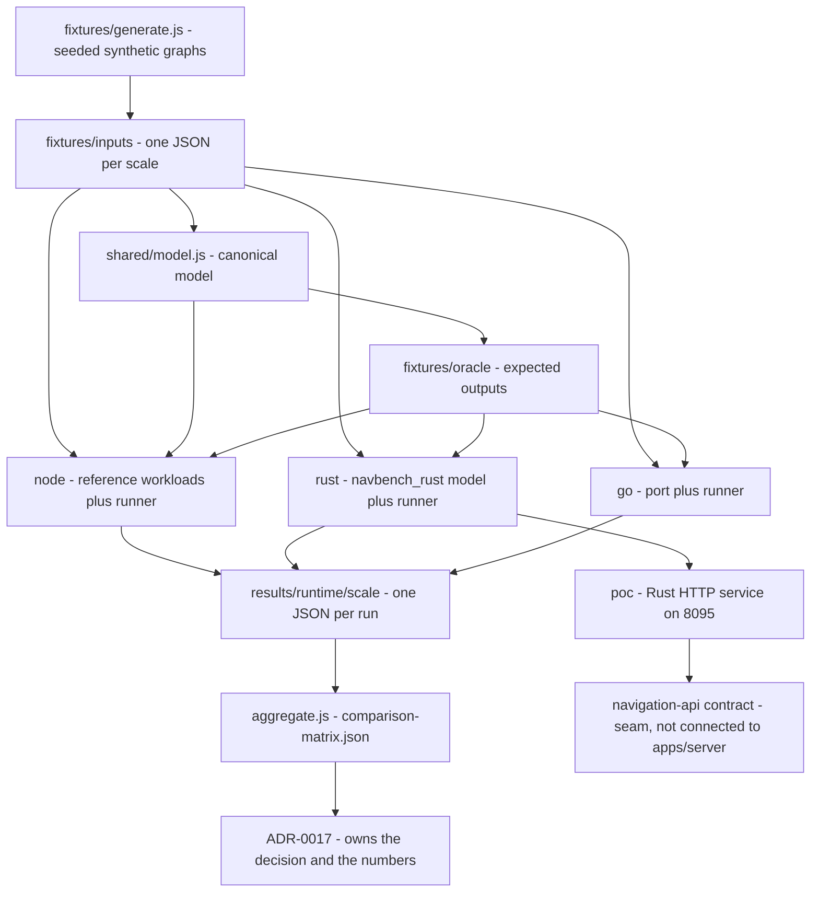
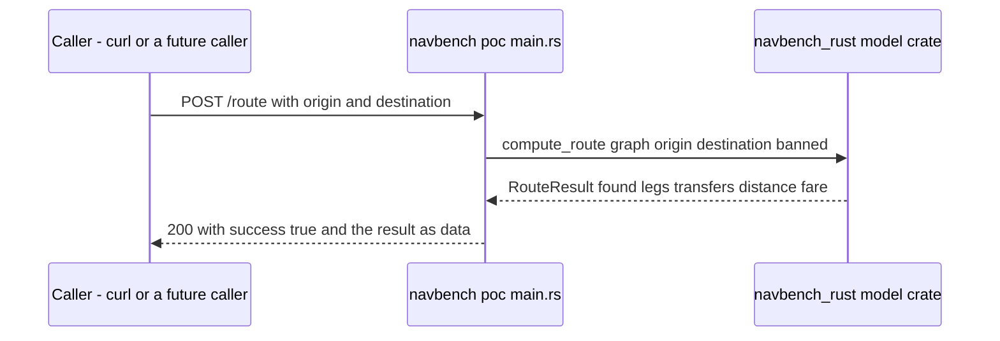

# Integration: navbench multi-runtime harness and the parity contract

`navbench/` is the evidence base for **ADR-0017** and for `specs/011-backend-language-migration/`. It is not a service. It is a standalone, hand-run comparison of **Node** (reference implementation), **Rust**, and **Go** on the three workloads a future server-side navigation engine would execute, plus a Rust proof-of-concept HTTP server that demonstrates the extraction seam. Nothing in `apps/` or `packages/` imports it, no Turbo task or CI step invokes it, and — stated plainly — **the shipped server exposes CRUD only and has no navigation endpoint** ([apps/server/src/api/index.ts](../../apps/server/src/api/index.ts#L14-L37), [Routing, navigation and trust are not implemented](../concepts/routing-and-navigation-scope.md)).

ADR-0017 owns the decision and the measured numbers. This page documents only what the harness code and its README actually contain, so that a reader changing the model, adding a port, or citing a latency figure knows what is being asserted and what is not.

## What is actually here

| Path | Role |
| --- | --- |
| `navbench/shared/model.js` | The canonical model: route-expanded graph, Dijkstra, per-leg fare, nearest-stop and snap geometry. Authoritative semantics for the three workloads ([navbench/shared/model.js](../../navbench/shared/model.js#L1-L15)). |
| `navbench/shared/workloads.js` | Workload names, the four profile names, default LTFRB fare params, the four scales, the result-schema factory, and the pass thresholds ([navbench/shared/workloads.js](../../navbench/shared/workloads.js#L8-L87)). |
| `navbench/fixtures/generate.js` | Deterministic seeded fixture generator; writes `fixtures/inputs/<scale>.json` ([navbench/fixtures/generate.js](../../navbench/fixtures/generate.js#L139-L163)). |
| `navbench/fixtures/inputs/` | Four checked-in graphs plus their request sets (`small`, `medium`, `large`, `rush`). |
| `navbench/oracle/generate-oracle.js` | Runs the canonical model to write `{input, expected_output}` pairs into `fixtures/oracle/` ([navbench/oracle/generate-oracle.js](../../navbench/oracle/generate-oracle.js#L187-L206)). |
| `navbench/fixtures/oracle/` | The checked-in parity oracle, one JSON array per scale. |
| `navbench/node/` | Node reference workloads, benchmark runner, and the Node parity test. Plain CommonJS JavaScript, no build step ([navbench/node/package.json](../../navbench/node/package.json#L1-L13)). |
| `navbench/rust/` | The `navbench_rust` crate: model port (`src/model.rs`), benchmark binary (`src/main.rs`), integration parity test (`tests/parity.rs`). |
| `navbench/go/` | The Go port: `model.go`, benchmark runner `main.go`, parity test `model_test.go` (module `komyuter/navbench/go`). |
| `navbench/poc/` | The `navbench-poc` Rust HTTP service — the seam, not a shipped endpoint. |
| `navbench/aggregate/aggregate.js` | Reads `results/<runtime>/<scale>/*.json` and writes `results/comparison-matrix.json`. |
| `navbench/results/` | Runner output. Never versioned; excluded from git and from this wiki's read boundary. |

Two things the table implies but are easy to miss: there is **no shared build entrypoint** (each runtime is invoked by hand in its own toolchain, documented only in the README quickstart), and the harness never touches Postgres — every graph comes from a checked-in JSON fixture ([navbench/README.md](../../navbench/README.md#L20-L34)).

## Where it sits in the repository

`navbench/` is deliberately outside the pnpm workspace. `pnpm-workspace.yaml` declares exactly two globs, `apps/*` and `packages/*`, so no harness toolchain is ever resolved by `pnpm install` or walked by a Turbo task ([pnpm-workspace.yaml](../../pnpm-workspace.yaml#L1-L3), [navbench/README.md](../../navbench/README.md#L16-L18)). The root ESLint flat config ignores `navbench/**` outright, so Rust, Go, and hand-written JS there can never fail `pnpm lint` ([eslint.config.mjs](../../eslint.config.mjs#L36-L46)). `.prettierignore` does **not** list `navbench/`, so its Markdown (including `navbench/README.md`) is inside the format gate — lint coverage is skipped, formatting is not ([.prettierignore](../../.prettierignore#L1-L19)). CI has no harness step at all: the `check` job runs install, format, lint, typecheck, the admin suite, and build, and nothing else ([.github/workflows/ci.yml](../../.github/workflows/ci.yml#L7-L39)). See [Workspace, build pipeline, lint and CI wiring](../architecture/workspace-build-and-ci.md) for the gates themselves.

Runner output is equally excluded. `navbench/results/` is listed in `.gitignore` and in `.openwikiignore`, so timings, the comparison matrix, and any environment notes are uncommitted artifacts that exist only on the machine that ran the harness ([.gitignore](../../.gitignore#L17-L24), [.openwikiignore](../../.openwikiignore#L21-L28)). ADR-0017 cites `navbench/results/comparison-matrix.json` and `navbench/results/env-notes.md` as its sources; those paths are not repository artifacts, which is why this page treats the ADR as the record of the numbers rather than as a pointer to files you can read.

## The canonical model

`navbench/shared/model.js` is the single source of navigational semantics that every runtime must reproduce. Its header states the rule that governs the whole harness: Rust and Go must reproduce its outputs exactly, and **any divergence is a port bug, never a reason to change this file** ([navbench/shared/model.js](../../navbench/shared/model.js#L1-L15)).

- **Graph shape** — `buildGraph` builds a route-expanded, direction-aware adjacency: stops are shared across routes; each stop records its `(routeId, dirId)` memberships; each direction polyline contributes ride edges between consecutive stops, and memberships of the same stop on different routes form transfer edges ([navbench/shared/model.js](../../navbench/shared/model.js#L36-L79)).
- **Costs** — ride edges cost `BASE_ON_BOARD + MARGINAL_PER_KM * km` with `13` and `1.8`, a transfer costs a flat `2.0` with zero distance, and a restricted segment is modelled by an effective `1e9` penalty constant that the model defines but the workload path implements as an explicit ban set instead ([navbench/shared/model.js](../../navbench/shared/model.js#L81-L84)). The internal cost is deliberately not the displayed fare — see ADR-0001 for why per-edge LTFRB would double-count the base fare; do not report the split as a defect.
- **Output shaping** — a route result carries `found`, `legs` (maximal runs on one route+direction, merged across segment seams), `transfers` recomputed as route changes after merging, `walk_m`, `distance_km` rounded to 3 decimals, and `fare` with a per-leg LTFRB breakdown ([navbench/shared/model.js](../../navbench/shared/model.js#L146-L188)). `legFare` applies `base_fare + max(0, km - base_dist_km) * rate_per_km` per leg and rounds each leg to cents; the total is the rounded sum ([navbench/shared/model.js](../../navbench/shared/model.js#L190-L201)).
- **`walk_m` is a constant.** `computeRoute` always returns `walk_m: 0` with the comment that origin and destination are snapped to stops and hail-ride walking is not modelled ([navbench/shared/model.js](../../navbench/shared/model.js#L184)). The field is part of the parity contract but currently carries no information.
- **Snapping lives outside this file.** `model.js` exports only `nearestStop` for snap-to-stop routing — a linear scan over all stops with a 50 m tolerance in kilometres, returning `null` outside it ([navbench/shared/model.js](../../navbench/shared/model.js#L380-L393)). The polyline geometry itself (seed from the nearest vertex, then project onto each segment, reject beyond tolerance) is implemented four times: in the oracle generator and in each runtime's own module ([navbench/oracle/generate-oracle.js](../../navbench/oracle/generate-oracle.js#L139-L185), [navbench/node/src/workloads.js](../../navbench/node/src/workloads.js#L78-L120), [navbench/rust/src/model.rs](../../navbench/rust/src/model.rs#L474-L538), [navbench/go/model.go](../../navbench/go/model.go#L418-L464)). The oracle's copy is the reference the others are compared against, but there is no single canonical snapping function to change.
- **`profile` is inert.** `computeRoute` destructures `profile` from its options and never reads it; the four profile names exist only as data, and every generated request uses `"balanced"` ([navbench/shared/model.js](../../navbench/shared/model.js#L96-L107), [navbench/fixtures/generate.js](../../navbench/fixtures/generate.js#L120-L137)). The "multi-criteria Dijkstra" label describes intent, not behaviour: today there is one cost function and no profile weighting.

Two implementation details matter to anyone editing or re-porting the model:

1. **The Dijkstra search is capped.** After 2,000,000 popped nodes each runtime returns "no path", and `computeRoute` turns that into `{ found: false }` ([navbench/shared/model.js](../../navbench/shared/model.js#L283-L290), [navbench/rust/src/model.rs](../../navbench/rust/src/model.rs#L289-L297), [navbench/go/model.go](../../navbench/go/model.go#L320-L331)). A graph so large that the cap fires is therefore indistinguishable, in both the oracle and the benchmark result, from a genuinely disconnected origin/destination pair.
2. **Tie-breaking is implemented differently in each runtime.** The Node min-heap orders on `(cost, insertion sequence)`, while Rust and Go order on `(cost, FNV-1a hash of the "stop|route|dir" key)` ([navbench/shared/model.js](../../navbench/shared/model.js#L203-L254), [navbench/rust/src/model.rs](../../navbench/rust/src/model.rs#L177-L186), [navbench/go/model.go](../../navbench/go/model.go#L160-L181)). The Node file's own header comment claims ties break lexicographically on `(routeId, stopId)`, which no implementation does ([navbench/shared/model.js](../../navbench/shared/model.js#L11-L14)). The ports converge anyway because the contract compares aggregate invariants, not the chosen leg list — but a change that starts caring about *which* equal-cost path wins would have to reconcile all three.

The Node reference also rebuilds the adjacency more often than the ports do: `computeRoute` calls `buildGraph` and discards the result, then each `dijkstraSegment` builds it again ([navbench/shared/model.js](../../navbench/shared/model.js#L96-L135)), whereas `compute_route` in Rust and `ComputeRoute` in Go build once per call ([navbench/rust/src/model.rs](../../navbench/rust/src/model.rs#L397-L413), [navbench/go/model.go](../../navbench/go/model.go#L229-L242)). The Node baseline is a plain-JS reference, not a tuned implementation, which is context for any latency comparison drawn from it.

## The three workloads

`navbench/shared/workloads.js` names three workloads and the four fixture scales ([navbench/shared/workloads.js](../../navbench/shared/workloads.js#L8-L22)). What each timed query actually does:

| `workload_id` | Timed operation | Where |
| --- | --- | --- |
| `route_optimization` | One `computeRoute` for the request's origin/destination | [navbench/node/src/workloads.js](../../navbench/node/src/workloads.js#L9-L22) |
| `polyline_snapping` | One scan of **all** direction polylines at 50 m tolerance, keeping the closest result and breaking distance ties by `direction_id` | [navbench/node/src/workloads.js](../../navbench/node/src/workloads.js#L52-L120) |
| `detour_pathfinding` | Compute the base route, derive a banned segment, recompute | [navbench/node/src/workloads.js](../../navbench/node/src/workloads.js#L24-L50) |

**The detour workload is edge removal, not virtual nodes.** All three runtimes implement the same recipe: take the base route, take the first ride edge of its first leg, form the canonical `a|b` key with the two stop ids in lexicographic order, ban it, and re-run Dijkstra ([navbench/oracle/generate-oracle.js](../../navbench/oracle/generate-oracle.js#L56-L84), [navbench/rust/src/main.rs](../../navbench/rust/src/main.rs#L146-L168), [navbench/go/main.go](../../navbench/go/main.go#L100-L111)). The canonical model does contain a via-waypoint chain (`detourWaypoints`, forcing a stop to be visited by running Dijkstra segment by segment), but every fixture, oracle case, and runner passes an empty array ([navbench/shared/model.js](../../navbench/shared/model.js#L115-L145), [navbench/node/src/run.js](../../navbench/node/src/run.js#L44-L59)). Nothing in the harness creates a request-time virtual node or a board edge, so the harness does **not** evidence the virtual-node mechanism the navigation-api contract describes ([specs/011-backend-language-migration/contracts/navigation-api.md](../../specs/011-backend-language-migration/contracts/navigation-api.md#L41-L49)). It also means a detour query costs roughly two routing passes, which is visible in every detour latency figure.

### Measurement protocol

The three runners share one protocol, which is what makes their JSON aggregable ([navbench/node/src/run.js](../../navbench/node/src/run.js#L19-L24), [navbench/rust/src/main.rs](../../navbench/rust/src/main.rs#L10-L12), [navbench/go/main.go](../../navbench/go/main.go#L16-L31)):

- **60 sampled requests** per workload (`SAMPLE`), yielding **120 snap points** (each request's origin and destination) for `polyline_snapping`.
- **Iterations by scale**: `small` 100, `medium` 40, `large` 20, `rush` 20. Queries cycle through the sample, so the same requests are repeated.
- **20 warmup route queries** before timing, excluded from the statistics.
- **Per-query wall clock**, with p50/p90/p99 taken from the sorted sample and throughput computed over the measured window.
- **A 5,000 ms per-query budget.** A query slower than that is counted as a failure rather than aborting the run ([navbench/node/src/run.js](../../navbench/node/src/run.js#L78-L113)).

Two deviations from that protocol are worth knowing before comparing rows in a matrix. The Go runner emits `"warmup_queries":20` but performs no warmup loop at all, and it computes throughput from the success counter rather than from all queries ([navbench/go/main.go](../../navbench/go/main.go#L139-L150), [navbench/go/main.go](../../navbench/go/main.go#L160-L185)). Both are differences from the Node and Rust runners, not from the workloads.

## Fixtures and the parity oracle

`fixtures/generate.js` produces all four graphs from one seeded Mulberry32 PRNG, around a fixed centre of `{ lng: 122.55, lat: 10.7 }` (Iloilo City Proper). Each scale sets route count, stops-per-route range, and a crosspoint probability that decides how often a new stop reuses an existing one — which is how transfer points appear at all ([navbench/fixtures/generate.js](../../navbench/fixtures/generate.js#L19-L29), [navbench/fixtures/generate.js](../../navbench/fixtures/generate.js#L31-L38), [navbench/fixtures/generate.js](../../navbench/fixtures/generate.js#L50-L100)):

| Scale | Routes | Stops per route | Crosspoint | Seed | Requests |
| --- | --- | --- | --- | --- | --- |
| `small` | 8 | 6–12 | 0.15 | 1337 | 80 |
| `medium` | 30 | 10–20 | 0.25 | 2337 | 150 |
| `large` | 90 | 12–30 | 0.30 | 3337 | 200 |
| `rush` | 120 (peak flag) | 12–30 | 0.35 | 4337 | 200 |

Every route gets two directions, and every route carries the same LTFRB fare config `{ base_fare: 13, base_dist_km: 4, rate_per_km: 1.8 }` ([navbench/fixtures/generate.js](../../navbench/fixtures/generate.js#L86-L109)). Two details cause confusion if unread: the JSON inside each file records `graph.scale` as `"baseline"` or `"stretch"` (only `rush` is stretch), *not* the file name, and the seed recorded in each file is `1337` plus that scale's offset (1337 / 2337 / 3337 / 4337) rather than the single `1337` the benchmark-format contract sketches ([navbench/fixtures/generate.js](../../navbench/fixtures/generate.js#L111-L117), [specs/011-backend-language-migration/contracts/benchmark-format.md](../../specs/011-backend-language-migration/contracts/benchmark-format.md#L20)). Scale selection everywhere else — runner iterations, oracle file names, parity tests — keys off the file name `small|medium|large|rush`.

The return direction is where the fixture stops matching the intent its own comment states. The generator's comment cites ADR-0008 and says direction 2 is "a distinct order", but the code sets `stopIds: [...stopIds].reverse()` and reverses the polyline as well ([navbench/fixtures/generate.js](../../navbench/fixtures/generate.js#L87-L99)). For these synthetic fixtures that is harmless — nothing consults a persisted polyline — but it means the harness never exercises the direction-integrity case ADR-0008 exists for, so do not cite `navbench` fixtures as evidence about real Direction ordering.

`oracle/generate-oracle.js` is the parity oracle's only producer. Per scale it emits, into `fixtures/oracle/<scale>.json`:

- up to 12 `route_optimization` cases sampled from the request set with a strided filter, each carrying the request as `input` and the canonical result as `expected_output`;
- for each found route, one `detour_pathfinding` case whose input records the restricted segment id;
- one `polyline_snapping` case per sampled polyline vertex across every direction, with the query point offset roughly 9 m east of the vertex and a **30 m** tolerance, and `null` as the expected output when nothing is in range ([navbench/oracle/generate-oracle.js](../../navbench/oracle/generate-oracle.js#L27-L132), [navbench/oracle/generate-oracle.js](../../navbench/oracle/generate-oracle.js#L139-L170)).

**The oracle is anchored to `navbench/shared/model.js`, not to the shipped shared package.** The specs and the parity contract describe expected outputs as generated from the canonical `@komyuter/shared` route/fare logic ([specs/011-backend-language-migration/contracts/workloads.md](../../specs/011-backend-language-migration/contracts/workloads.md#L53-L58)), but the generator imports `../shared/model.js`, and `packages/shared` exports only types and Zod schemas — it contains no fare or routing logic at all ([navbench/oracle/generate-oracle.js](../../navbench/oracle/generate-oracle.js#L10-L15), [packages/shared/src/index.ts](../../packages/shared/src/index.ts#L1-L11)). Practically: passing parity proves a port matches the **harness model**; it does not prove parity with anything the application ships, because no such implementation exists yet.

## The parity contract

The contract is short and is stated identically in the README and in each runtime's test: a runtime must reproduce the oracle's **navigational invariants** exactly ([navbench/README.md](../../navbench/README.md#L73-L79)).

| Compared | Fields |
| --- | --- |
| Route and detour results | `found`, then `distance_km`, `transfers`, `walk_m`, `fare.total`; a not-found expectation asserts only `found: false` |
| Snap results | `direction_id`, `position_on_polyline.lng`, `position_on_polyline.lat`, `distance_m`, or `null` |
| **Deliberately excluded** | the leg-by-leg decomposition (`legs`, and the per-leg `fare.legs` array) among equal-cost alternative paths |

The exclusion is not an oversight, it is the reason the invariant set is portable: equal-cost paths can differ in decomposition, and the three implementations break cost ties by different mechanisms (see above). Implementation status: the Node test asserts exactly those fields and nothing else; the Rust integration test normalizes numbers through `as_f64` so JavaScript `0` and Rust `0.0` compare equal; the Go test asserts the same five route fields plus the three snap fields ([navbench/node/tests/parity.test.js](../../navbench/node/tests/parity.test.js#L26-L74), [navbench/rust/tests/parity.rs](../../navbench/rust/tests/parity.rs#L61-L92), [navbench/go/model_test.go](../../navbench/go/model_test.go#L59-L86)).

One coverage gap is worth stating explicitly, because it is easy to mistake for full snap parity: **oracle snap cases are single-direction**, while the timed `polyline_snapping` workload scans every direction and picks a winner. The Node test therefore mirrors a single-direction snap and compares that, with a comment saying so; the Rust test resolves the named direction and calls `snap_direction`; the Go test does the same ([navbench/oracle/generate-oracle.js](../../navbench/oracle/generate-oracle.js#L108-L127), [navbench/node/tests/parity.test.js](../../navbench/node/tests/parity.test.js#L93-L107), [navbench/rust/tests/parity.rs](../../navbench/rust/tests/parity.rs#L144-L161), [navbench/go/model_test.go](../../navbench/go/model_test.go#L102-L109)). The multi-candidate selection logic — closest across candidates, tie-break by direction id, 50 m tolerance rather than the oracle's 30 m — is exercised by the benchmark, not by the oracle, so it is the part of the snapping path whose cross-runtime agreement is least defended.

Both snap tolerances sit inside the 25–50 m range the workload contract fixes, and the tolerance is baked into each caller rather than passed through the workload definitions ([specs/011-backend-language-migration/contracts/workloads.md](../../specs/011-backend-language-migration/contracts/workloads.md#L13-L36)).

## Pass criteria and the results pipeline

The decision rule lives in `navbench/shared/workloads.js` and the README: a runtime **passes** when `p90 ≤ 500 ms` **and** `success_rate ≥ 0.95` on every scale, and the README points at the matrix JSON for the breakdown and at `docs/adr/0017` for the decision ([navbench/shared/workloads.js](../../navbench/shared/workloads.js#L68-L79), [navbench/README.md](../../navbench/README.md#L66-L71)).

`success_rate` is a documented deviation, not a literal `found / total`: it counts **completion within the runner's budget**, where a valid `not-found` answer counts as a success because an empty result is a correct product output ([navbench/shared/workloads.js](../../navbench/shared/workloads.js#L68-L77)). The definition interacts with the model in a way worth knowing: an origin or destination farther than the 50 m snap tolerance from any stop returns `{ found: false }`, which the metric then scores as a successful completion rather than a missing route ([navbench/shared/model.js](../../navbench/shared/model.js#L380-L393), [navbench/node/src/run.js](../../navbench/node/src/run.js#L96-L101)).

The aggregator consumes one directory per runtime and scale, and takes the lexicographically last JSON in each — effectively the newest by timestamp in the filename ([navbench/aggregate/aggregate.js](../../navbench/aggregate/aggregate.js#L15-L45)):

| Runtime | Written by | Path |
| --- | --- | --- |
| Node | `node src/run.js`, all four scales per invocation | `results/node/<scale>/node-baseline-<ts>.json` ([navbench/node/src/run.js](../../navbench/node/src/run.js#L168-L172)) |
| Rust | `./target/release/navbench_rust <scale>` | `results/rust/<scale>/rust-<ts>.json` ([navbench/rust/src/main.rs](../../navbench/rust/src/main.rs#L207-L219)) |
| Go | `go run . <scale>` | `results/go/<scale>/go-<ts>.json` ([navbench/go/main.go](../../navbench/go/main.go#L187-L191)) |

`aggregate.js` writes `results/comparison-matrix.json` containing `generated_at`, the two thresholds echoed as data, and a `matrix[runtime][scale]` entry per workload with `p90_ms`, `qps`, `success_rate`, and a `pass_latency` boolean; a runtime/scale pair with no result file is marked `{ status: "not_measured" }` rather than omitted ([navbench/aggregate/aggregate.js](../../navbench/aggregate/aggregate.js#L47-L108)). **Only the latency half is evaluated in code** — no field computes a `success_rate ≥ 0.95` verdict, and nothing writes an overall pass/fail for a runtime. Applying the full decision rule is a reading of the matrix by a human, which is what ADR-0017 records.

Three reproducibility caveats come from the result payloads themselves, and all three make rows of a matrix non-comparable if taken at face value:

- `peak_rss_mb` is a real sampled value only in Node; Rust and Go emit a hard-coded `0.0` ([navbench/node/src/run.js](../../navbench/node/src/run.js#L61-L76), [navbench/rust/src/main.rs](../../navbench/rust/src/main.rs#L181-L204), [navbench/go/main.go](../../navbench/go/main.go#L139-L150)). Memory behaviour for the native runtimes is *not* measured by this harness.
- `environment.cpu` is the literal string `"<from env>"` outside Node, with `mem_gb: 16` hard-coded in all three ([navbench/rust/src/main.rs](../../navbench/rust/src/main.rs#L181-L188), [navbench/go/main.go](../../navbench/go/main.go#L172-L176)).
- `runtime.version` is the toolchain version for Node (`process.version`) and Go (`runtime.Version()`), but the **crate version** (`CARGO_PKG_VERSION`, i.e. `0.1.0`) for Rust, and `graph.hash` is an SHA-1 prefix in Node, a 12-hex FNV-1a digest in Rust, and the literal string `"GOHARNESS"` in Go — not the `sha256` the benchmark-format contract specifies ([navbench/rust/src/main.rs](../../navbench/rust/src/main.rs#L170-L205), [navbench/go/main.go](../../navbench/go/main.go#L172-L185), [navbench/node/src/run.js](../../navbench/node/src/run.js#L124-L135), [specs/011-backend-language-migration/contracts/benchmark-format.md](../../specs/011-backend-language-migration/contracts/benchmark-format.md#L20)). Any tool that tries to verify "same graph, same toolchain" from the JSON alone will fail; record the toolchains manually, as the README's prerequisites and ADR-0017 both do.

## Running it

Each runtime is invoked directly; nothing wraps them. The README quickstart is the only documented procedure ([navbench/README.md](../../navbench/README.md#L36-L64)):

```bash
# 1. Regenerate deterministic inputs + parity oracle (only if the model changed)
node fixtures/generate.js
node oracle/generate-oracle.js

# 2. Per-runtime parity (must be green before trusting any timing)
cd node && node --test tests/parity.test.js        # 4/4
cd ../rust && cargo test --release --test parity    # all scales

# 3. Benchmarks (one JSON per runtime+scale under results/)
cd node && node src/run.js                          # all scales
cd ../rust && for s in small medium large rush; do ./target/release/navbench_rust "$s"; done
cd ../go && go run . small                        # measured (go1.27.0)

# 4. Comparison matrix
node aggregate/aggregate.js      # -> results/comparison-matrix.json

# 5. PoC navigation service (US3)
cd poc && cargo run --release -- small
```

Node (≥ 22, tested on 24.12), a Rust toolchain (tested on 1.92), and Go (tested on go1.27.0 windows/amd64) must all be present. The quickstart lists parity commands for Node and Rust only; the Go port's parity test exists in the same package and runs with `go test ./...` from `navbench/go` ([navbench/go/model_test.go](../../navbench/go/model_test.go#L1-L4)). The order is not decorative — the README states parity must be green before any timing is trusted, because a divergence means two runtimes are not executing the same operation.



The harness pipeline: one canonical model produces both the oracle and the Node baseline; the ports are checked against the oracle, timed, and aggregated into the matrix the ADR reads.

## The PoC seam

`navbench/poc` is the only HTTP navigation service that exists anywhere in this repository. It is a minimal Rust server (std socket handling, `serde_json` for bodies) that loads one fixture graph at startup and serves four endpoints — `GET /health`, `POST /route`, `POST /detour`, `POST /snap` — on `127.0.0.1:8095`, with the scale defaulting to `small` ([navbench/poc/src/main.rs](../../navbench/poc/src/main.rs#L1-L16), [navbench/poc/src/main.rs](../../navbench/poc/src/main.rs#L159-L167)):

| Endpoint | Body | Behaviour |
| --- | --- | --- |
| `GET /health` | — | `{"ok": true}` |
| `POST /route` | `{origin, destination, restricted?}` | `compute_route` with the optional banned segment list |
| `POST /detour` | `{origin, destination, restricted?}` | computes the base route, adds the same first-ride-edge ban the detour workload uses, re-routes |
| `POST /snap` | `{point, tolerance_m?}` | multi-candidate `snap_point`, tolerance defaulting to 50 m |

Two properties make it a seam rather than a service. First, it **shares the parity-verified crate**: its `Cargo.toml` depends on `navbench_rust` by path, so the PoC and the harness cannot drift into two implementations of the same routing code ([navbench/poc/Cargo.toml](../../navbench/poc/Cargo.toml#L6-L12)). Second, its responses use the repository's envelope convention — `{ success: true, data }` or `{ success: false, error: { code } }` — which is the shape the navigation-api contract and the admin API both use ([navbench/poc/src/main.rs](../../navbench/poc/src/main.rs#L112-L117)).

It is also deliberately unfinished, and its limits are the real content of the seam:

- it is **not connected to `apps/server`** in any direction — no route registration, no client, no proxy;
- it is **single-threaded**: the accept loop handles one connection at a time and closes it (`Connection: close`), so its throughput is not the harness's throughput and certainly not a concurrency finding ([navbench/poc/src/main.rs](../../navbench/poc/src/main.rs#L119-L157));
- it has **no auth, no database and no persistence**; the graph is one checked-in fixture file read from `CARGO_MANIFEST_DIR`;
- its request shape is a **subset** of the navigation-api contract: no `version`, no `request_id`, no `profile`, and no `detour_scope_id`, so a `profile` sent by a future caller is simply not part of the accepted body ([specs/011-backend-language-migration/contracts/navigation-api.md](../../specs/011-backend-language-migration/contracts/navigation-api.md#L9-L20), [navbench/poc/src/main.rs](../../navbench/poc/src/main.rs#L23-L36)).



The PoC request path: one process, one fixture, one shared model crate, no persistence and no auth.

## What this page does not decide

The runtime choice, the migration question, and the measured latency table belong to **ADR-0017** — read it there, including the honest reading of which runtime wins which workload. The spec set under `specs/011-backend-language-migration/` owns the workload definitions, thresholds, and the future navigation-service contract; the PoC is a demonstration of that seam and not evidence that it is populated. The wiki's authority ladder puts both above code, and above this page.

What this page does assert is the negative: the shipping server is CRUD-only, with no pathfinding route, no graph, and no caller of `navbench` anywhere ([apps/server/src/api/index.ts](../../apps/server/src/api/index.ts#L14-L37), [Routing, navigation and trust are not implemented](../concepts/routing-and-navigation-scope.md)). Treat `navbench/` as offline evidence plus an unimplemented seam — never as a running service, and never as a source of production behaviour.
