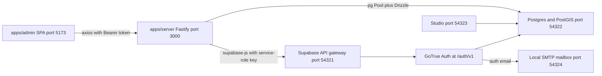
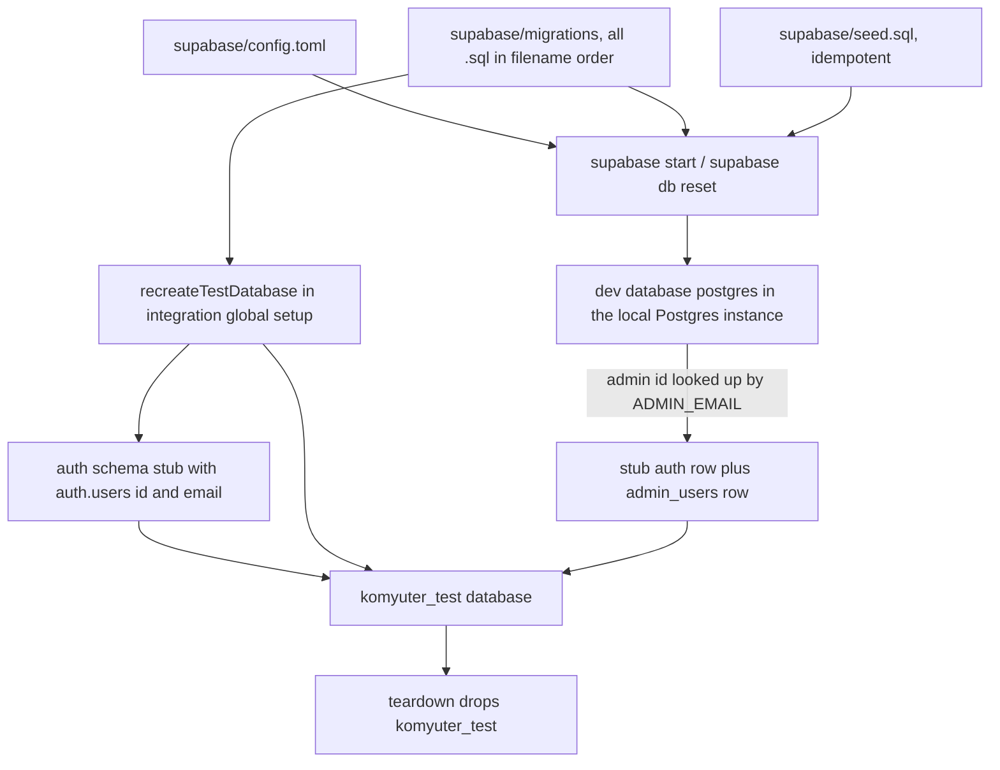

# Integration: local Supabase stack, migrations and seed

Komyuter has no hosted database and no deployment configuration for one. Postgres, the PostGIS extension and the identity provider (GoTrue) are all supplied by a **local Supabase Docker stack** that the Supabase CLI starts from [supabase/config.toml](../../supabase/config.toml); `supabase start` is the only way the backend gets a database, and every credential in `apps/server/.env` comes from `supabase status`. This page covers how that stack is configured and operated, what a fresh database contains after the seed, and how the integration suite builds a second, disposable database next to it.

The semantics of the tables themselves — columns, cascades, soft deletes, invariants — belong to [Persistent data model and migrations](../architecture/data-model.md) and are not repeated here. Where the stack sits among the workspace's components is [System overview](../architecture/system-overview.md); the variables the server reads are [Configuration, environment variables and secrets](../operations/configuration-and-secrets.md); the admin session flow is [Admin authentication and session](../workflows/admin-authentication-and-session.md).

## What runs, and which surfaces the application actually uses

| Surface (config key)                                     | Local address                                     | Who uses it                                                                                                                                                       |
| -------------------------------------------------------- | ------------------------------------------------- | ----------------------------------------------------------------------------------------------------------------------------------------------------------------- |
| Postgres + PostGIS (`[db]`)                              | `127.0.0.1:54322`, database `postgres`, major version 17 | `apps/server` over `DATABASE_URL` with `pg` + Drizzle; the integration harness directly                                                                     |
| API gateway (`[api]`)                                    | `127.0.0.1:54321`                                 | `apps/server` over `SUPABASE_URL`, but only for the Auth routes — the PostgREST/Data API surface is not an access path (see below)                                |
| Auth / GoTrue (`[auth]`)                                 | `{SUPABASE_URL}/auth/v1`                          | Server-side only, with the service-role key: `signInWithPassword`, `auth.getUser(token)`, `auth.admin.createUser`, `auth.admin.signOut`                          |
| Studio (`[studio]`)                                      | `127.0.0.1:54323`                                 | Human inspection; nothing in the repository calls it                                                                                                             |
| Local SMTP mailbox (`[local_smtp]`)                      | `127.0.0.1:54324`                                 | Catches Auth email (confirmation, recovery) instead of sending it — the config comments say mail is monitored, not delivered                                     |
| Analytics (`[analytics]`)                                | `127.0.0.1:54327`, `backend = "postgres"`         | Enabled, unused                                                                                                                                                  |
| Storage, Realtime, Edge runtime (`[storage]`, `[realtime]`, `[edge_runtime]`) | enabled                    | Enabled, unused: no bucket is configured, nothing subscribes, and `supabase/` contains no `functions/` directory                                                 |
| Shadow DB / connection pooler                            | `54320` / `54329`                                 | Shadow database only for `supabase db diff`; the pooler is disabled                                                                                              |



The two surfaces the application uses, Postgres and the Auth gateway, against the rest of the stack, which only humans and the CLI touch.

**The browser never reaches the stack.** `apps/server` is the only workspace package with a Supabase dependency: [src/index.ts](../../apps/server/src/index.ts) builds one service-role client through [createSupabaseAdmin](../../apps/server/src/config/supabase.ts) (`persistSession: false`, `autoRefreshToken: false`) and one `pg` pool wrapped in Drizzle from `env.DATABASE_URL`. `apps/admin` has no Supabase or Postgres dependency at all, so an operator action always crosses the Fastify API.

<!-- openwiki: broken internal link [../../supabase/migrations] file "../../supabase/migrations" does not exist. Fix the href or restore the target, then delete this comment. -->
**The Data API is not a data path either.** `[api] schemas = ["public", "graphql_public"]` lists what the gateway *may* expose, but `auto_expose_new_tables` is left unset — the comment above it documents that new entities are then **not** auto-exposed to `anon`/`authenticated`/`service_role` — and no migration under [supabase/migrations](../../supabase/migrations) issues a `GRANT` or a row-level-security policy. `public` tables are therefore read and written over the direct Postgres connection that the server owns, and the stack provides no second way in.

## Lifecycle: what `start`, `reset` and `stop` do

`[db.migrations] enabled = true` and `[db.seed] enabled = true` with `sql_paths = ["./seed.sql"]` are the two switches that make the CLI a delivery mechanism: `supabase start` (first boot) and `supabase db reset` apply every migration file in `supabase/migrations/` in filename order, then run the seed. The server README states the same contract from the operator's side — first start provisions the admin account and the default fare configuration, "reset to a clean state anytime: `supabase db reset`", and `supabase stop` + `start` leaves the data in place (validation scenario 11 exists to prove exactly that).

`supabase db reset` is destructive by design: it rebuilds the schema and restores **only** what the seed inserts, so a plotted dataset is gone and only the admin identity, the admin grant and the `default` fare configuration come back. The dataset export (`GET /api/admin/export/dataset`) is the durable copy; the dev database is a working surface.

No workspace script wraps any of this: `package.json` and `turbo.json` contain no `supabase` command, so `supabase start` / `status` / `db reset` are manual CLI invocations with Docker running.



Two delivery paths reach a database: the CLI applies migrations and then the seed to the dev database, while the integration harness rebuilds `komyuter_test` from the same migration files with a hand-made auth stub and no seed.

## The seed: what a fresh database contains

[supabase/seed.sql](../../supabase/seed.sql) is **idempotent**: every statement ends in `ON CONFLICT ... DO NOTHING` (`auth.users` on `id`, `auth.identities` on `(provider_id, provider)`, `admin_users` on `user_id`, `fare_configs` on `fare_config_id`), which the file's own header states makes re-running it after a partial reset safe. It performs three inserts and nothing else.

### 1. The admin identity in local Auth

- `auth.users`: `instance_id` all-zeros, `id = 00000000-0000-0000-0000-000000000001`, `aud`/`role` `authenticated`, email `admin@komyuter.ph`, password hashed with `crypt('komyuter-admin-dev', gen_salt('bf'))` — pgcrypto bcrypt, chosen to match GoTrue's own hashing — `email_confirmed_at = now()`, app metadata `{"provider":"email","providers":["email"]}` and user metadata `{"full_name":"Admin Komyuter"}`.
- `auth.identities`: provider `email`, `provider_id = 00000000-0000-0000-0000-000000000002`, `identity_data` carrying `sub`, `email` and `email_verified: true`.
- The fixed UUIDs are deliberate: the grant below references the user id as a literal, so insertion order between the auth rows and the grant cannot matter.

Two consequences are easy to miss. Because the row is inserted already confirmed, the stack's `enable_confirmations = true` never blocks the seeded admin — and `full_name` is what the login and `/api/auth/me` responses report as `name` (the integration suite asserts the literal `"Admin Komyuter"`).

### 2. The admin grant

```sql
insert into admin_users (user_id)
values ('00000000-0000-0000-0000-000000000001')
on conflict (user_id) do nothing;
```

That single row is the whole authorization state of a fresh database. Membership in `admin_users` is the one rule the login route, `/api/auth/me` and the `/api/admin` guard all consult through `isAdminUserId` ([apps/server/src/api/auth.ts](../../apps/server/src/api/auth.ts#L26-L53)), which is why the seed grants admin by inserting an auth id rather than by setting a claim. Deleting the auth user revokes the grant through the foreign key described below.

### 3. The default fare configuration

<!-- openwiki: broken internal link [../concepts/fares-and-fare-configurations.md] file "../concepts/fares-and-fare-configurations.md" does not exist. Fix the href or restore the target, then delete this comment. -->
One row: `fare_config_id = 'default'`, label `LTFRB Default Fare`, base fare `13.00`, base distance `4.00 km`, `1.80` per km, 20 % student and senior discounts, `is_default = true`, `is_active = true`. It satisfies the application-level "exactly one default" rule from the first reset, and it is what makes the admin usable without a manual setup step: the New Route dialog pre-selects the configuration whose `is_default` is true, and it blocks route creation entirely while no fare configuration exists ("No fare config exists yet — create one in Fares first"). Fare semantics live on [Fares and fare configurations](../concepts/fares-and-fare-configurations.md).

The seed inserts no routes, stops, directions, detours or restrictions: a freshly reset database exports an empty dataset and `/api/status` reports zero counts with `dataset_updated_at: null`.

### The committed dev password is not a secret and not a defect

The seed's password, `komyuter-admin-dev`, is committed in plain text because **the Supabase CLI executes seed files verbatim — there is no env interpolation**, as the file header and [apps/server/.env.example](../../apps/server/.env.example) both say. Treat it as a documented local fixture, not as configuration to copy elsewhere and not as a bug: `.env.example` mirrors it, notes that it must match `supabase/seed.sql`, and instructs changing it before any shared or production deployment.

The same pair is also the server's `DEV_CREDENTIAL` constant: `/api/auth/login` refuses it unless `ALLOW_DEV_CREDENTIAL=true` (default `false`, and the example file keeps `false` with a warning). That gate lives in the Fastify route, not in GoTrue, so minting a token directly from the Auth endpoint — the path the server README documents for manual API calls (`POST {SUPABASE_URL}/auth/v1/token?grant_type=password`) — is unaffected by it.

## Migrations in this stack, and the recorded journal drift

How migrations are *authored* (Drizzle `schema.ts` as source of truth, `drizzle-kit generate` writing into `supabase/migrations/`, hand-written files that drizzle-kit cannot express) is documented on [Persistent data model and migrations](../architecture/data-model.md). What matters operationally here is how they reach a database and what can go wrong.

### The `auth.users` foreign key (migration 0002)

[0002_admin_users_auth_fk.sql](../../supabase/migrations/0002_admin_users_auth_fk.sql) adds the project's only cross-schema constraint:

```sql
alter table "public"."admin_users"
  add constraint "admin_users_user_id_auth_users_id_fk"
  foreign key ("user_id") references "auth"."users" ("id") on delete cascade;
```

It is hand-written because the Drizzle declaration of `admin_users` is a bare `uuid` primary key with no reference ([apps/server/src/db/schema.ts](../../apps/server/src/db/schema.ts#L60-L62)), so nothing in the generated SQL would produce it. Two behaviors follow from the `ON DELETE CASCADE`:

- **Deleting an auth user revokes admin access.** There is no `disabled` column on `admin_users`; deprovisioning is deleting the `auth.users` row. The integration harness relies on this cascade when it sweeps stray test users from the main database.
- **A grant cannot be inserted for an id that has no auth row.** Anything that inserts into `admin_users` must first ensure the corresponding `auth.users` row exists — the constraint, not application code, enforces that.

The integration harness stubs that dependency explicitly (below) precisely because the test database has no real GoTrue tables.

### Journal drift (recorded in docs/DEVIATIONS.md, not newly discovered)

`supabase/migrations/meta/_journal.json` is drizzle-kit's own ledger. It currently holds a single entry, `0001_hard_roland_deschain`; `0000_create_postgis.sql` and the hand-written `0002`–`0005` exist on disk with no ledger entry. **[Appendix A1 of docs/DEVIATIONS.md](../../docs/DEVIATIONS.md)** records this drift together with its consequence: a plain `supabase db reset` therefore applies only `0000` + `0001`, leaving the applied database behind the code and the Drizzle schema — the `admin_users → auth.users` foreign key and `directions.direction_kind` absent — and the recorded fix is to journal and re-run those files through the Supabase CLI / drizzle-kit before relying on an applied schema.

Treat that as open, tracked work: verify the foreign key and the `direction_kind` column exist before trusting a reset-built dev database, since direction reads and writes in the API name that column. Note also that the integration path is not exposed to the drift — it replays every `*.sql` file from disk — which is exactly why a migration can pass the suite while a CLI-built database stays behind.

## Dev database vs `komyuter_test`

The integration suite deliberately does not test against the database the admin dashboard reads.

| | Dev database | `komyuter_test` |
| --- | --- | --- |
| Created by | `supabase start` / `supabase db reset` | `recreateTestDatabase()` in the integration global setup |
| Address | `DATABASE_URL` (`.../postgres` on port 54322) | the same URL with its pathname replaced by `/komyuter_test` — derived, not configured |
| Schema source | migrations applied by the CLI, in filename order | **every** `supabase/migrations/*.sql` read from disk, sorted, replayed onto a clean database each run |
| `auth` schema | real GoTrue tables | hand-made stub: `auth.users (id uuid primary key, email text)` |
| `supabase/seed.sql` | runs after migrations | never runs |
| Identity | the seeded admin plus any user created through the service-role admin API | only the admin id copied over from the dev database, plus generated test admins |
| Lifetime | survives `stop`/`start`; wiped by `db reset` | dropped at teardown; nothing survives a run |
| Written by | the running server | the integration suite only |

The lifecycle, in order ([test-db.ts](../../apps/server/tests/integration/test-db.ts), [helpers.ts](../../apps/server/tests/integration/helpers.ts), [global-setup.ts](../../apps/server/tests/integration/global-setup.ts)):

1. **Recreate.** A maintenance connection to the *dev* database runs `drop database if exists komyuter_test with (force)` and `create database komyuter_test` — `DROP DATABASE` cannot run inside a transaction or against the target database, and the maintenance connection must not be the test database.
2. **Auth stub.** The test database gets `create schema auth` and a minimal `auth.users (id, email)` table *before* the replay, so migration `0002`'s foreign key resolves. The test database has no GoTrue: real auth users are always created and cleaned in the main database, which is where the auth service keeps its schema.
3. **Replay.** Every `*.sql` file in `supabase/migrations`, filtered and sorted by filename, is executed in one pass. The Supabase CLI and drizzle-kit's journal are bypassed entirely, so this loop is what actually exercises `0002`–`0005`; a malformed migration fails the suite at setup rather than inside a handler.
4. **Admin reference.** The harness queries the dev database for the `auth.users` id matching `ADMIN_EMAIL` and, when found, inserts a stub `auth.users` row plus the matching `admin_users` row into the test database — so the `/api/admin` guard resolves exactly as it does in dev. If the stack was never seeded, the lookup finds nothing and no admin exists in the test database.
5. **Test admins.** `createTestAdmin` creates a real confirmed user through the service-role GoTrue admin API (main database), then writes the stub auth row and the `admin_users` row into the test database; `signInAdmin` signs in against real Auth and uses the resulting token against an app built on the test database.
6. **Baseline and teardown.** Global setup prints the baseline it can restore — route and fare-configuration ids from the test database, test auth user ids (`%@komyuter.test`) from the main database — after sweeping strays left by interrupted runs. Teardown deletes everything outside that baseline (routes cascade to directions, stops, detours, restrictions), removes the test auth users from the main database, and drops the test database.

Consequences worth knowing before writing a test here:

- **The test database never sees the seed.** Its `fare_configs` table starts empty, so the seeded `default` configuration, the `is_default` rule and the "route creation needs a fare config" behavior can only be observed against a CLI-built dev database; the suite creates the fare configurations it needs, and the fare-default fallback has unit coverage instead.
- **The auth stub has only `id` and `email`.** Any test query touching other `auth` columns against the test database will fail; login and user management must go through the main database (or the Auth API).
- **The stub must precede the replay,** and the replay must precede any test that inserts an `admin_users` row.
- **The suite is not parallel.** Vitest is configured with `fileParallelism: false` and a `globalSetup` that owns this whole lifecycle, because the integration files share one real Postgres database.
- **The test database's name is derived from `DATABASE_URL`,** so pointing the server at a different Postgres (a non-local instance, or a differently named database) moves where the test database is created.

## Runtime coupling and local-only assumptions

- **Every guarded admin request needs the Auth container.** `createAdminAuthGuard` calls `supabase.auth.getUser(token)` — a network round trip to GoTrue — and then looks up `admin_users` ([apps/server/src/api/auth.ts](../../apps/server/src/api/auth.ts#L40-L54)). The API therefore degrades or fails when Auth is down even if Postgres is healthy; docs/SECURITY.md records that latency and availability coupling as open.
- **Database failures are generic.** The central error handler maps `ApiError` and zod validation failures only; a stopped stack or a wrong `DATABASE_URL` surfaces as `500 INTERNAL` with a generic message ([apps/server/src/api/app.ts](../../apps/server/src/api/app.ts#L66-L88)).
- **Sign-up is closed.** `[auth] enable_signup = false` and `enable_anonymous_sign_ins = false`, so identities appear only from the seed or the service-role admin API. `[auth.email] enable_signup` must stay `true`: the config comment warns this flag is also the email-provider switch and that disabling it breaks email login for existing admins. `minimum_password_length = 8`, `enable_confirmations = true`, `jwt_expiry = 3600` with refresh-token rotation (10 s reuse interval).
- **Nothing sends real mail.** `[local_smtp]` captures Auth email on `127.0.0.1:54324`, so confirmation and recovery links are read from that mailbox UI rather than delivered.
- **Stack-level rate limiting is GoTrue's.** `sign_in_sign_ups = 30` per 5 minutes per IP (plus `token_refresh`, `token_verifications`, `email_sent = 2` per hour) is the only limit below the application; the Fastify login route adds its own per-account and per-source throttler on top.
- **Local-only posture.** HTTPS for the gateway is disabled (`[api.tls] enabled = false`), database network restrictions are disabled (all CIDRs allowed), and the connection pooler is disabled; `health_timeout = "2m"` and `major_version = 17` pin the expected container behavior. The auth values in `config.toml` already match the pre-shared-deployment hardening list in docs/SECURITY.md (public signup off, `minimum_password_length = 8`, confirmations on); rotating the seed password remains the outstanding item there.

## Tests that pin this behavior

`pnpm --filter server test` runs the suite and **requires the stack to be running** with `apps/server/.env` present, because the tests build the real Fastify app over `DATABASE_URL`, `SUPABASE_URL` and the service-role key. See [Server tests](../testing/server-tests.md) for the suite as a whole.

- [auth-login.test.ts](../../apps/server/tests/integration/auth-login.test.ts) signs in with `ADMIN_EMAIL`/`ADMIN_PASSWORD` (the seeded credential) through `/api/auth/login`, so the suite passes only when the local `.env` sets `ALLOW_DEV_CREDENTIAL=true` — the local value installed by [specs/009-auth-quick-wins](../../specs/009-auth-quick-wins/tasks.md), against the `false` documented in [.env.example](../../apps/server/.env.example). The two dev-credential gate tests build their own app instance with `envWith({ ALLOW_DEV_CREDENTIAL: ... })`, so both sides of the gate are covered regardless of the ambient value.
- [auth.test.ts](../../apps/server/tests/integration/auth.test.ts) exercises the 401 / 403 / 200 split around the seeded admin and the test admins created in the main database.
- The CRUD, plotting, export and status suites all write through apps built on the test database, which is what makes the "live dev database is never touched" property above observable.
- The `komyuter_test` lifecycle is itself the migration-replay test: a broken migration fails global setup, not a handler.
