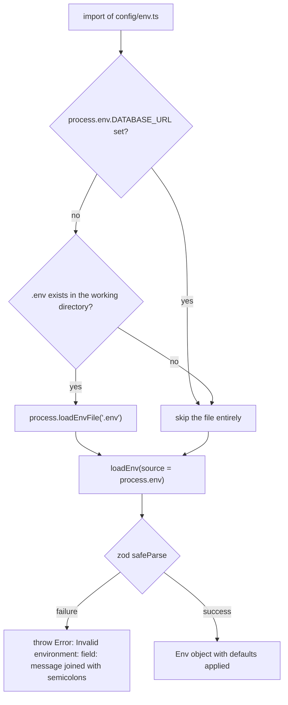

# Configuration, environment variables and secrets

The repository has exactly two configuration surfaces, and they are not connected:

- **Server** — `apps/server` reads its entire configuration from the process environment through one zod schema in [apps/server/src/config/env.ts](../../apps/server/src/config/env.ts). Five variables are mandatory, three have defaults, one is optional, and a value that fails validation stops the process before the HTTP server exists.
- **Admin SPA** — `apps/admin` documents exactly one variable, `VITE_API_URL`, which Vite inlines at build/dev time. It is not validated: an unset value simply makes browser requests relative to the SPA's own origin, and makes the production CSP omit the API origin.

Everything else that looks like configuration in the tree (`supabase/config.toml`, `supabase/seed.sql`) is committed local-stack setup, and the only committed credential is a documented dev-only one. No secret ever ships to a browser bundle: the Supabase service-role key is server-side only, and the admin SPA has no Supabase client dependency ([Admin data layer and client state](../apps/admin-data-layer-and-client-state.md)).

## Server environment schema

`envSchema` in [apps/server/src/config/env.ts](../../apps/server/src/config/env.ts#L8-L26) is the complete contract. It is enumerated here exactly as coded, including which entries are optional and what their absence changes:

| Variable                   | Rule as coded                                                       | Status                        | Absence / invalid value changes                                                                |
| -------------------------- | ------------------------------------------------------------------- | ----------------------------- | ---------------------------------------------------------------------------------------------- |
| `DATABASE_URL`             | `z.string().min(1)`                                                 | **required**                  | `loadEnv` throws → the process never starts                                                     |
| `SUPABASE_URL`             | `z.string().url()`                                                  | **required**                  | must parse as a URL (a bare host such as `127.0.0.1:54321` fails) → throw                       |
| `SUPABASE_SERVICE_ROLE_KEY`| `z.string().min(1)`                                                 | **required**                  | throw — the service-role client cannot be built                                                 |
| `ADMIN_EMAIL`              | `z.string().min(1)`                                                 | **required**                  | throw (validated only; see below)                                                                |
| `ADMIN_PASSWORD`           | `z.string().min(6)`                                                 | **required**, ≥ 6 characters  | throw (validated only; see below)                                                                |
| `PORT`                     | `z.coerce.number().int().positive().default(3000)`                  | defaulted                     | listens on **3000**; the string `"4000"` is coerced to the number `4000`                        |
| `MAPBOX_SECRET_TOKEN`      | `z.string().optional()`                                             | **optional**                  | the Directions proxy returns straight-line geometry, `snapped: false`, `warning: "no_token"`     |
| `ALLOW_DEV_CREDENTIAL`     | `z.enum(["true","false"]).transform(v => v === "true").default(false)` | defaulted (boolean)         | the documented dev credential is refused at login (any other string, e.g. `"1"`, throws)         |
| `ADMIN_ORIGINS`            | `z.string().default("http://localhost:5173,http://127.0.0.1:5173")`  | defaulted (comma-separated)   | only the two local Vite origins are accepted; a browser call from any other `Origin` gets 403    |

Notes that follow from the schema rather than from prose elsewhere:

- `MAPBOX_SECRET_TOKEN` cannot be made required by configuration alone; the proxy treats a falsy value (absent **or** an empty `MAPBOX_SECRET_TOKEN=`) as "no token" and takes the fallback branch ([apps/server/src/api/mapbox.ts](../../apps/server/src/api/mapbox.ts#L107-L122)).
- `ALLOW_DEV_CREDENTIAL` is a string enum, not a boolean coercion: `true`/`false` only. A value such as `1`, `yes`, or `TRUE` fails validation, so a typo is a startup abort rather than a silently-open gate.
- `ADMIN_EMAIL` / `ADMIN_PASSWORD` are validated but **never read by server runtime code**. Their only consumers are the integration helpers, which sign in with them against the seeded admin ([apps/server/src/config/env.ts](../../apps/server/src/config/env.ts#L12-L13), [apps/server/tests/integration/helpers.ts](../../apps/server/tests/integration/helpers.ts#L101-L114)). Drift between `.env` and `supabase/seed.sql` therefore shows up as a failing test or a failed manual sign-in, not as a startup error.

## Resolution order, the `.env` guard and `loadEnv`

Configuration is resolved once per process, at module import:



How a server process obtains its configuration: the `.env` guard, then one zod parse of the effective environment.

The guard at the top of the module is deliberately narrow ([apps/server/src/config/env.ts](../../apps/server/src/config/env.ts#L1-L6)):

```ts
if (!process.env.DATABASE_URL && existsSync(".env")) {
  process.loadEnvFile(".env");
}
```

- **An externally provided `DATABASE_URL` disables the whole file.** The check is on `DATABASE_URL` alone, so exporting just that variable in a shell or CI job means `.env` is never read — and any other variable that only existed in the file then fails validation instead of being back-filled.
- **The path is relative to the process working directory**, not to the module. `existsSync(".env")` and `loadEnvFile(".env")` both resolve against the CWD, so the server must be started from `apps/server` (which is what `pnpm --filter server dev` does, per [apps/server/package.json](../../apps/server/package.json#L6-L10)). Starting `tsx apps/server/src/index.ts` from the repository root silently skips the file and then aborts on a missing `DATABASE_URL`.
- **The guard makes the load idempotent.** Because the module body runs once, pre-loading `.env` from a test bootstrap before importing this module turns the guard into a no-op; the file is never read twice and ambient values are never overwritten mid-process.

`loadEnv` itself takes an **injectable source** and performs a pure parse with no caching ([apps/server/src/config/env.ts](../../apps/server/src/config/env.ts#L30-L41)):

```ts
export function loadEnv(source: Record<string, string | undefined> = process.env): Env
```

That seam is what makes the module testable and is used in three distinct ways:

- Unit tests pass a literal record and never touch the real environment ([apps/server/tests/unit/env.test.ts](../../apps/server/tests/unit/env.test.ts#L4-L47)).
- The integration helpers load `.env` themselves when it exists, then build per-test variants with `envWith({ ...process.env, ...overrides })` ([apps/server/tests/integration/helpers.ts](../../apps/server/tests/integration/helpers.ts#L11-L16), [helpers.ts](../../apps/server/tests/integration/helpers.ts#L60-L63)). Both sides of the dev-credential gate are covered this way, independent of the ambient local value ([apps/server/tests/integration/auth-login.test.ts](../../apps/server/tests/integration/auth-login.test.ts#L244-L262)).
- The Mapbox proxy re-parses `process.env` per request rather than reading `AppDeps.env`, which is how its unit tests flip the token live by mutating `process.env.MAPBOX_SECRET_TOKEN` ([apps/server/tests/unit/mapbox-proxy.test.ts](../../apps/server/tests/unit/mapbox-proxy.test.ts#L111-L135)).

**Failure semantics.** `loadEnv` collapses every zod issue into one message — `Invalid environment: <path>: <message>; <path>: <message>; …` — and throws ([apps/server/src/config/env.ts](../../apps/server/src/config/env.ts#L33-L39)). In [apps/server/src/index.ts](../../apps/server/src/index.ts#L6-L23) it is called at module scope, *before* `main()`: a misconfigured environment is an uncaught throw during import, not a logged `process.exit(1)` (that path is reserved for a failed `app.listen`). The same function can throw at runtime on the Mapbox route, where it is re-invoked inside a handler; there the central error handler converts it into a `500 INTERNAL` envelope.

## What each value drives

| Variable                        | Consumer                                                                                          | Effect                                                                                                                                          |
| ------------------------------- | ------------------------------------------------------------------------------------------------- | ----------------------------------------------------------------------------------------------------------------------------------------------- |
| `DATABASE_URL`                  | `createDb(env.DATABASE_URL)` in [apps/server/src/config/db.ts](../../apps/server/src/config/db.ts#L7-L10) | one `pg` `Pool` + Drizzle instance, passed to `buildApp` as `AppDeps.db` (the integration suite derives `komyuter_test` by rewriting this URL's path) |
| `SUPABASE_URL`, `SUPABASE_SERVICE_ROLE_KEY` | `createSupabaseAdmin` in [apps/server/src/config/supabase.ts](../../apps/server/src/config/supabase.ts#L3-L13) | service-role `supabase-js` client with `persistSession: false` and `autoRefreshToken: false`, used for sign-in, token verification and revocations |
| `PORT`                          | `app.listen({ port: env.PORT, host: "0.0.0.0" })` ([apps/server/src/index.ts](../../apps/server/src/index.ts#L18)) | listen port; the bind address is hard-coded, not configurable                                                                                    |
| `ADMIN_ORIGINS`                 | `createOriginGuard(deps.env.ADMIN_ORIGINS)` registered as an `onRequest` hook right after CORS ([apps/server/src/api/app.ts](../../apps/server/src/api/app.ts#L41-L45)) | the guard splits on commas, trims and drops empty entries; `OPTIONS` and requests without an `Origin` header pass, any other `Origin` gets `403 FORBIDDEN` "Origin not allowed" ([apps/server/src/api/origin-guard.ts](../../apps/server/src/api/origin-guard.ts#L14-L30)) |
| `ALLOW_DEV_CREDENTIAL`          | the login route ([apps/server/src/api/auth-login.ts](../../apps/server/src/api/auth-login.ts#L72-L79)) | sees the dev-credential gate below                                                                                                              |
| `MAPBOX_SECRET_TOKEN`           | the Directions proxy handler, re-read per request through `loadEnv(process.env)`                   | real road snapping, or the straight-line fallback; see [Mapbox Directions proxy](../integrations/mapbox-directions-proxy.md)                      |

The environment object reaches routes as `AppDeps.env` ([apps/server/src/api/app.ts](../../apps/server/src/api/app.ts#L21-L25)), which is why tests can construct an app with an arbitrary `Env` instead of editing process state.

## The documented dev credential and its gate

`supabase/seed.sql` provisions the single admin identity (`auth.users` + `auth.identities` + an `admin_users` row) with a fixed, documented dev-only password hash and a deterministic UUID, and the default fare configuration ([supabase/seed.sql](../../supabase/seed.sql#L14-L48), [supabase/seed.sql](../../supabase/seed.sql#L79-L110)). The file's own header states the constraint that matters operationally: the Supabase CLI executes it **verbatim, with no environment interpolation**, so the credential is a committed default rather than a deployable secret, and must be changed through Supabase Auth before any shared or production use.

Treat that value as a fixture, not as configuration:

- The server holds the same pair as a `DEV_CREDENTIAL` constant, not sourced from `ADMIN_EMAIL`/`ADMIN_PASSWORD` ([apps/server/src/api/auth-login.ts](../../apps/server/src/api/auth-login.ts#L20-L24)).
- When `ALLOW_DEV_CREDENTIAL` is `false` (the default, and the value in both `.env.example` files), the login route refuses that pair **before** calling GoTrue, through the same unified path as every other denial: a 250 ms delay, `401 UNAUTHORIZED` with the message `Invalid email or password`, a throttler failure record, and a `security.sign_in_failure` event ([apps/server/src/api/auth-login.ts](../../apps/server/src/api/auth-login.ts#L67-L95)). The gate is therefore invisible to a client.
- With `ALLOW_DEV_CREDENTIAL=true` the pair is not trusted outright — it still has to sign in against GoTrue and pass the `admin_users` check. Setting the flag reopens a well-known credential, which is why it is local-only ([apps/server/.env.example](../../apps/server/.env.example#L19-L22)).

**Boundary of the gate.** It lives in the Fastify route, not in GoTrue, so it only protects `POST /api/auth/login`. Minting a token directly from the Auth endpoint (`POST {SUPABASE_URL}/auth/v1/token?grant_type=password`, the manual flow in [apps/server/README.md](../../apps/server/README.md#L38-L48)) is unaffected by `ALLOW_DEV_CREDENTIAL` — see [Supabase local stack](../integrations/supabase-local-stack.md).

## Admin app: `VITE_API_URL`

`apps/admin` has exactly one documented variable ([apps/admin/.env.example](../../apps/admin/.env.example#L1-L12)):

```
VITE_API_URL=http://localhost:3000
```

It is consumed as the axios base URL for every admin API call ([apps/admin/src/lib/api.ts](../../apps/admin/src/lib/api.ts#L32-L35)). Consequences worth knowing:

- **Nothing validates it.** If it is unset, `import.meta.env.VITE_API_URL` is `undefined`, axios falls back to resolving requests against the SPA's own origin, and the build still succeeds. A misconfigured value shows up as failing API calls, not as a build error.
- **`VITE_SUPABASE_URL` / `VITE_SUPABASE_ANON_KEY` are deliberately unused.** Authentication is backend-proxied (ADR-0006), so they may linger in a local `.env` without effect, and the admin bundle contains no Supabase client.
- The template is committed; the real `apps/admin/.env` is gitignored (see [Committed versus gitignored](#committed-versus-gitignored)). Vite loads it from the package root in both dev and build, so the value is baked into the bundle at build time and can be changed without touching the server.

## Production-build CSP, derived from `VITE_API_URL`

`cspPlugin()` in [apps/admin/vite.config.ts](../../apps/admin/vite.config.ts#L16-L62) is the only other place the admin build reads configuration. It is **production-build-only**, by design:

- `configResolved` records `config.mode` and reads `VITE_API_URL` through Vite's own `loadEnv(config.mode, process.cwd(), "")`, taking `new URL(raw).origin` when it parses and the raw string otherwise ([apps/admin/vite.config.ts](../../apps/admin/vite.config.ts#L22-L33)).
- `transformIndexHtml` returns `undefined` unless `mode === "production"`, so `vite dev` serves the unmodified `index.html` — dev mode has **no CSP at all**, because Vite HMR needs inline scripts and styles ([apps/admin/vite.config.ts](../../apps/admin/vite.config.ts#L34-L37)). The static [apps/admin/index.html](../../apps/admin/index.html#L1-L13) contains no CSP `<meta>`; it only exists after a production build.
- When it does apply, it injects a single `<meta http-equiv="Content-Security-Policy">` at `head-prepend` with this policy ([apps/admin/vite.config.ts](../../apps/admin/vite.config.ts#L38-L59)):

```
default-src 'self'; script-src 'self'; style-src 'self'; worker-src 'self' blob:;
img-src 'self' data: blob: https://tiles.openfreemap.org; font-src 'self' data:;
connect-src 'self' https://tiles.openfreemap.org <API_ORIGIN>;
object-src 'none'; base-uri 'self'; form-action 'self'
```

  `<API_ORIGIN>` is appended only when `VITE_API_URL` is set; the directive ends at `https://tiles.openfreemap.org` otherwise. Since the token is never a secret, nothing sensitive is inlined here — the policy exists to contain the `localStorage`-token XSS exposure (S1) rather than to hide a value.
- There is no `'unsafe-inline'` and no `'unsafe-eval'` anywhere, and `object-src 'none'` blocks injected plugins. Two limitations are already recorded: `frame-ancestors` cannot be expressed in a `<meta>` CSP (header-only), and any new browser egress must be added to `connect-src`/`img-src` by hand — the admin route workspace's basemap talks to OpenFreeMap, which is why that origin is listed.
- **CI builds run without `VITE_API_URL`.** The build step in [.github/workflows/ci.yml](../../.github/workflows/ci.yml#L20-L39) sets no env vars, so a bundle produced there has a CSP with no API origin and an axios client with no base URL. Supplying `VITE_API_URL` at build time is a deployment responsibility; see [Workspace build and CI](../architecture/workspace-build-and-ci.md).

## Committed versus gitignored

| Artifact                                          | State                            | Notes                                                                                                                                              |
| ------------------------------------------------- | -------------------------------- | -------------------------------------------------------------------------------------------------------------------------------------------------- |
| `apps/server/.env.example`                        | committed                        | Local dev defaults: local Postgres/Auth URLs, the seeded admin identity, `PORT=3000`, `ALLOW_DEV_CREDENTIAL=false`, the local `ADMIN_ORIGINS`, and a commented `MAPBOX_SECRET_TOKEN`. `SUPABASE_SERVICE_ROLE_KEY` is left **blank** because the CLI prints it per machine ([apps/server/.env.example](../../apps/server/.env.example#L1-L30)). |
| `apps/admin/.env.example`                         | committed                        | One variable, `VITE_API_URL`, plus the note that the `VITE_SUPABASE_*` pair is unused.                                                              |
| `.env` (any package)                              | **gitignored**                   | The root [.gitignore](../../.gitignore#L1-L11) lists `.env` as a bare pattern, so it matches at any depth; no `.env` file exists in the tree. `*.local` is ignored too. |
| `supabase/seed.sql`                               | committed                        | Contains the dev-only credential hash and the default fare configuration; executed verbatim by `supabase db reset` ([supabase/config.toml](../../supabase/config.toml#L66-L71)). |
| `supabase/config.toml`                            | committed                        | Local stack, ports and auth policy (`jwt_expiry = 3600`, `enable_signup = false`, `minimum_password_length = 8`). Real secrets are referenced indirectly with `env(NAME)` substitution instead of literal values, e.g. `secret = "env(SUPABASE_AUTH_EXTERNAL_APPLE_SECRET)"` ([supabase/config.toml](../../supabase/config.toml#L155-L185), [supabase/config.toml](../../supabase/config.toml#L328-L329)). |
| `supabase/.env.keys`, `.env.local`, `.env.*.local` | gitignored by `supabase/.gitignore` | Along with `.branches` and `.temp` ([supabase/.gitignore](../../supabase/.gitignore#L1-L8)).                                                        |

No key material is committed: the service-role key exists only in a local `.env`, and the only committed credential is the documented dev-only seed value gated behind `ALLOW_DEV_CREDENTIAL`.

## Changing configuration safely

- **Adding a server variable** means three coordinated edits: the `envSchema` entry, the corresponding documentation in [apps/server/.env.example](../../apps/server/.env.example), and assertions in [apps/server/tests/unit/env.test.ts](../../apps/server/tests/unit/env.test.ts). Prefer a zod default over a new mandatory variable — every new required entry turns an incomplete environment into a startup abort.
- **Keeping a value out of `AppDeps`** is what lets a route re-read it at request time (the Mapbox token). Caching it in `AppDeps` instead would make it fixed for the process lifetime; either choice is a deliberate trade-off.
- **Allowing a new browser origin** has two independent places to update: `ADMIN_ORIGINS` on the server (request guard) and the CSP `connect-src`/`img-src` list in the Vite plugin (build output). Updating only one produces either a 403 at request time or a blocked request in the built SPA.
- **Never** promote the committed seed credential or the `.env.example` values into a shared environment; the gate defaults to refusing the former, and the latter only describes the local stack.
- `apps/mobile` reads no configuration of its own, so nothing on this page applies to it — see [Mobile commuter app](../apps/mobile-commuter-app.md).

## Tests that pin this

- [apps/server/tests/unit/env.test.ts](../../apps/server/tests/unit/env.test.ts#L12-L47) covers the schema's observable contract: `ALLOW_DEV_CREDENTIAL` defaulting to `false` and `ADMIN_ORIGINS` to the two local Vite origins, `"true"`/`"false"` parsing with `"1"` rejected, an explicit `ADMIN_ORIGINS`, and rejection of an empty mandatory value. It passes a literal object to `loadEnv`, so it never depends on the developer's environment.
- [apps/server/tests/integration/helpers.ts](../../apps/server/tests/integration/helpers.ts#L52-L63) is the pattern for env-dependent integration tests: build the app with `buildTestApp(envWith({...}))` rather than mutating `process.env`.
- [apps/server/tests/integration/auth-login.test.ts](../../apps/server/tests/integration/auth-login.test.ts#L244-L262) asserts both sides of the dev-credential gate through two independently built app instances.
- [apps/server/tests/unit/mapbox-proxy.test.ts](../../apps/server/tests/unit/mapbox-proxy.test.ts#L111-L135) exercises all three token configurations (`no_token`, snapped, `upstream_error`) by mutating and deleting `process.env.MAPBOX_SECRET_TOKEN`.
- The CSP plugin has **no automated test** — the admin suite is hermetic and does not run a build. Its verification surface is the output of `pnpm --filter admin build`; see [Workspace build and CI](../architecture/workspace-build-and-ci.md).

## Related pages

- [Server API surface](./server-api-surface.md) — the routes that `ADMIN_ORIGINS`, `PORT` and the auth gate protect.
- [Admin authentication and session](../workflows/admin-authentication-and-session.md) — the login path the dev-credential gate sits in.
- [Supabase local stack](../integrations/supabase-local-stack.md) — where the seeded credential, the service-role key and `supabase/config.toml` come from.
- [Mapbox Directions proxy](../integrations/mapbox-directions-proxy.md) — the only consumer of `MAPBOX_SECRET_TOKEN`.
- [Workspace build and CI](../architecture/workspace-build-and-ci.md) — how `pnpm build` and the CI job interact with these variables.
