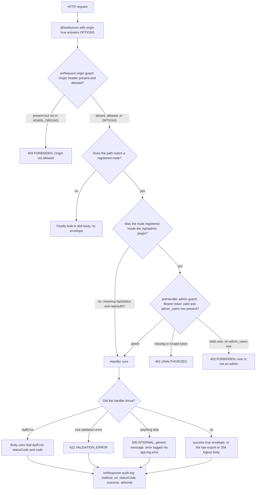

# Server API surface and response contract

`apps/server` exposes exactly one HTTP surface. It is built by `buildApp({ db, supabase, env })` in [apps/server/src/api/app.ts](../../apps/server/src/api/app.ts#L35-L91), which installs the cross-cutting plugins, hooks and error handler, then hands registration to `registerAdminRoutes` in [apps/server/src/api/index.ts](../../apps/server/src/api/index.ts#L14-L37). That second function is the exhaustive list of what the process serves: `status` and `auth-login` registered unguarded at the root, and one plugin mounted at `/api/admin` carrying `routes`, `fare-configs`, `directions`, `stops`, `detours`, `restrictions`, `export` and `mapbox`.

There is no second entrypoint, no versioned alias, and no route registered anywhere else. The `AppInstance` type threads a `ZodTypeProvider` through every module, so handlers get typed `request.body` from the same zod schemas the admin SPA compiles against ([Shared contracts](../packages/shared-contracts.md)).

## Registration, mounts and guard layering

Three mechanisms place a guard on a request, and they apply at different points:

1. **`@fastify/cors` with `origin: true`** is registered first, so `OPTIONS` preflights are answered by the plugin ([apps/server/src/api/app.ts](../../apps/server/src/api/app.ts#L41-L45)).
2. **The origin allowlist** is a root `onRequest` hook (`createOriginGuard(env.ADMIN_ORIGINS)`) added immediately after CORS. It is a root hook, not an admin-plugin hook, so it also runs for `GET /api/status` and the `/api/auth/*` routes — the integration suite asserts a foreign `Origin` on `POST /api/auth/login` returns the 403 envelope ([apps/server/tests/integration/auth-login.test.ts](../../apps/server/tests/integration/auth-login.test.ts#L291-L328)). A request without an `Origin` header and any `OPTIONS` request pass through.
3. **The Supabase admin guard** is a single `preHandler` added to the `/api/admin` plugin body before its child modules are registered ([apps/server/src/api/index.ts](../../apps/server/src/api/index.ts#L23-L36)). Every route inside that encapsulation context is therefore authenticated by construction; a new module added to that plugin needs no per-route guard.

The guard itself (`createAdminAuthGuard`) extracts a strict single-part `Bearer` token, verifies it with `supabase.auth.getUser(token)`, and then requires a row for that user id in `admin_users` through `isAdminUserId` — the same helper the login route and `GET /api/auth/me` call, so admin membership can never be decided two different ways ([apps/server/src/api/auth.ts](../../apps/server/src/api/auth.ts#L14-L55)). Missing or invalid token → `401 UNAUTHORIZED`; valid user without membership → `403 FORBIDDEN`. On success it records `request.adminUserId`.

The full request path: origin allowlist, route match, the admin guard on the `/api/admin` subtree, handler, central error mapping, and the audit log line that closes every response.

A fourth, non-blocking hook sits at the end: `onResponse` emits one structured log line per request with `method`, `url`, `statusCode`, an derived `outcome` (`success` / `redirect` / `failure`) and `adminId` when the guard set it ([apps/server/src/api/app.ts](../../apps/server/src/api/app.ts#L47-L64)).

## Route inventory

All paths below are the full paths as served. `admin` means the route is inside the `/api/admin` plugin and therefore behind the `preHandler` guard; `public` means it is registered at the root with no guard.

| Resource | Method and path | Auth | Validation | Notable behaviour |
| --- | --- | --- | --- | --- |
| Status | `GET /api/status` | public | — | Row counts for `routes`, `directions`, `stops`, `detours`, `restrictions`, `fare_configs` plus `dataset_updated_at = max(directions.updated_at)`; all counts coerced with `Number()` ([status.ts](../../apps/server/src/api/status.ts#L18-L56)) |
| Auth | `POST /api/auth/login` | public | `loginSchema` (route-local zod) | Returns `{ access_token, user }`; refresh token is discarded server-side; every denial is the same `401 UNAUTHORIZED` "Invalid email or password" after a ≥ 250 ms delay |
| Auth | `GET /api/auth/me` | public | — | Re-runs the same `getUser` + `admin_users` check as the guard; returns `{ id, email, name }` |
| Auth | `POST /api/auth/logout` | public | — | Best-effort global revocation, always `204` with an empty body — not enveloped ([auth-login.ts](../../apps/server/src/api/auth-login.ts#L145-L162)) |
| Routes | `GET /api/admin/routes` | admin | — | Summary rows ordered `updated_at DESC` with a computed `direction_count` ([routes.ts](../../apps/server/src/api/routes.ts#L22-L58)) |
| Routes | `POST /api/admin/routes` | admin | `createRouteSchema` | `201`; id is the supplied `route_id` or `uniqueSlug(name)`; `is_active` defaults to `false` (draft-first) even though the column default is `true` |
| Routes | `GET /api/admin/routes/overview` | admin | — | Static segment; every route's base polyline, derived-return polyline and base-direction stops in one response |
| Routes | `GET /api/admin/routes/:routeId` | admin | — | Route fields plus full `directions[]`, each with `stops[]`, `detours[]`, `restrictions[]`, ordered base before return |
| Routes | `PUT /api/admin/routes/:routeId` | admin | `updateRouteSchema` | Partial patch including `is_active`; `404` when the route does not exist |
| Routes | `DELETE /api/admin/routes/:routeId` | admin | — | **Hard delete**; FK cascade clears the route's directions, stops, detours, detour stops and restrictions |
| Directions | `GET /api/admin/routes/:routeId/directions` | admin | — | Direction summaries only (no nested stops/detours/restrictions); `404` when the route is unknown |
| Directions | `POST /api/admin/routes/:routeId/directions` | admin | `createDirectionSchema` | With a non-empty `stops` array: atomic plotted save that also creates the derived return and answers `201` with `return_direction`. Without `stops`: a single legacy direction row with `stops: []` |
| Directions | `GET /api/admin/directions/:directionId` | admin | — | Full entity: summary plus `stops`, `detours`, `restrictions` ([entities.ts](../../apps/server/src/domain/entities.ts#L278-L292)) |
| Directions | `PUT /api/admin/directions/:directionId` | admin | `updateDirectionSchema` | With `stops`: requires `base_polyline`, replaces the stop list and re-derives the sibling return. Without: a field patch such as `label`, `is_active`, or terminal ids |
| Directions | `DELETE /api/admin/directions/:directionId` | admin | — | **Soft**: sets `is_active = false` and returns `{ direction_id, is_active }` |
| Stops | `GET /api/admin/directions/:directionId/stops` | admin | — | Ordered by `stop_order`; no `is_active` filter |
| Stops | `POST /api/admin/directions/:directionId/stops` | admin | `createStopSchema` | `201`; `stop_order` defaults to `max(stop_order) + 1` for the direction |
| Stops | `PUT /api/admin/stops/:stopId` | admin | `updateStopSchema` | Partial patch; the response re-reads `location` as GeoJSON |
| Stops | `DELETE /api/admin/stops/:stopId` | admin | — | **Soft**, but `409 CONFLICT` when the stop is any direction's `origin_stop_id` or `destination_stop_id` |
| Detours | `GET /api/admin/directions/:directionId/detours` | admin | — | Detours with their ordered `detour_stops` |
| Detours | `POST /api/admin/directions/:directionId/detours` | admin | `createDetourSchema` | `201`; entry/exit must lie within 30 m of the base polyline, the loop must start on `entry` and end on `exit`, `entry ≠ exit`, and `label` must be unique within the direction |
| Detours | `PUT /api/admin/detours/:detourId` | admin | `updateDetourSchema` | Re-validates the loop against the current entry/exit when any geometry field changes; a present `detour_stops` array is a full replace; an otherwise empty patch skips the `UPDATE` |
| Detours | `DELETE /api/admin/detours/:detourId` | admin | — | **Destructive**: the row is removed, `detour_stops` cascade, and the label is reusable immediately |
| Restrictions | `GET /api/admin/directions/:directionId/restrictions` | admin | — | Restrictions for the direction, `is_active` included |
| Restrictions | `POST /api/admin/directions/:directionId/restrictions` | admin | `createRestrictionSchema` | `201`; `from_coord_index`/`to_coord_index` validated against the base polyline length and ordering |
| Restrictions | `PUT /api/admin/restrictions/:restrictionId` | admin | `updateRestrictionSchema` | Re-validates the index range when either index changes |
| Restrictions | `DELETE /api/admin/restrictions/:restrictionId` | admin | — | **Soft**: `is_active = false` |
| Fare configs | `GET /api/admin/fare-configs` | admin | — | Every config plus `active_route_count` counted over `is_active = true` routes only |
| Fare configs | `GET /api/admin/fare-configs/:fareConfigId` | admin | — | Single config; numerics returned as JSON numbers |
| Fare configs | `POST /api/admin/fare-configs` | admin | `createFareConfigSchema` | `201`; id is `fare-<slug>` or a uuid; `is_default: true` first un-marks the existing default in a separate statement |
| Fare configs | `PUT /api/admin/fare-configs/:fareConfigId` | admin | `updateFareConfigSchema` | `409` when the result would be an inactive default or would leave zero defaults |
| Fare configs | `DELETE /api/admin/fare-configs/:fareConfigId` | admin | — | **Soft**, with `409` when an active route references the config, and `409` when it is the current default |
| Export | `GET /api/admin/export/dataset` | admin | — | Raw `ExportDataset` JSON with `Content-Disposition: attachment; filename="komyuter-dataset.json"` — the response is not enveloped ([export.ts](../../apps/server/src/api/export.ts#L10-L19)) |
| Mapbox | `GET /api/admin/mapbox/directions?coordinates=lng,lat;lng,lat` | admin | query parsed by hand | `422` for a missing, malformed or single-coordinate string; otherwise chunked (25 coordinates per request) road snapping returning `{ polyline, distance_meters, snapped, warning }` |

### Shapes that callers must not assume

- **No single-item reads for stops, detours or restrictions.** There is no `GET /api/admin/stops/:stopId`, no `GET /api/admin/detours/:detourId`, no `GET /api/admin/restrictions/:restrictionId`; those entities are read through their parent direction.
- **No `PATCH` anywhere.** Field updates are `PUT` with partial bodies.
- **No pagination, filtering or ordering parameters** on any list endpoint.
- **`detour_stops` have no endpoint of their own.** They exist only as an array inside a detour `POST`/`PUT` body.

## The response envelope

Every wrapped response is `{ success: true, data }` or `{ success: false, error: { code, message } }`, exactly as modelled by `Envelope<T>` and `ERROR_CODES` in [packages/shared/src/types/envelope.ts](../../packages/shared/src/types/envelope.ts#L1-L18) with zod counterparts in [packages/shared/src/schemas/envelope.ts](../../packages/shared/src/schemas/envelope.ts#L1-L20). Handlers return the success object literally rather than through a helper, so the envelope is a convention enforced by review and by the client's interceptor, not by a serializer.

Two paths deliberately leave the envelope:

- `GET /api/admin/export/dataset` returns the assembled dataset itself (no `success`/`data` wrapper) in an attachment response.
- `POST /api/auth/logout` returns `204` with no body at all.

A third case is not deliberate but is observable: `buildApp` installs a `setErrorHandler` and no `setNotFoundHandler`, so a path that matches no route is answered by Fastify's built-in 404 body (`statusCode`, `error`, `message`) rather than by the envelope. Clients that branch on `body.success` must not treat that shape as a network failure.

### Error code to status mapping

`ApiError` carries its own `statusCode` and `code`, and the factory helpers in [apps/server/src/api/errors.ts](../../apps/server/src/api/errors.ts#L21-L43) fix the pairing:

| Code | Status | Raised by |
| --- | --- | --- |
| `UNAUTHORIZED` | 401 | `unauthorized()` — missing/invalid bearer token, the unified login denial |
| `FORBIDDEN` | 403 | `forbidden()` — authenticated user absent from `admin_users`, disallowed `Origin` |
| `NOT_FOUND` | 404 | `notFound()` in each handler for an unknown id |
| `CONFLICT` | 409 | `conflict()` — duplicate route id, a third active direction, a referenced stop terminal, fare-config default and in-use guards |
| `VALIDATION_ERROR` | 422 | `validationError()` plus every zod body failure, mapped centrally |
| `INTERNAL` | 500 | `internal()` and the catch-all branch of `setErrorHandler` (generic message, real error logged) |

There is no `429`/rate-limit code and no upstream-error code: throttled logins are ordinary `401 UNAUTHORIZED` denials, and Mapbox upstream failures never surface as an HTTP error at all.

### The central error handler

`setErrorHandler` in [apps/server/src/api/app.ts](../../apps/server/src/api/app.ts#L66-L86) is the only place that writes a failure envelope:

- an `ApiError` instance → its own `statusCode` and `code`;
- any `Error` that has a `validation` property (the shape `@fastify/type-provider-zod` produces) → `422 VALIDATION_ERROR`;
- everything else → `app.log.error(error)` and `500 INTERNAL` with the fixed message "Internal server error".

Because the last branch is a catch-all, a Postgres constraint or connection error is never surfaced with a specific status; that is why each handler pre-checks its own preconditions instead of relying on database errors ([Data model](../architecture/data-model.md)).

## Validation sources

- **Body schemas** come from `@komyuter/shared` (`createRouteSchema`, `updateRouteSchema`, `createDirectionSchema`, `updateDirectionSchema`, `createStopSchema`, `updateStopSchema`, `createDetourSchema`, `updateDetourSchema`, `createRestrictionSchema`, `updateRestrictionSchema`, `createFareConfigSchema`, `updateFareConfigSchema`) in [packages/shared/src/schemas/domain.ts](../../packages/shared/src/schemas/domain.ts#L1-L151), attached per route as `{ schema: { body: … } }`.
- **The compilers** come from `@fastify/type-provider-zod`: `app.setValidatorCompiler(validatorCompiler)` and `app.setSerializerCompiler(serializerCompiler)` are set on the instance right after construction ([apps/server/src/api/app.ts](../../apps/server/src/api/app.ts#L36-L39)), which is what turns a body failure into the `validation`-bearing error the handler recognises.
- **`loginSchema` is the only route-local schema** ([auth-login.ts](../../apps/server/src/api/auth-login.ts#L12-L15)); everything else is shared with the admin client.
- **Path params and query strings are not schema-validated.** Handlers cast them (`request.params as { routeId: string }`) and `mapbox.ts` parses `coordinates` with its own `parseCoordinates` helper, throwing `422 VALIDATION_ERROR` on malformed input.
- **Post-zod domain guards** run inside the handlers, all raising `422` unless noted: a plotted payload needs at least two stops and a polyline whose endpoints sit within 100 m of the first and last stop ([derive.ts](../../apps/server/src/domain/derive.ts#L8-L9), [directions.ts](../../apps/server/src/api/directions.ts#L204-L220)); a detour needs entry/exit within 30 m of the base polyline, a loop that starts on `entry` and ends on `exit`, a non-degenerate pair, and a label unique within the direction ([validation.ts](../../apps/server/src/domain/validation.ts#L8-L76), [detours.ts](../../apps/server/src/api/detours.ts#L108-L115)); restrictions need an in-range, ascending coordinate index pair ([validation.ts](../../apps/server/src/domain/validation.ts#L136-L157)); a stop delete checks the terminal reference and raises `409` ([validation.ts](../../apps/server/src/domain/validation.ts#L115-L134)).

## Delete semantics

Deletes are inconsistent by design, per resource:

| Resource | Endpoint effect | Guard before the write |
| --- | --- | --- |
| `routes` | **Hard delete** of the row, cascading through `directions` → `stops`, `detours` → `detour_stops`, and `restrictions`; a repeat delete is `404` | none beyond existence ([routes.ts](../../apps/server/src/api/routes.ts#L260-L278), [schema.ts](../../apps/server/src/db/schema.ts#L119-L139)) |
| `directions` | **Soft deactivate** (`is_active = false`); the row and its stops stay and remain readable; no check on whether it is the base of a plotted pair | existence only ([directions.ts](../../apps/server/src/api/directions.ts#L416-L441)) |
| `stops` | **Soft deactivate**, refused with `409 CONFLICT` when the stop is any direction's `origin_stop_id` or `destination_stop_id` | `assertNotDirectionTerminal` ([stops.ts](../../apps/server/src/api/stops.ts#L163-L187)) |
| `detours` | **Destructive delete** of the row, cascading to `detour_stops`; the label becomes reusable immediately and a repeat delete is `404` | existence only ([detours.ts](../../apps/server/src/api/detours.ts#L254-L278)) |
| `restrictions` | **Soft deactivate** | existence only ([restrictions.ts](../../apps/server/src/api/restrictions.ts#L150-L175)) |
| `fare_configs` | **Soft deactivate**; `409` when an active route references the config, and `409` when the config is the current default | two pre-checks ([fare-configs.ts](../../apps/server/src/api/fare-configs.ts#L209-L254)) |
| `detour_stops` | No endpoint; **replaced wholesale** (delete-then-insert) whenever a detour `PUT` carries `detour_stops` | — ([detours.ts](../../apps/server/src/api/detours.ts#L236-L244)) |

Two consequences worth carrying into any client:

- **Deactivated rows stay in reads and in the export.** The entity loaders and the export rows have no `is_active` filter, so a soft-deleted direction, stop or restriction is still returned by its `GET` and still appears in `komyuter-dataset.json`. Only `routes` and `directions` carry `is_active` through to the export payload.
- **Stop ids are not stable across a plotted save.** The plotted create/replace path deletes every existing stop row of the directions it rewrites and inserts fresh rows with new `stop_…` uuids, then re-points `origin_stop_id`/`destination_stop_id` at the new terminals ([directions.ts](../../apps/server/src/api/directions.ts#L82-L130)).

Deactivation is reversible through the API for directions, stops, restrictions and fare configs via a `PUT` that sets `is_active: true`; routes and detours have no restore path because their deletion is physical.

## Ordering traps: static segments versus parameterised ones

`GET /api/admin/routes/overview` and `GET /api/admin/routes/:routeId` live in the same module and the same plugin. The static route is declared first in `routes.ts` and Fastify's router gives the static segment precedence, so `/api/admin/routes/overview` is never read as a route id such as `overview` ([routes.ts](../../apps/server/src/api/routes.ts#L112-L116)). The integration suite asserts the response is an array, not a route object ([apps/server/tests/integration/plotting-save.test.ts](../../apps/server/tests/integration/plotting-save.test.ts#L396-L445)).

`"overview"` is additionally reserved at write time, in two places:

- `uniqueSlug` adds `"overview"` to the taken set before suffixing, so a route created from the name "Overview" becomes `overview-2` ([apps/server/src/domain/ids.ts](../../apps/server/src/domain/ids.ts#L15-L28)).
- `POST /routes` adds `"overview"` to the set it checks an explicit `route_id` against, so `route_id: "overview"` is rejected with `409 CONFLICT` instead of shadowing the endpoint ([apps/server/src/api/routes.ts](../../apps/server/src/api/routes.ts#L66-L79)).

When adding a route to an existing prefix, keep both halves of the pattern: declare the literal path in the module that owns the resource before (or at least alongside) any parameterised sibling, and add the literal to the reserved set in `uniqueSlug` if the resource's primary key is slug-derived. The same reasoning applies to `fare-configs`, whose ids are slugs (`fare-<label>`) and whose literals are only the collection path and `:fareConfigId`.

## Serialization rules

- **Numeric columns cross the wire as JSON numbers.** Drizzle 0.36.x reads `numeric` columns in string mode (there is no `mode: "number"`), so each handler converts at the boundary: `num()`/`serialize()` for the five fare-config decimals and `active_route_count` ([fare-configs.ts](../../apps/server/src/api/fare-configs.ts#L18-L48)), `Number()` for every `/api/status` count, and `Number(c.direction_count)` for the route list. The `active_route_count` aggregate is additionally cast to `::int` in SQL. This is deliberate, not a defect.
- **Timestamps are ISO strings.** A local `iso()` helper normalises Drizzle's `Date` values (`value instanceof Date ? value.toISOString() : String(value)`) in every module that returns `created_at`/`updated_at`.
- **Geometry is GeoJSON in `[longitude, latitude]` order**, read through `asGeoJSON` (`ST_AsGeoJSON(...)::jsonb`) and written through `geomFromGeoJSON`/`asPointFromGeoJSON`/`asLineStringFromGeoJSON` casts to `geometry(Point|LineString,4326)` ([queries.ts](../../apps/server/src/db/queries.ts#L4-L18)).

## Extension points

To add an endpoint with the current conventions:

1. Write a `registerX(app, deps)` module under `apps/server/src/api/` and add it to the `/api/admin` plugin in [apps/server/src/api/index.ts](../../apps/server/src/api/index.ts#L23-L36) — the auth guard then applies with no extra code. Register at the root instead only for a genuinely public route, and remember it still passes the origin guard.
2. Declare or extend a zod schema in `packages/shared/src/schemas/`, export it from the barrel, and attach it as `{ schema: { body: … } }` so validation happens before the handler and both apps share the type.
3. Throw `notFound()` / `conflict()` / `validationError()` from `api/errors.ts` rather than building an error body; the central handler writes the envelope.
4. Return `{ success: true, data: … }`, or `reply.code(201).send(...)` for creation.

## Focused tests

- [apps/server/tests/integration/auth.test.ts](../../apps/server/tests/integration/auth.test.ts#L28-L76) — `401 UNAUTHORIZED` for an unauthenticated write and `403 FORBIDDEN` for a non-admin token, each asserting no data change.
- [apps/server/tests/integration/auth-login.test.ts](../../apps/server/tests/integration/auth-login.test.ts#L68-L136) — the unified 401 denial with its delay and the `422` for a malformed body; the origin-guard cases on the public login route are at [`tests/integration/auth-login.test.ts` L279-L328](../../apps/server/tests/integration/auth-login.test.ts#L279-L328).
- [apps/server/tests/integration/crud.test.ts](../../apps/server/tests/integration/crud.test.ts#L34-L81) — route CRUD with the hard-delete contract and the stop terminal `409`; the same file pins the fare-config default guards at [L902-L1063](../../apps/server/tests/integration/crud.test.ts#L902-L1063).
- [apps/server/tests/integration/plotting-save.test.ts](../../apps/server/tests/integration/plotting-save.test.ts#L112-L251) — plotted-save payload rejection with no persistence, the third-active-direction `409`, and the single-request overview.
- [apps/server/tests/integration/status.test.ts](../../apps/server/tests/integration/status.test.ts#L21-L60) and [latency.test.ts](../../apps/server/tests/integration/latency.test.ts#L21-L48) — status shape and the sub-second budget for status and export reads.
- [apps/server/tests/integration/export.test.ts](../../apps/server/tests/integration/export.test.ts#L85-L120) — the attachment headers and the absence of an envelope on the export body.
- [apps/server/tests/unit/schemas.test.ts](../../apps/server/tests/unit/schemas.test.ts) and [validation.test.ts](../../apps/server/tests/unit/validation.test.ts) — the zod schemas and the domain guards in isolation. Integration helpers build the real app through `buildApp` against a replayed test database ([helpers.ts](../../apps/server/tests/integration/helpers.ts#L52-L58)).

## Documentation drift

Two checked-in descriptions of this surface are behind the code, both covered by the delete semantics above:

- [apps/server/README.md](../../apps/server/README.md#L53-L75) describes `DELETE /api/admin/routes/:routeId` as "deactivate a route"; the handler hard-deletes it with cascade.
- `docs/ADMIN.md` lists detours as soft-delete (line 82 and the detour/restriction paragraph) while `DELETE /api/admin/detours/:detourId` removes the row.

## Related pages

- [System overview](../architecture/system-overview.md) — where the server sits among the workspace packages and the browser–server boundary.
- [Data model](../architecture/data-model.md) — the tables and foreign keys this surface writes, plus the persistence-side failure semantics.
- [Configuration, environment variables and secrets](./configuration-and-secrets.md) — `PORT`, `ADMIN_ORIGINS`, `ALLOW_DEV_CREDENTIAL` and `MAPBOX_SECRET_TOKEN`, the values this surface reads.
- [Mapbox Directions proxy](../integrations/mapbox-directions-proxy.md) — the snapping endpoint in depth.
- [Directions and derived return](../concepts/directions-and-derived-return.md) — why the plotted save writes a pair of directions.
- [Admin data layer and client state](../apps/admin-data-layer-and-client-state.md) — the client that consumes this envelope.
- [Shared contracts](../packages/shared-contracts.md) — the zod schemas and types behind the request bodies.
