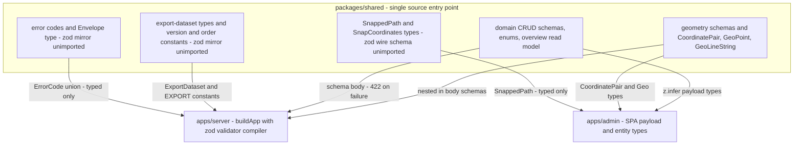

# Shared package: types, zod schemas and cross-app contracts

`@komyuter/shared` is the single contract that `apps/server` and `apps/admin` compile against. It is deliberately small: one private workspace package, one source entry point, one dependency (`zod`), and no build or test tooling of its own. Every admin CRUD request body is declared here, and every geometry value, error code and export-document field that crosses the wire is typed here.

This page describes what the package actually owns, which half of each contract is enforced at runtime and which half is a compile-time promise, and what a change inside it ripples into. The authority ladder still applies: decisions belong to `docs/adr/*` and `AGENTS.md`; this page records current behaviour. Fare semantics are **ADR-0001** and coordinate order is **ADR-0013** — both are cited, not restated.

## What the package is

| Property | Value |
| --- | --- |
| Package name | `@komyuter/shared` (`packages/shared/package.json`) |
| Entry point | `.` → `./src/index.ts`, also `types` → `./src/index.ts` — TypeScript source, no `dist` |
| Scripts | None. No build, no lint, no test script of its own |
| Runtime dependency | `zod` only |
| Consumers | `apps/server` (`workspace:*`) and `apps/admin` (`workspace:^`) |
| Not a consumer | `apps/mobile` — the Expo app has no dependency on this package |

The package is source-only by design, not by omission: there is no build script for turbo to run, and the root `typecheck` script compiles `packages/shared/tsconfig.json` explicitly. Consumers therefore compile the same `.ts` files the package type-checks itself — there is no published artifact and no stale-`dist` failure mode.

## One entry point, two consumers, one validator

`packages/shared/src/index.ts` re-exports five type modules and five schema modules and nothing else:

```ts
export * from "./types/geometry";
export * from "./types/domain";
export * from "./types/envelope";
export * from "./types/export-dataset";
export * from "./types/mapbox";

export * from "./schemas/geometry";
export * from "./schemas/domain";
export * from "./schemas/envelope";
export * from "./schemas/export-dataset";
export * from "./schemas/mapbox";
```

There are no subpath exports, so every import in the repository is `from "@komyuter/shared"`, and one specifier can carry both a schema value and a type inferred from it (`createFareConfigSchema` and `OverviewRouteEntity`). That flat barrel is what makes the package a contract rather than a utility library: a name that is not re-exported here is unreachable to both apps.



What the barrel feeds: a runtime body validator on the server, compile-time types in both apps, and three schema modules whose zod half is imported by nobody.

### The server side: schemas become behaviour

`buildApp` creates Fastify with `withTypeProvider<ZodTypeProvider>()` and installs the zod `validatorCompiler` and `serializerCompiler` from `@fastify/type-provider-zod`. Twelve admin endpoints then attach a shared schema as `{ schema: { body: … } }`:

| Resource | Create / update schemas |
| --- | --- |
| Routes | `createRouteSchema`, `updateRouteSchema` |
| Directions | `createDirectionSchema`, `updateDirectionSchema` |
| Stops | `createStopSchema`, `updateStopSchema` |
| Detours | `createDetourSchema`, `updateDetourSchema` |
| Restrictions | `createRestrictionSchema`, `updateRestrictionSchema` |
| Fare configs | `createFareConfigSchema`, `updateFareConfigSchema` |

The full endpoint table is on [Server API surface](../operations/server-api-surface.md). The login route uses a local `loginSchema`, not a shared one — it is the only body schema defined outside this package.

Two consequences follow from that wiring, and they are the reason a schema edit is never a local edit:

- **Validation happens before the handler.** A body that fails a shared schema never reaches the route function; the central error handler turns the validation failure into `422 { success: false, error: { code: "VALIDATION_ERROR", message } }`. Tightening a schema therefore changes the API's observable failure mode with no change in any handler.
- **Nothing on the response side is schema-driven.** The serializer compiler is installed, but no route in `apps/server/src/api` declares a `response` schema, so shared zod schemas currently constrain requests only. Every success body is written literally as `{ success: true, data: … }`.

Error codes are the other compile-time coupling: `apps/server/src/api/errors.ts` types `ApiError.code` as the shared `ErrorCode` union and provides the `unauthorized`/`forbidden`/`notFound`/`validationError`/`conflict`/`internal` factories that pair each code with its status. Adding a member to `ERROR_CODES` does not make it reachable — a factory (and, for the two generic cases in `app.ts`, a literal in the error handler) has to produce it.

### The admin side: types, but not the schemas

The SPA imports the barrel for two things: geometry/enum/entity types (`CoordinatePair`, `GeoLineString`, `GeoPoint`, `StopType`, `SnappedPath`, `OverviewRouteEntity`, `FareConfiguration`) and, in one place, schemas used purely for inference — `apps/admin/src/features/fares/api.ts` derives `CreateFareConfigPayload` and `UpdateFareConfigPayload` with `z.infer` from `createFareConfigSchema`/`updateFareConfigSchema`.

That is the whole runtime story in the admin: it *types* against the contract but does not *parse* with it. The fare form's input validation is a hand-written mirror of the same numeric rules in `apps/admin/src/features/fares/validation.ts`, and the client envelope handling lives in the axios interceptor of `apps/admin/src/lib/api.ts` rather than in a shared schema — see [Admin data layer and client state](../apps/admin-data-layer-and-client-state.md).

## Geometry: the structural rules and the `[lng, lat]` convention

`types/geometry.ts` defines `CoordinatePair = [number, number]`, `GeoPoint` (`type: "Point"` + one pair) and `GeoLineString` (`type: "LineString"` + pairs). `schemas/geometry.ts` is the mirror, and it is the *only* place the package states structural geometry rules:

- `coordinatePairSchema = z.tuple([z.number(), z.number()])` — exactly two numbers, no range check, no order check.
- `geoPointSchema` / `geoLineStringSchema` pin the GeoJSON type literals, so a `Polygon` or a `Feature` is rejected.
- `geoLineStringSchema` requires `.min(2)` coordinate pairs. This is the package's one length invariant, and the schema unit test asserts it (a one-point `LineString` is refused).

Coordinate order is **`[lng, lat]` everywhere** — GeoJSON, PostGIS, MapLibre and the admin UI, with no conversion layer, by decision (**ADR-0013**, which supersedes ADR-0007's Leaflet exception; a converter must not be added). The package cannot express that order in a tuple of two `number`s, so it does not try: the tuple is structural only and says nothing about which ordinate is which. The order is carried by convention and by downstream consumers (`ST_GeomFromGeoJSON` narrowing to `geometry(Point,4326)`/`geometry(LineString,4326)`, MapLibre's native `[lng, lat]`), and the single written statement of it inside this package is the `SnapCoordinates` doc comment. The wider story of the invariant is on [Coordinates and spatial math](../concepts/coordinates-and-spatial-math.md).

### Range checking sits on the server, and is currently test-only

The server composes the shared schemas with a geographic sanity layer in `apps/server/src/domain/geometry.ts`:

- `validateGeoPoint` / `validateGeoLineString` call `geoPointSchema.safeParse` / `geoLineStringSchema.safeParse` first, then check that every pair is a finite `lng` in `[-180, 180]` and `lat` in `[-90, 90]`, flattening zod issues into `{ path, message }` (`ValidationIssue`).
- The `[longitude, latitude]` reading of the pair — and the message `Coordinate pair must be [longitude, latitude]` — exists only in that guard; its unit test also pins the honest limit of the check: an in-range pair passes "regardless of presumed order", because range is the only enforceable property of an unlabelled tuple.

Nothing in a shipped request path calls those two functions today: the only importer of `domain/geometry.ts` is `apps/server/tests/unit/geometry.test.ts`, and the write paths pass `body.location` / `body.entry` / `body.base_polyline` straight into the `asPointFromGeoJSON` / `asLineStringFromGeoJSON` helpers, which are `ST_GeomFromGeoJSON(...)` casts to `geometry(Point,4326)` / `geometry(LineString,4326)`. So on the live API the geometry rules that actually run are the shared ones — the GeoJSON type literal, two numbers per pair, two or more pairs for a `LineString` — plus whatever the write cast rejects. Out-of-range but well-formed coordinates are not stopped by a range gate.

## Domain schemas: create/update pairs, enums, the read model

`schemas/domain.ts` is the largest module of the package and covers six resources.

**Enums.** `stopTypeSchema` (`terminal` / `major_stop` / `waiting_area`), `restrictionReasonSchema` (`no_stopping_zone` / `contraflow` / `pedestrian_hostile`) and `restrictionAffectsSchema` (`boarding` / `alighting` / `both`). Their string lists are *duplicated*: `types/domain.ts` declares `STOP_TYPE_VALUES` / `RESTRICTION_REASON_VALUES` / `RESTRICTION_AFFECTS_VALUES` as `as const` arrays and derives the union types, while the schema file spells the same literals out again in `z.enum([...])`. Adding a stop type or restriction reason therefore means editing two files that the compiler will not correlate. `errorCodeSchema` is the counter-example that shows the intended pattern — it is `z.enum(ERROR_CODES)`, derived from the const array, so the envelope can never drift from its own schema.

**Create/update pairs.** Each resource has a strict `createXSchema` and an `updateXSchema = createXSchema.partial().extend({ is_active })`, so `is_active` is patch-only for every resource — the exception being routes, whose `createRouteSchema` already accepts it. Notable rules:

- `routeIdSchema` — 1–100 characters, lower-case slug `^[a-z0-9]+(?:-[a-z0-9]+)*$`; `createRouteSchema` makes it optional because the server generates a slug when it is absent, and the reserved slug handling lives in the handler ([Server API surface](../operations/server-api-surface.md)).
- `color` — `^#[0-9a-fA-F]{6}$` or `null`. A named colour such as `"blue"` is refused by the schema, not by the UI.
- `stop_order` — `z.number().int().min(1)`, optional; `createStopSchema` requires `type`, while `detourStopSchema` leaves `type` optional and the handler defaults it to `waiting_area`. Detour stops carry no `stop_order` in the payload at all: their order is the array position.
- Restriction indices — `from_coord_index` / `to_coord_index` are `int().min(0)` with no ordering rule, so `from > to` is accepted by the schema and left to domain checks against the base polyline.
<!-- openwiki: broken internal link [../concepts/fares-and-fare-configurations.md] file "../concepts/fares-and-fare-configurations.md" does not exist. Fix the href or restore the target, then delete this comment. -->
- Fare configuration — `base_fare`, `base_distance_km`, `rate_per_km` are `nonnegative()`, discounts are clamped to `[0, 100]`. These are *parameters only*: the package stores, validates and exports fare inputs and never evaluates a fare. The two fare notions (displayed per-leg total vs. the Dijkstra internal cost) are **ADR-0001**; see [Fares and fare configurations](../concepts/fares-and-fare-configurations.md). The schema test asserting the LTFRB defaults pass validation is about the default parameter values, not about any formula.

**The overview read model.** `overviewStopSchema` (id/name/type/location) and `overviewRouteSchema` (route fields + nullable `base_polyline`/`return_polyline` + stops) exist so the admin's overview screen can fetch every route's geometry in one request. Their practical export is the *type* `OverviewRouteEntity` — that is what `apps/admin` compiles against in its route cache and overview helpers, while the server's `/api/admin/routes/overview` handler builds the payload from `loadDirectionFull` and declares no response schema. The stops the server returns are wider than the declared lean shape (they are full stop entities); the admin reads only the four declared fields. See [Directions and the derived return](../concepts/directions-and-derived-return.md) for why both polylines are nullable.

**Hand-written entity interfaces.** `types/domain.ts` also declares `Route`, `Direction`, `Stop`, `Detour`, `DetourStop`, `Restriction` and `FareConfiguration` as plain interfaces — they are not `z.infer`ed from the schemas, so the two representations can disagree without a compile error. Today only `FareConfiguration` has an importer (the admin fare API extends it); the server declares its own `*Entity` interfaces in `apps/server/src/domain/entities.ts`, and the admin declares its own row interfaces per feature. Treat the entity interfaces as the *documented* database row shape rather than as a type every consumer must use.

## The envelope and error codes

`types/envelope.ts` owns the wire envelope:

- `ERROR_CODES` = `UNAUTHORIZED`, `FORBIDDEN`, `NOT_FOUND`, `VALIDATION_ERROR`, `CONFLICT`, `INTERNAL`, with `ErrorCode` derived from it.
- `ErrorBody` = `{ code, message }`.
- `Envelope<T>` = `{ success: true; data: T } | { success: false; error: ErrorBody }`.

`schemas/envelope.ts` mirrors it as `errorCodeSchema` (derived from `ERROR_CODES`), `errorBodySchema`, and the `successEnvelopeSchema` / `failureEnvelopeSchema` / `envelopeSchema` factories that take a data schema.

Those five schema names — and the `Envelope<T>` / `ErrorBody` types beside them — are imported nowhere in `apps/`; only `ErrorCode` is (by `apps/server/src/api/errors.ts`). The server writes the success object literally in each handler and maps failures centrally in `buildApp`'s error handler (`ApiError` → its own status/code; a validation error → `422 VALIDATION_ERROR`; anything else → `500 INTERNAL` with a logged error and a generic message). The admin unwraps the same shape in its axios response interceptor, rejecting with a local `ApiError` class that also synthesises the non-shared codes `NETWORK` and `UNAUTHORIZED`. The envelope is therefore a convention held by both sides' code and by the client interceptor — the shared schema is documentation, not a gate. Any new code must be produced by the server's error factories and tolerated by the admin's string-typed `ApiError`, because the union does not constrain the client.

## The dataset export contract

`types/export-dataset.ts` is the one place the export document's identity lives:

- `EXPORT_SCHEMA_VERSION = "1.1"` and `EXPORT_COORDINATE_ORDER = "lng_lat"`, both used as `typeof` literal types inside `ExportDataset`, so `schema_version` and `coordinate_order` are literal-typed fields rather than bare strings.
- `ExportFareConfiguration`, `ExportRestriction`, `ExportStop`, `ExportDetour`, `ExportDetourStop`, `ExportDirection`, `ExportRoute`, `ExportDataset` — a shallow, denormalized document with `fare_configs[]` and `routes[]` at the top, each route carrying `directions[]`, and each direction carrying `stops[]`/`detours[]`/`restrictions[]` (detours also nesting their own stops). Unlike the domain types, these are the shape that the server's assembler is *required* to return: `buildExportDataset` is typed `ExportDataset`, so the interface is compiler-enforced at the producer.

`schemas/export-dataset.ts` mirrors that interface field by field with its own constraints — `z.string().min(1)` ids, `exported_at: z.string().datetime()`, `stop_order: int().min(1)`, and `additional_distance_meters: int().nullable()`, which is *looser* than the write-path `createDetourSchema` that requires `.min(0)` — and pins the two constants as `z.literal(EXPORT_SCHEMA_VERSION)` / `z.literal(EXPORT_COORDINATE_ORDER)`. Because both the assembler and the schema read the same constants, bumping the version is a one-line change that moves the document and its validator together.

The enforcement, though, does not run through this schema. `GET /api/admin/export/dataset` streams whatever `assembleExportDataset` produced — raw JSON, not enveloped, with a `Content-Disposition` filename — and nothing validates it against `exportDatasetSchema` at runtime, because no module imports it. The dataset *is* verified in tests, but against a different artifact: `apps/server/tests/helpers/dataset-schema.ts` loads `specs/001-local-supabase-backend/contracts/export-dataset.schema.json` into Ajv (with `ajv-formats`, both server devDependencies) and compiles it, and the export integration test asserts `schema_version === "1.1"` and `coordinate_order === "lng_lat"` after `assertDatasetValid(dataset)`. That JSON Schema copy sets `additionalProperties: false` at every level, so a field added to `ExportDataset` without adding it to the spec JSON Schema fails the integration test rather than the shared schema. `referenceCheck` — the referential pass that reports dangling terminals and stop/detour ids colliding with direction ids — is likewise a pure function exercised only by tests; the route calls `assembleExportDataset` alone. Details of grouping, ordering and the export flow are on [Dataset export pipeline](../workflows/dataset-export-pipeline.md).

## The Mapbox snap contract, and the one wire/type disagreement

`schemas/mapbox.ts` declares the wire shape of the admin snap proxy: `polyline` (a `GeoLineString`), `distance_meters` (nonnegative), `snapped`, `warning` (nullable), with field names mirroring Mapbox's snake_case JSON so the response can be passed through. `GET /api/admin/mapbox/directions` returns exactly that shape, including the straight-line fallback with `distance_meters: 0`, `snapped: false` and `warning: "no_token"` / `"upstream_error"` (see [Mapbox Directions proxy](../integrations/mapbox-directions-proxy.md)).

`mapboxDirectionsResponseSchema` is exported but applied nowhere — no handler attaches it as a response schema and no client parses with it. The type half of the module *is* used, and there the two halves disagree:

- `types/mapbox.ts` documents `SnappedPath` as the "camelCase counterpart of the wire `MapboxDirectionsResponse`", with `distanceMeters`, and declares `SnapCoordinates` (also unimported).
- `apps/admin/src/features/routes/routesApi.ts`'s `snapPreview` types the proxy response as `SnappedPath` and returns it unmodified; the axios interceptor only unwraps the envelope. No mapping layer exists between the two names.
- The consequence is visible in code: the plotting store writes `snap.distanceMeters = result.distanceMeters`, which is `undefined` at runtime, because the server emits `distance_meters` (the proxy's own unit test asserts `data.distance_meters`). Today this has no user-visible symptom — the workspace reads only `snap.snapped` and `snap.warning` — and the store's unit tests inject camelCase fakes, so they cannot detect it either.

Unlike the coordinates rule, this is a genuine contract inconsistency rather than a deliberate one: one name has to win, either by aligning `SnappedPath` with the wire field or by aligning the wire field with the type. Whoever changes it should keep the "field names mirror Mapbox's snake_case JSON so the response passes through" property or drop it deliberately — but note that the coordinate *order* is a separate, settled decision (ADR-0013) and needs no conversion layer.

## Not in this package today

- **No `fareCalculator`.** The package exports types and schemas only; there is no fare formula, no arithmetic helper and no oracle. `AGENTS.md` and the Wiki brief describe a shared `fareCalculator` as planned — reuse, never reimplement — and `docs/DEVIATIONS.md` §0 records the current state as "types + Zod schemas only". Fare configs are stored and exported *parameters*.
- **No preference-profile weights.** `docs/DEVIATIONS.md` D9 tracks the multi-criteria weights (`shortest` / `cheapest` / `least_transfers` / `balanced`) as planned / not implemented, to be added here when the routing engine is built. The `preference` identifier does not occur in this package.
- **No navigation or graph types.** No route request/response contract, no node/edge, no normalized-cost concept, no ETA field anywhere (ADR-0009). The negative-space inventory is on [Routing, navigation and trust are not implemented](../concepts/routing-and-navigation-scope.md).
- **No tests of its own, and no CI coverage of its schemas.** The schema behaviour that is pinned by tests lives in `apps/server` (`tests/unit/schemas.test.ts`, `tests/unit/geometry.test.ts`), and CI runs only the admin suite plus typecheck, lint, format and build. Schema regressions are therefore caught in CI by typecheck alone; the behavioural tests are a local pre-merge obligation.
- **Documentation drift to be aware of.** `docs/DEVIATIONS.md` D7 and ADR-0012 still describe detour stops as the `detours.notable_stops` JSONB field (with a `notableStopSchema` named in `docs/ADMIN.md`); the code has moved on — `notable_stops` was dropped by migration `0004` and replaced by the `detour_stops` table (migration `0005`) with `detourStopSchema` / `DetourStop` / `ExportDetourStop` as the shared contract, and no `notableStopSchema` exists in this package.

## Changing the package safely

- **Adding a create/update field.** Edit `schemas/domain.ts`, then the handler that persists it (the schema only gates the request; unknown fields are stripped, not stored). The admin payload type follows automatically only where it is `z.infer`ed — currently just the fare-config payloads; every other admin row interface is hand-written and must be updated by hand.
- **Adding an enum value.** Two files (`types/domain.ts` const array and `schemas/domain.ts` `z.enum`), plus every exhaustive consumer. The envelope shows how to avoid that duplication by deriving the schema from the const array.
- **Adding an error code.** `types/envelope.ts`, plus a factory in `apps/server/src/api/errors.ts` for it to be reachable, plus client tolerance (the admin types codes as `string`).
- **Changing the export document.** `types/export-dataset.ts` for the interface and, if the version moves, `EXPORT_SCHEMA_VERSION`; the zod mirror; the assembler in `apps/server/src/domain/export.ts`; and `specs/001-local-supabase-backend/contracts/export-dataset.schema.json`, which is what the integration test actually enforces. Never reorder coordinates: `coordinate_order: "lng_lat"` is a self-describing marker for the external consumer, not a knob (ADR-0013).
- **Changing geometry.** The tuple is order-agnostic by construction, so no schema change can enforce `[lng, lat]`; adding a converter is explicitly not the answer (ADR-0013). Range validation belongs in the server guard that already wraps the shared schemas — which today is not wired into any request path.

## Tests that pin this contract

| Test | What it pins |
| --- | --- |
| `apps/server/tests/unit/schemas.test.ts` | Shared schema rules imported from the barrel: slug acceptance/rejection, `color` hex, `LineString` ≥ 2 pairs, restricted stop types, `stop_order` positivity, restriction reason enum, fare-config bounds including the LTFRB defaults |
| `apps/server/tests/unit/geometry.test.ts` | The server-side range guard layered on `geoPointSchema`/`geoLineStringSchema`, including that in-range pairs pass regardless of presumed coordinate order |
| `apps/server/tests/unit/export.test.ts` | Assembled `schema_version`/`coordinate_order`, `Number()` conversion of string-mode numeric columns, and `referenceCheck`'s collision/terminal findings |
| `apps/server/tests/integration/export.test.ts` | The served dataset validates against the spec JSON Schema with Ajv, plus `1.1` / `lng_lat` |
| `apps/server/tests/unit/mapbox-proxy.test.ts` | The proxy's snake_case wire field `distance_meters` and the 422 path for malformed coordinates |
| `apps/admin/src/tests/plotting-store.test.ts` | The plotting store's snap lifecycle against an injected camelCase `SnappedPath` fake — which is why the `distance_meters`/`distanceMeters` disagreement is invisible here |

## Related pages

- [Server API surface](../operations/server-api-surface.md) — which endpoint consumes which schema, and the envelope/error contract in practice.
- [Admin data layer and client state](../apps/admin-data-layer-and-client-state.md) — the admin's typed clients and envelope interceptor.
- [Coordinates and spatial math](../concepts/coordinates-and-spatial-math.md) — the `[lng, lat]` invariant end to end.
<!-- openwiki: broken internal link [../concepts/fares-and-fare-configurations.md] file "../concepts/fares-and-fare-configurations.md" does not exist. Fix the href or restore the target, then delete this comment. -->
- [Fares and fare configurations](../concepts/fares-and-fare-configurations.md) — fare parameters, defaults and ADR-0001's two notions.
- [Dataset export pipeline](../workflows/dataset-export-pipeline.md) — how `ExportDataset` is assembled and what the external consumer sees.
- [Mapbox Directions proxy](../integrations/mapbox-directions-proxy.md) — the snap endpoint behind `SnappedPath`.
- [Routing, navigation and trust are not implemented](../concepts/routing-and-navigation-scope.md) — the planned-but-absent shared surface.
