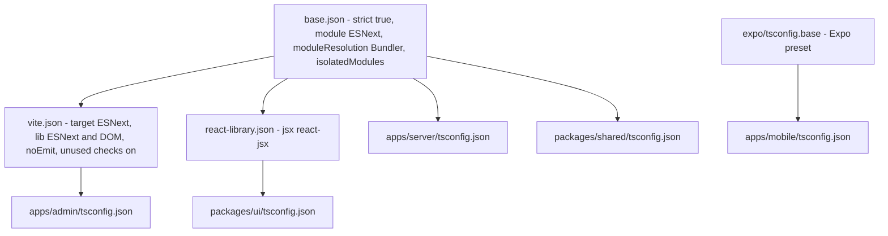

# Shared UI primitives and the TypeScript config presets

`packages/ui` and `packages/typescript-config` are the workspace's two supporting packages, and they are not equally load-bearing. `@repo/typescript-config` is real infrastructure: four of the five type-checked projects in the repository inherit their compiler options from one of its three presets, and that is where `strict: true`, `moduleResolution: "Bundler"` and the admin's extra unused-code checks are defined. `@repo/ui` is not: it still holds the two unstyled components that came with the `create-turbo` "with-vite-react" starter, and **no workspace package depends on it or imports it**.

This page covers what each package owns, which project extends which preset and what that means when a preset changes, the honest state of the UI package including the parts of its `exports` map that point at files that do not exist, and the rule that ESLint is owned solely by the root flat config — per-package lint configs and `@repo/eslint-config` were removed and must not come back. The gate mechanics themselves (CI order, husky hooks, Turbo tasks) belong to [Workspace, build and CI](../architecture/workspace-build-and-ci.md); the other source-only contract package is on [Shared package: types, zod schemas and cross-app contracts](./shared-contracts.md).

| Package | Path | Name | Scripts | Depended on by |
| --- | --- | --- | --- | --- |
| Shared UI primitives | `packages/ui` | `@repo/ui` | none — no `build`, `test`, `lint` or `dev` | nothing |
| TypeScript config presets | `packages/typescript-config` | `@repo/typescript-config` | none — consumed purely through `extends` | `apps/admin`, `apps/server`, `packages/shared`, `packages/ui` (all as devDependencies) |

Both are workspace members via the `packages/*` glob. Neither has a build step, a test file or a task in `turbo.json`, and neither is type-checked by Turbo: `packages/ui` is checked because the root `typecheck` script names it explicitly.

## `@repo/typescript-config`: three presets, one source of strictness

The package is JSON only — four files, no code. `package.json` marks it `"private": true` at `version 0.0.0`, so it is never published; consumers pull it in as `workspace:*` / `workspace:^` devDependencies and reference it by package specifier in `extends`, not by relative path.



Which preset each project extends; `apps/mobile` is the only project outside the `@repo/typescript-config` family.

### What each file contributes

| File | Adds on top of the parent | Notable effect |
| --- | --- | --- |
| `base.json` | Nothing — it is the root preset | `strict: true`, `module: "ESNext"`, `moduleResolution: "Bundler"`, `isolatedModules: true`, `esModuleInterop`, `forceConsistentCasingInFileNames`, `declaration` + `declarationMap`, `skipLibCheck: true`, `preserveWatchOutput`, `composite: false`, and explicitly `noUnusedLocals: false` / `noUnusedParameters: false`; `exclude: ["node_modules"]`. No `target`, `lib`, `jsx` or `noEmit`. |
| `vite.json` | `base.json` | `target: "ESNext"`, `lib: ["ESNext", "DOM"]`, `useDefineForClassFields`, `resolveJsonModule`, `sourceMap: true`, `noEmit: true`, and it flips the unused-code checks **on**: `noUnusedLocals: true`, `noUnusedParameters: true`, plus `noImplicitReturns: true`. Repeats `exclude: ["node_modules"]`. |
| `react-library.json` | `base.json` | Only `jsx: "react-jsx"`. |

The asymmetry inside that table is the part worth remembering: `vite.json` is strictly stricter than `base.json`. The admin build fails on an unused local or a non-returning code path, while `apps/server`, `packages/shared` and `packages/ui` type-check cleanly with both.

### Who extends what

| Project | `extends` | Its own additions |
| --- | --- | --- |
| `apps/admin` | `@repo/typescript-config/vite.json` | `jsx: "react-jsx"`, `strictNullChecks: true` (redundant under `strict`), the `@/*` → `./src/*` path alias, `include: ["src"]` |
| `apps/server` | `@repo/typescript-config/base.json` | `outDir: "dist"`, `types: ["node"]`, `include: ["src", "tests"]` |
| `packages/shared` | `@repo/typescript-config/base.json` | `include: ["src"]` |
| `packages/ui` | `@repo/typescript-config/react-library.json` | `include: ["."]`, `exclude: ["node_modules"]`, `strictNullChecks: true` |
| `apps/mobile` | `expo/tsconfig.base` | Its own `strict: true` and `@/*` → `./*` |

`apps/mobile` is the exception that proves the rule: it keeps Expo's preset and re-declares `strict: true` itself, so it is not covered by any change to these files — see [Mobile commuter app](../apps/mobile-commuter-app.md).

### Consequences that matter when you edit a preset

- **Strictness is defined once and extended, never redefined.** `AGENTS.md` and `.specify/memory/constitution.md` both make this a project rule: a new project extends `@repo/typescript-config` rather than copying compiler options. `strict: true` therefore has exactly one owner.
- **`moduleResolution: "Bundler"` is what allows relative imports to be extensionless across every project that extends these presets.** `apps/server/src/index.ts` imports `"./api/app"`, `packages/shared/src/index.ts` re-exports `"./types/geometry"`, and `packages/ui/index.ts` re-exports `"./components"` — all without `.js` suffixes, which `NodeNext` resolution would reject. `tsx` and Vite resolve them at runtime. Changing `module`/`moduleResolution` in `base.json` would break `apps/server`, `packages/shared` and `packages/ui` relative imports simultaneously.
- **`vite.json` sets `noEmit: true`, so the admin's `tsc` step is a type-check only.** The admin's build script is `tsc && vite build`; the preset guarantees `tsc` emits nothing and Vite writes the bundle. The server inherits the opposite posture from `base.json` (`declaration` + `declarationMap`, `outDir: "dist"`), so its `tsc` build emits JavaScript plus declaration files.
- **A preset edit is a multi-project edit.** `pnpm typecheck` compiles `packages/ui`, `apps/admin`, `apps/mobile`, `apps/server` and `packages/shared` with no Turbo cache, in one chained command, so a `base.json` change is verified across the three projects that extend it (plus the admin indirectly, via `vite.json`) by a single run. The CI ordering around those gates is on [Workspace, build and CI](../architecture/workspace-build-and-ci.md).
- **`skipLibCheck: true` is inherited by every project**, so type errors inside `node_modules` declarations do not fail any gate.

## `@repo/ui`: two starter components, no consumer

### What is actually in it

The package is six files, and its whole public surface is a two-level barrel:

```
packages/ui/index.ts               export * from "./components";
packages/ui/components/index.ts    export * from "./header"; export * from "./counter";
```

| Component | Signature | Renders |
| --- | --- | --- |
| `Counter` | `React.FC` — no props | A `<button id="counter">` whose label is a local `useState(0)` counter, incremented by one on click |
| `Header` | `React.FC<HeaderProps>` where `HeaderProps = { title: string }` (the interface is not exported) | `<header id="header"><h1>{title}</h1></header>` |

Neither component carries any styling: no Tailwind classes, no design tokens, no `cn` helper, nothing from the Route Sign visual system in `DESIGN.md`. The `id="counter"` / `id="header"` hooks they render belong to the starter's `web` app, which no longer exists.

The `Counter`/`Header` split is the package's only extension pattern: a new component becomes public by being added to `components/` and re-exported from `components/index.ts`, because the root barrel re-exports the whole sub-barrel.

### The `exports` map overstates the package

`packages/ui/package.json` declares four entry points, but only one resolves:

| Subpath | Target | Reality |
| --- | --- | --- |
| `.` | `./index.ts` | Exists — the barrel above |
| `./counter` | `./components/counter.ts` | The file is `components/counter.tsx`, so the declared target does not exist |
| `./header` | `./components/header.ts` | Same extension mismatch — the file is `components/header.tsx` |
| `./setup-counter` | `./utils/counter.ts` | There is no `utils/` directory anywhere in the package; the target is missing entirely |

Nothing surfaces this because nothing imports the package. It is a leftover of the starter's `exports` map, and it is the one thing to fix before `@repo/ui` is used from an app — a consumer should import from `@repo/ui` (or the named exports) rather than from these subpaths.

Two further latent hazards in the same file, again harmless only while the package has no consumers:

- **Runtime and type versions disagree.** The runtime dependencies are `react` and `react-dom` at `^18.2.0`, while the devDependencies are `@types/react` `^19.0.1` and `@types/react-dom` `^19.0.2`. The declared types are a major version ahead of the declared runtime.
- **React is a regular dependency, not a peer dependency.** An app that imports `@repo/ui` would install a nested React rather than sharing its own, which is the classic duplicated-React failure mode in a pnpm workspace.

### Why nobody consumes it

No workspace package declares `@repo/ui`, and no source file in the repository imports it. The "shared UI kit" role it nominally has is filled in practice by the admin's own component layer: `apps/admin/src/components/ui/` holds 18 locally generated shadcn-style primitives built on `@base-ui/react` (including `button.tsx`, `dialog.tsx`, `sheet.tsx`, `sidebar.tsx`, `table.tsx`), and `apps/admin/src/components/shared/` holds the app-level pieces (`Plate.tsx`, `NoticePlate.tsx`, `SectionLabel.tsx`, `BrandMark.tsx`, `ConnectionBanner.tsx`, `Toaster.tsx`). The visual vocabulary that is genuinely shared across surfaces is `DESIGN.md` and `PRODUCT.md`, not a package. The admin's own layer is described on [Admin SPA shell: providers, routes, rail and workspace gates](../apps/admin-shell-and-routing.md).

So the accurate statement of the current state is: **`packages/ui` is starter-level primitives with no reuse**, and the admin is self-contained. That is also why the package can be changed — or deleted — without affecting any runtime behaviour. Its only protection today is the type-check, lint and format gates:

- `pnpm typecheck` (`package.json`) runs `tsc --noEmit -p packages/ui/tsconfig.json` as the first of its five projects.
- The root flat config's lint scoping covers `packages/ui/**/*.{ts,tsx}`.
- The prettier glob `**/*.{ts,tsx,md}` covers its TypeScript files.
- There are no unit tests for it, because it contains no logic to test.

## ESLint ownership: one root flat config, and only one

Lint configuration is deliberately centralised. `eslint.config.mjs` at the repository root is the only ESLint configuration in the repository, and `pnpm lint` runs a bare `eslint .` rather than `turbo run lint`. `apps/mobile` is the only package that declares a `lint` script of its own; `packages/ui` and `packages/typescript-config` declare none.

For this page's two packages the scoping means:

- `packages/ui/**/*.{ts,tsx}` sits in the config's `webUiFiles` array, so its components are linted with the React rules — `react-hooks/rules-of-hooks` as an error, `react-hooks/exhaustive-deps` and `react-refresh/only-export-components` as warnings — plus browser globals, with `@typescript-eslint/no-non-null-assertion` turned off.
- `packages/typescript-config` is JSON, so no lint block matches it; its JSON files are also outside the root format glob and are only prettier-checked on staged files by `lint-staged`.
- The config carries two historical remnants worth knowing about rather than fixing blind: `webUiFiles` still lists `apps/web/**`, an app deleted in commit `c9bf984`, so those globs match nothing, and the root `README.md` still advertises both a `web` app and an `@repo/eslint-config` package. Both are documented on [Workspace, build and CI](../architecture/workspace-build-and-ci.md).

**The rule that must not be undone:** `@repo/eslint-config`, all `.eslintrc.*` files and all per-package lint configs were removed in favour of the single flat config, and `AGENTS.md`, `.specify/memory/constitution.md` and `docs/ADMIN.md` all state that they must not be recreated. A new source package therefore gets linted by the root config's globs — the work is adding or widening a scoping block in `eslint.config.mjs`, not adding a config file to the package. The same applies to type-checking: a new project is added to the root `typecheck` chain and to `extends` in the presets, not given its own compiler options.

## Change checklist

| Change | What to touch | What to run |
| --- | --- | --- |
| Add or change a shared component in `packages/ui` | The component file plus `components/index.ts` (the barrel is the public surface) | `pnpm typecheck`, `pnpm lint`, `pnpm format:check` — nothing else imports it |
| Make `@repo/ui` consumable by an app | Fix the `exports` map and reconcile React to a peer dependency | `pnpm install`, then the consuming app's build and tests |
| Tighten a compiler option | `packages/typescript-config/base.json` for all four preset-consuming projects, or `vite.json` / `react-library.json` for one audience | `pnpm typecheck` (five projects), then `pnpm build` |
| Cover a new package with lint | A scoping block in `eslint.config.mjs` | `pnpm lint` — never a new `.eslintrc` |
