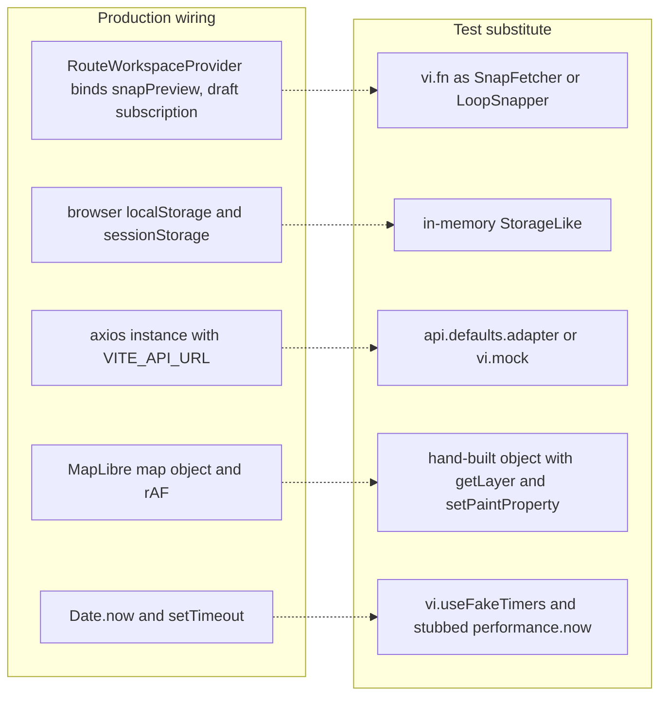

# Admin test suite: what is hermetic and what is not covered

`apps/admin` has one test suite: 23 files under `apps/admin/src/tests/`, run by a single `vitest run` (`"test": "vitest run"` in [`../../apps/admin/package.json`](../../apps/admin/package.json)), which CI invokes as `pnpm --filter admin test`. It is **the only test job CI runs** — the workflow comment states that the admin suite is the hermetic subset, running in the Node environment with no database, while `apps/server`'s integration half needs a live Supabase stack and stays a local pre-merge obligation ([`.github/workflows/ci.yml`](../../.github/workflows/ci.yml)). The consequence is the single most important thing to know about this page: a green pipeline proves that Node-importable behaviour inside `apps/admin` is intact, and nothing more. React components, MapLibre rendering and real HTTP calls are only covered by `format:check`, `lint`, `typecheck` and `vite build`. See [Workspace, build pipeline, lint and CI wiring](../architecture/workspace-build-and-ci.md) for the gate order and [Server tests](./server-tests.md) for the suite CI does not run.

The suite covers no DOM and no database. Its full target set is the pure and injectable half of the admin SPA: the two zustand stores (plotting and detour), the pure undo/redo transitions, the chain/connection helpers, the coordinate and overlap math, the localStorage mirrors with their TTLs, and the auth/session helpers. Everything it exercises is reachable from Node with no browser globals, and every test that needs a browser-ish dependency replaces it with a fake.

## How the suite is configured

[`../../apps/admin/vitest.config.ts`](../../apps/admin/vitest.config.ts) is four facts wide:

```ts
resolve: { alias: { "@": fileURLToPath(new URL("./src", import.meta.url)) } },
test: {
  environment: "node",
  include: ["src/tests/**/*.test.{ts,tsx}"],
  passWithNoTests: true,
}
```

- **`environment: "node"`** — no jsdom, no `@testing-library/*` in `apps/admin`'s dependencies at all. A test that needs a DOM has to install the fake itself, which is exactly what the auth and fade tests do (`globalThis.localStorage = storage`, `globalThis.requestAnimationFrame = …`).
- **`include` allows `.tsx` but no `.test.tsx` exists**, so the glob is aspirational: nothing in the suite mounts a component.
- **`passWithNoTests: true`** means a broken include pattern or an emptied test directory turns the CI test step green with zero tests executed. The gate proves the tests it found are green, not that it found any.
- The `@` alias is what lets every test import production modules by their real specifier (`@/lib/plottingStore`) rather than by relative path.

## Where hermeticity comes from: the seams tests depend on

Every module in the covered set was written so a Node test can substitute its ambient dependency. These seams are load-bearing: change one and the suite breaks, not because a test is brittle but because the only injection point disappeared.



Each ambient dependency of the covered modules, and the fake the suite substitutes for it.

| Seam | Production form | Test substitute | Where it is declared |
| --- | --- | --- | --- |
| Storage | `localStorage` via `defaultStorage()` | `MemoryStorage` / `fakeStorage()` implementing `StorageLike` | [`../../apps/admin/src/lib/draft.ts`](../../apps/admin/src/lib/draft.ts), [`../../apps/admin/src/lib/overviewCache.ts`](../../apps/admin/src/lib/overviewCache.ts) |
| Snap network call | `bindSnapFetcher((coords) => snapPreview(coords))` once in the workspace provider | `vi.fn` returning a `SnappedPath`, bound/unbound around each test | [`../../apps/admin/src/lib/plottingStore.ts`](../../apps/admin/src/lib/plottingStore.ts) |
| Detour road-following | `createDetourStore(snapFn = snapToLoop)`; the app's singleton `useDetourStore` uses the Mapbox proxy | `createDetourStore(stubSnap)` — a fresh store per test | [`../../apps/admin/src/features/detours/detourStore.ts`](../../apps/admin/src/features/detours/detourStore.ts) |
| HTTP | the shared axios instance | `api.defaults.adapter` replaced with a rejecting adapter, or `vi.mock("@/features/auth/api")` | [`../../apps/admin/src/tests/session-expired.test.ts`](../../apps/admin/src/tests/session-expired.test.ts), [`../../apps/admin/src/tests/restore.test.ts`](../../apps/admin/src/tests/restore.test.ts) |
| Clock | real `setTimeout`/`Date.now` | `vi.useFakeTimers()` + `advanceTimersByTimeAsync`, or an explicit `now` argument | debounce and TTL tests |
| Animation frame + clock | `requestAnimationFrame` + `performance.now()` | stubbed globals with a synthetic clock and a manual frame queue | [`../../apps/admin/src/tests/overviewFade.test.ts`](../../apps/admin/src/tests/overviewFade.test.ts) |

Three design decisions matter more than the rest, and the code says so in its own comments:

- **Module-scope orchestration lives outside the store, on purpose.** The snap fetcher, debounce timer, generation counter and "last edit entry" are module-level variables in `lib/plottingStore.ts`, because timers and the fetcher must survive `store.reset()` and must not be part of persisted state. The tests therefore have to call `bindSnapFetcher(null)` and `cancelPendingSnap()` in `afterEach`; a change that moves this state into the store changes the test lifecycle contract.
- **The detour store is a factory, not a singleton.** `createDetourStore(snapFn)` returns a store bound to one road-following engine; `export const useDetourStore = createDetourStore()` is the app's instance. Tests build a new store per case, so they never fight over global state the way the plotting tests do.
- **Transitions and selectors are pure functions.** `undoChanges`/`redoChanges`, `coalesceDragEntry`/`coalescePropsEntry`, `pushHistory`, `reorderStops`, `draftMatchesBaseline`, `visibleStopsForLayers` and `deriveUiState` are exported standalone so they can be tested without zustand, and `deriveUiState` takes only structural inputs — a route *count*, not the array — specifically to keep it pure (see [Admin data access, query cache and client state](../apps/admin-data-layer-and-client-state.md) for where those selectors are consumed).

## Store logic

### Plotting store (`lib/plottingStore.ts`)

The largest test file by far (`plotting-store.test.ts`, 1495 lines) pins the draft-edit state machine:

| Subject | What the tests establish |
| --- | --- |
| Stop lifecycle | `addStop` appends with an auto-default name (`Stop 1`) and defaults to the Waiting Area type; `moveStop` updates in place; `insertStopBetween` and `reorderStop` reorder the sequence; `removeStop` drops the stop *and* clears its selection |
| Selection | `selectStop`/`isStopSelected`/`clearSelection` semantics, used by the map layers |
| Snap orchestration | Debounced request after the last placement; idle with fewer than two stops; `pending` → `applied` auto-commit with no Apply step; a road-snap response is the only thing that becomes the committed path; a `snapped: false` straight-line fallback is recorded as a warning and **never** committed; a newer composition wins over a stale in-flight response |
| Save guard | `pathStopIds` is the association between the committed path and the ordered stops it was derived for; save requires it to match the current chain, and a stale association is nulled so a partial undo cannot leave a path routed through deleted stops |
| Undo/redo wiring | Each edit kind pushes its entry, one undo reverts a placement *and* its auto-committed path together (merged entries), redo re-applies, `clearHistory` empties both stacks |
| Dirty tracking | `captureSavedBaseline` snapshots the saved draft; `draftMatchesBaseline` compares stops and polyline by value, so undo back to the baseline hides the Save button; with no baseline the draft can never be confirmed clean |
| Layer filtering | `setLayers` merges partial patches, so toggling one control never disturbs another; `visibleStopsForLayers` gives per-stop-type control with no sub-filtering |
| Cache seed | `seedFromOverview` populates stops + polyline + baseline with `directionId: null` and `seedSource: "cache"`; it is a no-op when the draft already has stops or no route is open; `openRoute`/`reset` clear `seedSource` |
| Workspace state machine | `deriveUiState` maps `loaded`/`routeCount`/`routeId`/`focusedRouteId` onto `empty`/`overview`/`focus`/`edit`, with an opened route beating a focused one and `empty` never flashed while loading |
| Restore races | A restored draft whose `pathStopIds` no longer matches the restored chain untrusts the association and re-snaps; `resolvePendingSnap` settles a debounced snap so a save taken immediately after a rewire sees the new chain |

Two timing nuances worth knowing before changing the store. The tests read the exported `SNAP_DEBOUNCE_MS` rather than a literal, so the debounce *window length* is not pinned — only the ordering (nothing fires before the window, exactly one call after it). And the history stack itself has no length cap, so "undo all the way back" is bounded only by how many edits the admin made.

### Detour store (`features/detours/detourStore.ts`)

`detour-store.test.ts` and `detour-describe.test.ts` drive a fresh store built with a stub snapper and pin the branching-node authoring model (see [Detour authoring and persistence](../workflows/detour-authoring-persistence.md)):

- **Placement order.** Split first, merge second, then every click is a detour stop; the mode progresses `entry` → `exit` → `waypoint`.
- **Refusals are visible, not silent.** A merge placed *behind* the split produces a `refusal` of kind `order`, holds the refused tap, and `swapEntryExit` resolves the pair in one action; a merge within the 30 m degenerate minimum produces kind `degenerate` and leaves `exit` null.
- **Undo/redo per phase** (`FR-019`), with the past stack trimmed to `HISTORY_LIMIT` (50) snapshots.
- **Marker interactions** — dragging the split/merge nodes re-projects them onto the base polyline (an off-corridor drop is ignored), moving a detour stop records history and rebuilds the loop, and selecting a detour stop is cleared by placing another.
- **Display-only toggles.** `toggleDetourVisibility` only accumulates `hiddenDetourIds`; it never touches the composition.
- **Late-bound stops.** `setTargetStops` binds the direction's stops into the target once, and later calls are ignored.
- **The save gate is pure and blocks before any HTTP.** `validateSave()` refuses with a reason naming the first missing piece (split, merge, detour stops, instruction) and never fires the snapper; a passing call returns the exact server payload (`entry`, `exit`, `detour_polyline`, `additional_distance_meters`, `commuter_instruction`, `driver_instruction`, `detour_stops`).
- **Labels and distance.** The default label numbers from `existingDetourCount` (`Detour 3` after two existing detours); the rider instruction auto-fills only while empty; `additionalDistanceMeters` is the loop length minus the exact replaced base arc and is recomputed as waypoints grow.
- **Draft round trip.** `serializeDraft()` → `restoreDraft()` reproduces mode, node indices, stops and `target`, and leaves `draftOffer` false.

The detour store's save itself is *not* in the suite: `validateSave` produces the payload, but the POST/PUT issued by the editor component is exercised nowhere.

### History transitions (`lib/plottingHistory.ts`)

`plottingHistory.test.ts` tests the transition layer directly, without zustand: `emptyHistory`/`canUndo`/`canRedo`, `pushHistory` clearing the future branch after an undo, and `undoChanges`/`redoChanges` for the four declared edit kinds. It also pins the merge semantics — one undo reverts an edit and its snapped path together — and the coalescing helpers that fold a drag or a property keystroke burst into a single entry. The module's comment states the scope boundary explicitly: reordering and linking stay outside the history model, so an edit outside those four kinds can leave the draft permanently dirty.

### Chain and connection logic (`lib/connections.ts`)

`connections.test.ts` covers the stop-chain algebra used by the property dropdowns: `removeEdge` in either direction, `setStopLink` for the `from`/`to` slots (including the case where the requested predecessor is the stop's own successor, which reverses the edge, and the "None" case, which clears only the affected connection), `pathFromConnections` for deriving path order, and `connectionsFromStops` for rebuilding the consecutive chain — with the loop-closure tolerance shared with the snap and geometry code. The rewire trace is tested on a closed 1..10 loop, which is the case where a naive implementation flips half the chain.

## Pure geometry and spatial math

### Coordinates and distance (`lib/coords.ts`)

`coords.test.ts` (651 lines) is the pin on the arithmetic the plotting and detour flows build on: `parseCoordinatePair` for `"lng,lat"` strings, `coordinatesEqual` with an explicit epsilon, `nearestCoordIndex` (including `-1` for an empty line or an out-of-threshold point), Haversine `coordsDistanceMeters`, `straightLineThrough`, `polylineDistanceMeters`, `formatDistance`, `polylineSegmentLength`, `projectPointOnPolyline`, and `replacedArcLengthMeters` (the `FR-011` fractional-exactness case behind detour distance). Two behaviours are asserted as invariants rather than examples:

- **Endpoint legality (`pathEndsOnStops`)**: a path must start on the first stop and end on the last, and a loop that returns to its start stop is accepted (`FR-004`). Failures carry a `reason` of `"start"` or `"end"`, which is what the UI surfaces.
- **`LOOP_CLOSE_TOLERANCE_METERS` is 150 m and shared.** The same constant governs snap waypoint closure, chain closure and the transient connecting stub, so the three can never disagree — the module comment says this explicitly, and the tests cover the closure boundary.
- **`inferDetourFlanks`** is tested both for the ordinary case and for loop routes that wrap across the closing arc, because a wrong wrap silently produces a detour through the wrong half of the route.
- `resolveConnectingLine` is tested for the chain-line override (the map must reflect a rewire), the transient stub, and the `FR-006`/`FR-007` cases.

Coordinate order is `[longitude, latitude]` throughout, with no conversion layer, and the suite is a guardian of that: the fixtures and expectations are `[lng, lat]` pairs everywhere (see [Coordinates and spatial math](../concepts/coordinates-and-spatial-math.md)).

### Opposite-direction overlap (`lib/overlap.ts`)

`overlap.test.ts` tests `findOppositeOverlapRuns` and `shiftOverlapRuns` with flat-earth fixtures at Iloilo latitude. The asserted model: two passes overlap only when their vertices are within `OVERLAP_TOLERANCE_METERS` **and** their local travel directions are opposite, so same-direction convoys are ignored and genuinely different parallel roads outside tolerance never match; self-overlap needs the two vertices to be far apart *along* the line, so dense snapped geometry is not mistaken for a second pass. `shiftOverlapRuns` then moves each overlapping pass laterally by a real-world offset.

### Workspace geometry

`workspaceGeometry.test.ts` fixes the layout tokens (`leftCol` 256, `rightCol` 336, no gutter track, `minMapWidth` 400) and `computeMapWidth`'s viewport arithmetic for overview/focus/edit, including invariance to how the rail is passed, a floor at 0 and the literal-1024-window case that triggers the map gate. `isMapGateActive` is pinned at the 399/400/401 boundary. This is the only part of the workspace feature with automated coverage — see [Admin route workspace UI](../apps/admin-route-workspace-ui.md) for the components around it.

## Storage helpers

### Draft persistence (`lib/draft.ts`)

`draft.test.ts` drives the module through the `StorageLike` seam and pins the `FR-014` contract: the key shape `komyuter.draft.{routeId}.{directionId}` with `no-route`/`new` fallbacks, the 24 h `DRAFT_TTL_MS`, save/load value round-trips, "never restore an expired draft and delete the stale key", corrupt JSON treated as absent and dropped, normalization of older payloads missing `history`/`routeMeta`/`connections` so a restore never crashes on `undefined`, per-key `clearDraft`, and the debounced writer's three operations — `save` coalesces rapid edits into the latest payload, `flush` writes immediately (used on `beforeunload` and before a save), `cancel` drops a pending write.

The draft is client-local only: it is never sent to the server, and the deletion-on-clean behaviour (dropping a stored draft the moment the draft becomes clean again) lives in the workspace provider's store subscription, which is **not** covered by any test.

### Overview mirror (`lib/overviewCache.ts`)

`overviewCache.test.ts` pins the same pattern for the overview geometry mirror: write → read round trip, `null` when nothing is stored, TTL expiry on a deterministic timestamp, `null` for corrupt JSON and for a malformed shape (`routes` not an array), the key dropped when writing an empty payload, and — the operationally interesting one — storage failures (quota exceeded, storage disabled) swallowed rather than thrown, because the cache is an optimization only.

**Gap:** the detour-draft half of `lib/draft.ts` (`saveDetourDraft`, `loadDetourDraft`, `clearDetourDraft`, keyed `komyuter.detour-draft.{directionId}`) has no test at all. The detour draft *test* covers the store's `serializeDraft`/`restoreDraft` snapshot round trip, not the storage layer that persists it, so a regression in the detour TTL or key shape would not fail CI.

## Auth and session helpers

This group is the suite's HTTP-adjacent corner, and it is still hermetic: the axios adapter is replaced, or the API module is mocked.

- **Redirect state** (`features/auth/redirect.ts`, `require-auth.test.ts`): `getReturnPath` accepts only a stored internal path — a non-string, an absolute URL or a protocol-relative `//evil.example` falls back to `/`, which is the open-redirect guard; `getSessionExpired` is true only for a literal boolean `true`; and the `sessionStorage` copy round-trips, clears, and is re-sanitized on read so a tampered value cannot escape.
- **Expiry bus and interceptor** (`session-expired.test.ts`): `emitSessionExpired` fans out to every subscriber and stops notifying after unsubscribe; a 401 from a protected endpoint clears the stored token, saves `pathname + search` as the return path and emits, while a 401 from `/api/auth/login` is deliberately exempt and other failures never emit. These assertions are made by swapping `api.defaults.adapter` for one that rejects with an `AxiosError` — nothing reaches the network.
- **Session restore** (`features/auth/auth.tsx`, `restore.test.ts`): `restoreSession` with no token goes straight to `unauthenticated` without calling `me`; a valid token restores `authenticated`; a 401 clears the token and signs out; `NETWORK` and 5xx keep the token and report `unreachable` (the BackendUnreachable screen); other non-401 failures sign out but keep the token.
- **Display helpers** (`features/auth/session.ts`, `session.test.ts`): `getInitials` and `getDisplayName`.

## Formatting, registries and small pure helpers

| File | Coverage |
| --- | --- |
| `features/fares/format.ts` | `formatPeso`, `formatKm`, `formatPct` |
| `features/fares/validation.ts` | `validateFareConfigForm` (including raw-string decimals such as `"1."` surviving a keystroke-by-keystroke edit) and `validateDefaultUnset` |
| `features/routes/routeColors.ts` + `features/routes/format.ts` | `isValidHexColor` strictness, `randomRouteColor` validity and variety, `detourLineColorFor` determinism per detour id plus hue contrast against the route colour, `formatTimestamp` with the em-dash fallback |
| `lib/stopShapes.ts` | One shape and colour per stop type, and the asserted invariant that selection is never conveyed by shape or colour alone (`FR-015`) |
| `lib/tiles.ts` | The three commercial-safe OpenFreeMap style URLs |
| `lib/sections.ts` | The four canonical sections in order, unique ids, and path resolution including the nested `/routes/:id` route |
| `lib/poiSearch.ts` | `buildNominatimUrl` and `parseNominatimResults` |
| `lib/selection.ts` | Selection helpers (tested inside `plotting-store.test.ts`) |

## What has no automated coverage

Stated plainly, because a green CI run hides all of it:

- **Every React component.** There is no `.test.tsx` in the repository and no DOM environment or component-testing library installed. Files such as `RouteWorkspaceProvider.tsx`, `RouteMap.tsx`, `RouteOverviewLayer.tsx`, `RouteList.tsx`, `PlotActionBar.tsx` and the whole `features/detours/*.tsx` group are verified only by typecheck and lint.
- **MapLibre rendering.** The fade helpers are tested against a hand-built object exposing `getLayer`/`setPaintProperty`/`getStyle`, which proves the opacity arithmetic and the frame stepping, not that a layer exists, that the style is valid, or that the real hover/focus `feature-state` expression behaves. `lib/mapLayers.ts` has no test at all. The rAF driver that consumes `overviewOpacityAt`/`fadeOutLayers` in `RouteOverviewLayer.tsx` is untested.
- **Live network flows.** No test performs a real request. The snap proxy's response shape, the detour POST/PUT after a passing `validateSave`, `routesApi.ts`, `useRouteQueries.ts`, the react-query cache patching after mutations, and `routeCache.ts` (the source of the cache seed the store test only simulates) are all unverified here; the server side of those contracts belongs to [Server tests](./server-tests.md).
- **The wiring that joins store to screen.** Nothing asserts that the workspace provider binds the snap fetcher, that the draft subscription writes and clears the stored draft, or that `useDetourStore` is the instance the editor reads. Those effects are `.tsx` code, so the seams listed earlier are exercised in isolation and never end to end.
- **Other untested modules** include `lib/queryClient.ts`, `lib/queryKeys.ts`, `lib/uiStore.ts`, `lib/useOnline.ts`, `lib/utils.ts`, `lib/brand.ts`, `features/detours/target.ts`, `features/routes/stopLabels.ts` and `features/routes/useRouteFilter.ts`.

## What a change can safely rely on

- **A change inside the covered modules is checked by CI's only behavioural gate**, and it is fast and deterministic: one Node process, fake timers, fake storage, fake HTTP, no external services.
- **A change to a component, a MapLibre style operation or an HTTP call gets no behavioural verification in CI.** Rely on typecheck plus the store-level tests that the component calls into, and treat a manual run of the admin app as required for those paths.
- **Changing a seam changes the tests, not just the code.** Making storage or the snap fetcher a required parameter, moving snap orchestration into a component, making the history transitions mutate their input, or turning `createDetourStore` into a bare singleton all break the suite by removing the substitution point.
- **Do not read a green pipeline as "the admin app works."** `passWithNoTests: true` means even the test step can pass without executing anything, and the suite never touches `apps/server`.
