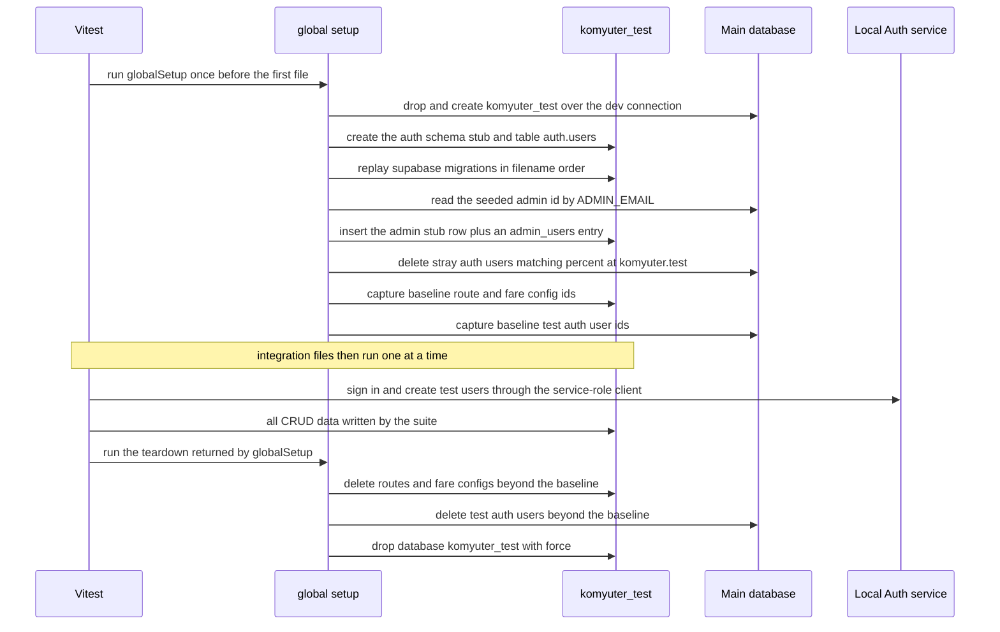
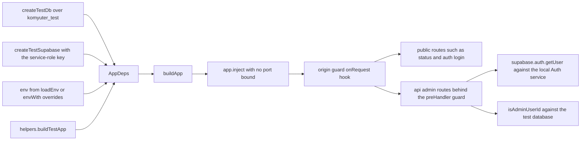

# Server test suites: hermetic units, database-backed integration and the test database lifecycle

`apps/server` has one test command — `pnpm --filter server test`, whose script is a bare `vitest run` ([`../../apps/server/package.json`](../../apps/server/package.json)) — and it runs two halves that are wired into a single Vitest configuration. The **unit half** (8 files, 75 cases under `tests/unit/`) imports only database-free modules: geometry and derivation helpers, domain validation, the throttler, the export assembler, the zod env parser, the `@komyuter/shared` schemas, and the Mapbox proxy registered on a bare Fastify instance with `fetch` stubbed. The **integration half** (7 files, 63 cases under `tests/integration/`) builds the real app with `buildApp` against a dedicated `komyuter_test` database and the local Supabase Auth service, then drives it through `app.inject`.

Two facts shape everything else on this page. First, the two halves are not separable at the command level: the single config declares a `globalSetup` that recreates, migrates, snapshots and finally drops the test database, so *any* invocation of the suite performs the full database lifecycle. Second, that lifecycle is why the suite is a **local obligation**: it needs the local Supabase stack running plus `apps/server/.env`, so CI deliberately runs only the admin suite and the workflow says so in a comment ([`.github/workflows/ci.yml`](../../.github/workflows/ci.yml)). This is a design decision, not a coverage gap — see [Workspace, build pipeline, lint and CI wiring](../architecture/workspace-build-and-ci.md) for the gate order and [Admin test suite](./admin-tests.md) for the suite CI does run.

## How the suite is wired

[`../../apps/server/vitest.config.ts`](../../apps/server/vitest.config.ts) is the whole configuration:

```ts
export default defineConfig({
  test: {
    include: ["tests/**/*.test.ts"],
    environment: "node",
    testTimeout: 30000,
    hookTimeout: 30000,
    fileParallelism: false,
    globalSetup: ["./tests/integration/global-setup.ts"],
  },
});
```

- **`include: ["tests/**/*.test.ts"]`** — one glob for both halves; there is no unit-only or integration-only config, so the directory tree is the only separation.
- **`environment: "node"`**, with no setup files, no DOM and no coverage configuration.
- **`testTimeout`/`hookTimeout: 30000`** — the suite's own budget for a single case and for a `beforeAll`/`afterAll` hook. Integration files sign in against the live Auth service (mostly in `beforeAll`), the export cases build full route graphs, and the latency cases issue twenty reads each, so both budgets are sized for local-stack round trips rather than for pure functions.
- **`fileParallelism: false`** — integration files share one real Postgres database. The config comment states the reason directly: concurrent files would corrupt each other's counts and assertions (the fare-config guards count active routes, the status case counts routes, the latency case measures loaded reads). Files therefore run strictly one at a time.
- **`globalSetup: ["./tests/integration/global-setup.ts"]`** — unconditional, so even `vitest run tests/unit` first drops and recreates `komyuter_test` and afterwards restores the baseline and drops it again.

## The integration database lifecycle

The lifecycle is a five-step contract — recreate, sweep, capture, restore, drop — owned by three files: [`global-setup.ts`](../../apps/server/tests/integration/global-setup.ts) sequences it, [`test-db.ts`](../../apps/server/tests/integration/test-db.ts) owns the test database and the main-database sweep, and [`helpers.ts`](../../apps/server/tests/integration/helpers.ts) owns the baseline snapshot/restore and the app seam.



The setup, per-case traffic and teardown, in the order the code executes them.

### 1. Recreate and migrate `komyuter_test`

`recreateTestDatabase()` runs first and does four things:

1. **Drop and create the database** over the *dev* connection: `drop database if exists komyuter_test with (force)` then `create database komyuter_test`. The code comment records the constraint that shapes this: `DROP DATABASE` cannot run inside a transaction or against the target database itself, so this must happen on the maintenance connection.
2. **Create the auth-schema stub** on the fresh test database: `create schema auth` and `create table auth.users (id uuid primary key, email text)`. Supabase Auth owns the real `auth.users` in the main database, but migration `0002` adds `admin_users.user_id → auth.users (id) on delete cascade` ([`../../supabase/migrations/0002_admin_users_auth_fk.sql`](../../supabase/migrations/0002_admin_users_auth_fk.sql)), and the test database would otherwise fail to replay it.
3. **Replay the project migrations**: read `supabase/migrations`, keep `*.sql`, `sort()` by filename (`0000_create_postgis.sql` first, so PostGIS exists before the geometry columns) and execute each file's text on the test database. The consequence is that the test database's schema is always exactly the migration history — `drizzle.config.ts` generates into that same directory ([`../../apps/server/drizzle.config.ts`](../../apps/server/drizzle.config.ts)), so drift between `src/db/schema.ts` and `supabase/migrations` surfaces as an integration failure rather than passing silently.
4. **Seed the admin reference.** The id of the main database's `auth.users` row for `ADMIN_EMAIL` is read, then inserted into the test database as a stub auth user *plus* an `admin_users` row, so `/api/admin` resolves for the seeded admin exactly as it does in dev. Note the failure mode: if no main-database user matches `ADMIN_EMAIL`, the whole block is skipped without error, and admin-gated cases then fail with the guard's `401`/`403` responses instead of a setup failure.

`supabase/seed.sql` is **not** applied here. Seeds are a `supabase db reset` concern ([`../../supabase/seed.sql`](../../supabase/seed.sql)); the test database gets migrations only, so the seeded default fare configuration does not exist in it and every fare-related case creates the configuration it needs.

### 2. Sweep stale auth users from the main database

`sweepMainDatabaseStrays()` runs on the main database *before* the baseline is captured: `delete from auth.users where email like '%@komyuter.test'`. The comment names it a self-healing sweep for users left behind by previously interrupted runs; their `admin_users` rows cascade off through the FK. It is safe for the seeded admin because `ADMIN_EMAIL` is a `@komyuter.ph` address, and it is effective because every identity the suite creates uses the `@komyuter.test` suffix — `createTestAdmin` (`admin-<uuid>@komyuter.test`), `createNonAdminToken` (`nonadmin-<uuid>@komyuter.test`).

### 3. Capture the baseline, then restore it in teardown

`globalSetup` captures a `DataBaseline` and returns Vitest's teardown function:

- **Capture** reads `routes` and `fare_configs` ids from the *test* database and `%@komyuter.test` auth user ids from the *main* database.
- **Restore** deletes `routes` and `fare_configs` rows whose ids are not in the baseline (or every row when the baseline list is empty), relying on the schema's cascades — routes cascade to directions → stops → detours → restrictions — and deletes `%@komyuter.test` auth users from the main database, where the auth users were created outside the app's database transaction. Test-database `admin_users` rows need no explicit cleanup because the database itself is dropped next.
- Because the test database was created in the same run, its `routes`/`fare_configs` baselines are normally empty; the branches that preserve ids only matter if a future migration starts seeding rows.

### 4. Drop the test database

`destroyTestDatabase()` runs `drop database if exists komyuter_test with (force)` on the dev connection as the last teardown step, so nothing survives a run. An interrupted run (Ctrl-C, a crashed worker) therefore leaves an orphan `komyuter_test` and stray main-database auth users — both are cleaned by the *next* run, at steps 1 and 2. That is what "self-healing" means here: the lifecycle's entry point repairs whatever its exit point missed.

## The test seam: `buildApp` plus `tests/integration/helpers.ts`

Everything the integration half can substitute comes from the injectable app. `buildApp(deps: AppDeps)` takes `{ db, supabase, env }` and returns the typed `AppInstance`; it is the same function `src/index.ts` uses in production, wired with `createDb(env.DATABASE_URL)`, `createSupabaseAdmin(...)` and `loadEnv()`.



How a test request reaches handlers without binding a port, and where the real local services still sit in the path.

| Helper | What it substitutes or exposes |
| --- | --- |
| `buildTestApp(envOverride?)` | `buildApp` with `createTestDb()`, a service-role Supabase client and either the module-scope env or an override. This is how a whole suite gets an app instance in `beforeAll`. |
| `envWith(overrides)` | `loadEnv({ ...process.env, ...overrides })` — an `Env` identical to the test env except for named keys. Used to flip `ALLOW_DEV_CREDENTIAL` per case. |
| `testEnv()` | The env loaded from `apps/server/.env`, used by cases that need `ADMIN_EMAIL`/`ADMIN_PASSWORD`. |
| `testDatabaseUrl(envValue?)` | Clones `DATABASE_URL` and replaces the pathname with `/komyuter_test`, so the test database is a sibling of the dev database in the same local instance, preserving credentials, host and port. |
| `createTestDb()` / `createTestPool()` / `createDevPool()` | A drizzle handle over the test database, and raw `pg` pools for the test and main databases. Pools are used by setup and teardown, which need SQL the app never issues. |
| `createTestSupabase()` | A service-role client against `SUPABASE_URL`, used for sign-in, user creation and admin lookups. |
| `captureBaselineState()` / `restoreBaselineState(baseline)` | The snapshot/restore contract described above. |

Three seam properties are easy to break by accident:

- **Environment is resolved at import time.** `helpers.ts` calls `process.loadEnvFile(".env")` when the file exists and then `loadEnv()` at module scope. A missing or invalid `apps/server/.env` therefore fails during *file collection* with `Invalid environment: …`, not inside an individual case — you will see the suite fail to collect, not one red test.
- **`envWith` merges over `process.env`, not over `.env`.** Any key absent from both the override and the process environment falls back to the schema defaults (for example `ADMIN_ORIGINS` to the two localhost Vite origins), which is exactly what the origin-guard cases rely on.
- **Auth is real, only data is fake.** `signInAdmin()` signs in `ADMIN_EMAIL`/`ADMIN_PASSWORD` through `supabase.auth.signInWithPassword`, and the route guard calls `supabase.auth.getUser(token)` before checking `admin_users` in the app's `db` — which is the test database. The split is deliberate: the service-role client is what makes the auth service reachable, while the authorization check reads the test database's `admin_users` stub rows.

## What the integration half protects

| File | Subject | Representative assertions |
| --- | --- | --- |
| [`crud.test.ts`](../../apps/server/tests/integration/crud.test.ts) | CRUD reflection and validation for the whole data model, plus the fare-configuration lifecycle guards | A created route is visible in the list and defaults to **inactive**, an update is reflected without a restart and the delete really removes it (`404` on re-read); directions with ordered stops; `409` when deleting a stop used as a direction terminal; `422` for empty stop lists, invalid `LineString`s, detours whose loop drifts off entry/exit, degenerate loops, negative distances and duplicate detour labels; detour stops persist atomically and cascade on detour delete; restriction indices out of range are refused; fare configs refuse deactivation while an active route references them or while they are the sole default, and the list reports `active_route_count` |
| [`plotting-save.test.ts`](../../apps/server/tests/integration/plotting-save.test.ts) | Route plotting's atomic save and the two-direction model | `POST` saves the base direction and derives the return in one transaction — reversed polyline, reversed stop order renumbered from 1, and terminals that resolve inside the return's *own* stop list; a single-stop save or a path that does not start on the first stop is refused with `422` and persists nothing; a third active direction is refused with `409` (ADR-0008); `PUT` with stops and polyline replaces the base and re-derives; route detail returns the base before the derived return, and the overview endpoint returns every route's base/return polylines and stops in one request |
| [`auth.test.ts`](../../apps/server/tests/integration/auth.test.ts) | Auth gating (SC-001) | An unauthenticated write gets `401` and the re-read list proves nothing was written; a non-admin token gets `403` with the same proof; the seeded admin can create and read a route |
| [`auth-login.test.ts`](../../apps/server/tests/integration/auth-login.test.ts) | Login, `/me`, throttling, the dev-credential gate, the origin allowlist and logout | A valid admin login returns a token and identity; wrong credentials and a signed-in non-admin are denied *identically* (unified `401`, `Invalid email or password`, and at least 200 ms of deliberate delay); `422` for a malformed body; account and source keys each block after 5 failures and a success clears both; the documented dev credential is refused with `ALLOW_DEV_CREDENTIAL=false` and accepted with `true`; a foreign `Origin` gets the `403` envelope while an allowed one, a missing one and `OPTIONS` preflight pass; `POST /api/auth/logout` is idempotent `204` and revokes the token globally |
| [`status.test.ts`](../../apps/server/tests/integration/status.test.ts) | Status and persistence | `/api/status` reports `ok` with numeric route/stop/direction counts that do not decrease after a create; a route written through one app instance is readable from a *freshly built* instance — restart equivalence, i.e. the database is the only state |
| [`export.test.ts`](../../apps/server/tests/integration/export.test.ts) | The Collaboratory export dataset | A plotted route downloads as an `attachment`/`application/json` response with `schema_version` `1.1` and `coordinate_order` `lng_lat`; both the base and the derived return direction appear with their own stop lists and terminal ids; a sweep over every route finds no dangling origin/destination terminal; the raw body contains no `eta`, `arrival` or `departure` key anywhere; a fresh database still yields a schema-valid dataset; the body parses standalone with a non-empty `routes` array |
| [`latency.test.ts`](../../apps/server/tests/integration/latency.test.ts) | Local read latency (SC-007) | 20 `/api/status` reads and 20 export reads, each requiring at least 19 of 20 under one second |

Two coverage details are worth knowing because they cross module boundaries:

- **The export cases validate against a JSON Schema outside `apps/server`.** [`tests/helpers/dataset-schema.ts`](../../apps/server/tests/helpers/dataset-schema.ts) compiles `specs/001-local-supabase-backend/contracts/export-dataset.schema.json` with Ajv (+ `ajv-formats`, both devDependencies of `apps/server`) and caches the compiled validator on first use. That file is effectively a test input: moving or resizing the contract breaks the export suite even though nothing under `apps/server` changed. The spec tree itself is out of scope for this wiki; only the dependency matters here.
- **Latency is asserted, not merely observed.** The integration half contains a local performance gate with a 19-of-20 threshold, so a busy machine can fail it; it measures against the local stack, not a deployed environment.

## The hermetic unit half

The unit files never open a database connection and never bind a socket. They import the pure layer directly and substitute the two ambient dependencies that layer has: the clock (an injected `now` for the throttler, `loadEnv({ ...BASE_ENV })` for the env parser) and the network (`vi.stubGlobal("fetch", …)` for the Mapbox route).

| File | Module under test | Focus |
| --- | --- | --- |
| [`derive.test.ts`](../../apps/server/tests/unit/derive.test.ts) | `src/domain/derive` | Return-direction derivation: reversing coordinates without mutating the input, never reusing the base stop objects, renumbering `stop_order`, keeping the first stop leading on a closed loop, deriving the `To {first stop name}` label, distance math, and `pathEndpointsOnStops` accept/reject cases |
| [`geometry.test.ts`](../../apps/server/tests/unit/geometry.test.ts) | `src/domain/geometry` | `validateGeoPoint` / `validateGeoLineString`: `[lng, lat]` bounds including the 180/-90 boundaries, out-of-range longitude and latitude rejected with per-coordinate issue paths, non-finite coordinates and non-geometry payloads refused, and `LineString`s requiring at least two points |
| [`validation.test.ts`](../../apps/server/tests/unit/validation.test.ts) | `src/domain/validation` + `ApiError` | `assertDetourLoopEndpoints` against the on-line tolerance: loops that divert through a waypoint pass, exact matches at the tolerance boundary pass, and drifted or degenerate loops throw the domain `VALIDATION_ERROR` whose message identifies the failure (`Detour loop start`, `Detour loop end`, `degenerate`) |
| [`export.test.ts`](../../apps/server/tests/unit/export.test.ts) | `src/domain/export` | The dataset assembler over fixture rows: `schema_version` and `coordinate_order: "lng_lat"` are pinned, string-mode numeric columns are converted to numbers, stops are sorted by `stop_order` regardless of input order, an empty database yields empty arrays, `referenceCheck` reports dangling terminal ids, and a stringified dataset contains no ETA/arrival/departure key |
| [`schemas.test.ts`](../../apps/server/tests/unit/schemas.test.ts) | `@komyuter/shared` schemas | Slug rules for `routeIdSchema`, minimal/empty-field cases for the create schemas — the contract the API validates with |
| [`env.test.ts`](../../apps/server/tests/unit/env.test.ts) | `src/config/env` | Defaults for `ALLOW_DEV_CREDENTIAL` and `ADMIN_ORIGINS`, strict `"true"`/`"false"` parsing that rejects `"1"`, explicit `ADMIN_ORIGINS`, and the mandatory-variable requirement — all by passing an explicit source object, never by mutating `process.env` |
| [`throttle.test.ts`](../../apps/server/tests/unit/throttle.test.ts) | `src/api/throttle` | The login throttler with an injected clock: blocking after `MAX_FAILURES` for at least `BLOCK_MS`, window rollover freeing a key, `clearKey` resetting both account and source counters, unknown keys unblocked |
| [`mapbox-proxy.test.ts`](../../apps/server/tests/unit/mapbox-proxy.test.ts) | `src/api/mapbox` | Pure helpers (coordinate parsing, 25-coordinate chunking, straight-line fallback, chunk concatenation removing the duplicated joint) plus the route handler registered on a **bare** `Fastify()` instance — see below |

Two nuances in that table matter for anyone editing these files:

- **The Mapbox route cases are unit tests of a production handler.** They call `registerMapbox` on a bare `Fastify()` instance with no central error handler, so the `422` case asserts the error code through `body.error?.code ?? body.code` — the same assertion would read differently against the real `buildApp` app. The handler resolves `loadEnv(process.env)` per request to read `MAPBOX_SECRET_TOKEN`, so these cases need resolvable env (typically the `.env` auto-load in `src/config/env.ts`), and the stubbed `fetch` is the only thing standing in for the real Mapbox API: no integration case covers `/api/admin/mapbox/directions`.
- **`derive.test.ts` and `geometry.test.ts` are also the executable statements of repo invariants.** Coordinate order is `[lng, lat]` with no conversion layer (ADR-0013) and the derived return direction is built from its own stop rows with the path endpoints kept as separate stop ids (ADR-0008) — the unit half is where a change to either would be caught first.

## Running it, and what enforces it

```sh
# the whole suite: unit half + integration half
pnpm --filter server test

# the compile-level gate
pnpm --filter server typecheck

# a subset still runs the full test-database lifecycle
pnpm --filter server exec vitest run tests/unit
```

Prerequisites for the integration half are the local Supabase stack running and `apps/server/.env` present, with `DATABASE_URL`, `SUPABASE_URL`, `SUPABASE_SERVICE_ROLE_KEY` and `ADMIN_EMAIL`/`ADMIN_PASSWORD` matching the seeded admin ([`../../apps/server/.env.example`](../../apps/server/.env.example), [`../../apps/server/README.md`](../../apps/server/README.md)); `ALLOW_DEV_CREDENTIAL` is part of the suite's subject matter, not just configuration, because two cases flip it via `envWith`.

The gate policy is split on purpose:

| Gate | Command | Where it runs |
| --- | --- | --- |
| Format, lint, typecheck, admin suite, build | `pnpm format:check`, `pnpm lint`, `pnpm typecheck`, `pnpm --filter admin test`, `pnpm build` | CI (`.github/workflows/ci.yml`) |
| Server unit + integration suite | `pnpm --filter server test` | Local pre-merge obligation; the workflow comment states the integration half needs a live stack, so it is not a CI step |
| Server typecheck | `pnpm --filter server typecheck` | Both — root `pnpm typecheck` also compiles `apps/server` via `tsc --noEmit -p apps/server/tsconfig.json` |

Two consequences follow. Root `pnpm test` runs `turbo run test` across the workspace, so it executes the server suite and needs the stack up; the CI-equivalent check is `pnpm --filter admin test`. And because the server suite is a manual obligation, a red integration run is only discovered by the person running it — `AGENTS.md` therefore records `pnpm --filter server test` as required before commit, with tests written first per the repository's spec workflow (the spec tree is the source of the task breakdown and is not documented here).

## Invariants to preserve when changing the suite

- **The test database is disposable and disposable only.** It is created from migrations at setup and dropped at teardown; nothing in it may be treated as fixture data for the next run. There is no "leave the database in place and re-run faster" mode, and adding one would invalidate step 1 of the lifecycle.
- **Seed data does not exist in the test database.** Cases must create the routes, fare configs and users they assert on. A case that assumes the `supabase/seed.sql` default fare configuration will read a different database than the one under test.
- **The `@komyuter.test` suffix is load-bearing.** It is simultaneously the creation convention (`createTestAdmin`, `createNonAdminToken`) and the cleanup predicate (sweep and restore). A test identity created under any other domain will survive the run in the main database's `auth.users`.
- **A destructive drop sits next to a live dev database.** `drop database ... with (force)` is issued over the *dev* connection but targets `komyuter_test` only; the safety of the whole lifecycle rests on `testDatabaseUrl` always rewriting the pathname of `DATABASE_URL`. Anything that widens that target — or that runs the lifecycle against a different `DATABASE_URL` than the app under test — puts the dev data the admin dashboard reads in scope.
- **`fileParallelism: false` and the 30 s timeouts are functional, not stylistic.** Turning parallelism on shares one database across files that count rows; shrinking the budgets puts the multi-request cases (export, latency) at risk of timing out on a loaded machine.
- **Changing `ADMIN_EMAIL` in `.env` silently degrades setup.** The admin stub insert is conditional on finding that email in the main database, so a mismatch produces `401`/`403` failures across the admin gating cases rather than an error at setup time.
- **Two cross-boundary dependencies are easy to forget**: the export helper reads a JSON Schema from the spec tree, and the unit Mapbox cases read `process.env` through `loadEnv`. Both live outside the directory a maintainer is likely to search when the suite breaks.
