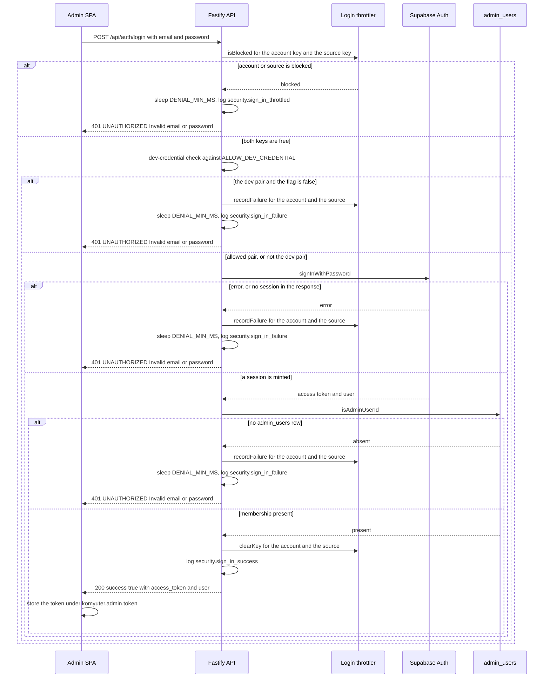
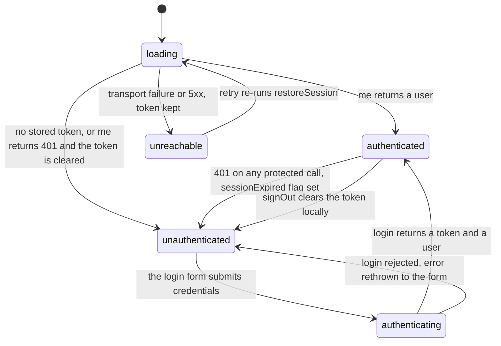

# Admin login, authorization gate and session expiry

The admin console has exactly one way to obtain a session: `POST /api/auth/login` on the Fastify backend. That route verifies credentials against Supabase Auth (GoTrue) with the service-role client, checks the resulting user against a single `admin_users` table, and hands the SPA an access token. Everything after that is a repetition of the same check — the token is verified with `supabase.auth.getUser()` and the user id re-checked against `admin_users` on every guarded request. Authentication is Supabase Auth brokered by the backend ([ADR-0006](../../docs/adr/0006-supabase-auth.md)); the SPA bundles no Supabase client and never sees the service-role key. Brute-force resistance is in-process rather than Redis-backed ([ADR-0005](../../docs/adr/0005-no-redis.md)), and the single-admin deployment that justified that choice is what makes the module's documented limits acceptable.

Two design commitments shape almost every detail below, and both are intentional:

- **Every denial is the same denial.** Wrong password, unconfirmed email, correct credentials without administrative access, a throttled key, and a refused dev credential all produce the identical `401 UNAUTHORIZED` / `Invalid email or password` body after a uniform delay, and are never distinguished in the response.
- **One authorization rule.** `isAdminUserId(db, userId)` is the only place that decides who is an administrator; the route guard, the login route, and `GET /api/auth/me` all call it.

## Participants and entrypoints

| Participant | Where | Role in the flow |
| --- | --- | --- |
| Admin SPA | [apps/admin/src/lib/api.ts](../../apps/admin/src/lib/api.ts), [features/auth](../../apps/admin/src/features/auth/auth.tsx) | holds the token, attaches `Authorization: Bearer`, reacts to 401 |
| Fastify API | [apps/server/src/api/auth-login.ts](../../apps/server/src/api/auth-login.ts) | the only issuer of sessions; throttling, dev-credential gate, unified denial |
| Login throttler | [apps/server/src/api/throttle.ts](../../apps/server/src/api/throttle.ts) | per-account and per-source fixed windows, in-process |
| Supabase Auth | `supabase.auth.signInWithPassword` | credential authority and token mint/verify |
| `admin_users` | [apps/server/src/db/schema.ts](../../apps/server/src/db/schema.ts#L60-L62) | the sole membership table — the authorization rule's data |

## The login path in sequence



The four login outcomes — success, throttled denial, dev-credential refusal, and credential or membership denial. Only the last two differ from each other in the security-event log, never on the wire.

## Validation and the request contract

`loginSchema` (route-local zod) accepts `email` as a well-formed address and `password` as a non-empty string. A malformed body never reaches credential verification: the zod failure is converted by the central error handler into `422 VALIDATION_ERROR`, so such requests are also never counted as failed attempts by the throttler ([apps/server/src/api/auth-login.ts](../../apps/server/src/api/auth-login.ts#L12-L15), [apps/server/src/api/app.ts](../../apps/server/src/api/app.ts#L66-L86)).

A successful response carries the GoTrue access token and the identity the SPA renders:

```jsonc
{
  "success": true,
  "data": {
    "access_token": "<GoTrue access token>",
    "user": { "id": "<uuid>", "email": "admin@komyuter.ph", "name": "Admin Komyuter" }
  }
}
```

`name` is read from `user_metadata.full_name` and falls back to an empty string when absent ([apps/server/src/api/auth-login.ts](../../apps/server/src/api/auth-login.ts#L26-L29)); the session's refresh token is deliberately dropped, which is the root of the expiry behaviour described later.

## One funnel for every denial

All four refusal branches call the same local `deny` helper, so the wire format cannot drift between them:

```ts
const deny = async (event, outcome, account, recordFailure) => {
  if (recordFailure) {
    throttler.recordFailure(accountKey);
    throttler.recordFailure(sourceKey);
  }
  await sleep(DENIAL_MIN_MS);
  eventLog(request, event, outcome, account);
  throw unauthorized(UNIFIED_DENIAL);
};
```

Three properties follow, and they are the contract a change must preserve:

- **Identical body.** `unauthorized(...)` produces `401 UNAUTHORIZED` with the constant message `Invalid email or password`, enveloped by the central error handler exactly like every other API error ([apps/server/src/api/auth-login.ts](../../apps/server/src/api/auth-login.ts#L17-L18), [apps/server/src/api/errors.ts](../../apps/server/src/api/errors.ts#L21-L23)).
- **Uniform timing.** Every denial sleeps `DENIAL_MIN_MS` (250 ms) before responding, so a throttle rejection is not faster than a wrong-password rejection ([apps/server/src/api/throttle.ts](../../apps/server/src/api/throttle.ts#L15-L16)).
- **Reasons only in the log.** Which branch fired is recorded solely by `eventLog`, and appears in the HTTP response nowhere ([apps/server/src/api/security-events.ts](../../apps/server/src/api/security-events.ts#L3-L8)).

The distinction between "the key was already blocked" and "this attempt failed" survives only as an event name and an outcome value:

| Actual reason | `event` | `outcome` | Counts as a failure |
| --- | --- | --- | --- |
| account or source key already blocked | `security.sign_in_throttled` | `throttled` | no — the attempt is refused before recording |
| dev credential refused by the gate | `security.sign_in_failure` | `denied` | yes, for account and source |
| GoTrue rejected, or returned no session | `security.sign_in_failure` | `denied` | yes, for account and source |
| signed in but no `admin_users` row | `security.sign_in_failure` | `denied` | yes, for account and source |
| accepted | `security.sign_in_success` | `success` | n/a — both keys are cleared |

`eventLog` writes exactly one structured pino line per event on the request logger, with `event`, `account`, `source: request.ip`, and `outcome`; because it is the request logger, lines correlate by `reqId` with the `onResponse` audit line ([apps/server/src/api/security-events.ts](../../apps/server/src/api/security-events.ts#L10-L36), [apps/server/src/api/app.ts](../../apps/server/src/api/app.ts#L47-L64)).

## Throttling (ADR-0005)

```ts
export const MAX_FAILURES = 5;
export const WINDOW_MS = 5 * 60_000;
export const BLOCK_MS = 15 * 60_000;
export const DENIAL_MIN_MS = 250;
```

The throttler is an in-memory `Map` of keys to failure timestamps plus a `blockedUntil` instant — no Redis, in line with [ADR-0005](../../docs/adr/0005-no-redis.md):

- **Two keys per attempt.** `normalizeAccount(email)` (trimmed, lowercased) and `request.ip`. A failure is recorded against both, so one attacker's guessing damages its own source and the targeted account; a success clears both.
- **Fixed window, then block.** Once a key accumulates `MAX_FAILURES` timestamps inside `WINDOW_MS`, it is blocked until the *oldest* of those failures plus `BLOCK_MS`. An active block always wins over window pruning, so the block lasts its full 15 minutes even after the underlying failures age out.
- **Cleanup is lazy.** `isBlocked` prunes expired timestamps and deletes keys with no failures left; an unknown key is simply unblocked.
- **Per app instance.** `createLoginThrottler()` is called inside `registerAuth`, so each `buildApp()` gets isolated state — which is what gives the integration suite its per-app isolation, and what makes a process restart clear all counters ([apps/server/src/api/auth-login.ts](../../apps/server/src/api/auth-login.ts#L39-L42)).
- **The limits are documented, not accidental.** The module header states that in-memory state suits the admin panel's single-instance deployment and that a multi-instance setup would need a shared store.

One operational caveat: the source key is Fastify's `request.ip`, and `buildApp` does not enable `trustProxy` ([apps/server/src/api/app.ts](../../apps/server/src/api/app.ts#L35-L45)). With a reverse proxy in front, every request would present the proxy's address, collapsing per-source throttling into one shared key.

## The dev-credential gate

The documented development pair is a constant in the route, not configuration:

```ts
const DEV_CREDENTIAL = { email: "admin@komyuter.ph", password: "komyuter-admin-dev" };
```

The gate fires only when the submitted pair matches it *and* `env.ALLOW_DEV_CREDENTIAL` is false: the request takes the ordinary denied branch, records a failure against both throttle keys, and returns the unified 401 — the refusal is therefore invisible to a client ([apps/server/src/api/auth-login.ts](../../apps/server/src/api/auth-login.ts#L72-L79)). `ALLOW_DEV_CREDENTIAL` defaults to `false` and accepts only the strings `"true"` / `"false"` ([apps/server/src/config/env.ts](../../apps/server/src/config/env.ts#L17-L21)).

Setting the flag does not make the pair trusted: it still has to sign in through GoTrue and pass the `admin_users` check, so the flag only reopens a well-known credential — which is why it is local-only. The credential itself is a committed fixture: `supabase/seed.sql` inserts the `auth.users` row with `crypt('komyuter-admin-dev', ...)` and its own header records that the Supabase CLI executes the file verbatim with no environment interpolation, making it a dev-only default that must be replaced through Supabase Auth before any shared use ([supabase/seed.sql](../../supabase/seed.sql#L1-L48)). See [Configuration and secrets](../operations/configuration-and-secrets.md) for the full env surface and the deployment consequence that the gate protects only this Fastify route, not GoTrue itself.

Relatedly, `ADMIN_EMAIL` and `ADMIN_PASSWORD` are required by the env schema but are never read by server code — only the integration helpers use them to sign in the seeded admin ([apps/server/src/config/env.ts](../../apps/server/src/config/env.ts#L12-L13), [apps/server/tests/integration/helpers.ts](../../apps/server/tests/integration/helpers.ts#L101-L114)).

## One authorization rule, three callers

`isAdminUserId(db, userId)` performs a single `select` for the user id in `admin_users` and returns a boolean. It is called by:

| Caller | Effect on false |
| --- | --- |
| `createAdminAuthGuard` — the `preHandler` on the `/api/admin` plugin | `403 FORBIDDEN` "User is not an admin" |
| `POST /api/auth/login` | the unified `401` denial, plus a recorded failure |
| `GET /api/auth/me` | `403 FORBIDDEN` "User is not an admin" |

Because membership is read from the database on *every* request rather than embedded in the token, removing a row from `admin_users` takes effect on the next call with no restart and no token rotation ([apps/server/src/api/auth.ts](../../apps/server/src/api/auth.ts#L26-L38)).

The guard itself is registered once, as a `preHandler` inside the `/api/admin` plugin body, before that plugin's child modules are added — so every existing and future module registered there is authenticated by construction, and a module that needs no guard has to be mounted outside that plugin ([apps/server/src/api/index.ts](../../apps/server/src/api/index.ts#L14-L36)). It parses a strictly single-part `Bearer <token>` header, rejects a missing or malformed header with `401 UNAUTHORIZED`, verifies the token with `supabase.auth.getUser(token)`, rejects a failed verification with `401 UNAUTHORIZED`, then applies the membership rule; on success it records `request.adminUserId`, which the `onResponse` log then includes as `adminId` ([apps/server/src/api/auth.ts](../../apps/server/src/api/auth.ts#L14-L55), [apps/server/src/api/app.ts](../../apps/server/src/api/app.ts#L47-L64)).

`GET /api/auth/me` repeats exactly the same three steps and returns `{ id, email, name }`; it is registered outside the admin plugin, so it is reachable with a token but is not itself behind the guard ([apps/server/src/api/auth-login.ts](../../apps/server/src/api/auth-login.ts#L120-L143)).

## The SPA session lifecycle

`AuthProvider` owns one `AuthStatus` value and one user object, restored once at mount:



The `AuthStatus` lifecycle; only a real 401 clears the stored token, and only the unreachable branch keeps the user on a retry screen instead of the login form.

`restoreSession()` is the boot step and deliberately distinguishes three outcomes ([apps/admin/src/features/auth/auth.tsx](../../apps/admin/src/features/auth/auth.tsx#L37-L71)):

| Situation | Result | Token |
| --- | --- | --- |
| no stored token | `unauthenticated` without calling `/me` | absent already |
| `/me` succeeds | `authenticated` with the returned user | kept |
| `ApiError UNAUTHORIZED` | `unauthenticated` | **cleared** |
| transport failure (`NETWORK` with no status) or any status ≥ 500 | `unreachable` | **kept** |
| any other failure (e.g. `403`) | `unauthenticated` | kept |

The unreachable branch is what prevents an offline backend from being presented as an expired session; `RequireAuth` renders the `BackendUnreachable` plate whose Retry button calls `AuthProvider.retry()` and re-runs the restore while `retrying` is true. The `403` row is the reason a user deleted from `admin_users` is signed out of the UI but still holds a token that will keep failing ([apps/admin/src/features/auth/RequireAuth.tsx](../../apps/admin/src/features/auth/RequireAuth.tsx#L6-L36), [apps/admin/src/features/auth/BackendUnreachable.tsx](../../apps/admin/src/features/auth/BackendUnreachable.tsx#L7-L40)).

`signIn()` sets `authenticating`, clears any `sessionExpired` flag, awaits `login()`, and either stores the user or rethrows to the form after flipping back to `unauthenticated`; `signOut()` is synchronous and local. The route guard is covered in [Admin shell and routing](../apps/admin-shell-and-routing.md).

## Token storage and mid-use expiry

The session token is a plain browser value: `localStorage["komyuter.admin.token"]`, read and written only through `getStoredToken()` / `setStoredToken()` / `clearStoredToken()`. The request interceptor attaches `Authorization: Bearer <token>` on every call, so no feature module passes credentials ([apps/admin/src/lib/api.ts](../../apps/admin/src/lib/api.ts#L5-L43)). `login()` is the only writer ([apps/admin/src/features/auth/api.ts](../../apps/admin/src/features/auth/api.ts#L14-L24)).

When a stored token stops validating mid-session, the response interceptor handles it before classifying the error: for any `401` whose URL does not end with `/api/auth/login` it saves the current path to `sessionStorage`, clears the stored token, and emits on the `sessionExpired` bus. `AuthProvider` is the only subscriber; it sets `sessionExpired`, drops the user, and flips to `unauthenticated`, which makes `RequireAuth` redirect to `/login` with `returnTo` and the flag, and makes the form render the "Your session expired" notice ([apps/admin/src/lib/api.ts](../../apps/admin/src/lib/api.ts#L45-L76), [apps/admin/src/features/auth/sessionExpired.ts](../../apps/admin/src/features/auth/sessionExpired.ts#L1-L20)).

Two details keep that from misfiring:

- **The login URL is exempt**, so a wrong-password 401 renders the ordinary credential error instead of being reported as an expiry ([apps/admin/src/lib/api.ts](../../apps/admin/src/lib/api.ts#L103-L105)).
- **The return path is sanitized on read.** `getReturnPath` accepts only strings starting with `/` and not `//`, and `getSessionExpired` accepts only a literal `true`; `Login` prefers the `sessionStorage` copy (which survives a reload) over `location.state` and clears it after use ([apps/admin/src/features/auth/redirect.ts](../../apps/admin/src/features/auth/redirect.ts#L4-L44), [apps/admin/src/pages/Login.tsx](../../apps/admin/src/pages/Login.tsx#L26-L34)).

There is no refresh path anywhere: the login response omits the refresh token, the admin app has no refresh call, and `supabase/config.toml` sets `jwt_expiry = 3600` ([supabase/config.toml](../../supabase/config.toml#L164-L165)). The practical consequence is that roughly an hour after signing in, the first protected request returns 401 and the session-expiry path is the only way back — a fresh sign-in, not a silent renewal.

## Sign-out: idempotent on the server, local in the client

`POST /api/auth/logout` is idempotent by contract. It attempts a best-effort global revocation (`supabase.auth.admin.signOut(token, "global")`) when the presented token resolves to a user, swallows any failure, logs exactly one `security.sign_out` event with the resolved email or `"unknown"`, and always answers `204` with an empty body — valid token, invalid token, or no token at all ([apps/server/src/api/auth-login.ts](../../apps/server/src/api/auth-login.ts#L145-L162)).

The SPA does **not** call it. `signOut()` only clears the stored token and resets the auth state, and `Header`'s menu item then navigates to `/login` ([apps/admin/src/features/auth/auth.tsx](../../apps/admin/src/features/auth/auth.tsx#L118-L123), [apps/admin/src/app/Header.tsx](../../apps/admin/src/app/Header.tsx#L38-L42)); there is no `/api/auth/logout` call anywhere under `apps/admin/src`. So a UI sign-out ends the browser session but leaves the GoTrue session valid until the token expires — the endpoint's revocation guarantee applies to callers that use it, and the "sign-out revokes" description in `docs/ADMIN.md` and the manual quickstart scenario does not match the current client. The endpoint itself is exercised by the integration suite.

## Origin allowlist

The path begins before any credential work. `createOriginGuard(deps.env.ADMIN_ORIGINS)` is added as a root `onRequest` hook immediately after `@fastify/cors`, so the CORS plugin answers `OPTIONS` preflights first ([apps/server/src/api/app.ts](../../apps/server/src/api/app.ts#L41-L45)). The guard splits `ADMIN_ORIGINS` on commas, trims, drops empties, and then:

- passes `OPTIONS` unconditionally,
- passes any request without an `Origin` header (curl, tests, native clients),
- rejects a present `Origin` that is not in the allowlist with `403 FORBIDDEN` "Origin not allowed" ([apps/server/src/api/origin-guard.ts](../../apps/server/src/api/origin-guard.ts#L14-L30)).

Being a root hook, it applies to `/api/status` and the `/api/auth/*` routes as well as the `/api/admin` subtree, which is why a foreign origin is refused at login rather than only on data routes. The default allowlist is the local admin origins (`http://localhost:5173`, `http://127.0.0.1:5173`); the full request-ordering picture is in [Server API surface](../operations/server-api-surface.md).

## Invariants a change must not break

- A denial's status, error code, message, and minimum delay are the same for every cause; new causes must go through `deny`, not around it.
- No HTTP response may reveal whether an email exists, whether a password was correct, or whether a key was throttled.
- Do not make the throttler an "improvement" without also giving it a shared store: the in-memory design is the documented trade-off, and its per-instance state is what the tests isolate on.
- Every new admin-gated route belongs inside the `/api/admin` plugin so it inherits the single `preHandler`; a new authorization decision must reuse `isAdminUserId` instead of an inline query.
- `admin_users` membership is re-read per request — never cached in the token, the app, or a module-level variable.
- The login URL must stay exempt from the 401 interceptor, and only a real `401` may clear the stored token.
- `POST /api/auth/logout` must keep answering `204` for every token state.

## Configuration and operations

| Knob | Default | Effect on this path |
| --- | --- | --- |
| `ALLOW_DEV_CREDENTIAL` | `false` | opens the gate for the committed dev pair; still requires a real GoTrue sign-in and an `admin_users` row |
| `ADMIN_ORIGINS` | `http://localhost:5173,http://127.0.0.1:5173` | the origin allowlist; requests without `Origin` bypass it |
| `SUPABASE_URL`, `SUPABASE_SERVICE_ROLE_KEY` | required | the client used for sign-in, per-request token verification, and logout revocation, with `persistSession: false` and `autoRefreshToken: false` |
| `ADMIN_EMAIL`, `ADMIN_PASSWORD` | required | validated but unused by server code; consumed by integration helpers only |
| `jwt_expiry` (supabase config) | `3600` | how long the browser token is accepted before the 401 expiry path fires |

Because the throttler lives in the process, restarting the server clears every block, and there is no observability surface for throttle state other than the `security.*` log lines — see [Configuration and secrets](../operations/configuration-and-secrets.md) and [Supabase local stack](../integrations/supabase-local-stack.md).

## Focused tests

Server side, [apps/server/tests/integration/auth-login.test.ts](../../apps/server/tests/integration/auth-login.test.ts) is the behavioural contract for this page: success returns an access token and identity; a wrong password, a signed-in non-admin, and the throttle pre-check all produce the identical `401` with the identical message and a measured ≥ 200 ms delay; five failures from five distinct sources block the account even for the correct password; five failures from one source block that source against another account; a success clears both counters; the dev credential is refused with `ALLOW_DEV_CREDENTIAL=false` and accepted with `true`; a foreign `Origin` gets `403`, an allowed origin and no origin pass, and `OPTIONS` gets `204`; `/me` requires a token and `403`s for non-admins; logout answers `204` for valid, invalid, and missing tokens and the revoked token stops authenticating. [apps/server/tests/integration/auth.test.ts](../../apps/server/tests/integration/auth.test.ts) covers the guard on the `/api/admin` subtree, including that a rejected write leaves data untouched. [apps/server/tests/unit/throttle.test.ts](../../apps/server/tests/unit/throttle.test.ts) pins the window, block, and clear semantics with an injected clock, and [apps/server/tests/unit/env.test.ts](../../apps/server/tests/unit/env.test.ts) pins the `ALLOW_DEV_CREDENTIAL` and `ADMIN_ORIGINS` defaults.

Client side, [apps/admin/src/tests/restore.test.ts](../../apps/admin/src/tests/restore.test.ts) covers all three `restoreSession` outcomes plus the token-kept-on-403 case, [apps/admin/src/tests/session-expired.test.ts](../../apps/admin/src/tests/session-expired.test.ts) covers the interceptor (token cleared, path saved, event emitted) and the login-URL exemption, and [apps/admin/src/tests/require-auth.test.ts](../../apps/admin/src/tests/require-auth.test.ts) covers return-path sanitization and the `sessionExpired` flag parsing.

## Related pages

- [Admin data access, query cache and client state](../apps/admin-data-layer-and-client-state.md) — the axios instance, envelope handling, and the 401 hook from the data-layer side.
- [Admin shell and routing](../apps/admin-shell-and-routing.md) — the provider stack, route tree, and the `RequireAuth` branches.
- [Server API surface](../operations/server-api-surface.md) — guard layering, the route inventory including the three `/api/auth/*` routes, and error mapping.
- [Configuration and secrets](../operations/configuration-and-secrets.md) — the env schema, the dev credential as a fixture, and which values are committed.
- [Supabase local stack](../integrations/supabase-local-stack.md) — the local GoTrue/Postgres stack the login route talks to.
