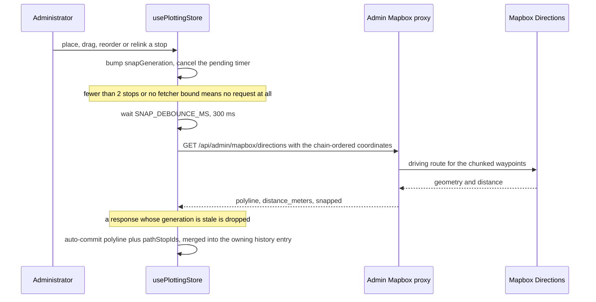
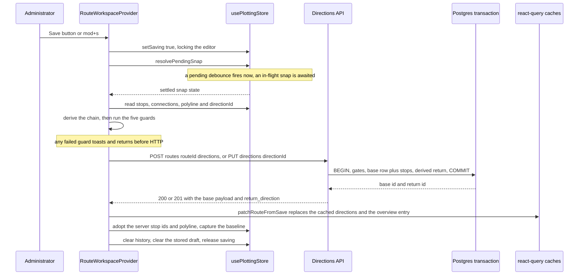

# Workflow: plotting a route and saving the direction pair

Plotting a route is the heaviest workflow in the admin app: an administrator opens a route, places a road-following path through ordered stops, edits it freely with undo/redo, and then persists **one** direction which the server turns into a base/return pair. This page traces that path end to end — the client drafting buffer, the road-snapping round trip, the guards that run before any HTTP request, the transactional write, the cache patch, and what happens when the write is refused.

Three collaborators matter:

| Role | Code | Owns |
| --- | --- | --- |
| Drafting buffer | [`usePlottingStore`](../../apps/admin/src/lib/plottingStore.ts) | stops, chain, committed polyline, `pathStopIds` association, snap state, undo/redo history, `savedBaseline`, `draftDirty`, `saving`, `directionId` |
| Orchestrator | [`RouteWorkspaceProvider`](../../apps/admin/src/features/routes/workspace/RouteWorkspaceProvider.tsx) | the save sequence, the localStorage draft, the conflict flag, the navigation guards, the dialogs |
| Write boundary | [`useSaveDirectionMutation` / `useReplaceDirectionMutation`](../../apps/admin/src/features/routes/useRouteQueries.ts) → [`routesApi.ts`](../../apps/admin/src/features/routes/routesApi.ts) | the request, the envelope-unwrapped response, the cache patch |

The client-side scaffolding around those (axios interceptors, query keys, the patch helpers, the draft mirror) is documented in [Admin data access, query cache and client state](../apps/admin-data-layer-and-client-state.md); how the editing surface renders it is in [Admin route workspace UI](../apps/admin-route-workspace-ui.md). This page is about the sequence and its invariants.

## Opening a route into edit state

Edit state is defined by exactly one thing: `routeId !== null` in the plotting store (the derived four-state machine is `empty | overview | focus | edit`). It is entered by clicking a route row (`openRoute(selected.route_id)`) or by the URL parameter seed — an effect in the provider calls `openRoute(routeParam ?? null)` on every `routeId` param change, after which the store, not the URL, is the source of truth.

`openRoute` is a hard reset of the editing slate rather than a merge. Before storing the new id it cancels a pending snap, bumps the snap generation counter so an in-flight response can never land on the new route, and clears the module-scope "history entry that owns the next snap" pointer. It then blanks `stops`, `polyline`, `snap`, `selection`, `tool`, `poi`, `routeMeta`, `connections`, `draftDirty`, `saving`, `focusedRouteId`, `seedSource`, `history` and `savedBaseline`, and — importantly for the save verb — sets `directionId: null`, which means "the next save creates a direction" rather than replaces one. Finally it calls `requestFit()`.

Content then arrives in two stages, both driven from [`RouteList.tsx`](../../apps/admin/src/features/routes/RouteList.tsx):

1. **Instant cache seed.** If the overview mirror still holds the route's geometry and the draft is empty, `seedFromOverview` calls `setStops(stops, polyline)`. That single call seeds the stop list, the committed polyline, the consecutive chain, and `pathStopIds = stops.map(id)`, then captures the baseline and fits the map — so the editor paints with the route rather than blank. It does **not** set `directionId` and it marks `seedSource: "cache"`.
2. **Authoritative detail upgrade.** When `useRouteQuery` resolves, the effect sets `directionId` from `directions[0]`, replaces the stops with the full server rows (including `is_guaranteed_service`, `landmark_hint`, `notes`), sets the polyline, captures the baseline, fits, and marks `seedSource: "detail"`. It does this either when the draft is empty **or** when the draft is a *pristine* cache seed — same `seedSource`, not dirty, and stop ids matching the server row index-for-index. A dirty draft is never clobbered.

That two-stage load has one operational consequence worth knowing: the create/replace decision depends only on `directionId`, which the cache seed leaves `null`. An admin who edits and saves a route in the window before the detail response lands POSTs a create on a route that may already have its pair, which the server refuses with `409 CONFLICT` (see [the conflict section](#failure-semantics-blocking-toasts-and-the-conflict-banner)).

## The chain: placing, moving and reordering stops

The draft holds two related structures: `stops` (an array whose order is placement order) and `connections` (the chain of `{ from, to }` edges). The chain is the source of truth for route order; [`pathFromConnections`](../../apps/admin/src/lib/connections.ts) walks it and returns the **main** component — the longest chain, ties broken by earliest placement — with `closed: true` when the last member links back to the first and the component has at least three stops. Its `polyline` is only the straight line through those stops, used as a display fallback; the saved geometry is the road-snapped `polyline` separately.

What each interaction writes:

- **`addStop(location)`** — the `add` tool's map click. Type defaults to `waiting_area`, name to `Stop {stops.length + 1}` in placement order (renamable later, and naming never blocks plotting). Placement is not blindly appended: if the point lies beyond the route's ends or the loop-close heuristic fires — the point is within `LOOP_CLOSE_TOLERANCE_METERS` (150 m) of the chain's first stop, meaning "close the route back to start" — the stop appends; otherwise [`inferDetourFlanks`](../../apps/admin/src/lib/coords.ts) picks the flanking pair on the committed path and the stop is inserted **between** them. Appending links the chain's last stop to the new stop and re-closes the loop edge when the route was a ring, which is what keeps a custom connected-from/to chain from being silently rebuilt into consecutive pairs.
- **`insertStopBetween(anchorId, location)`** — the list's "insert after" action: slots a stop after the anchor and re-derives consecutive pairs.
- **`moveStop` / `updateStop({ location })`** — a drag or a coordinate edit; the location change triggers a re-snap.
- **`reorderStop(fromIndex, toIndex)`** — drag-and-drop reordering in the list; rebuilds the chain from the new placement order (`connectionsFromStops`) and re-snaps.
- **`removeStop(id)`** — drops the stop's edges and reconnects predecessor → successor instead of rebuilding, so a custom chain survives a deletion; in a closed chain the last stop's removal re-closes `prev → first`.
- **`setStopLinks(id, { from, to })`** — the property panel's connected-from/connected-to dropdowns. Edges are **replaced, never toggled**; `null` clears exactly that side and drops the stop off the path without disturbing the rest of the chain. Because the committed road path no longer describes the new chain, the action sets `pathStopIds: null` and requests a re-snap — it never substitutes the straight chain line for the previous road geometry.

Every one of those sets `draftDirty: true`, pushes (or coalesces) an undo entry, and calls `requestSnapPreview()` when the draft still has at least two stops.

The save does not read `stops` in array order. `savePlot` derives the chain again and builds `saveStops` from `chain.stopIds` whenever the chain yields at least two stops, falling back to the raw `stops` array only for a degenerate chain. That is how a stop disconnected via the dropdowns — no longer on the route path — is excluded from what gets persisted.

## The debounced road-snap round trip

The committed `polyline` is never hand-drawn: it is the road-following geometry returned by the admin Mapbox proxy ([Mapbox Directions proxy](../integrations/mapbox-directions-proxy.md)). The store orchestrates the call through module-scope state deliberately kept outside the zustand store — the bound fetcher, the debounce timer, the generation counter, and the pointer to the history entry that owns the next snap result:

One placement's debounced request, the map-request hop through the proxy, and the generation-guarded auto-commit.

The details that decide save behaviour later:

- **`SNAP_DEBOUNCE_MS` is 300 ms.** `requestSnapPreview` bumps the generation *before* any early return, so even an edit that cannot produce a request (one remaining stop, no fetcher) invalidates whatever is in flight. A response whose generation no longer matches `snapGeneration` returns without touching state, so a slow snap can never overwrite a newer composition.
- **Waypoints follow the chain.** `runSnapRequest` derives `pathFromConnections(connections, stops)`, drops ids that no longer exist in `stops` (a restored legacy draft can name a deleted stop), and falls back to placement order when the filtered chain is shorter than two. With at least three waypoints, loop closure re-appends the first coordinate when the chain itself is closed, when the committed path still closes on the first stop *and* `pathStopIds` is non-null (a stale looping polyline must not re-close a loop the admin just opened), or when the last edit was a placement within the 150 m tolerance of the first stop.
- **Only a road-snapped result is committed.** On success with `snapped: true` the store writes the polyline and `pathStopIds = waypointIds` and marks `snap.status = "applied"`. The `snapped: false` straight-line fallback (missing token, upstream failure) is recorded as a warning and **never** becomes route data; the UI shows the warning and the connecting line stays a display-only stub. On a thrown error the state resets to `idle` with `warning: "upstream_error"`.
- **The commit merges into the edit that caused it.** When the last history entry is the placement/deletion/drag/property edit that requested the snap and has no merged path yet, the snapped path and stop association merge *into that entry* instead of pushing a separate `snap_applied` entry — so one undo reverts the stop **and** the path together. A commit whose path and association already equal the current state is a no-op. Reordering has no entry of its own, so its snap lands as a plain `snap_applied` entry.
- **`resolvePendingSnap()` is the save's synchronization point.** A pending debounced request is fired immediately (with the current generation, so its result is not treated as stale) and awaited; otherwise an in-flight promise is awaited. Awaiting settles the auto-commit, so a save pressed right after a rewire or a drag sees the road path and the association that edit produced rather than the previous ones. Cancelling instead of settling is the bug this replaced: the draft stayed out of sync and the save guard blocked.

The fetcher itself is injected with `bindSnapFetcher((coordinates) => snapPreview(coordinates))` from the provider, which keeps the store free of an HTTP import and lets tests drive it with a stub. The provider unbinds it on unmount and cancels the timer, because a stray timer would otherwise reject against a null fetcher.

## Undo/redo, dirtiness and the save baseline

The undo model lives in [`plottingHistory.ts`](../../apps/admin/src/lib/plottingHistory.ts) as pure transitions over `{ stops, connections, polyline }`. Entries are one of five kinds: `stop_placed`, `stop_deleted`, `stop_dragged`, `stop_props_changed` (including connection-dropdown edits, which carry the full chain before and after), and `snap_applied`. `pushHistory` clears the future branch, so a new edit after an undo cuts redo. Per-keystroke property edits and consecutive drags of the same stop coalesce into one entry so a typing session is one undo step.

Undo/redo is **not** what makes the Save button visible. `showSave` is `routeId !== null && (draftDirty || metaDirty)`, and every undo or redo recomputes `draftDirty = !draftMatchesBaseline(next.stops, next.polyline, savedBaseline)`: a value-identical comparison of stop ids, names, types, locations, service flags, landmark hints, notes, and the polyline coordinates. `captureSavedBaseline()` — called after a load and after a save — snapshots the current draft and clears `draftDirty`; with no baseline the draft can never be confirmed clean, so a restored draft keeps the Save button visible. `draftMatchesBaseline` returning true is also what hides the button the moment an undo walks all the way back to the saved state.

Two asymmetries are deliberate and easy to trip over:

- **Reordering and relinking are unevenly modelled.** `setStopLinks` pushes a `stop_props_changed` entry, so a rewire is undoable; `reorderStop` pushes nothing, so a list reorder cannot be undone. Undoing the reorder's `snap_applied` entry restores the previous path but not the stop order, and the draft stays dirty because the stop order still differs from the baseline.
- **The `pathStopIds` association is part of the undo state.** Undo/redo restore it from the entry (`previousStops` on undo, `stops` on redo), including an explicit `null`, so an undone save-blocking association is restored truthfully rather than left stale — which is what stops the fifth save guard from blocking a legitimately restored draft.

A successful save empties both stacks: the persisted state is the new baseline, so the old history no longer describes anything reachable.

## The 24 h client draft is recovery state, never persistence

While the draft is dirty and a route is open, a `usePlottingStore.subscribe` listener in the provider writes the draft to `localStorage` under `komyuter.draft.{routeId}.{directionId}` (`new` when `directionId` is null) through [`lib/draft.ts`](../../apps/admin/src/lib/draft.ts), debounced at ~500 ms, with `beforeunload` and unmount flushing a pending write. The payload carries `stops`, `polyline`, `connections`, `history`, `routeMeta` and `pathStopIds`, which is what makes a restore exact — including the undo stack.

**This draft is never sent to the server.** It is a same-device recovery convenience with a 24 h TTL, and the only way plot data reaches the backend is the direction save/replace request. The server has no knowledge of it, cannot read it, and never accepts it as input.

Its lifecycle relative to a save:

- The moment the draft becomes clean — an undo back to the baseline, or a completed save — the listener calls `clearDraft` and cancels the pending writer, so the mirror only ever holds **unsaved** work.
- On a fresh route detail the provider offers a stored draft once per route/direction (guarded by a ref keyed `routeId/directionId`). Restoring calls `restoreDraft`, clears the key and marks the draft restored; discarding only clears the key.
- `loadDraft` returns `null` *and deletes* the entry when it is older than 24 h or its JSON is corrupt, and normalises older shapes (missing `connections`/`history`/`routeMeta`/`pathStopIds`) so a restore never crashes on a field an older build did not write.
- `restoreDraft` refuses to trust the stored `pathStopIds` when it does not match the chain re-derived from the restored connections — a draft written between a rewire and its auto-commit can hold the new chain with the old path. In that case it nulls the association, sets `savedBaseline: null` (a restored draft is entirely unsaved work), and requests a snap so the association is re-derived honestly.

## What the save actually sends

The Save button and `mod+s` both call the provider's single consolidated `saveAll`. It sets `saving: true` (which disables the tool toggle, undo/redo, the Save button and the hotkey), runs the plotting save first, then the route-metadata leg, and releases the lock in a `finally`. If the metadata was not touched, only the plotting leg runs; if the draft is not dirty, the plotting leg is skipped.

`savePlot()` — the plotting leg — starts by awaiting `resolvePendingSnap()`, then reads the draft back out of the store and applies **five guards**. Each guard toasts a specific message and returns `false` before any request is issued:

1. **At least two stops.** `saveStops` (the chain-ordered list, see above) must have `saveStops.length >= 2` — otherwise *"A route needs at least 2 stops (a start and an end stop)."*
2. **A committed polyline exists.** `polyline !== null` — otherwise *"The road-following path hasn't loaded yet — wait a moment, then save again."*
3. **The path starts and ends on a stop.** `pathEndsOnStops(polyline, saveStops).ok`, i.e. the first coordinate within 100 m of `saveStops[0]` and the last within 100 m of the last stop **or** of the first stop (a loop ending back on its start); a failure toasts *"The path must start on a stop."* or *"The path must end on a stop (or return to the start stop for a loop)."*
4. **The path covers every stop.** `pathCoversStops(polyline, saveStops)` — every stop must have a polyline vertex within 150 m of it. This catches a partial undo or a failed snap that left a stale polyline; the toast reads *"The road-following path doesn't match the current stops — undo or adjust, then save again."*
5. **The path was derived for the current chain order.** `pathStopIds !== null && pathStopIds.length === saveStops.length && pathStopIds.every((id, i) => id === saveStops[i].id)`, where `saveStops` is the current chain order. Guard 4 alone cannot see a stale excursion through a removed stop — the surviving stops still lie on the old path — so the association must match index-for-index; the toast reads *"The path hasn't caught up with your latest stop order yet — wait a moment, then save again."*

Only then is the payload built: `label: "To {saveStops[last].name}"`, `base_polyline: polyline`, and each stop as `{ name, type, location: { type: "Point", coordinates } }`. The verb comes from the store's `directionId`: a value means `PUT /api/admin/directions/{directionId}` (atomic replace), `null` means `POST /api/admin/routes/{routeId}/directions` (atomic create). The return direction's label, polyline and stops are not sent at all — the server derives them.

The whole save path: settle the snap, guard, one request, transactional pair write, cache patch, baseline capture.

## The server side of the write

The request lands on the directions handlers in [`apps/server/src/api/directions.ts`](../../apps/server/src/api/directions.ts), which own their own gates — parent existence (`404`), a present non-empty `stops` array and the two-stop minimum (`422`), the endpoint rule at 100 m with the loop exception (`422`), the replace-mode requirement that `base_polyline` accompanies `stops` (`422`), and, in create mode, the count of active directions inside the transaction (`409`). A plotting save therefore passes through the client's five guards and the server's gates, and the endpoint rule is deliberately the same 100 m on both sides.

What comes back is the persisted base payload plus a nested `return_direction`; the pair itself is written in a single transaction that inserts the base row and its stops, derives the sibling, and points both directions' terminals at their own stop rows. The derivation rules, the two modes' differences, the exactly-two-active-directions guard and the terminal invariants are documented on [Two directions per route: base, derived return and the atomic pair](../concepts/directions-and-derived-return.md) (ADRs 0008/0011 for the rationale) and the tolerances are on [Coordinates and spatial math](../concepts/coordinates-and-spatial-math.md). Two things about it matter to this workflow:

- The response is the client's only source of truth after a write. New routes get **fresh** `stop_id`s, so the client must adopt the returned rows rather than keep its draft ids.
- A `PUT` re-derives the sibling, so re-saving a base silently discards return-side edits made since the last save — the sibling's stop rows are deleted, not merged.

## After the response: patch, adopt, baseline

The mutation hook patches caches from the response instead of invalidating them: `patchRouteFromSave` replaces the cached route detail's `directions` array with `[base, return_direction]` and rewrites the route's overview entry (both polylines and the lean stop list), leaving an absent cache entry absent. Then `savePlot` reconciles the store with what was persisted, in this order:

1. `setDirectionId(result.direction_id)` — subsequent saves are replaces.
2. `setStops(serverStops.map(...), result.base_polyline)` — adopting the server stop ids, and passing the polyline so `pathStopIds` is re-derived from those ids. Without that second argument, a later name or type edit would leave the association naming the draft's old ids and would false-block guard 5.
3. `captureSavedBaseline()` — the persisted state becomes the clean baseline, which clears `draftDirty` and therefore hides the Save button unless the metadata draft is also dirty.
4. Reset the snap state, clear the selection, `clearHistory()`, `clearDraft(routeId, directionId)` and cancel the draft writer, drop any pending draft offer, and clear the conflict flag.

Back in `saveAll`, the metadata leg runs only if `isRouteMetaDirty` compares the metadata draft against the loaded route (name, short name, colour with the default fallback, active flag, fare config); on success it patches the same caches through `patchRouteMeta`. Finally the workspace clears `draftDirty`, requests a fit of the whole route, and shows the transient "Saved just now" plate, which the provider auto-dismisses after 4 s.

## Failure semantics: blocking toasts and the CONFLICT banner

Non-conflict failures are ordinary error toasts carrying the server message (or the `ApiError` message), and the lock is released — the draft, its history, and the stored localStorage draft all survive, so the admin can adjust and retry.

`409 CONFLICT` is *not* a version check on the row the client was holding. It means **the route already has two active directions** — another administrator has already plotted the pair — and it is raised by the create-mode POST inside the transaction, after the two-active-directions count, before any row is inserted. The client's response to it is deliberately shaped around that meaning:

- The direction mutations' `onError` returns early for `code === "CONFLICT"` so no auto-dismissing toast can hide it, and `savePlot` sets the workspace `conflict` flag and toasts the same copy.
- The workspace's `StatusBar` then shows a persistent inline banner — *"Another Administrator edited this route. Your work is still here — reload to see the latest, or adjust and save again."* — positioned next to the Save action, with **Load latest** and a dismiss button. The banner takes precedence over the draft-restore offer and the "draft restored" confirmation, so at most one notice is ever on screen.
- **Load latest** opens a confirm dialog (*"Loading the latest version replaces your unsaved edits. Your current work is kept as a draft on this device."*), and only on confirm does `loadLatest` force `queryClient.fetchQuery` on the route detail key, then replace the local draft from the server: `directionId` from `directions[0]`, the full stop rows and `base_polyline`, the baseline, cleared history, refreshed metadata, and `conflict: false`.

  What that recovery actually discards is worth stating precisely, because the dialog copy is optimistic. `captureSavedBaseline` marks the draft clean, and the dirty → clean transition is exactly what makes the provider's store subscription cancel the pending debounced write and `clearDraft` the current key — so the unsaved work is generally **not** left behind as a recoverable draft, and the draft-restore offer reads the key built from the *current* `directionId`. The one case where a stored draft can outlive a Load latest is a workflow that saved under a different key: a conflict on a first create leaves the draft under `...new`, while the reloaded `directionId` points at the server's base direction, so the clear targets a key that was never written and the stale `new` entry simply stops being offered.

`saveAll` catches `CONFLICT` on the metadata leg as well and shows the same banner, so a conflict there is never swallowed as an unhandled rejection; the route-update handler does not currently raise `409`, so in practice the status comes from the create-mode direction POST.

Two more failure paths belong to this workflow: with fewer than two stops the store never requests a snap at all, so the two-stop guard fails first and the polyline guard would block anyway — there is no straight-line escape hatch into a save; and when road following is unavailable the warning plate under the action bar explains the degradation while placement keeps working.

## Invariants a change must not break

- **The chain, not the stop array, defines the saved order.** Anything that rebuilds `connections` from consecutive pairs destroys a custom connected-from/to chain; `addStop` and `removeStop` are written specifically to re-link around the edit instead.
- **`pathStopIds` must always describe the polyline that is actually committed.** Every path-changing operation either updates the association with the path (auto-commit) or nulls it (rewire, disconnect, delete, undo) and re-snaps. A guard that trusts a stale association is worse than no guard.
- **The straight-line fallback is display-only.** `snapped: false` geometry must never be written to `polyline`, or the save would persist a path that is not road-following.
- **`resolvePendingSnap` must stay the first statement of a save.** Everything after it assumes the committed path and association match the current chain.
- **The baseline is captured from persisted or loaded state only**, and a successful save clears both the history and the stored draft.
- **The localStorage draft is never an input to a request** and never a substitute for the server's state.
- **`CONFLICT` must keep its meaning.** It says the route already has two active directions; describing or handling it as optimistic locking would mislead anyone reading the banner.

Extension points, for the same reason:

- Adding a draft field means adding it to `DraftPayload`, the subscription payload, the `restoreDraft` normalisation, and (if it must survive a save) the reconciliation block after the response.
- Adding an undoable edit means a new `HistoryEntry` variant plus cases in `undoChanges` and `redoChanges`; anything else is silently non-undoable, as reordering is today.
- Adding a guard on the client without a matching server gate is a UX nicety, not an enforcement: the server's gates are the ones an arbitrary API client meets.
- `SNAP_DEBOUNCE_MS`, the 100 m endpoint tolerance and the 150 m coverage/loop tolerance are the tuning knobs, and the 100 m value is shared with the server on purpose.
- `saveAll` has no internal re-entrancy guard — the disabled controls and the hotkey's `enabled` condition are the double-submit protection.

## Focused tests

| Suite | What it pins for this workflow |
| --- | --- |
| [`apps/server/tests/integration/plotting-save.test.ts`](../../apps/server/tests/integration/plotting-save.test.ts) | `POST` saves the base and derives the return atomically (reversed polyline, reordered stops renumbered from 1, terminals resolving inside the return's own stop list); a single-stop save and a start-mismatched path are `422` and persist nothing; a loop ending on the start stop is accepted; a *second* create on the same route is `409 CONFLICT`; `PUT` with stops and polyline replaces the base and re-derives; a legacy `POST` without stops creates a single direction with no derivation; route detail returns the base first; the overview endpoint returns both polylines and the stops in one request |
| [`apps/admin/src/tests/plotting-store.test.ts`](../../apps/admin/src/tests/plotting-store.test.ts) | the snap orchestration (debounce via the exported constant, no request under two stops, `pending` → `applied` auto-commit, straight-line fallback never committed, a stale in-flight response ignored, `resolvePendingSnap` firing a pending request so the save sees the new chain), merged-edit undo, dirty tracking against the baseline, cache seeding, and the restore association race |
| [`apps/admin/src/tests/coords.test.ts`](../../apps/admin/src/tests/coords.test.ts) | `pathEndsOnStops` (including the loop case and the `start`/`end` reasons the toasts use) and `pathCoversStops` — the client guards 3 and 4 |
| [`apps/admin/src/tests/plottingHistory.test.ts`](../../apps/admin/src/tests/plottingHistory.test.ts) | the history transitions and the coalescing/merge semantics that make one undo revert an edit and its path together |
| [`apps/admin/src/tests/draft.test.ts`](../../apps/admin/src/tests/draft.test.ts) | draft key scheme, TTL expiry (expired entries deleted and never returned), round-trip, debounce/flush/cancel, and normalisation of older shapes |

Note the coverage gap: the admin suite runs in a Node environment without jsdom, so `saveAll`/`savePlot` themselves — the guard ordering, the verb selection, the post-save reconciliation — have no automated test. They are pinned only indirectly, through the guard helpers above and through the server integration suite that defines what the request must satisfy. See [Admin tests](../testing/admin-tests.md) and [Server tests](../testing/server-tests.md).

## Related

- [Admin data access, query cache and client state](../apps/admin-data-layer-and-client-state.md) — the axios envelope, the query keys, the patch helpers, and the draft mirror's contract.
- [Admin route workspace UI](../apps/admin-route-workspace-ui.md) — the four states, the plates, and how the draft polyline is drawn.
- [Two directions per route: base, derived return and the atomic pair](../concepts/directions-and-derived-return.md) — the server half: derivation rules, the transaction, the five server gates.
- [Coordinates and spatial math](../concepts/coordinates-and-spatial-math.md) — coordinate order and the distance tolerances the guards use.
- [Mapbox Directions proxy](../integrations/mapbox-directions-proxy.md) — the snapping endpoint, chunking, and the straight-line fallback.
- [Detour authoring and persistence](./detour-authoring-persistence.md) — the sibling authoring workflow, which shares the snapping helper and its own per-direction draft.
