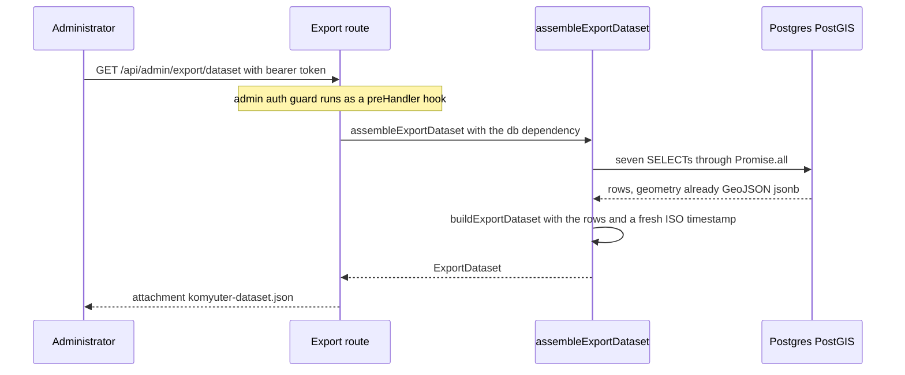
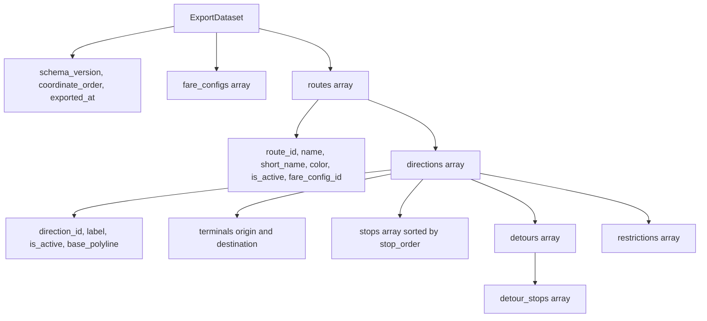

# Workflow: dataset export and its reference invariants

The export is the repository's outward-facing data product: a single JSON document holding every plotted route, its directions, their ordered stops, their detours (with the detour's own stops), their restrictions, and the fare configurations. Its consumer is external — a Collaboratory script downloads the file and reads it from disk, with no network reachability to the backend — which is why the document has to be self-describing and standalone: `schema_version`, `coordinate_order` and embedded GeoJSON are all in the payload itself.

Four functions make up the whole pipeline, in [apps/server/src/domain/export.ts](../../apps/server/src/domain/export.ts):

| Function | Purity | Responsibility |
| --- | --- | --- |
| `readExportRows(db)` | async, I/O | Seven unordered `SELECT`s across `routes`, `fare_configs`, `directions`, `stops`, `detours`, `detour_stops`, `restrictions`, with geometry projected to GeoJSON |
| `buildExportDataset(rows, exportedAt)` | pure | Nesting, ordering, field curation, number conversion, and the three document-level header fields |
| `assembleExportDataset(db)` | async, I/O | `readExportRows` then `buildExportDataset` with the current timestamp — the only composition the route uses |
| `referenceCheck(dataset)` | pure | The referential pass: returns human-readable problem strings; **not** wired into the route |

## The request path

`registerExport` in [apps/server/src/api/export.ts](../../apps/server/src/api/export.ts) registers `GET /export/dataset`, which [apps/server/src/api/index.ts](../../apps/server/src/api/index.ts) mounts inside the `/api/admin` plugin scope, so the Supabase admin auth guard runs as a `preHandler` hook before the handler. The handler always answers the same way: `Content-Disposition: attachment; filename="komyuter-dataset.json"`, `Content-Type: application/json`, and the dataset object itself — this is one of the two documented exceptions to the `{ success, data | error }` envelope (see [Server API surface](../operations/server-api-surface.md)). The route declares no response schema, so Fastify serializes the object as-is; nothing validates it on the way out.

The seven reads of `readExportRows` run concurrently in a single `Promise.all` and are **not** wrapped in a transaction, and none of them carries an `ORDER BY`. Two consequences follow: the document is not a single atomic snapshot of the tables (a write landing between two of the statements is not reflected consistently across parents and children), and the array order of routes, directions, detours, restrictions and fare configs is whatever Postgres returns. Geometry columns are selected through `asGeoJSON` (`sql\`ST_AsGeoJSON(${column})::jsonb\`` in [apps/server/src/db/queries.ts](../../apps/server/src/db/queries.ts)), so the rows already hold GeoJSON objects instead of WKB — `readExportRows` returns them typed `unknown` and `buildExportDataset` casts them into the document.

## The document: nesting and field curation

`buildExportDataset` groups children by foreign key into maps — `stopsByDirection`, `detourStopsByDetour`, `detoursByDirection`, `restrictionsByDirection`, `directionsByRoute` — and nests them under their parent, so the child `direction_id`/`route_id` columns never appear in the document and a parent with no children gets `[]` rather than `undefined`. The document is a *column-curated* dump, not a mirror of the tables:

| Level | Fields carried | Notable drops |
| --- | --- | --- |
| `fare_configs[]` | `fare_config_id`, `label`, `base_fare`, `base_distance_km`, `rate_per_km`, `student_discount_pct`, `senior_discount_pct`, `is_default` | `is_active`, timestamps |
| `routes[]` | `route_id`, `name`, `short_name`, `color`, `is_active`, `fare_config_id` | timestamps |
| `directions[]` | `direction_id`, `label`, `is_active`, `terminals.origin` / `terminals.destination`, `base_polyline`, `stops`, `detours`, `restrictions` | `route_id` (implied by nesting), `direction_kind`, timestamps |
| `stops[]` | `stop_id`, `name`, `type`, `stop_order`, `is_guaranteed_service`, `landmark_hint`, `location` | `direction_id` (implied), `is_active`, `notes`, `ar_marker_enabled`, timestamps |
| `detours[]` | `detour_id`, `label`, `entry`, `exit`, `detour_polyline`, `additional_distance_meters`, `commuter_instruction`, `driver_instruction`, `detour_stops` | `direction_id` (implied), `is_active`, timestamps |
| `detour_stops[]` | `detour_stop_id`, `stop_order`, `name`, `location`, `type`, `is_guaranteed_service`, `landmark_hint`, `notes` | `detour_id` (implied), timestamps |
| `restrictions[]` | `restriction_id`, `from_coord_index`, `to_coord_index`, `reason`, `affects`, `note` | `direction_id` (implied), `is_active`, timestamps |

Three curation details are contracts rather than cosmetics:

- **`color` is normalized.** A null `routes.color` becomes the empty string (`color: route.color ?? ""`), because the JSON Schema the test suite enforces requires `color` to be a *required string*, while the shared TypeScript type and its zod mirror both allow `null`. Changing the assembler without changing that validator breaks the suite.
- **`direction_kind` is not carried.** The document cannot tell a consumer which member of a saved pair is the server-derived return; only the terminals, labels and geometry distinguish them (see [Directions and the derived return](../concepts/directions-and-derived-return.md)).
- **Activation state is barely carried.** Only routes and directions expose `is_active`. Since `DELETE /api/admin/stops/:stopId` and `DELETE /api/admin/restrictions/:restrictionId` are soft (`is_active = false`), a deactivated stop or restriction is still exported, with nothing in the document to distinguish it from a live one; fare configs likewise have no `is_active` field at all.

## Ordering, and the two stop collections

- `direction.stops` is the base chain and is explicitly sorted ascending by `stop_order`, so the array order the consumer sees is the route order regardless of how the rows came back.
- `detour_stops` is a second, separate stop collection with its own `detour_stop_id` namespace. It is never mixed into `direction.stops`, and the assembler does **not** sort it — the array holds the query order, so a consumer must sort by `stop_order` itself. The entity loader for the API takes the opposite approach and orders detour stops by `stop_order` ([apps/server/src/domain/entities.ts](../../apps/server/src/domain/entities.ts)).
- Detours, restrictions, directions and fare configs are emitted in query order. The integration test works around the absence of ordering explicitly, locating a base direction by its `terminals.origin` instead of by index.

## The header contract: `schema_version` and `coordinate_order`

Every document opens with three scalars produced by the assembler:

- `schema_version` — `EXPORT_SCHEMA_VERSION` from `@komyuter/shared`, currently `"1.1"`.
- `coordinate_order` — `EXPORT_COORDINATE_ORDER`, currently `"lng_lat"`.
- `exported_at` — `new Date().toISOString()`, taken by `assembleExportDataset` and passed into the pure builder so tests can pin it; the schema requires an ISO date-time string.

Both constants live in [packages/shared/src/types/export-dataset.ts](../../packages/shared/src/types/export-dataset.ts) and are used as `typeof` literal types inside `ExportDataset`, and the zod mirror in [packages/shared/src/schemas/export-dataset.ts](../../packages/shared/src/schemas/export-dataset.ts) pins them with `z.literal(...)`, so document and validator move together.

`coordinate_order: "lng_lat"` is an explicit contract for the external reader, not a setting. Every geometry value in the document is standard GeoJSON (`Point`, `LineString`) whose pairs are `[longitude, latitude]`, exactly the order PostGIS stores and the rest of the repository uses — one order everywhere, with no conversion layer ([Coordinates and spatial math](../concepts/coordinates-and-spatial-math.md), ADR-0013). The JSON Schema copy at [specs/001-local-supabase-backend/contracts/export-dataset.schema.json](../../specs/001-local-supabase-backend/contracts/export-dataset.schema.json) hardcodes both values as `const`, so a dataset whose marker disagrees with the constant fails validation instead of silently shipping a differently-ordered file.

## Numbers at the boundary

`fare_configs` is the only place where the document converts types, and it does so deliberately. The five fare numerics are declared in [apps/server/src/db/schema.ts](../../apps/server/src/db/schema.ts) as drizzle `numeric(...)` columns, and this drizzle version has no `mode: "number"`, so the driver hands back strings. `readExportRows` therefore types them `unknown` and `buildExportDataset` runs each through `num()` (`Number(value)`) while mapping the row — the single conversion point between the column representation and the JSON document. That is why a stored `"13.00"` / `"1.80"` pair serializes as the numbers `13` and `1.8`, and the unit test pins exactly that. `additional_distance_meters` needs no conversion: it is a real `integer` column and is passed through as `number | null`. The same string-mode pattern and its `Number()` compensation appear on the fare-config read path ([Data model](../architecture/data-model.md)).

## What `referenceCheck` refuses — and what it does not

`referenceCheck(dataset)` walks `dataset.routes` → `directions` and returns `string[]` of problems, empty when the document is coherent. It builds `directionIds` and `stopIds` as **dataset-wide** sets and reports three kinds of finding:

1. **Dangling terminal.** `direction.terminals.origin` or `.destination` names an id that is not in the stop set — *"Direction X origin terminal Y is not a known stop"*. A `null` terminal is skipped (a direction may legitimately have no terminals).
2. **Detour id colliding with a direction id.** For every detour of every direction, a `detour_id` present in `directionIds` is reported as a collision.
3. **Stop id colliding with a direction id.** The same test applied to each base `stop_id`.

Everything outside that list is *not* checked, and the boundaries are worth knowing before relying on the function:

- The sets are unions across the whole document, not scoped per direction, so a terminal that points at a stop belonging to a *different* direction is not flagged. Stop-versus-detour id collisions, `detour_stop_id` collisions, `fare_config_id` existence, and restriction `from_coord_index`/`to_coord_index` bounds inside the polyline are not checked at all.
- The per-direction property that matters in practice — each direction's terminals resolve inside its own ordered stop list — is created by the write path: the pair save sets `origin_stop_id`/`destination_stop_id` to the first and last stop rows it just inserted for that direction, for the base and for the derived return, with a comment naming the export reference check as the reason ([apps/server/src/api/directions.ts](../../apps/server/src/api/directions.ts)). The export integration test asserts that property for both members of a saved pair. The legacy single-direction create path writes client-supplied terminal ids without that coupling, which is precisely the kind of dangling reference `referenceCheck` exists to surface.
- `referenceCheck` has **no production caller**. Only the unit test imports it; `GET /api/admin/export/dataset` calls `assembleExportDataset` alone. A document with a dangling terminal or a colliding id is therefore served as a 200 download, not rejected — the check is a test-time and review-time instrument today.

## Failure semantics and current state

- **Empty database is not an error.** A fresh stack still returns 200 with a schema-valid document carrying `routes: []` and `fare_configs: []`; the integration suite asserts this, and the latency suite reloads the endpoint 20 times requiring at least 19 responses under a second.
- **No arrival-time data can appear.** The document types have no ETA/arrival/departure field, and both the unit and integration tests assert the serialized dataset contains none of those keys (ADR-0009; see [Routing and navigation scope](../concepts/routing-and-navigation-scope.md)).
- **The admin page is still a placeholder while the endpoint is live.** [apps/admin/src/pages/Export.tsx](../../apps/admin/src/pages/Export.tsx) renders a "Nothing to export yet — dataset export arrives in a later milestone" empty state even though `/export` is wired in the router and in the nav sections, and nothing under `apps/admin` calls `GET /api/admin/export/dataset`. This is a documented gap, not a defect: the server export is complete and `docs/ADMIN.md` tracks wiring the UI as roadmap item R7.
- **Runtime schema validation is absent.** The document is checked in tests against the JSON Schema in `specs/`, not against the shared zod schema, which no module imports. Because that JSON Schema sets `additionalProperties: false` at every level and is what the Ajv test helper loads, a field added to the assembler without a matching schema entry fails the suite; and bumping `EXPORT_SCHEMA_VERSION` also requires editing the hardcoded `const` in that file. See [Shared contracts](../packages/shared-contracts.md).

## Focused tests

| Test | What it pins about this pipeline |
| --- | --- |
| [apps/server/tests/unit/export.test.ts](../../apps/server/tests/unit/export.test.ts) | `buildExportDataset` over fixture rows: the pinned `schema_version`/`coordinate_order`, `Number()` conversion of string-mode fare values, `stop_order` sorting regardless of input order, empty input yielding empty arrays, the absence of ETA-style keys, and `referenceCheck` returning `[]` for a clean document but reporting a terminal that names an unknown stop |
| [apps/server/tests/integration/export.test.ts](../../apps/server/tests/integration/export.test.ts) | The live route: attachment and JSON headers, JSON-Schema validity via Ajv, both members of a saved pair present with their own stops and terminals and no dangling terminal anywhere, a raw-body check for `eta`/`arrival`/`departure`, a fresh database still valid, and standalone `JSON.parse` of the body |
| [apps/server/tests/helpers/dataset-schema.ts](../../apps/server/tests/helpers/dataset-schema.ts) | The validator itself: compiles the spec JSON Schema with Ajv + `ajv-formats` and returns instance-path errors |
| [apps/server/tests/integration/latency.test.ts](../../apps/server/tests/integration/latency.test.ts) | Operational floor: 20 export reads, at least 19 under one second |

See [Server tests](../testing/server-tests.md) for how these suites are run (the integration ones need the local Supabase stack).

## Change checklist

When the document changes, four artifacts move together: the interfaces in `packages/shared/src/types/export-dataset.ts`, the zod mirror in `packages/shared/src/schemas/export-dataset.ts`, the assembler in [apps/server/src/domain/export.ts](../../apps/server/src/domain/export.ts), and the enforced JSON Schema at `specs/001-local-supabase-backend/contracts/export-dataset.schema.json` (including its `schema_version`/`coordinate_order` `const`s). Never reorder coordinates: `coordinate_order: "lng_lat"` is a marker for the external consumer, not a knob (ADR-0013). If a new referential invariant matters, it belongs in `referenceCheck` **and** in a test, because the route will not enforce it.
