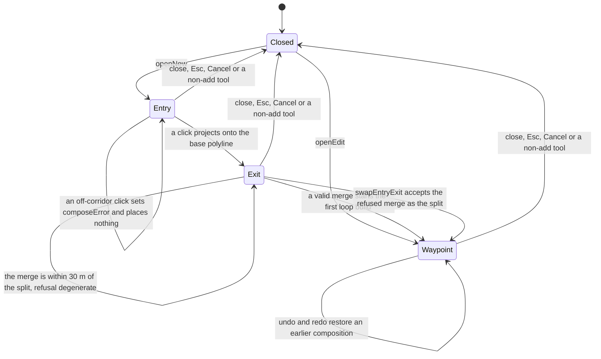
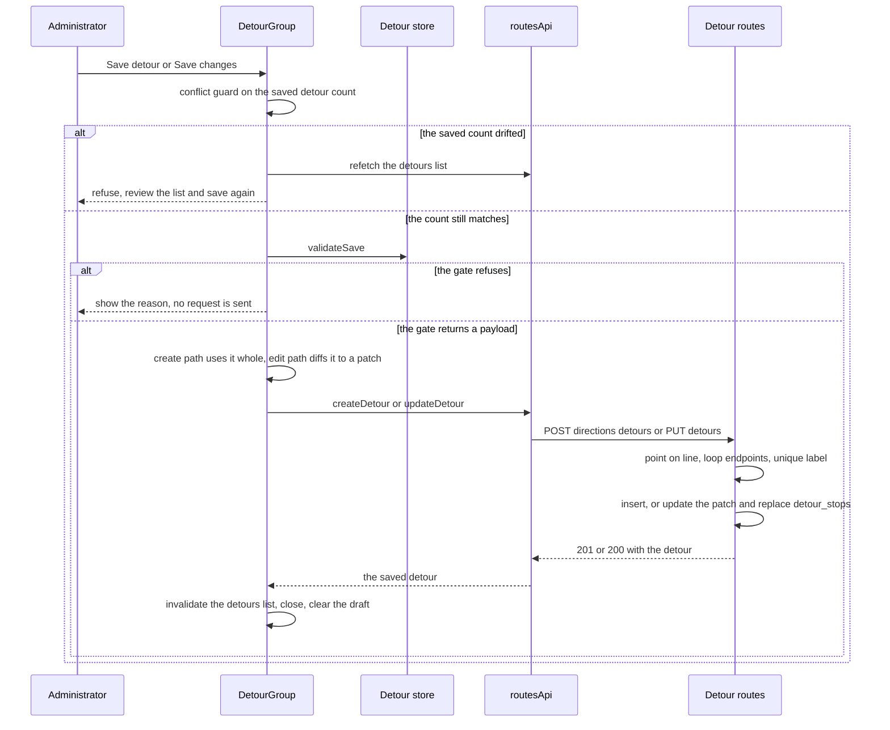

# Workflow: authoring and persisting a detour (alternative route)

A **detour** (alternative route) is a loop that diverges from a direction's base polyline at a **split** node and rejoins it ahead at a **merge** node, serving detour-only stops in between. It is authored entirely in the admin workspace — `apps/admin/src/features/detours/` — and persisted through the detour CRUD routes in `apps/server/src/api/detours.ts`. When a detour activates for a request the replaced base arc stops being usable in that same request (ADR-0008); the conditional trigger machinery that would decide *when* a detour activates is not implemented (ADR-0012), so this page covers authoring and persistence only.

Two stores and one property panel are involved, and the boundary between them is the load-bearing part of the design:

| Role | Code | Owns |
| --- | --- | --- |
| Base plotting store | [`usePlottingStore`](../../apps/admin/src/lib/plottingStore.ts) | the open route/direction, the base stop chain, the committed base polyline, the base draft and its undo/redo. **Not written by detour authoring at all.** |
| Detour store | [`useDetourStore`](../../apps/admin/src/features/detours/detourStore.ts) | split/merge nodes, detour stops, the loop, label and instructions, additional distance, its own capped undo/redo, its own `localStorage` draft |
| Editor surface | [`DetourGroup`](../../apps/admin/src/features/detours/DetourGroup.tsx), [`DetourStopGroup`](../../apps/admin/src/features/detours/DetourStopGroup.tsx) | the right-rail panel: composition readout, save gate, undo/redo buttons, per-stop properties |

The base-side plotting workflow (stops, chain, road snapping, direction save) is documented separately in [Workflow: plotting a route and saving the direction pair](admin-route-plotting-save.md); the geometry helpers both workflows share are in [Coordinates and spatial math](../concepts/coordinates-and-spatial-math.md), and the persistence tables in [Data model](../architecture/data-model.md).

## Opening the editor and handing it a target

The workspace has no detour *route* of its own — it edits one direction's detours, so the base store stays the anchor. `DetourLayer` and `DetourList` read `usePlottingStore((s) => s.directionId)` to decide which direction's detours are fetched and drawn, and `buildDetourTarget` ([`target.ts`](../../apps/admin/src/features/detours/target.ts)) copies everything the editor needs out of the loaded direction into a plain snapshot: `directionId`, `directionLabel`, `routeId`, `routeName`, `basePolyline`, `existingDetourCount`, and the chain-ordered stops.

Entry points, both in [`DetourList.tsx`](../../apps/admin/src/features/detours/DetourList.tsx):

- **Add alternative route** → `openNew(target)` — `IDLE_STATE` plus `open: true`, `baselineDetourCount: target.existingDetourCount`, and an auto label ``Detour {existingDetourCount + 1}``.
- **A detour row, or a saved detour's stop marker on the map** → `openEdit(detour, target)` — the same reset, but pre-filled from the saved entity: `mode: "waypoint"`, `entry`/`exit` re-projected onto the base polyline, `detourStops` rebuilt from `detour.detour_stops`, the saved loop, label, instructions and distance, plus `editDetourId` and `editBaseline` (the diff baseline for patch saves).

Stops are late-bound. The directions *list* response does not embed stops, so `DetourGroup` binds them once the dedicated stops query resolves, through `setTargetStops`, which is a no-op when the target already has stops. A target may therefore open with `stops: []` and be completed a render later; the panel shows "Loading this direction's stops…" until they land.

The handoff is one-directional and snapshot-shaped: the detour store never subscribes to the plotting store, and the plotting store never learns a detour exists. The only shared render-time inputs are the direction id (which list to fetch) and the route colour (palette derivation for saved detour lines).

## The placement state machine: split → merge → path

`mode` is the click dispatcher. Every map tap that reaches the detour store resolves against it:



The four placement phases, their refusals and the exits from each; `openEdit` enters directly at `Waypoint`.

What each phase does, with the constants that matter:

- **`entry` (split node).** The click is projected onto the base polyline with `projectPointOnPolyline(click, base, 5000)` — a **5 km** corridor, not the 30 m saved tolerance. A click outside the corridor sets `composeError` (`"That point is too far from the route — place the split/merge node near it."`) and changes nothing. A hit stores the `ProjectedPoint` (snapped coordinate, leading segment index, clamped fraction) and advances to `exit`.
- **`exit` (merge node).** Same 5 km projection, then two refusals. **Travel order**: the merge must lie strictly further along the arc than the split — `snap.index < entry.index || (snap.index === entry.index && snap.fraction <= entry.fraction)` is *behind*, and the store records a `{ kind: "order" }` refusal that keeps the refused projection so `swapEntryExit()` can accept it as the split in one action; `mode` stays `exit`. **Degeneracy**: `coordsDistanceMeters(entry, exit) < 30` (`NODE_TOO_CLOSE_METERS`) records `{ kind: "degenerate" }` and leaves `exit` unset. Both thresholds mirror the server's 30 m checks, so a composition that passes the client cannot be refused for the same reason on save.
- **`waypoint` (detour path).** Each click appends a `DetourStopDraft` — `crypto.randomUUID()` client id, name `Stop {n}`, `type: "waiting_area"`, no guaranteed service, no landmark/notes — and rebuilds the loop. Detour stops are deliberately **never projected**: they define the diversion and may be anywhere. The first stop auto-fills `commuterInstruction` with `"Take the detour"` only for a *new* detour with an empty instruction — in edit mode the saved text is never stomped.
- **Node dragging.** The split and merge are draggable HTML markers ([`RouteMap.tsx`](../../apps/admin/src/features/routes/RouteMap.tsx)); `moveEntry`/`moveExit` re-project the drop onto the base polyline through the same 5 km corridor and ignore an off-corridor drop, which is what keeps the saved `entry`/`exit` on the line.

Note the asymmetry between the corridor and the saved tolerance: the click corridor is generous (5 km) so an operator can tap a node near a bend, but the stored node is the *projection* — a point exactly on the base polyline — so the 30 m on-line gate the server applies is satisfied by construction rather than by luck.

## The loop: a road-followed line through entry, stops and exit

Every mutation that changes geometry — a placed stop, a dragged stop, a removed stop, a moved node, a swap — calls `rebuildLoop`, which snaps `[entry, ...detourStops.map(location), exit]` through the injected `LoopSnapper`. The default is `snapToLoop` → `snapPreview` → `GET /api/admin/mapbox/directions`, the same road-following proxy the base path editor uses and which chunks waypoints at 25 per upstream request ([Mapbox Directions proxy](../integrations/mapbox-directions-proxy.md)).

Three properties of that build are worth knowing:

- **Latest wins.** A module-scope sequence counter is incremented per build; a resolution whose sequence is stale returns without touching state, so a slow snap can never overwrite a newer composition. The counter is also bumped on `openNew`, `openEdit`, `close`, `undo`, `redo` and `restoreDraft`, so a pending build cannot land on a composition the admin has already left or undone.
- **Failure is a straight line, never a blocked editor.** If the snapper *throws*, the store falls back to a `LineString` through the waypoint list and sets `mapboxWarning: "upstream_error"`, which the panel renders as "Road following is unavailable — showing a straight line. Click the detour point again to retry." The save gate accepts that fallback, because it only requires ≥ 2 loop coordinates.
- **A `snapped: false` fallback is indistinguishable from a real snap to this store.** The proxy resolves `200` with `success: true` and a straight-line polyline plus `warning: "no_token" | "upstream_error"` when the Mapbox token is missing or the upstream call fails; `snapToLoop` reads only `.polyline` and never inspects `snapped` or `warning`. So the amber "Road following is unavailable" notice appears only when the HTTP call itself rejects (network failure, non-2xx, expired session), not when the proxy degraded to a straight line.

`DetourLayer` draws the live composition as an amber dashed line ([`DetourLayer.tsx`](../../apps/admin/src/features/detours/DetourLayer.tsx)), separately from the saved detours of the open direction, which it renders dashed in a stable per-detour palette colour (inactive detours at reduced opacity) whether or not the editor is open. Saved-detour visibility is governed by the map layer toggles and the sidebar eye toggle (`hiddenDetourIds`, display-only).

## Additional distance is derived, never entered

`additionalDistanceMeters` is recomputed on every loop rebuild as

```
Math.round(Math.max(0, polylineDistanceMeters(loop) - replacedArcLengthMeters(basePolyline, entry, exit)))
```

in meters, clamped at zero. The subtrahend is the **exact replaced base arc**, not a vertex-sliced approximation: `replacedArcLengthMeters` ([`coords.ts`](../../apps/admin/src/lib/coords.ts)) measures the tail of the entry's segment `(1 − entry.fraction) × segmentLength`, the full middle segments, and the head of the exit's segment `exit.fraction × segmentLength`, so a node snapped mid-segment never over- or under-counts a whole segment. Out-of-order or same-position pairs return `0` defensively. The value is read-only in the panel and is the exact number the payload carries (`additional_distance_meters`, `?? 0` on save); the server schema accepts only an `int >= 0`.

## Saving: the client gate, then the request

Saving is one action in the panel (`handleSave`), and the HTTP call happens **only** on a fully valid composition — the request is never issued to discover what is wrong.



The conflict guard, the pure client gate, the request, the server gates, and the cache close-out.

**The conflict guard runs first (US4).** `baselineDetourCount` was captured when the editor opened (`target.existingDetourCount`, i.e. the list length at that moment). `handleSave` compares it against the current `useDetoursQuery` data length; a mismatch refetches the list and refuses with "Another detour was added or removed while you were editing — review the list and save again." It is a **count** comparison, so it detects additions and deletions but not a concurrent edit of an existing detour — the admin's own save then wins.

**`validateSave()` is pure and returns either a reason or the exact payload.** In order: the editor must be open with a target; a split node (`"Place the SPLIT node — …"`); a merge node; at least one detour stop; a loop with ≥ 2 coordinates; a non-blank label; a non-blank commuter instruction. On success it builds the POST/PUT body — `label` and instructions trimmed, `driver_instruction` trimmed to `null` when empty, `entry`/`exit` as `Point` GeoJSON, `detour_polyline` as the loop, `additional_distance_meters` (or `0`), and `detour_stops` mapped to authoring inputs. The gate never triggers a snap and never performs I/O; the store tests assert the snapper call count is unchanged across refuse/pass passes.

**A create sends the payload whole; an edit sends a computed patch.** When `editDetourId` and `editBaseline` are set, `buildEditPatch` diffs against the saved entity and emits only changed fields: `label`, `commuter_instruction`, `driver_instruction`, and — if any of the loop, entry or exit changed — the geometry triple `detour_polyline` + `entry` + `exit` + `additional_distance_meters` together. `detour_stops` is included when the projected list differs from the baseline's. An empty patch is refused with `"No changes to save."`, and the editor stays open either way.

**`is_active` is not part of the editor's save.** The activation switch in `DetourGroup` (edit mode only) fires a direct PUT of `{ is_active }` through the same mutation; the panel never includes the flag in a create or in the composed patch.

**Outcomes.** On success the panel invalidates `routeKeys.detours(directionId)` — the mutation hooks invalidate too — and closes the editor with `closeGroup({ clearDraft: true })`. On failure the error message is written to the store's `lastError` and rendered inline (the mutation hook also toasts it); the composition, the draft and the editor state survive so the admin can fix and retry. A server refusal that the client could not predict (a duplicate label, a session expiry) therefore surfaces as a `422`/`401` message with nothing lost.

## Server-side gates on POST and PUT

The two write routes carry the structural invariants. All geometry checks are local haversine math in [`validation.ts`](../../apps/server/src/domain/validation.ts), not PostGIS, and all failures are the standard envelope's `422 VALIDATION_ERROR` (or `404` for a missing direction/detour):

| Gate | Source | Applies to |
| --- | --- | --- |
| The direction (POST) or detour (PUT) must exist | `notFound` in [`detours.ts`](../../apps/server/src/api/detours.ts) | both |
| `entry` off the base polyline by more than **30 m** | `assertPointOnLine` with `DETOUR_ON_LINE_TOLERANCE_METERS = 30` — haversine point-to-segment over every segment | POST (both), PUT (when supplied) |
| `exit` off the base polyline by more than **30 m** | same | POST (both), PUT (when supplied) |
| The loop must **start at entry** and **end at exit** | `assertDetourLoopEndpoints` — `loop[0]` vs `entry`, `loop[last]` vs `exit`, 30 m | POST always; PUT when `detour_polyline`, `entry` or `exit` is present |
| `entry` and `exit` must **not coincide** (≤ 30 m apart) | `assertDetourLoopEndpoints`, "Detour entry and exit coincide (degenerate loop)" | same as above |
| The **label must be unique within the direction** | `assertDetourLabelAvailable` — compares `label.trim()` against every remaining detour of that direction, excluding the detour being updated | POST always; PUT when `label` is supplied |
| Payload shape | `createDetourSchema` / `updateDetourSchema` (`@komyuter/shared`): label ≥ 1 char, commuter instruction ≥ 1 char, `additional_distance_meters` an int ≥ 0 or null, `detour_stops` optional; `is_active` accepted only by update | both |

Two behaviours of that table are easy to get wrong when changing the code:

- **A partial geometry PUT revalidates against the *resulting* triple.** If any one of `detour_polyline`, `entry` or `exit` is present, the handler loads the current detour and calls `assertDetourLoopEndpoints(body.detour_polyline ?? current.detour_polyline, body.entry ?? current.entry, body.exit ?? current.exit)`. Replacing only the loop therefore cannot drift its endpoints away from the stored nodes.
- **Label uniqueness counts remaining rows only.** A permanently deleted detour frees its label immediately, and a PUT excludes its own row so an unchanged label is not a self-collision.

## `detour_stops` is its own table, and a PUT replaces it wholesale

Detour stops are **real stops with full base-stop parity** — name, type, guaranteed service, landmark hint, notes, location — but they live in the `detour_stops` table, keyed by `detour_id` with `ON DELETE CASCADE` ([`schema.ts`](../../apps/server/src/db/schema.ts)), and they are **never part of the base stop chain**: the direction's ordered list consumed by routing and the dataset export is the `stops` table keyed by `direction_id`, which detour authoring never writes. The detour's route is `entry (base) → detour_stops in `stop_order` → exit (base)`. Rows come back nested under each detour (`detour_stops`, ordered by `stop_order`) from `loadDetours`.

The PUT semantics follow from that:

- **REPLACE, not patch.** When `detour_stops` is present in the body, the handler deletes *every* row for that detour and re-inserts the payload's array in order, numbering `stop_order` from array position `0..n-1` (the `(detour_id, stop_order)` unique index enforces a gap-free ordering). Reordering and renaming a detour's stops is therefore the same operation as rewriting the list.
- **Omitting the field leaves the list untouched; an empty array clears it.** The whole block is guarded by `body.detour_stops !== undefined`, so a PUT that changes only the label keeps the existing stops, while `detour_stops: []` deletes them all.
- **Detour-stop identity is not stable across saves.** The client's `crypto.randomUUID()` ids are list keys and history keys only; the server mints `dstp…` ids and the panel is closed after a successful save, so a client id never needs to survive a round trip.
- **A `detour_stops`-only PUT must not run an empty `SET`.** `detour_stops` is not a column of `detours`, so it contributes nothing to the patch object; the `UPDATE` is executed only when `Object.keys(patch).length > 0`, because drizzle renders `update().set({})` as invalid SQL and the request would fail with a 500 rather than saving the stops. The integration suite exercises exactly this shape — a PUT whose only field is `detour_stops`.
- **POST writes the detour and its stops in the same request** (the detour row first, then `insertDetourStops`). Unlike the direction save, this handler uses no explicit `db.transaction`, so the two inserts are sequential statements.

## Undo/redo, drafts, and who owns the keyboard

**Undo/redo is the detour store's own, capped at 50 entries** (`HISTORY_LIMIT`), and it is coarser than the base editor's: `recordHistory` snapshots the *entire* editable composition (mode, nodes, stops, loop, label, both instructions, additional distance) **before** every change, clears the future branch, and sets `touched`. Only identity writes short-circuit — a label set to its current value records nothing. Because the loop is part of the snapshot, one undo reverts a placed stop *and* the loop that was built for it. Undo and redo bump the snap sequence, so a build in flight cannot land on a restored composition.

**The detour draft is a separate mini-draft from the base route draft.** While the editor is open and `touched` is set, an effect in `DetourGroup` writes a full `DetourDraftSnapshot` per change to `localStorage` under `komyuter.detour-draft.{directionId}` ([`draft.ts`](../../apps/admin/src/lib/draft.ts)), with the same 24 h TTL, injectable storage and corrupt-JSON disposal as the plotting draft — but its own key prefix and its own payload, because the two drafts describe different objects and must not overwrite each other. Writes are plain (the editor is modal and the payload is small); the base draft's debounced writer is not used here.

The snapshot deliberately includes more than the composition: `target`, `editDetourId` and `baselineDetourCount`, so restoring a draft resumes editing **the same saved detour** with the same conflict baseline, and validates against the base polyline captured when the draft was written. The lifecycle:

- A pristine open never clobbers a leftover draft — the persistence effect returns early until `touched` is set. This is what lets the restore offer surface a draft that the open itself did not destroy.
- The first time the editor opens for a direction with a stored draft, it offers restore once per direction (a ref keyed on `directionId`); **Restore draft** calls `restoreDraft` and then clears the key, **Discard** clears the key and dismisses the offer.
- `restoreDraft` resets to `IDLE_STATE` and hydrates from the snapshot with `touched: true`, so persistence resumes on the next edit.
- Only a **successful save** clears the draft (`closeGroup({ clearDraft: true })`, after `close()` so the persistence effect's final pass cannot rewrite what was just erased). **Cancel, Esc and switching away from the Add tool all preserve it** — the same contract as the base route.

**Keyboard and interaction ownership while the editor is open** is decided in [`RouteWorkspace.tsx`](../../apps/admin/src/pages/RouteWorkspace.tsx) and `RouteMap`:

- `mod+s` (the base-route save) is **disabled** while `useDetourStore.open` is true, and the action bar's Save button is hidden, so `mod+s` can never save the base route mid-detour.
- `mod+z` / `mod+shift+z` dispatch to the detour store when it is open and to the plotting store otherwise — one binding, two owners, chosen by `open`.
- `Esc` order is: an open child dialog wins; a focused form field keeps Esc for itself; then an open detour editor closes (draft preserved); only then does the base editor's close/focus flow run. The panel's Cancel button and the X both call the same close.
- Every map tap belongs to the detour editor while it is open — `RouteMap.handleMapClick` routes the click to `handleMapClick` when the **Add** tool is active and otherwise closes the editor, and in both cases returns before the base add-tool placement can run. Base stop placement is therefore unreachable until the detour editor closes.
- Detour stops are first-class on the map while the editor is open: draggable markers with the same shape vocabulary as base stops (drawn hollow/dashed so they never read as base stops), clicking one selects it, and selection swaps the right panel to `DetourStopGroup` (name, type, guaranteed service, landmark hint, notes; location only by dragging the marker, plus Remove).

## Related helpers still named after detours

`inferDetourFlanks` in [`coords.ts`](../../apps/admin/src/lib/coords.ts) is the *original* one-click detour inference: given chain-ordered stops and a click, it returns the flanking pair along the base arc (with a wrap across the closing arc for loop routes). Detour authoring no longer uses it — nodes are explicit — but the base plotting store reuses it as the **mid-route insertion** rule, so a base stop placed between two existing stops is slotted between them rather than appended. The comment in `projectPointOnPolyline` referring to `MAX_DETOUR_VIA_DISTANCE_METERS` is stale: that constant no longer exists, and the detour store passes the `5000` corridor literally.

## Tests that pin this behaviour

- [`apps/admin/src/tests/detour-store.test.ts`](../../apps/admin/src/tests/detour-store.test.ts) — the placement phases and their order/degenerate/off-route refusals and the swap; that the save gate blocks before any HTTP and never calls the snapper; undo/redo across placement and text; marker drag and selection; visibility toggles; late-bound stops; the draft serialise/restore round trip.
- [`apps/admin/src/tests/detour-describe.test.ts`](../../apps/admin/src/tests/detour-describe.test.ts) — auto labels in creation order, gate messages naming the missing field, additional distance growing as waypoints are added, `openEdit` hydration, edit mode never stomping saved text, draft round trip.
- [`apps/admin/src/tests/coords.test.ts`](../../apps/admin/src/tests/coords.test.ts) — `projectPointOnPolyline` (segment snap, vertex-exact index, corridor rejection), `polylineSegmentLength`, `replacedArcLengthMeters` fractional exactness, and `inferDetourFlanks`.
- [`apps/server/tests/integration/crud.test.ts`](../../apps/server/tests/integration/crud.test.ts) — the `422` for an off-line entry, the FR-023 happy path plus a loop-only PUT revalidation, drifting loop start/end, degenerate entry/exit, negative additional distance, duplicate label, destructive delete freeing the label, and detour stops inserted with the detour, replaced wholesale by a `detour_stops`-only PUT, and cascaded on delete. This is the only suite that touches the database.
- [`apps/server/tests/unit/validation.test.ts`](../../apps/server/tests/unit/validation.test.ts) — the 30 m on-line tolerance constant and its boundary.

See [Admin tests](../testing/admin-tests.md) for the hermetic-versus-integration split and the runners.
